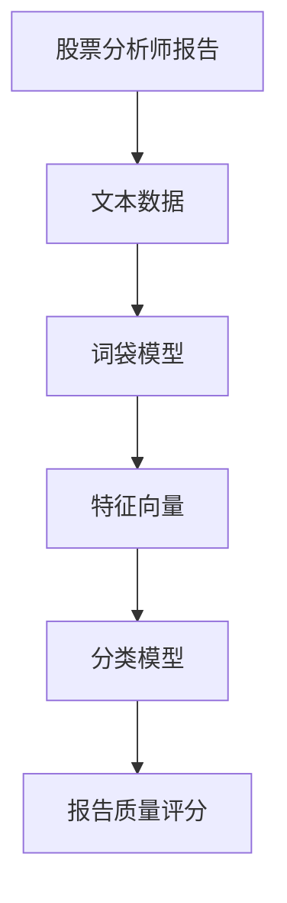

                 


# AI驱动的股票分析师报告质量评估

> 关键词：AI，股票分析师，自然语言处理，机器学习，深度学习，文本分析，金融数据分析

> 摘要：本文探讨了如何利用人工智能技术评估股票分析师报告的质量。通过自然语言处理和机器学习技术，我们能够提取报告中的关键信息，分析其内容的准确性和逻辑性，并通过模型预测报告的潜在价值。文章详细介绍了AI驱动的股票分析师报告质量评估的核心概念、算法原理、系统架构以及实际项目实现，为金融从业者和AI研究人员提供了理论依据和实践指导。

---

# 第一章：背景介绍

## 1.1 问题背景

### 1.1.1 传统股票分析的局限性

股票市场是高度复杂和不确定的市场，股票分析师的报告质量直接影响投资者的决策。然而，传统的人工评估方法存在以下问题：

- **主观性**：不同评估人员对报告质量的判断可能存在主观差异。
- **效率低下**：手动评估报告耗时长，难以应对大量报告的评估需求。
- **不一致性**：缺乏统一的标准和方法，导致评估结果的不一致性。

### 1.1.2 AI技术在金融分析中的应用潜力

人工智能技术，尤其是自然语言处理（NLP）和机器学习（ML），在金融数据分析中展现出巨大潜力。AI可以通过以下方式提升股票分析师报告的质量评估：

- **自动化处理**：AI可以快速处理大量文本数据，提取关键信息。
- **客观性**：通过模型量化报告质量，减少人为主观判断的影响。
- **高效性**：AI可以实时或批量处理报告，显著提高评估效率。

### 1.1.3 报告质量评估的定义与目标

报告质量评估的目标是通过技术手段，量化报告的准确性、逻辑性和信息丰富程度。具体目标包括：

1. 评估报告的逻辑结构是否合理。
2. 评估报告中信息的准确性和全面性。
3. 评估报告的语言表达是否清晰。

---

## 1.2 问题描述与解决方法

### 1.2.1 股票分析师报告质量评估的核心问题

股票分析师报告质量评估的核心问题包括以下几点：

- **文本理解**：如何准确理解报告中的内容和观点。
- **信息提取**：如何从报告中提取关键信息，如市场趋势、公司基本面分析等。
- **质量量化**：如何将报告质量量化为可评估的指标。

### 1.2.2 AI驱动评估的主要解决方法

AI驱动的股票分析师报告质量评估的主要解决方法包括：

1. **自然语言处理（NLP）**：用于报告文本的理解和信息提取。
2. **机器学习（ML）**：用于报告质量的分类和预测。
3. **深度学习（DL）**：用于更复杂的模式识别和预测任务。

### 1.2.3 技术实现的边界与外延

AI驱动的报告质量评估的边界包括：

- **输入数据**：股票分析师报告的文本内容。
- **输出结果**：报告质量的评分和改进建议。
- **适用场景**：股票市场分析、投资决策支持。

其外延包括：

- **扩展数据源**：结合市场数据、公司财务数据等进行综合评估。
- **多模态分析**：结合图像、语音等多种数据源进行分析。

---

## 1.3 核心概念与联系

### 1.3.1 核心概念原理

AI驱动的股票分析师报告质量评估涉及的核心概念包括：

1. **文本预处理**：包括分词、去停用词、实体识别等。
2. **特征提取**：包括词袋模型、TF-IDF、Word2Vec等。
3. **模型训练**：包括分类、回归、聚类等机器学习任务。

### 1.3.2 核心概念属性对比表

| 概念         | 描述                               |
|--------------|------------------------------------|
| 文本预处理   | 对文本数据进行清洗和标准化的过程   |
| 特征提取     | 从文本中提取有意义的特征           |
| 模型训练     | 使用训练数据训练模型以实现预测任务 |

### 1.3.3 实体关系图（ER图）



---

## 1.4 总结与展望

通过AI技术，我们可以显著提升股票分析师报告的质量评估效率和准确性。然而，当前技术仍存在以下挑战：

- **数据质量问题**：需要高质量的标注数据进行模型训练。
- **模型解释性**：需要提高模型的可解释性，以便更好地理解评估结果。
- **实时性要求**：需要优化模型的计算效率，以满足实时评估需求。

---

# 第二章：AI驱动的文本分析基础

## 2.1 自然语言处理（NLP）基础

### 2.1.1 NLP的核心技术与工具

- **分词工具**：如jieba（中文）、spaCy（英文）。
- **词向量工具**：如Word2Vec、GloVe。
- **句法分析工具**：如NLTK、spaCy。

### 2.1.2 文本预处理的关键步骤

1. **分词**：将文本分割成单词或短语。
2. **去停用词**：去除常见但无意义的词语，如“的”、“了”。
3. **实体识别**：识别文本中的命名实体，如公司名称、人名。

### 2.1.3 常见的文本表示方法

- **词袋模型**：将文本表示为词频向量。
- **TF-IDF**：基于词频和逆文档频率的加权表示。
- **Word2Vec**：通过神经网络学习词向量。

---

## 2.2 机器学习与深度学习在文本分析中的应用

### 2.2.1 传统机器学习模型在文本分析中的应用

- **SVM**：支持向量机，常用于文本分类。
- **Naive Bayes**：朴素贝叶斯，常用于情感分析。

### 2.2.2 深度学习模型（如BERT、GPT）的应用

- **BERT**：基于Transformer的预训练模型，擅长上下文理解。
- **GPT**：生成式预训练模型，擅长文本生成和改写。

### 2.2.3 模型选择与优化策略

1. **选择合适的模型**：根据任务需求选择模型。
2. **数据增强**：通过数据增强技术提升模型的泛化能力。
3. **超参数优化**：通过网格搜索等方法优化模型性能。

---

## 2.3 案例分析：基于BERT的情感分析

### 2.3.1 情感分析的三分类模型

情感分析的三分类任务包括：

- **正面**：报告内容积极，建议买入。
- **中性**：报告内容客观，无明确建议。
- **负面**：报告内容消极，建议卖出。

### 2.3.2 BERT模型的应用


### 2.3.3 模型训练与评估

- **训练数据**：需要标注好的股票报告数据。
- **评估指标**：准确率、召回率、F1分数。

---

## 2.4 总结与展望

通过NLP和机器学习技术，我们可以有效地进行文本分析和情感理解。然而，当前技术仍需在以下方面进一步优化：

- **模型性能**：提升模型的准确性和鲁棒性。
- **计算效率**：优化模型的计算效率，以满足实时需求。
- **可解释性**：提高模型的可解释性，便于用户理解和使用。

---

# 第三章：股票分析师报告质量评估的算法原理

## 3.1 文本相似度计算

### 3.1.1 余弦相似度的计算公式

余弦相似度的计算公式为：

$$ \text{相似度} = \frac{\vec{A} \cdot \vec{B}}{\|\vec{A}\| \|\vec{B}\|} $$

其中，$\vec{A}$和$\vec{B}$分别是两个文本的词向量。

### 3.1.2 Word2Vec模型的应用

Word2Vec模型通过训练词向量，可以将文本表示为低维向量，从而计算文本相似度。

### 3.1.3 BERT模型的应用

BERT模型通过预训练，能够捕捉文本的上下文信息，从而提高相似度计算的准确性。

---

## 3.2 情感分析与观点挖掘

### 3.2.1 情感分析的三分类模型

情感分析的三分类模型包括正面、中性和负面三类。

### 3.2.2 LSTM模型的应用

LSTM模型通过长短期记忆网络，可以有效捕捉文本的情感信息。

### 3.2.3 BERT模型的应用

BERT模型通过预训练，能够准确捕捉文本的情感信息。

---

## 3.3 异常检测与质量评估

### 3.3.1 Isolation Forest模型的应用

Isolation Forest是一种基于树的异常检测算法，适用于小样本数据。

### 3.3.2 Autoencoder模型的应用

Autoencoder模型通过无监督学习，可以发现数据中的异常模式。

### 3.3.3 综合评估模型的设计与实现

综合评估模型通过将文本相似度、情感分析和异常检测的结果进行加权，最终得到报告质量的评分。

---

## 3.4 总结与展望

通过文本相似度计算、情感分析和异常检测，我们可以综合评估股票分析师报告的质量。然而，当前技术仍需在以下方面进一步优化：

- **模型集成**：优化多模型的集成策略，以提高评估结果的准确性。
- **实时性**：优化模型的计算效率，以满足实时评估需求。
- **可解释性**：提高模型的可解释性，便于用户理解和使用。

---

# 第四章：系统架构与设计

## 4.1 系统功能模块设计

### 4.1.1 数据采集模块

数据采集模块负责从股票市场获取分析师报告和其他相关数据。

### 4.1.2 数据预处理模块

数据预处理模块负责对文本数据进行清洗和标准化处理。

### 4.1.3 模型训练与评估模块

模型训练与评估模块负责训练和评估AI模型，生成报告质量评分。

### 4.1.4 结果反馈模块

结果反馈模块将评估结果反馈给用户，提供改进建议。

---

## 4.2 系统架构设计

### 4.2.1 分层架构设计

分层架构包括数据层、业务逻辑层和用户界面层。

### 4.2.2 微服务架构设计

微服务架构包括独立的服务模块，如数据采集服务、模型训练服务等。

### 4.2.3 数据流与交互流程

数据流与交互流程包括数据采集、预处理、模型训练和结果反馈。

---

## 4.3 系统接口与交互设计

### 4.3.1 API设计

API设计包括数据接口和模型调用接口。

### 4.3.2 用户界面设计

用户界面设计包括数据输入界面和结果展示界面。

---

## 4.4 总结与展望

通过系统架构设计，我们可以构建一个高效、可靠的股票分析师报告质量评估系统。然而，当前系统仍需在以下方面进一步优化：

- **系统扩展性**：优化系统的扩展性，以支持更多的数据源和模型。
- **系统安全性**：加强系统的安全性，防止数据泄露和攻击。
- **系统性能**：优化系统的性能，提高处理速度和响应时间。

---

# 第五章：项目实战

## 5.1 环境安装

### 5.1.1 Python环境安装

安装Python和必要的库，如TensorFlow、Keras、NLTK等。

### 5.1.2 数据集准备

准备股票分析师报告的文本数据和标注数据。

---

## 5.2 系统核心实现

### 5.2.1 数据预处理

```python
import jieba

def preprocess(text):
    words = jieba.lcut(text)
    return words
```

### 5.2.2 模型训练

```python
from tensorflow.keras import layers

model = tf.keras.Sequential()
model.add(layers.Embedding(input_dim=10000, output_dim=50))
model.add(layers.LSTM(64))
model.add(layers.Dense(3, activation='softmax'))
```

### 5.2.3 模型评估

```python
from sklearn.metrics import accuracy_score

y_pred = model.predict(X_test)
accuracy = accuracy_score(y_test, y_pred.argmax(axis=1))
print(f"Accuracy: {accuracy}")
```

---

## 5.3 实际案例分析

### 5.3.1 数据输入

股票分析师报告文本。

### 5.3.2 数据预处理

分词和去停用词处理。

### 5.3.3 模型训练与预测

使用训练好的模型对报告进行质量评估。

### 5.3.4 结果展示

展示模型评估结果和改进建议。

---

## 5.4 总结与展望

通过实际项目的实现，我们可以验证AI驱动的股票分析师报告质量评估技术的可行性和有效性。然而，实际应用中仍需考虑以下问题：

- **数据质量问题**：需要更多的标注数据进行模型优化。
- **模型性能**：需要进一步优化模型的准确性和鲁棒性。
- **系统性能**：需要优化系统的计算效率，以支持更大的数据规模。

---

# 第六章：最佳实践

## 6.1 小结

通过本文的介绍，我们了解了AI驱动的股票分析师报告质量评估的核心概念、算法原理和系统架构。我们还通过实际项目展示了如何实现这一技术。

## 6.2 注意事项

在实际应用中，需要注意以下几点：

- **数据隐私**：保护用户数据的隐私和安全。
- **模型解释性**：提高模型的可解释性，以便更好地理解评估结果。
- **系统维护**：定期更新模型和系统，以适应市场变化。

## 6.3 拓展阅读

- **相关书籍**：《自然语言处理入门》、《机器学习实战》。
- **相关论文**：关注最新的NLP和机器学习研究论文。
- **技术博客**：关注技术博客和社区，获取最新的技术动态。

---

# 作者：AI天才研究院 & 禅与计算机程序设计艺术

---

以上是《AI驱动的股票分析师报告质量评估》的完整大纲和部分正文内容。如果需要进一步扩展或补充，请随时告知！

