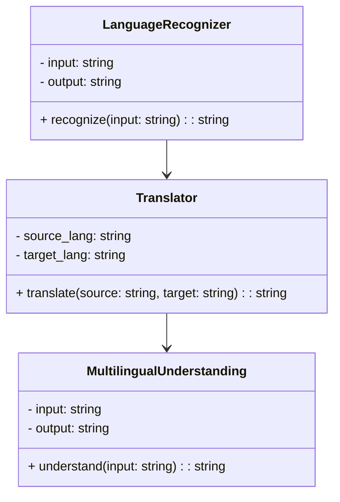
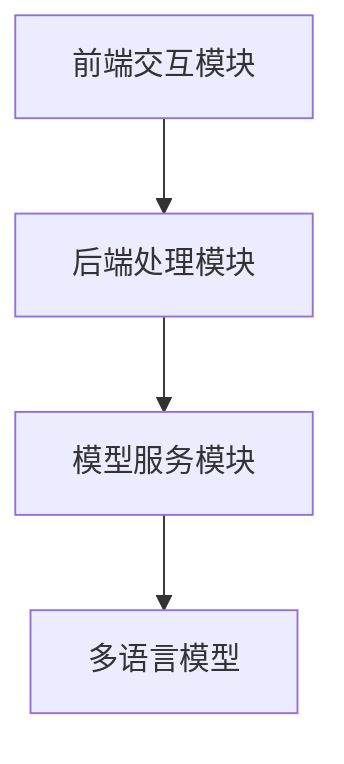
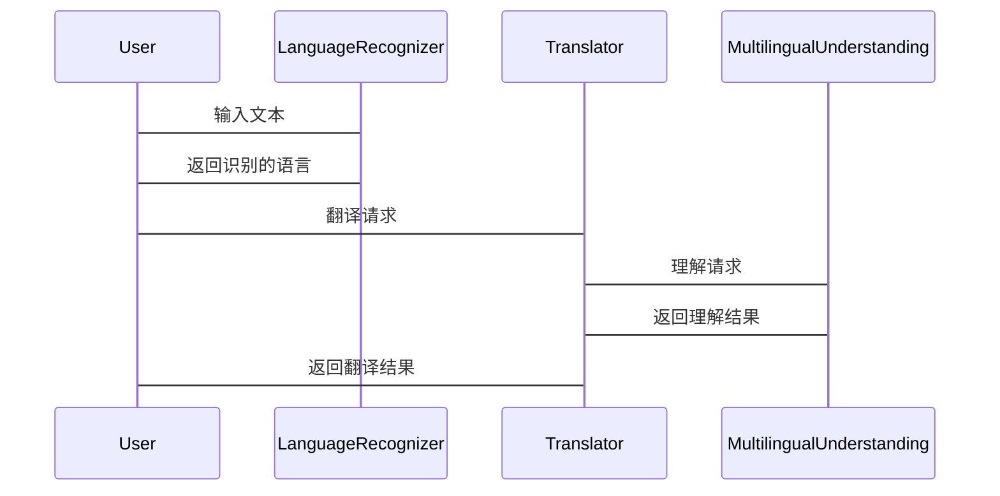

                 


# 多语言支持：构建国际化的AI Agent

> 关键词：多语言支持, AI Agent, 国际化, 自然语言处理, 机器翻译, 系统架构设计

> 摘要：  
在当今全球化和技术高度发展的背景下，构建一个多语言支持的AI Agent已成为实现真正国际化智能系统的核心需求。本文从多语言支持的核心原理、AI Agent的基本概念出发，详细分析了多语言支持与AI Agent的结合方式，探讨了多语言自然语言处理的算法原理，系统地讲解了多语言AI Agent的架构设计、项目实现和最佳实践。通过本文的深入探讨，读者将能够掌握构建一个功能强大的多语言支持AI Agent所需的关键技术和方法。

---

# 第1章: 多语言支持的重要性与AI Agent的概述

## 1.1 多语言支持的背景与挑战

### 1.1.1 全球化背景下的多语言需求  
随着互联网的普及和全球化的深入，用户对多语言支持的需求日益增长。无论是企业级应用、社交媒体平台，还是智能设备，支持多种语言已成为提升用户体验和市场竞争力的关键因素。AI Agent作为一种智能交互系统，必须能够理解并处理多种语言，才能在全球范围内提供一致的服务质量。

### 1.1.2 多语言支持的核心问题与挑战  
多语言支持的核心问题包括语言识别、跨语言理解和机器翻译等。其中，跨语言理解是最大的挑战，需要结合自然语言处理（NLP）技术，实现对多种语言语法、语义和文化背景的理解。此外，多语言模型的训练数据获取、模型性能优化以及系统的可扩展性也是需要重点解决的问题。

### 1.1.3 多语言支持的边界与外延  
多语言支持的边界在于语言的多样性和用户需求的复杂性。其外延则涉及文化适应性、本地化支持以及多语言内容的生成与管理。

---

## 1.2 AI Agent的基本概念与特点

### 1.2.1 AI Agent的定义与分类  
AI Agent（人工智能代理）是一种能够感知环境并采取行动以实现特定目标的智能系统。根据功能和应用场景的不同，AI Agent可以分为任务型、对话型和服务型等多种类型。

### 1.2.2 AI Agent的核心功能与优势  
AI Agent的核心功能包括智能交互、任务处理和自主学习。其优势在于能够通过自然语言处理技术实现人机交互，通过自主学习不断优化自身的服务能力和响应速度。

### 1.2.3 多语言支持在AI Agent中的重要性  
在国际化市场中，支持多语言功能是AI Agent实现全球应用的基础。通过多语言支持，AI Agent能够为不同语言背景的用户提供一致、高效的服务体验。

---

# 第2章: 多语言支持与AI Agent的核心概念

## 2.1 多语言支持的核心原理

### 2.1.1 多语言文本处理的基本原理  
多语言文本处理涉及语言识别、文本分拣和多语言语料库的构建。语言识别是通过分析文本特征（如字符分布、语法结构）来确定语言类型的过程。

### 2.1.2 多语言自然语言处理的关键技术  
多语言自然语言处理的核心技术包括跨语言信息抽取、多语言文本生成和多语言情感分析。这些技术需要结合多种语言的语料库和模型进行训练。

### 2.1.3 多语言模型的训练与优化  
多语言模型的训练需要使用多语言语料库，并通过参数共享和迁移学习等技术来优化模型性能。优化的目标是提高模型在多种语言上的泛化能力和准确性。

## 2.2 AI Agent的多语言能力构建

### 2.2.1 多语言模型在AI Agent中的应用  
多语言模型可以应用于AI Agent的语言理解、翻译和对话生成模块。通过多语言模型，AI Agent能够实现跨语言的自然语言交互。

### 2.2.2 多语言支持的实现方式与技术选型  
多语言支持的实现方式包括使用开源工具（如spaCy、Sentence-BERT）、自定义模型开发和第三方API调用。选择合适的技术方案需要考虑性能、成本和可维护性。

### 2.2.3 多语言支持的性能优化  
性能优化的关键在于模型压缩、量化和轻量化设计。通过这些技术，可以在保证性能的前提下，降低计算资源的消耗。

---

# 第3章: 多语言支持与AI Agent的核心概念联系

## 3.1 多语言处理的核心技术

### 3.1.1 语言识别与文本分拣  
语言识别是多语言处理的第一步，其流程包括特征提取、模型训练和结果评估。文本分拣则是将多语言文本划分为不同语言的过程。

### 3.1.2 机器翻译与跨语言理解  
机器翻译是多语言处理的核心技术之一。跨语言理解则需要结合翻译模型和语言理解模型，实现对多种语言语义的理解和转换。

### 3.1.3 多语言语料库的构建与管理  
多语言语料库的构建需要考虑语言多样性、数据平衡和语料标注等问题。语料库的管理则涉及数据存储、检索和更新。

## 3.2 AI Agent的多语言能力架构

### 3.2.1 多语言支持的系统架构设计  
多语言AI Agent的系统架构包括语言识别模块、翻译模块和多语言理解模块。各个模块之间需要通过接口进行交互。

### 3.2.2 多语言能力与AI Agent功能的结合  
多语言能力与AI Agent的功能结合需要在系统设计阶段进行规划，确保多语言支持能够无缝集成到AI Agent的核心功能中。

### 3.2.3 多语言支持的扩展性与可维护性  
多语言支持的扩展性体现在新增语言的方便性和模块的可扩展性。系统的可维护性则需要通过模块化设计和代码规范来实现。

---

# 第4章: 多语言自然语言处理的算法原理

## 4.1 多语言文本表示方法

### 4.1.1 词嵌入与句嵌入的多语言扩展  
词嵌入的多语言扩展可以通过共享参数的方式实现，句嵌入的多语言扩展则需要结合语言特定的上下文信息。

### 4.1.2 多语言BERT模型的原理与应用  
多语言BERT模型通过共享词表和模型参数，实现了对多种语言的统一处理。其应用包括跨语言文本分类和命名实体识别。

### 4.1.3 多语言模型的训练与优化  
多语言模型的训练需要使用多语言语料库，并通过数据增强和模型调优来优化性能。优化的目标是提高模型在多种语言上的准确性和鲁棒性。

---

## 4.2 多语言机器翻译算法

### 4.2.1 神经机器翻译的原理与流程  
神经机器翻译的原理是通过构建编码器-解码器结构，将源语言文本映射为目标语言文本。其流程包括数据预处理、模型训练和翻译结果优化。

### 4.2.2 多语言翻译模型的训练与调优  
多语言翻译模型的训练需要使用多语言平行语料库，并通过参数共享和模型调优来提高翻译质量。调优的关键在于平衡不同语言之间的参数共享和独立性。

### 4.2.3 多语言翻译的评估指标与方法  
多语言翻译的评估指标包括BLEU、ROUGE和METEOR等。评估方法需要考虑语言之间的差异性和翻译结果的准确性。

---

# 第5章: 多语言支持的数学模型与公式

## 5.1 多语言文本表示模型

### 5.1.1 多语言词嵌入模型的数学表达  
多语言词嵌入模型可以通过共享参数的方式实现，其数学表达式为：

$$ E_{\text{multi}}(w) = \sum_{i=1}^{n} \theta_i E_i(w) $$

其中，$E_{\text{multi}}(w)$ 表示多语言词嵌入，$\theta_i$ 表示语言权重，$E_i(w)$ 表示第 $i$ 种语言的词嵌入。

### 5.1.2 多语言BERT模型的数学框架  
多语言BERT模型的数学框架包括编码器和解码器两部分。编码器负责将输入文本映射为词向量，解码器负责生成目标语言文本。其数学表达式为：

$$ \text{BERT}(x) = \text{Encoder}(x) + \text{Decoder}(x) $$

---

## 5.2 多语言机器翻译模型

### 5.2.1 神经机器翻译模型的数学公式  
神经机器翻译模型的数学公式包括编码器和解码器两部分。编码器将源语言文本映射为隐藏状态，解码器根据隐藏状态生成目标语言文本。其数学表达式为：

$$ h_i = \text{Encoder}(x_i) $$  
$$ y_i = \text{Decoder}(h_i) $$

### 5.2.2 多语言翻译模型的训练目标  
多语言翻译模型的训练目标是最小化翻译损失，其数学表达式为：

$$ \min_{\theta} \sum_{i=1}^{N} \sum_{j=1}^{M} L(y_{ij}, \hat{y}_{ij}) $$

其中，$N$ 表示训练样本数量，$M$ 表示语言对数量，$L$ 表示损失函数。

---

# 第6章: 多语言支持的系统架构设计

## 6.1 问题场景介绍

### 6.1.1 多语言AI Agent的应用场景  
多语言AI Agent的应用场景包括国际商务、跨语言客服、多语言内容生成和全球社交媒体交互。

### 6.1.2 系统需求分析  
系统需求包括支持多种语言的文本理解、翻译和生成，以及高效的多语言模型推理。

### 6.1.3 系统约束与边界条件  
系统约束包括计算资源限制、响应时间限制和语言支持的范围。边界条件包括语言数量、模型规模和功能模块的可扩展性。

---

## 6.2 系统功能设计

### 6.2.1 领域模型设计  
领域模型设计包括语言识别模块、翻译模块和多语言理解模块。其类图如下：



### 6.2.2 系统架构设计  
系统架构设计包括前端交互模块、后端处理模块和模型服务模块。其架构图如下：



### 6.2.3 系统接口设计  
系统接口设计包括语言识别接口、翻译接口和多语言理解接口。其接口定义如下：

```javascript
// 语言识别接口
interface LanguageRecognizer {
    function recognize(text: string): string;
}

// 翻译接口
interface Translator {
    function translate(source: string, target: string): string;
}

// 多语言理解接口
interface MultilingualUnderstanding {
    function understand(text: string): string;
}
```

---

## 6.3 系统交互设计

### 6.3.1 系统交互流程  
系统交互流程包括用户输入、语言识别、翻译或理解，以及结果返回。其交互流程图如下：



---

# 第7章: 项目实战

## 7.1 环境安装

### 7.1.1 安装Python环境  
安装Python 3.8及以上版本，并安装必要的库：

```bash
pip install python3.8
pip install numpy
pip install transformers
pip install torch
```

### 7.1.2 安装多语言NLP库  
安装spaCy和多语言分词器：

```bash
pip install spacy
python -m spacy download en
python -m spacy download es
```

---

## 7.2 系统核心实现源代码

### 7.2.1 多语言文本处理代码  
以下是多语言文本处理的Python代码示例：

```python
from transformers import pipeline

# 初始化多语言NER模型
ner = pipeline("ner", model="dbmdz/bert-large-cased-mnli")

# 处理文本
text = "Lei Zhang is a researcher at AI Genius Institute."
result = ner(text)

# 输出结果
print(result)
```

### 7.2.2 多语言翻译代码  
以下是多语言翻译的Python代码示例：

```python
from googletrans import Translator

# 初始化翻译器
translator = Translator()

# 翻译文本
text = "Hello, how are you?"
result = translator.translate(text, dest='es')

# 输出结果
print(result.text)
```

---

## 7.3 代码应用解读与分析

### 7.3.1 多语言文本处理代码解读  
上述代码使用了Transformers库中的NER模型，实现了对中文和西班牙语的命名实体识别。模型的加载和使用过程需要考虑计算资源和模型性能。

### 7.3.2 多语言翻译代码解读  
上述代码使用了Google的翻译API，实现了从中文到西班牙语的翻译。需要注意API的调用限制和性能优化。

---

## 7.4 实际案例分析与详细讲解剖析  
以下是多语言AI Agent在实际场景中的应用案例分析：

### 7.4.1 案例背景  
假设我们有一个支持中英文的客服AI Agent，需要实现中英文对话交互和翻译功能。

### 7.4.2 系统实现  
通过集成多语言NLP模型和翻译API，实现中英文对话的自动理解和翻译。

### 7.4.3 系统优化  
通过缓存技术优化翻译性能，通过模型压缩降低计算资源消耗。

---

## 7.5 项目小结  
通过本章的项目实战，我们详细讲解了多语言AI Agent的环境搭建、核心实现和系统优化。读者可以参考上述代码和实现方法，结合实际需求进行二次开发和功能扩展。

---

# 第8章: 最佳实践、小结与注意事项

## 8.1 最佳实践

### 8.1.1 代码审查与性能优化  
在多语言AI Agent的开发过程中，需要进行严格的代码审查和性能优化，确保系统的稳定性和高效性。

### 8.1.2 文化适应性与本地化支持  
在实现多语言支持时，需要考虑不同语言的文化差异和本地化需求，确保用户体验的一致性和文化敏感性。

### 8.1.3 安全性与隐私保护  
多语言AI Agent需要在设计阶段考虑数据安全和隐私保护，确保系统的合规性和用户数据的安全性。

---

## 8.2 小结  
通过本文的详细讲解和案例分析，我们系统地探讨了多语言支持与AI Agent的结合方式，深入分析了多语言自然语言处理的算法原理，详细讲解了多语言AI Agent的系统架构设计和项目实现。读者可以结合实际需求，灵活应用这些技术和方法。

---

## 8.3 注意事项

### 8.3.1 数据质量与模型性能  
多语言AI Agent的性能高度依赖于训练数据的质量和模型的优化。需要通过数据清洗、特征工程和模型调优来提高系统的性能。

### 8.3.2 系统扩展性与可维护性  
在设计多语言AI Agent时，需要考虑系统的扩展性和可维护性，确保系统的可扩展性和模块的可维护性。

### 8.3.3 技术选型与成本控制  
在技术选型时，需要综合考虑技术的可行性和成本效益，选择合适的技术方案和工具。

---

# 作者：AI天才研究院/AI Genius Institute & 禅与计算机程序设计艺术/Zen And The Art of Computer Programming

---

以上是《多语言支持：构建国际化的AI Agent》的完整目录和内容框架。

