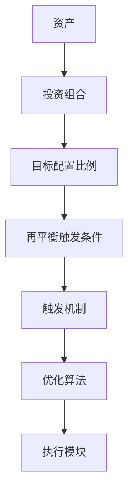
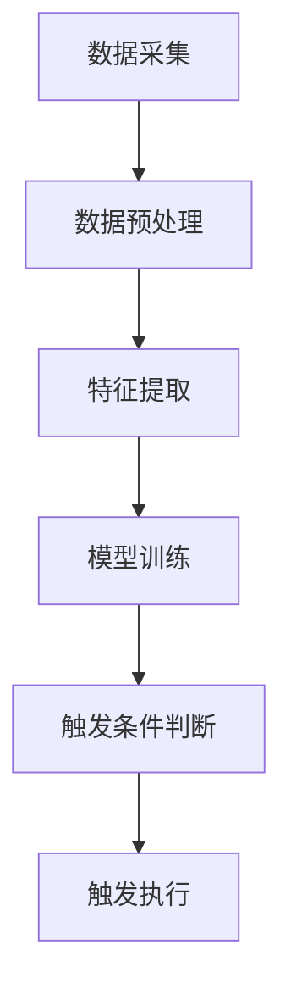
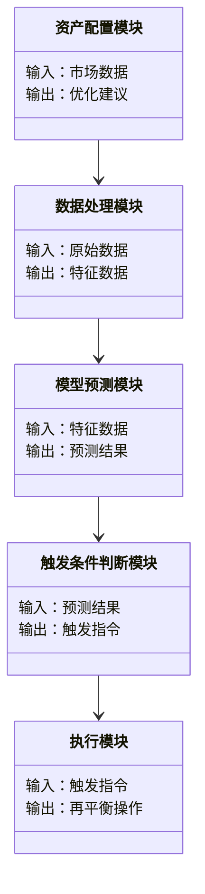
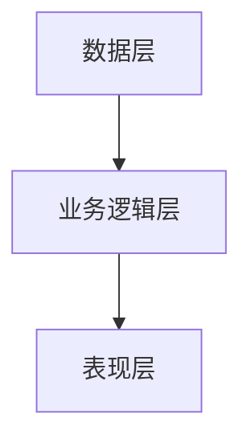
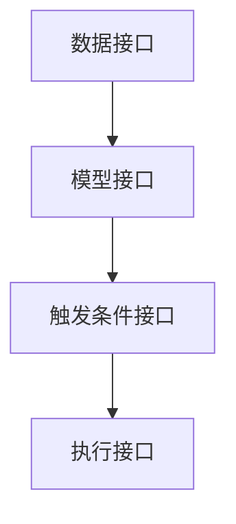
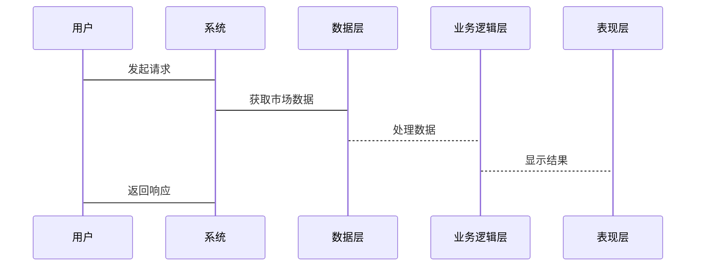

                 


# 智能资产配置再平衡触发系统

> 关键词：智能资产配置，再平衡触发，机器学习，优化算法，系统架构

> 摘要：本文详细探讨了智能资产配置再平衡触发系统的背景、核心概念、算法原理、系统架构以及实际应用。通过分析资产配置的必要性、再平衡触发的优化算法以及系统的整体架构，本文为读者提供了从理论到实践的全面指导。通过实际案例分析和代码实现，展示了如何利用智能化方法提升资产配置的效率和准确性。

---

# 第1章: 智能资产配置再平衡触发系统背景介绍

## 1.1 问题背景

### 1.1.1 资产配置的重要性
资产配置是投资管理中的核心环节，决定了投资组合的风险和收益。通过科学的资产配置，投资者可以在不同资产类别之间分散风险，实现收益最大化。

### 1.1.2 再平衡触发的必要性
随着时间的推移，市场环境的变化会导致投资组合偏离最初的配置目标。为了维持目标配置比例，需要定期进行再平衡。传统的手动再平衡方式效率低下，而智能化的触发机制能够实时监控市场变化，自动启动再平衡流程。

### 1.1.3 智能化的需求驱动
随着金融市场复杂性的增加，投资者对实时、动态的资产配置需求日益增长。智能化技术的应用能够显著提升资产配置的效率和准确性。

## 1.2 问题描述

### 1.2.1 资产配置的核心问题
资产配置的核心问题是如何在不同资产类别之间分配资金，以实现风险和收益的最佳平衡。

### 1.2.2 再平衡触发的挑战
传统的再平衡触发机制依赖于固定的时间间隔或特定的市场指标，这种方式难以适应市场的快速变化。智能化的触发机制需要实时监控市场数据，并根据模型预测结果动态调整触发条件。

### 1.2.3 系统化解决方案的必要性
通过系统化的解决方案，可以实现资产配置的智能化、自动化。系统化的触发机制能够根据市场环境的变化，动态调整再平衡的时机和策略。

## 1.3 问题解决

### 1.3.1 智能化再平衡的核心思想
智能化再平衡的核心思想是利用机器学习和优化算法，实时监控市场数据，预测市场趋势，并根据预测结果动态调整触发条件。

### 1.3.2 数据驱动的决策逻辑
数据驱动的决策逻辑强调通过大量历史数据和实时市场数据，提取有效的特征，构建预测模型，从而指导再平衡触发的决策。

### 1.3.3 系统化触发机制的设计
系统化触发机制的设计包括数据采集、特征提取、模型预测、触发条件判断等多个环节，确保触发机制的科学性和有效性。

## 1.4 边界与外延

### 1.4.1 系统边界定义
系统的边界包括数据输入、模型预测、触发条件判断和执行指令输出。系统的输入包括市场数据和投资组合信息，输出包括再平衡触发指令和优化建议。

### 1.4.2 相关概念的外延
相关概念的外延包括资产配置策略、再平衡机制、触发条件、优化算法等。这些概念共同构成了智能化再平衡触发系统的核心内容。

### 1.4.3 应用场景的限制
系统主要应用于机构投资和个人投资领域，适用于需要频繁调整投资组合的场景。对于长期投资和低频调整的需求，系统同样可以提供优化建议。

## 1.5 概念结构与核心要素

### 1.5.1 核心概念组成
核心概念包括触发机制、优化算法、数据处理和系统架构。

### 1.5.2 概念之间的关系
触发机制依赖于优化算法和数据处理，优化算法需要目标函数和约束条件，数据处理需要市场数据和投资组合信息，系统架构则整合了触发机制、优化算法和数据处理模块。

### 1.5.3 系统架构的核心要素
系统架构的核心要素包括数据采集模块、特征提取模块、模型预测模块、触发条件判断模块和执行模块。

---

# 第2章: 核心概念与原理

## 2.1 触发机制的核心原理

### 2.1.1 基于数据的触发逻辑
基于数据的触发逻辑通过分析市场数据的变化，如波动率、收益率等指标，判断是否需要启动再平衡。

### 2.1.2 基于模型的触发规则
基于模型的触发规则通过构建预测模型，预测市场趋势和投资组合的表现，根据预测结果决定是否触发再平衡。

### 2.1.3 基于市场的触发条件
基于市场的触发条件包括市场波动率超过阈值、资产比例偏离目标比例等。

## 2.2 优化算法的原理

### 2.2.1 常见优化算法概述
常见的优化算法包括线性规划、非线性规划、遗传算法和模拟退火算法等。

### 2.2.2 再平衡优化的目标函数
再平衡优化的目标函数通常包括最大化收益、最小化风险或两者之间的权衡。

### 2.2.3 算法收敛性分析
优化算法的收敛性分析包括收敛速度、收敛条件和收敛后的稳定性。

## 2.3 数据处理与特征提取

### 2.3.1 数据预处理方法
数据预处理方法包括数据清洗、标准化和缺失值处理。

### 2.3.2 特征提取的关键点
特征提取的关键点包括选择与市场波动和投资收益相关的特征，如波动率、收益率、相关系数等。

### 2.3.3 特征选择的优化
特征选择的优化可以通过逐步回归、Lasso回归等方法实现。

---

## 2.4 智能化触发机制的核心要素

### 2.4.1 数据采集与处理
数据采集与处理包括市场数据的获取、清洗和特征提取。

### 2.4.2 模型构建与训练
模型构建与训练包括选择合适的预测模型，如支持向量机、随机森林和神经网络等。

### 2.4.3 触发条件判断
触发条件判断包括预测结果与目标阈值的比较，决定是否启动再平衡。

---

## 2.5 核心概念对比表

| **触发机制类型** | **优化算法类型** | **特点** | **优缺点** | **适用场景** |
|--------------------|------------------|----------|------------|--------------|
| 基于数据的触发    | 线性规划          | 简单易实现 | 精度较低    | 适用于线性问题 |
| 基于模型的触发    | 非线性规划        | 精度高     | 计算复杂    | 适用于非线性问题 |
| 基于市场的触发    | 遗传算法          | 全局最优   | 计算时间长  | 适用于复杂场景 |

---

## 2.6 实体关系图（ER图）



---

# 第3章: 算法原理讲解

## 3.1 再平衡触发算法的流程



## 3.2 算法实现代码

```python
import numpy as np
import pandas as pd
from sklearn.linear_model import LinearRegression

def load_data():
    # 加载市场数据和投资组合信息
    return df

def preprocess_data(df):
    # 数据清洗和标准化
    return processed_df

def extract_features(processed_df):
    # 提取特征
    return features

def train_model(features, target):
    # 训练预测模型
    model = LinearRegression()
    model.fit(features, target)
    return model

def trigger_condition(model, current_features):
    # 判断触发条件
    prediction = model.predict(current_features)
    return prediction > threshold

def trigger_execution():
    # 执行再平衡
    pass

if __name__ == "__main__":
    df = load_data()
    processed_df = preprocess_data(df)
    features = extract_features(processed_df)
    target = processed_df['target']
    model = train_model(features, target)
    current_features = extract_features(new_data)
    trigger = trigger_condition(model, current_features)
    if trigger:
        trigger_execution()
```

## 3.3 数学模型与公式

### 3.3.1 优化目标函数

$$ \text{目标函数} = \min \sum_{i=1}^{n} w_i x_i - \lambda \sum_{i=1}^{n} w_i^2 $$

### 3.3.2 约束条件

$$ \sum_{i=1}^{n} w_i = 1 $$

$$ w_i \geq 0 \quad \forall i $$

### 3.3.3 优化算法的收敛性分析

$$ \text{收敛速度} = O(\frac{1}{k^2}) $$

---

# 第4章: 系统分析与架构设计

## 4.1 问题场景介绍

### 4.1.1 投资者的实际需求
投资者需要动态调整投资组合，以应对市场变化和实现收益目标。

### 4.1.2 市场波动的影响
市场波动会导致投资组合偏离目标配置比例，需要及时调整。

## 4.2 项目介绍

### 4.2.1 系统功能目标
系统功能目标包括实时监控市场数据、动态调整触发条件、自动执行再平衡操作。

### 4.2.2 目标用户群体
目标用户群体包括机构投资者、高净值个人和财富管理机构。

## 4.3 系统功能设计

### 4.3.1 领域模型



## 4.4 系统架构设计

### 4.4.1 分层架构



### 4.4.2 接口设计



## 4.5 系统交互流程

### 4.5.1 序列图



---

# 第5章: 项目实战

## 5.1 环境安装

### 5.1.1 安装Python

```bash
python --version
```

### 5.1.2 安装依赖库

```bash
pip install numpy pandas scikit-learn
```

## 5.2 系统核心实现

### 5.2.1 数据加载与处理

```python
import pandas as pd
import numpy as np

def load_data():
    df = pd.read_csv('market_data.csv')
    return df

def preprocess_data(df):
    df = df.dropna()
    df = df[(df['close'] > 0)]
    return df

data = load_data()
data = preprocess_data(data)
```

### 5.2.2 特征提取与建模

```python
from sklearn.linear_model import LinearRegression

def extract_features(data):
    features = data[['open', 'high', 'low', 'volume']]
    return features

def train_model(features, target):
    model = LinearRegression()
    model.fit(features, target)
    return model

features = extract_features(data)
target = data['close']
model = train_model(features, target)
```

### 5.2.3 触发条件与执行

```python
def trigger_condition(model, current_features):
    prediction = model.predict(current_features)
    return prediction > 100

current_features = extract_features(new_data)
trigger = trigger_condition(model, current_features)
if trigger:
    trigger_execution()
```

## 5.3 实际案例分析

### 5.3.1 数据来源
数据来自某金融市场的历史数据，包括开盘价、收盘价、最高价、最低价和成交量。

### 5.3.2 模型训练与评估
使用历史数据训练模型，评估模型的准确性和稳定性。

### 5.3.3 触发机制的实际效果
通过实际市场数据测试触发机制的有效性，分析触发条件的准确性和及时性。

---

# 第6章: 最佳实践与小结

## 6.1 最佳实践

### 6.1.1 数据质量管理
确保数据的准确性和完整性，避免因数据问题导致的错误决策。

### 6.1.2 模型选择与优化
选择合适的模型，并进行参数优化和模型调优，提升预测精度。

### 6.1.3 系统监控与维护
建立完善的系统监控机制，及时发现和解决系统运行中的问题。

## 6.2 小结

智能资产配置再平衡触发系统通过智能化的方法，显著提升了资产配置的效率和准确性。通过实时监控市场数据、动态调整触发条件，系统能够帮助投资者在复杂多变的市场环境中实现投资目标。

## 6.3 注意事项

### 6.3.1 数据隐私与安全
确保系统的数据安全，避免数据泄露和被篡改。

### 6.3.2 模型局限性
认识到模型的局限性，避免过度依赖模型预测，结合人工判断。

## 6.4 拓展阅读

### 6.4.1 推荐书籍
1. 《机器学习实战》
2. 《量化投资：机构投资者的智慧》

### 6.4.2 推荐博客
1. [机器学习在金融领域的应用](#)
2. [智能投资系统设计](#)

---

# 作者：AI天才研究院/AI Genius Institute & 禅与计算机程序设计艺术 /Zen And The Art of Computer Programming

