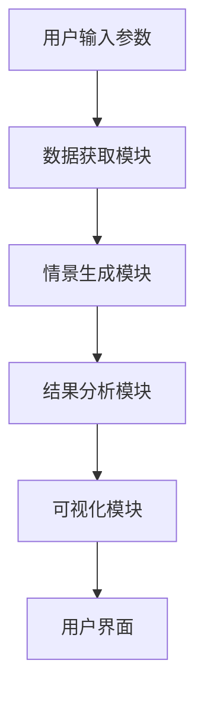

                 


# 金融机构压力测试情景生成器

> 关键词：金融机构，压力测试，情景生成器，风险评估，蒙特卡洛模拟，系统架构，Python实现

> 摘要：本文介绍金融机构压力测试情景生成器的设计与实现，涵盖压力测试的基本概念、情景生成的核心算法、系统架构设计以及项目实战案例。通过详细讲解数学模型、算法流程和系统架构，帮助读者理解如何构建高效的压力测试工具。

---

## 目录

1. [金融机构压力测试概述](#金融机构压力测试概述)
   1.1 [压力测试的基本概念](#压力测试的基本概念)
   1.2 [金融机构压力测试的必要性](#金融机构压力测试的必要性)
   1.3 [压力测试情景生成器的定义与作用](#压力测试情景生成器的定义与作用)
2. [压力测试情景生成的核心算法](#压力测试情景生成的核心算法)
   2.1 [蒙特卡洛模拟](#蒙特卡洛模拟)
   2.2 [历史数据分析](#历史数据分析)
   2.3 [机器学习模型](#机器学习模型)
3. [压力测试情景生成器的系统架构](#压力测试情景生成器的系统架构)
   3.1 [系统模块划分](#系统模块划分)
   3.2 [数据流设计](#数据流设计)
   3.3 [用户界面设计](#用户界面设计)
4. [压力测试情景生成器的项目实战](#压力测试情景生成器的项目实战)
   4.1 [环境搭建](#环境搭建)
   4.2 [核心算法实现](#核心算法实现)
   4.3 [结果分析与可视化](#结果分析与可视化)
5. [压力测试情景生成器的案例分析](#压力测试情景生成器的案例分析)
   5.1 [股票市场波动测试](#股票市场波动测试)
   5.2 [信用风险评估](#信用风险评估)
6. [压力测试情景生成器的高级主题](#压力测试情景生成器的高级主题)
   6.1 [实时数据流处理](#实时数据流处理)
   6.2 [深度学习的应用](#深度学习的应用)
7. [压力测试情景生成器的总结与展望](#压力测试情景生成器的总结与展望)

---

## 1. 金融机构压力测试概述

### 1.1 压力测试的基本概念

压力测试是一种评估金融机构在极端市场条件下承受风险能力的方法。它通过模拟可能的极端市场情景，如经济衰退、市场崩盘等，来评估金融机构的资产组合在这些情景下的表现。

#### 1.1.1 什么是压力测试
压力测试通过模拟极端市场条件，评估金融机构在这些条件下的财务状况和风险承受能力。它帮助机构识别潜在风险，制定应对策略。

#### 1.1.2 压力测试的目的与意义
压力测试的主要目的是：
1. 评估资产组合在极端市场条件下的表现。
2. 确定金融机构在压力情景下的资本需求。
3. 识别潜在风险点并制定应对措施。

#### 1.1.3 压力测试的分类与应用场景
压力测试可以分为以下几类：
- **市场风险测试**：评估资产组合在市场价格波动下的表现。
- **信用风险测试**：评估贷款组合在违约率上升情况下的表现。
- **流动性风险测试**：评估金融机构在市场流动性不足情况下的融资能力。

### 1.2 金融机构压力测试的必要性

#### 1.2.1 金融机构面临的市场风险
金融机构在经营过程中面临多种风险，如市场风险、信用风险、流动性风险等。这些风险可能在极端市场条件下迅速放大，导致重大损失。

#### 1.2.2 压力测试在风险管理中的作用
压力测试通过模拟极端市场情景，帮助金融机构识别潜在风险，并制定应对策略，从而增强风险管理和资本规划能力。

#### 1.2.3 压力测试的监管要求与行业标准
许多国家的监管机构要求金融机构定期进行压力测试，以确保其具备足够的资本和流动性应对极端市场条件。

### 1.3 压力测试情景生成器的定义与作用

#### 1.3.1 情景生成器的基本概念
情景生成器是一种工具，用于生成各种可能的市场情景，供压力测试使用。它可以根据历史数据或模型模拟出极端市场条件下的资产价格、利率等变量。

#### 1.3.2 情景生成器在压力测试中的作用
情景生成器是压力测试的核心工具，它帮助金融机构快速生成多种市场情景，评估资产组合在不同情景下的表现。

#### 1.3.3 情景生成器的优势与局限性
**优势**：
- 可以生成大量市场情景，覆盖各种可能的市场变化。
- 可以模拟极端市场条件，帮助识别潜在风险。

**局限性**：
- 模型依赖假设，可能无法完全捕捉现实中所有的市场变化。
- 需要大量历史数据或参数设定，可能影响情景的准确性。

## 2. 压力测试情景生成的核心算法

### 2.1 蒙特卡洛模拟

#### 2.1.1 蒙特卡洛模拟的基本原理
蒙特卡洛模拟是一种通过随机抽样方法模拟系统行为的算法。它常用于金融市场中，生成资产价格的随机路径。

#### 2.1.2 蒙特卡洛模拟的实现步骤
1. 确定资产价格的驱动因素，如波动率、收益率等。
2. 生成随机数，模拟资产价格的变化路径。
3. 计算资产组合在不同模拟路径下的表现。

#### 2.1.3 蒙特卡洛模拟的数学模型
$$ S_t = S_0 \exp\left( \left( r - \frac{\sigma^2}{2} \right) t + \sigma W_t \right) $$
其中，\( S_t \) 是资产价格，\( S_0 \) 是初始价格，\( r \) 是无风险利率，\( \sigma \) 是波动率，\( W_t \) 是布朗运动。

#### 2.1.4 蒙特卡洛模拟的代码实现
```python
import numpy as np

def monte_carlo_simulation(S0, r, sigma, T, steps):
    # 模拟资产价格
    W = np.random.standard_normal(steps)
    S = S0 * np.exp( (r - 0.5*sigma**2)*T + sigma*np.sqrt(T)*W )
    return S
```

### 2.2 历史数据分析

#### 2.2.1 历史数据分析的基本原理
历史数据分析是基于过去市场数据生成情景的一种方法。它通过分析历史市场波动，生成类似的情景。

#### 2.2.2 历史数据分析的实现步骤
1. 收集历史市场数据，如资产价格、收益率等。
2. 分析数据的统计特征，如均值、方差等。
3. 生成新的市场情景，保持与历史数据一致的统计特征。

#### 2.2.3 历史数据分析的数学模型
$$ \hat{\mu} = \frac{1}{n}\sum_{i=1}^{n} r_i $$
$$ \hat{\sigma}^2 = \frac{1}{n-1}\sum_{i=1}^{n} (r_i - \hat{\mu})^2 $$

#### 2.2.4 历史数据分析的代码实现
```python
import numpy as np

def historical_analysis_simulation(r历史收益率):
    mu = np.mean(r历史收益率)
    sigma = np.std(r历史收益率)
    S0 = 初始价格
    T = 时间跨度
    steps = 步数
    W = np.random.standard_normal(steps)
    S = S0 * np.exp( (mu - 0.5*sigma**2)*T + sigma*np.sqrt(T)*W )
    return S
```

### 2.3 机器学习模型

#### 2.3.1 机器学习模型的基本原理
机器学习模型，如LSTM，可以用于生成市场情景。通过训练历史数据，模型可以捕捉市场波动的模式，并生成未来的情景。

#### 2.3.2 机器学习模型的实现步骤
1. 收集历史市场数据，如资产价格、技术指标等。
2. 数据预处理，包括标准化、分割训练集和测试集。
3. 训练机器学习模型，如LSTM。
4. 使用训练好的模型生成未来的情景。

#### 2.3.3 机器学习模型的数学模型
$$ LSTM递归公式 $$
$$ h_t = \text{激活}(f_{t-1}, h_{t-1}, W_f) $$
$$ c_t = \text{激活}(i_{t-1}, h_{t-1}, W_i) $$
$$ o_t = \text{激活}(o_{t-1}, h_{t-1}, W_o) $$
$$ h_t = o_t \cdot c_t $$

#### 2.3.4 机器学习模型的代码实现
```python
import numpy as np
from tensorflow.keras.models import Sequential
from tensorflow.keras.layers import LSTM, Dense, Dropout

def lstm_model(input_shape):
    model = Sequential()
    model.add(LSTM(64, return_sequences=True, input_shape=input_shape))
    model.add(Dropout(0.5))
    model.add(LSTM(32, return_sequences=True))
    model.add(Dropout(0.5))
    model.add(Dense(1))
    model.compile(loss='mean_squared_error', optimizer='adam')
    return model
```

## 3. 压力测试情景生成器的系统架构

### 3.1 系统模块划分

- **数据获取模块**：负责获取历史市场数据或实时数据。
- **情景生成模块**：实现蒙特卡洛模拟、历史数据分析和机器学习模型的接口。
- **结果分析模块**：对生成的情景进行统计分析和风险评估。
- **可视化模块**：将分析结果以图形化界面展示。

### 3.2 数据流设计



### 3.3 用户界面设计

```mermaid
ui -> input[输入参数]
ui -> dropdown[选择生成方法]
ui -> button[开始生成]
ui -> output[结果显示]
```

## 4. 压力测试情景生成器的项目实战

### 4.1 环境搭建

#### 4.1.1 安装必要的库
- Python 3.8+
- NumPy
- Pandas
- Matplotlib
- TensorFlow

#### 4.1.2 数据源选择
选择一个金融数据源，如Yahoo Finance，获取历史资产价格数据。

### 4.2 核心算法实现

#### 4.2.1 蒙特卡洛模拟实现
```python
import numpy as np

def monte_carlo_simulation(S0, r, sigma, T, steps):
    W = np.random.standard_normal(steps)
    S = S0 * np.exp( (r - 0.5*sigma**2)*T + sigma*np.sqrt(T)*W )
    return S
```

#### 4.2.2 历史数据分析实现
```python
import numpy as np

def historical_analysis_simulation(r历史收益率):
    mu = np.mean(r历史收益率)
    sigma = np.std(r历史收益率)
    S0 = 初始价格
    T = 时间跨度
    steps = 步数
    W = np.random.standard_normal(steps)
    S = S0 * np.exp( (mu - 0.5*sigma**2)*T + sigma*np.sqrt(T)*W )
    return S
```

#### 4.2.3 机器学习模型实现
```python
import numpy as np
from tensorflow.keras.models import Sequential
from tensorflow.keras.layers import LSTM, Dense, Dropout

def lstm_model(input_shape):
    model = Sequential()
    model.add(LSTM(64, return_sequences=True, input_shape=input_shape))
    model.add(Dropout(0.5))
    model.add(LSTM(32, return_sequences=True))
    model.add(Dropout(0.5))
    model.add(Dense(1))
    model.compile(loss='mean_squared_error', optimizer='adam')
    return model
```

### 4.3 结果分析与可视化

#### 4.3.1 结果分析
计算资产组合在不同情景下的VaR和CVaR，评估风险。

#### 4.3.2 可视化
使用Matplotlib绘制资产价格的模拟路径和风险指标的分布。

## 5. 压力测试情景生成器的案例分析

### 5.1 股票市场波动测试

#### 5.1.1 案例背景
选择一只股票，模拟其在市场波动情况下的价格变化。

#### 5.1.2 数据来源与预处理
使用Yahoo Finance获取过去5年的日收益率数据。

#### 5.1.3 情景生成与分析
使用蒙特卡洛模拟生成1000条价格路径，计算VaR和CVaR。

### 5.2 信用风险评估

#### 5.2.1 案例背景
评估一组贷款在违约率上升情况下的损失。

#### 5.2.2 数据来源与预处理
收集贷款的历史违约数据，分析违约率的变化。

#### 5.2.3 情景生成与分析
使用历史数据分析生成违约率上升的情景，评估贷款组合的信用风险。

## 6. 压力测试情景生成器的高级主题

### 6.1 实时数据流处理

#### 6.1.1 实时数据流的重要性
金融机构需要实时处理市场数据，快速生成情景，应对市场变化。

#### 6.1.2 实时数据流的处理方法
使用流处理框架，如Kafka和Flink，实时生成市场情景。

### 6.2 深度学习的应用

#### 6.2.1 深度学习在压力测试中的优势
深度学习可以捕捉市场数据中的复杂模式，生成更准确的情景。

#### 6.2.2 基于深度学习的情景生成
使用生成对抗网络（GAN）生成逼真的市场情景。

## 7. 压力测试情景生成器的总结与展望

### 7.1 总结
本文详细介绍了金融机构压力测试情景生成器的设计与实现，涵盖核心算法、系统架构和项目实战。通过多种方法生成市场情景，帮助金融机构评估风险，制定应对策略。

### 7.2 展望
未来，压力测试情景生成器将结合更先进的技术，如实时数据流处理和深度学习，提高情景生成的准确性和效率。

---

## 作者：AI天才研究院/AI Genius Institute & 禅与计算机程序设计艺术 /Zen And The Art of Computer Programming

---

通过以上思考过程，我们逐步构建了金融机构压力测试情景生成器的技术博客文章，涵盖从基本概念到高级主题的各个方面。希望这篇文章能够为读者提供有价值的信息，帮助他们理解压力测试情景生成器的设计与实现。

