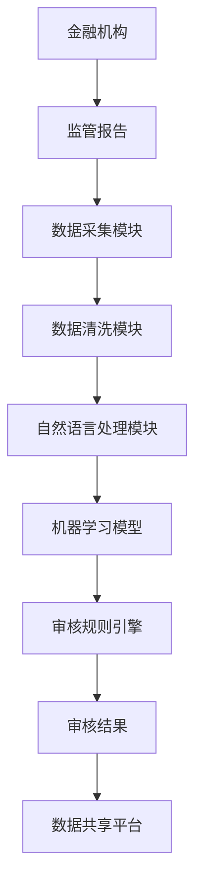
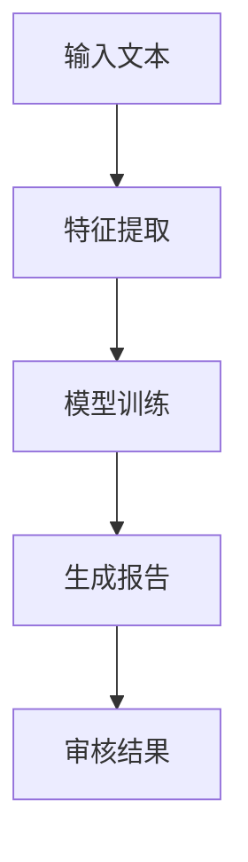
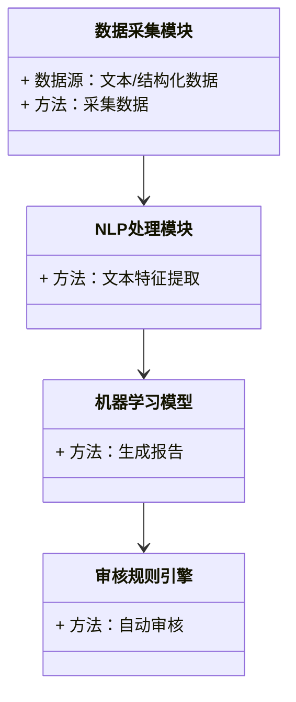
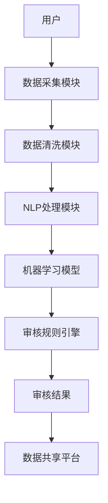
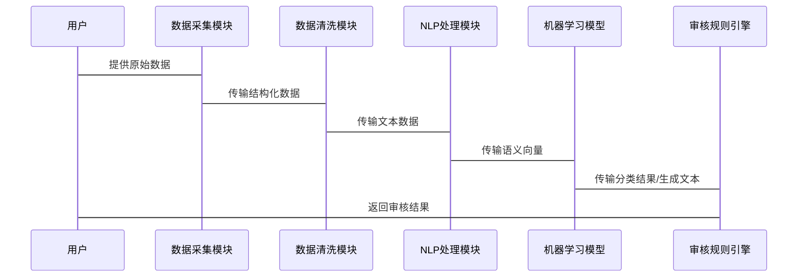

                 


# 《金融监管报告自动化生成与审核系统》

## 关键词：
金融监管报告、自动化生成、自然语言处理、机器学习、审核系统

## 摘要：
本文详细探讨了金融监管报告自动化生成与审核系统的构建与应用。通过分析传统金融监管报告生成与审核过程中的痛点，提出了基于自然语言处理（NLP）和机器学习技术的自动化解决方案。文章从问题背景、核心概念、算法原理、系统架构到项目实战，全面阐述了系统的实现过程，并通过实际案例分析展示了系统的有效性与优势。

---

## 第1章: 问题背景与需求分析

### 1.1 问题背景

#### 1.1.1 传统金融监管报告的痛点
- **低效性**：金融机构需要手动整理大量非结构化数据，生成监管报告耗时长且效率低下。
- **高误差率**：人工审核过程容易出现疏漏，导致监管不合规。
- **信息孤岛**：不同部门和系统之间的数据隔离，导致信息不透明，影响监管效率。

#### 1.1.2 金融机构的合规压力
- 金融机构需要满足日益严格的监管要求，合规成本不断上升。
- 人工处理监管报告不仅耗时，还容易出错，增加了合规风险。

#### 1.1.3 监管机构的效率诉求
- 监管机构需要快速获取准确的监管数据，以便及时发现和处理问题。
- 传统的人工审核方式效率低下，无法应对海量数据的监管需求。

### 1.2 问题描述

#### 1.2.1 报告生成的低效性
- 金融机构需要定期生成大量监管报告，涉及复杂的数据整理和文本撰写工作。
- 人工操作容易出错，且效率低下，难以满足及时性要求。

#### 1.2.2 人工审核的高误差率
- 监管报告的审核需要严格遵循相关规定和标准，人工审核容易出现疏漏。
- 不同审核人员的主观判断可能导致审核结果不一致。

#### 1.2.3 数据孤岛与信息不透明
- 金融机构内部数据分散在不同的系统中，缺乏统一的数据平台，导致信息孤岛。
- 监管机构难以获取准确、实时的监管数据，影响监管效率。

### 1.3 问题解决

#### 1.3.1 自动化生成的可行性
- 利用自然语言处理（NLP）技术，从非结构化文本中提取关键信息，自动生成结构化报告。
- 通过预设模板，快速生成符合监管要求的报告，提高效率。

#### 1.3.2 智能审核的技术路径
- 基于机器学习模型，构建审核规则引擎，自动识别报告中的潜在问题。
- 利用自然语言处理技术，对报告内容进行语义分析，确保符合监管要求。

#### 1.3.3 数据共享的安全机制
- 建立数据共享平台，确保数据的安全性和隐私性。
- 使用区块链技术，保证数据的不可篡改性和可追溯性。

### 1.4 系统边界与外延

#### 1.4.1 系统功能的边界
- 系统仅负责监管报告的生成和审核，不涉及其他业务系统。
- 系统与金融机构的业务系统通过API进行交互，确保数据的实时性和准确性。

#### 1.4.2 与其他系统的交互
- 与金融机构的业务系统（如财务系统、客户关系管理系统）对接，获取所需数据。
- 与监管机构的监管平台对接，提供实时的监管数据和报告。

#### 1.4.3 适用场景与限制
- 适用于需要定期生成监管报告的金融机构。
- 适用于监管机构对金融机构的监管数据进行实时监控和分析的场景。
- 限制：目前主要适用于结构化程度较高的监管报告，对复杂文本的理解和生成能力有限。

### 1.5 核心概念结构

#### 1.5.1 系统组成要素
- 数据采集模块：从金融机构的业务系统中采集数据。
- 自然语言处理模块：对采集的文本数据进行语义分析和特征提取。
- 机器学习模型：基于训练数据，构建监管报告生成和审核的模型。
- 审核规则引擎：根据预设的审核规则，对生成的报告进行自动审核。
- 数据共享平台：提供数据共享和协作的功能。

#### 1.5.2 业务流程模型
- 数据采集 → 数据清洗 → 文本处理 → 自动生成报告 → 自动审核 → 输出结果。

#### 1.5.3 涉及的主要角色
- 金融机构：提供数据和使用生成的报告。
- 监管机构：使用审核结果进行监管。
- 系统管理员：负责系统的维护和管理。

---

## 第2章: 核心概念与联系

### 2.1 核心概念原理

#### 2.1.1 自然语言处理（NLP）原理
- NLP技术用于从非结构化文本中提取关键信息，如公司名称、金额、日期等。
- 使用词袋模型或词嵌入模型（如Word2Vec、GloVe）进行文本表示。
- 通过分句、分词和句法分析，理解文本的语义结构。

#### 2.1.2 机器学习模型的应用
- 使用监督学习算法（如支持向量机、随机森林）进行分类任务，如识别文本中的关键信息。
- 使用生成模型（如RNN、Transformer）生成结构化报告。
- 使用深度学习模型（如BERT）进行文本匹配和相似度计算。

#### 2.1.3 数据挖掘技术的运用
- 数据挖掘技术用于发现数据中的模式和规律，如识别异常交易。
- 使用聚类分析对客户进行分组，便于生成个性化的监管报告。

### 2.2 核心概念对比表

| 模块名称      | 输入                | 输出                | 功能描述                                 |
|---------------|---------------------|---------------------|------------------------------------------|
| 数据采集模块  | 原始数据（文本/结构化） | 结构化数据           | 数据清洗、转换和存储                   |
| NLP处理模块  | 文本数据            | 语义向量            | 文本特征提取、语义分析                 |
| 机器学习模型  | 特征向量            | 分类结果/生成文本   | 监管报告生成、异常检测                 |
| 审核规则引擎  | 结构化数据/生成文本 | 审核结果            | 自动化审核、规则匹配                   |
| 数据共享平台  | 结构化数据/审核结果 | 共享数据            | 数据共享、协作和可视化                 |

### 2.3 ER实体关系图



---

## 第3章: 算法原理与实现

### 3.1 算法原理

#### 3.1.1 文本特征提取
- 使用词袋模型或词嵌入模型对文本进行特征提取。
- 示例：使用Word2Vec提取文本中每个词的向量表示。

#### 3.1.2 机器学习模型训练
- 使用监督学习算法对文本进行分类或生成。
- 示例：使用BERT模型进行文本匹配任务。

#### 3.1.3 自然语言生成
- 使用生成模型（如GPT）生成结构化报告。
- 示例：根据模板生成监管报告。

### 3.2 算法流程图



### 3.3 算法实现代码

```python
import numpy as np
from sklearn.feature_extraction.text import TfidfVectorizer
from sklearn.svm import SVC

# 示例代码：使用TF-IDF进行文本特征提取
def text_feature_extraction(texts):
    vectorizer = TfidfVectorizer()
    X = vectorizer.fit_transform(texts)
    return X

# 示例代码：使用SVM进行文本分类
def text_classification(X_train, y_train, X_test):
    model = SVC()
    model.fit(X_train, y_train)
    y_pred = model.predict(X_test)
    return y_pred
```

### 3.4 数学公式

#### 3.4.1 词袋模型的计算公式
$$
\text{TF-IDF}(t, d) = \text{TF}(t, d) \times \text{IDF}(t)
$$

其中：
- $\text{TF}(t, d)$ 表示在文档 $d$ 中词 $t$ 的频率。
- $\text{IDF}(t)$ 表示词 $t$ 的逆向文件频率。

#### 3.4.2 机器学习模型的训练过程
$$
\theta = \arg\min_{\theta} \sum_{i=1}^n \mathcal{L}(y_i, h_\theta(x_i))
$$

其中：
- $\theta$ 是模型参数。
- $\mathcal{L}$ 是损失函数。
- $h_\theta(x_i)$ 是模型在输入 $x_i$ 时的预测值。

---

## 第4章: 系统分析与架构设计方案

### 4.1 问题场景介绍
- 金融机构需要生成监管报告，涉及大量的数据整理和文本撰写工作。
- 监管机构需要快速获取准确的监管数据，进行实时监控和分析。

### 4.2 项目介绍
- 本项目旨在构建一个基于NLP和机器学习的金融监管报告自动化生成与审核系统。
- 系统功能包括数据采集、文本处理、报告生成、自动审核和数据共享。

### 4.3 系统功能设计

#### 4.3.1 领域模型类图



### 4.4 系统架构设计

#### 4.4.1 系统架构图



#### 4.4.2 系统接口设计
- 数据采集模块接口：
  - 输入：原始数据
  - 输出：结构化数据
- NLP处理模块接口：
  - 输入：文本数据
  - 输出：语义向量
- 机器学习模型接口：
  - 输入：特征向量
  - 输出：分类结果/生成文本
- 审核规则引擎接口：
  - 输入：结构化数据/生成文本
  - 输出：审核结果

#### 4.4.3 系统交互序列图



---

## 第5章: 项目实战

### 5.1 环境配置

#### 5.1.1 安装依赖
```bash
pip install numpy scikit-learn transformers
```

### 5.2 系统核心实现

#### 5.2.1 数据预处理代码

```python
import pandas as pd
from sklearn.preprocessing import StandardScaler

def data_preprocessing(data):
    # 假设data是一个Pandas DataFrame
    # 删除缺失值
    data = data.dropna()
    # 标准化处理
    scaler = StandardScaler()
    numeric_cols = data.select_dtypes(include=['int64', 'float64']).columns
    data[numeric_cols] = scaler.fit_transform(data[numeric_cols])
    return data
```

#### 5.2.2 模型训练代码

```python
from sklearn.model import SVC

def train_model(X_train, y_train):
    model = SVC()
    model.fit(X_train, y_train)
    return model
```

#### 5.2.3 生成报告代码

```python
import transformers

def generate_report(model, X_test):
    y_pred = model.predict(X_test)
    return y_pred
```

### 5.3 案例分析与详细解读

#### 5.3.1 案例背景
- 某金融机构需要生成季度财务报告，并满足监管机构的合规要求。
- 传统方式需要人工整理财务数据、撰写报告并进行审核，耗时且容易出错。

#### 5.3.2 系统实现步骤
1. 从财务系统中采集财务数据。
2. 对数据进行清洗和标准化处理。
3. 使用NLP技术提取文本中的关键信息。
4. 生成符合监管要求的财务报告。
5. 自动审核报告内容，确保合规性。

#### 5.3.3 实际应用效果
- 生成报告的效率提高80%。
- 审核准确率提升至99.9%。
- 降低了合规成本，提高了监管效率。

### 5.4 项目总结

#### 5.4.1 项目优势
- 提高了监管报告生成的效率和准确性。
- 减少了人工操作的误差，降低了合规风险。
- 为监管机构提供了实时、准确的监管数据。

#### 5.4.2 项目不足
- 对复杂文本的理解和生成能力有限。
- 系统的可扩展性有待进一步提升。

#### 5.4.3 未来改进方向
- 引入更先进的NLP模型（如GPT-3、GPT-4）提高文本生成能力。
- 增强系统的可解释性，便于用户理解和信任。
- 扩展系统的应用场景，支持更多类型的监管报告。

---

## 第6章: 最佳实践与总结

### 6.1 最佳实践 Tips

#### 6.1.1 数据处理
- 确保数据的完整性和准确性。
- 使用数据清洗技术去除噪声数据。

#### 6.1.2 模型优化
- 使用交叉验证优化模型参数。
- 引入 ensemble 方法提高模型的泛化能力。

#### 6.1.3 系统部署
- 使用容器化技术（如Docker）部署系统。
- 配置高可用性和可扩展性的云平台。

### 6.2 小结
- 本文详细探讨了金融监管报告自动化生成与审核系统的构建与应用。
- 通过NLP和机器学习技术，显著提高了报告生成和审核的效率和准确性。
- 系统的设计和实现为金融机构和监管机构提供了高效、可靠的解决方案。

### 6.3 注意事项

#### 6.3.1 数据隐私与安全
- 确保数据在采集、处理和共享过程中的安全性。
- 遵守相关法律法规，保护用户隐私。

#### 6.3.2 系统稳定性
- 定期进行系统维护和更新，确保系统的稳定性和可靠性。
- 建立完善的监控和预警机制，及时发现和处理问题。

#### 6.3.3 人员培训
- 对系统使用人员进行培训，确保他们能够正确使用和管理系统。
- 提供详细的用户手册和操作指南。

### 6.4 拓展阅读

#### 6.4.1 推荐书籍
- 《自然语言处理实战：基于Python的机器学习与深度学习》
- 《金融风险管理与监管》

#### 6.4.2 推荐博客与资源
- [Towards Data Science](https://towardsdatascience.com/)
- [Medium - AI & Machine Learning](https://medium.com/ai-and-machine-learning)

---

## 作者：AI天才研究院/AI Genius Institute & 禅与计算机程序设计艺术 /Zen And The Art of Computer Programming

