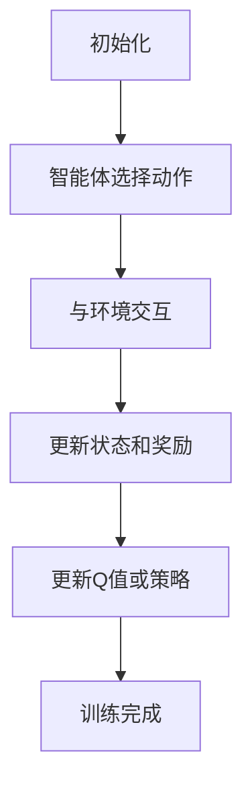
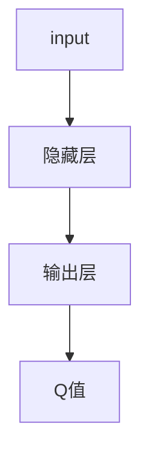
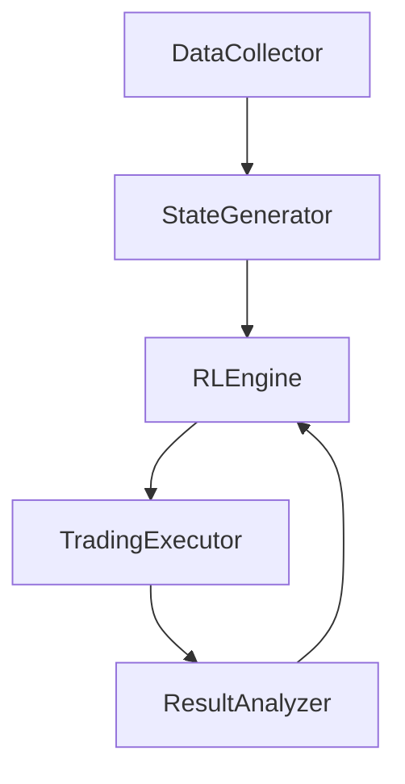

                 


# 《金融领域强化学习在资产定价中的应用》

## 关键词：强化学习、资产定价、金融、马尔可夫决策过程、Q-learning、DQN

## 摘要：  
本文深入探讨了强化学习在金融资产定价中的应用，从强化学习的基本原理到其在金融场景中的具体实现进行了详细分析。通过构建强化学习模型，结合金融市场的动态特性，本文提出了资产定价的新方法，并通过实际案例展示了如何利用强化学习优化投资策略和风险管理。文章内容涵盖强化学习算法的数学模型、金融资产定价系统的架构设计以及实际项目中的实现与应用，为金融领域的技术实践者提供了理论与实践相结合的指导。

---

## 第一部分: 强化学习与金融资产定价基础

### 第1章: 强化学习的基本概念与原理

#### 1.1 强化学习的定义与核心概念  
强化学习（Reinforcement Learning, RL）是一种机器学习范式，通过智能体与环境的交互，逐步优化决策策略，以最大化累计奖励。其核心在于通过试错机制，学习最优行为策略。

**核心概念：**  
- **状态（State）**：智能体所处的环境信息，如当前市场数据。  
- **动作（Action）**：智能体采取的操作，如买入或卖出股票。  
- **奖励（Reward）**：智能体采取动作后获得的反馈，用于指导策略优化。  
- **策略（Policy）**：智能体选择动作的概率分布，最大化累积奖励。  
- **值函数（Value Function）**：衡量状态或动作的价值，用于指导决策。

#### 1.2 马尔可夫决策过程（MDP）  
马尔可夫决策过程是强化学习的核心模型，描述了智能体与环境的交互过程。MDP由以下五部分组成：  
1. **状态空间（State Space）**：所有可能的状态集合。  
2. **动作空间（Action Space）**：所有可能的动作集合。  
3. **转移概率（Transition Probability）**：从当前状态采取动作后转移到下一个状态的概率。  
4. **奖励函数（Reward Function）**：智能体在状态-动作对上获得的奖励。  
5. **折扣因子（Discount Factor）**：用于平衡当前奖励与未来奖励的重要性的参数，通常记为$\gamma$。

#### 1.3 强化学习算法的分类  
强化学习算法可分为以下几类：  
1. **值函数方法**：基于值函数优化策略，如Q-learning。  
2. **策略梯度方法**：直接优化策略参数，如Policy Gradient。  
3. **近端策略优化方法**：在策略空间中进行小幅度调整，如PPO。  

### 第2章: 金融资产定价的理论基础  

#### 2.1 资产定价的基本原理  
资产定价是金融市场的重要任务，旨在确定资产的公允价值。常用模型包括：  
1. **马科维茨投资组合理论**：通过优化风险-收益 trade-off 确定最优投资组合。  
2. **CAPM 模型**：计算资产的预期收益，基于其系统性风险。  
3. **APT 模型**：通过多个风险因子解释资产收益。  

#### 2.2 金融市场中的强化学习应用  
金融市场具有高度的不确定性和动态性，强化学习在以下方面具有优势：  
1. **非平稳环境**：强化学习能够适应市场环境的变化。  
2. **多步决策**：强化学习适合处理需要长期规划的金融决策。  
3. **复杂策略**：强化学习能够生成复杂的交易策略，超越传统模型的限制。  

#### 2.3 强化学习与资产定价的结合  
资产定价问题可以转化为强化学习的MDP问题，其中：  
- 状态：市场数据、资产价格、持有仓位等。  
- 动作：买入、卖出或持有资产。  
- 奖励：资产收益或损失。  

### 第3章: 强化学习在资产定价中的核心概念与联系  

#### 3.1 强化学习与资产定价的关系  
资产定价问题可以通过强化学习框架建模，其中智能体通过与市场环境交互，学习最优的交易策略。  

#### 3.2 强化学习与金融市场的交互模型  
**状态空间**：包括市场指数、资产收益率、交易成本等。  
**动作空间**：包括买入、卖出或持有资产的操作。  
**奖励函数**：基于资产收益和交易成本设计，例如，$r = \text{收益} - \text{交易成本}$。  

#### 3.3 实体关系图与流程图  
以下是强化学习在资产定价中的ER实体关系图：

```mermaid
erd
actor: 智能体
action: 动作
state: 状态
reward: 奖励
actor -> action: 选择动作
action --> state: 动作改变状态
state --> reward: 状态生成奖励
```

以下是强化学习资产定价流程的Mermaid图：



---

## 第4章: 强化学习算法原理与数学模型  

### 4.1 强化学习的核心算法  

#### 4.1.1 Q-learning算法  
Q-learning是一种基于值函数的强化学习算法，通过更新Q值表学习最优策略。Q值表示在状态s采取动作a后的预期累积奖励。更新公式为：  

$$ Q(s,a) = Q(s,a) + \alpha \left[ r + \gamma \max_{a'} Q(s',a') - Q(s,a) \right] $$  

其中，$\alpha$为学习率，$\gamma$为折扣因子。  

#### 4.1.2 Policy Gradient算法  
Policy Gradient算法直接优化策略参数，通过梯度上升方法最大化奖励的期望。策略函数为：  

$$ \pi(a|s) = \text{softmax}(w \cdot s) $$  

更新公式为：  

$$ w = w + \alpha \nabla_w J(w) $$  

其中，$J(w)$为策略的期望奖励。  

#### 4.1.3 Deep Q-Networks（DQN）  
DQN结合了深度神经网络和Q-learning，通过经验回放和目标网络优化Q值。经验回放机制存储历史状态-动作-奖励-状态（SARSA）元组，减少样本依赖性。  

### 4.2 强化学习的数学模型  

#### 4.2.1 动态规划与贝尔曼方程  
贝尔曼方程描述了状态值函数与当前奖励的关系：  

$$ V(s) = \max_a Q(s,a) $$  

其中，$Q(s,a)$是动作a在状态s下的Q值。  

#### 4.2.2 策略评估与策略优化  
策略评估通过动态规划方法计算值函数，策略优化通过贪心策略更新动作选择。  

#### 4.2.3 值函数的近似与更新  
在金融资产定价中，值函数可以用深度神经网络近似，网络结构如下：



---

## 第5章: 金融资产定价系统的系统架构设计  

### 5.1 问题场景介绍  
资产定价系统需要处理动态市场环境，实时更新资产价格，优化投资策略。  

### 5.2 系统功能设计  
资产定价系统包括以下模块：  
1. **数据采集模块**：获取市场数据和交易信息。  
2. **状态生成模块**：构建市场状态向量。  
3. **强化学习引擎**：执行策略选择和Q值更新。  
4. **交易执行模块**：根据策略生成交易指令。  
5. **结果分析模块**：评估策略表现并优化参数。  

### 5.3 系统架构设计  



### 5.4 接口设计与交互流程  

#### 5.4.1 系统接口设计  
- 输入接口：市场数据API、交易指令API。  
- 输出接口：资产价格预测、交易信号。  

#### 5.4.2 交互流程  
1. 数据采集模块获取市场数据。  
2. 状态生成模块构建当前状态。  
3. 强化学习引擎选择动作。  
4. 交易执行模块执行交易指令。  
5. 结果分析模块评估策略表现。  

---

## 第6章: 项目实战  

### 6.1 环境配置  
安装必要的库，如TensorFlow、Keras、OpenAI Gym。  

### 6.2 核心代码实现  

#### 6.2.1 DQN实现  

```python
import numpy as np
import tensorflow as tf

class DQN:
    def __init__(self, state_size, action_size):
        self.state_size = state_size
        self.action_size = action_size
        self.gamma = 0.99
        self.epsilon = 1.0
        self.epsilon_min = 0.01
        self.epsilon_decay = 0.995
        self.model = self.build_model()
        self.target_model = self.build_model()
        self.memory = []

    def build_model(self):
        model = tf.keras.Sequential()
        model.add(tf.keras.layers.Dense(32, activation='relu', input_dim=self.state_size))
        model.add(tf.keras.layers.Dense(32, activation='relu'))
        model.add(tf.keras.layers.Dense(self.action_size, activation='linear'))
        model.compile(optimizer=tf.keras.optimizers.Adam(learning_rate=0.001), loss='mse')
        return model

    def remember(self, state, action, reward, next_state):
        self.memory.append((state, action, reward, next_state))

    def act(self, state):
        if np.random.random() < self.epsilon:
            return np.random.randint(self.action_size)
        q_values = self.model.predict(np.array([state]))
        return np.argmax(q_values[0])

    def replay(self, batch_size):
        if len(self.memory) < batch_size:
            return
        minibatch = np.random.choice(self.memory, batch_size)
        states = np.array([t[0] for t in minibatch])
        actions = np.array([t[1] for t in minibatch])
        rewards = np.array([t[2] for t in minibatch])
        next_states = np.array([t[3] for t in minibatch])
        targets = self.model.predict(states)
        next_q = self.target_model.predict(next_states)
        targets[range(batch_size), actions] = rewards + self.gamma * np.max(next_q, axis=1)
        self.model.fit(states, targets, epochs=1, verbose=0)
        if self.epsilon > self.epsilon_min:
            self.epsilon *= self.epsilon_decay
```

#### 6.2.2 训练与测试  

```python
state_size = 4  # 示例：市场指数、资产收益率、交易成本、仓位
action_size = 3  # 买入、卖出、持有
dqn = DQN(state_size, action_size)

# 训练过程
for episode in range(1000):
    state = get_initial_state()
    while not episode_done:
        action = dqn.act(state)
        next_state, reward, done = step(action)
        dqn.remember(state, action, reward, next_state)
        dqn.replay(32)
        state = next_state
        if done:
            break

# 测试过程
state = get_test_state()
while True:
    action = dqn.act(state)
    next_state, reward, done = step(action)
    print(f"动作：{action}, 奖励：{reward}")
    state = next_state
    if done:
        break
```

### 6.3 案例分析  
假设我们训练一个DQN模型，用于股票交易策略。通过回测数据验证策略的有效性，调整参数如学习率和折扣因子，优化模型表现。  

### 6.4 项目总结  
通过强化学习实现资产定价系统，能够有效捕捉市场机会，降低交易成本，提升投资收益。  

---

## 第7章: 最佳实践与注意事项  

### 7.1 最佳实践 tips  
- 数据质量：确保市场数据的准确性和及时性。  
- 策略调整：根据市场变化动态调整策略参数。  
- 风险控制：设置止损机制，避免过度损失。  

### 7.2 小结  
强化学习为金融资产定价提供了新的思路，通过建模市场的动态特性，优化投资决策，提升资产定价的准确性。  

### 7.3 注意事项  
- 强化学习模型对环境变化敏感，需实时更新。  
- 避免过度拟合，保持模型的泛化能力。  

### 7.4 拓展阅读  
推荐阅读《Reinforcement Learning: Theory and Algorithms》和《Deep Reinforcement Learning in Financial Markets》。  

---

## 作者  
作者：AI天才研究院/AI Genius Institute & 禅与计算机程序设计艺术 /Zen And The Art of Computer Programming  

---

以上是《金融领域强化学习在资产定价中的应用》的完整目录和内容框架，您可以根据需要进一步扩展每个部分的具体内容。

