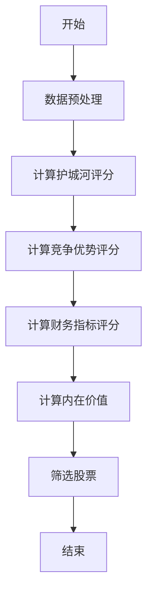
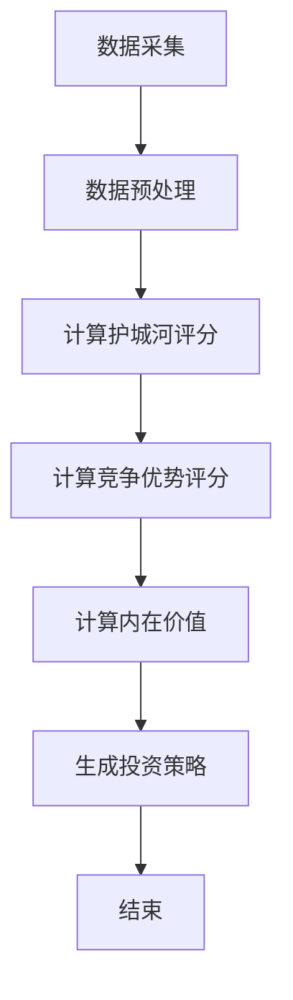

                 


# 乔尔·格林布拉特的价值投资量化方法

> 关键词：价值投资，量化方法，护城河，竞争优势，财务指标，量化模型，投资策略

> 摘要：本文详细介绍了乔尔·格林布拉特的价值投资量化方法，从背景介绍、核心概念、算法原理到系统架构、项目实战，全面解析了这一投资策略的理论基础和实际应用。通过本文，读者将深入了解如何通过量化方法评估企业的护城河和竞争优势，从而制定有效的投资策略。

---

# 第一部分: 价值投资与量化方法的背景

## 第1章: 价值投资与量化投资概述

### 1.1 价值投资的核心理念

#### 1.1.1 价值投资的定义与起源

价值投资是一种以基本面分析为基础的投资策略，起源于20世纪20年代，由本杰明·格雷厄姆和戴维·多德共同提出。其核心理念是通过分析企业的财务状况、行业地位和未来前景，寻找市场价格低于其内在价值的股票进行投资。

#### 1.1.2 价值投资的核心原则

- **安全边际**：买入价格低于内在价值，确保有一定的安全空间。
- **长期视角**：关注企业的长期盈利能力，而非短期市场波动。
- **企业基本面**：重视企业的财务健康、行业地位和竞争优势。

#### 1.1.3 价值投资与量化方法的结合

随着科技的进步，越来越多的投资者开始尝试将量化方法引入价值投资，通过数学模型和算法筛选出具有潜在价值的股票。乔尔·格林布拉特的方法正是这一结合的典型代表。

### 1.2 量化投资的基本概念

#### 1.2.1 量化投资的定义

量化投资是通过数学模型和算法进行投资决策的一种方法。它利用大数据、统计套利和算法交易等技术，寻找市场中的套利机会或趋势，从而实现超额收益。

#### 1.2.2 量化投资的主要方法

- **统计套利**：通过统计分析寻找市场中的套利机会。
- **算法交易**：利用算法在市场中快速执行交易策略。
- **因子投资**：基于特定的因子（如市值、价值、动量等）构建投资组合。

#### 1.2.3 量化投资与传统投资的区别

| 区别点 | 量化投资 | 传统投资 |
|--------|----------|----------|
| 数据驱动 | 强调数据和模型 | 更依赖主观判断 |
| 交易频率 | 高频交易为主 | 低频交易为主 |
| 风险控制 | 严格量化风险 | 风险控制较为模糊 |

### 1.3 乔尔·格林布拉特投资方法的背景

#### 1.3.1 乔尔·格林布拉特的生平简介

乔尔·格林布拉特（Joel Greenblatt）是美国著名投资家，毕业于哥伦比亚商学院，曾师从彼得·林奇。他在投资领域独树一帜，提出了“价值投资的量化方法”，将护城河和竞争优势等概念引入量化模型。

#### 1.3.2 乔尔·格林布拉特投资方法的提出背景

随着市场的日益复杂化，传统的价值投资方法逐渐难以适应快速变化的市场环境。乔尔·格林布拉特通过量化方法，将价值投资的理念转化为可操作的模型，使得投资决策更加科学化和系统化。

#### 1.3.3 乔尔·格林布拉特方法的核心思想

- 通过量化模型评估企业的护城河和竞争优势。
- 筛选出具有高性价比的股票，构建投资组合。
- 通过长期持有优质资产，实现超额收益。

### 1.4 本章小结

本章介绍了价值投资和量化投资的基本概念，以及乔尔·格林布拉特方法的背景和核心思想。通过结合价值投资的长期视角和量化方法的科学性，乔尔·格林布拉特提出了一种独特的投资策略。

---

## 第2章: 核心概念与模型结构

### 2.1 护城河的定义与分类

#### 2.1.1 护城河的定义

护城河是指企业在行业内相对于竞争对手的独特优势，能够保护企业免受市场竞争的冲击。常见的护城河包括成本优势、品牌优势、技术优势等。

#### 2.1.2 护城河的分类

| 类型 | 描述 |
|------|------|
| 成本优势 | 企业通过规模效应或技术创新降低成本，从而在价格上具有竞争力。 |
| 品牌优势 | 强大的品牌影响力吸引更多的消费者。 |
| 技术优势 | 拥有独特的技术或专利，形成市场壁垒。 |
| 网络效应 | 用户数量的增加会增强产品的价值，形成正反馈。 |

### 2.2 竞争优势的量化评估

#### 2.2.1 竞争优势的定义

竞争优势是指企业在市场上相对于竞争对手的独特优势，能够使其在竞争中占据有利地位。

#### 2.2.2 竞争优势的量化指标

| 指标 | 描述 |
|------|------|
| 护城河评分 | 通过量化模型评估企业护城河的强弱。 |
| 市场占有率 | 企业在市场中的份额，反映其竞争优势。 |
| 净利润率 | 反映企业的盈利能力，体现竞争优势的强弱。 |

#### 2.2.3 竞争优势与企业价值的关系

竞争优势是影响企业内在价值的重要因素。具有强大竞争优势的企业，通常具有更高的内在价值和长期盈利能力。

### 2.3 财务指标的筛选与分析

#### 2.3.1 财务指标的定义与分类

| 类型 | 描述 |
|------|------|
| 收益能力 | 净利润、ROE（净资产收益率）等。 |
| 财务健康 | 负债率、流动比率等。 |
| 成长能力 | 收入增长率、净利润增长率等。 |

#### 2.3.2 财务指标的筛选标准

- 收益能力：ROE高于行业平均水平。
- 财务健康：负债率低于行业平均水平。
- 成长能力：收入和净利润持续增长。

#### 2.3.3 财务指标的分析方法

通过分析企业的财务指标，评估其盈利能力、财务健康和成长能力，从而筛选出具有投资价值的股票。

### 2.4 乔尔·格林布拉特模型的数学公式

#### 2.4.1 模型公式

$$
\text{内在价值} = \frac{\text{收益} \times \text{护城河评分}}{\text{资本回报率}}
$$

其中：
- 收益：企业的净利润。
- 护城河评分：通过量化模型评估的企业护城河强弱。
- 资本回报率：企业的ROE（净资产收益率）。

#### 2.4.2 公式解析

通过将企业的收益、护城河评分和资本回报率结合起来，计算出企业的内在价值。内在价值高于市场价格的股票具有投资价值。

#### 2.4.3 公式的应用场景

在实际投资中，通过计算股票的内在价值，筛选出市场价格低于内在价值的股票进行投资。

### 2.5 本章小结

本章详细介绍了乔尔·格林布拉特模型的核心概念，包括护城河、竞争优势和财务指标的定义、分类和量化评估方法。通过数学公式，将这些概念转化为可操作的量化模型，为投资决策提供了科学依据。

---

## 第3章: 乔尔·格林布拉特模型的算法实现

### 3.1 模型的输入数据

#### 3.1.1 数据来源

- 股票的基本信息（名称、代码、行业等）。
- 财务数据（净利润、ROE、收入增长率等）。
- 市场数据（股价、市盈率等）。

#### 3.1.2 数据预处理

- 数据清洗：处理缺失值和异常值。
- 数据标准化：将数据归一化，便于模型计算。

### 3.2 模型的算法流程

#### 3.2.1 算法流程图



#### 3.2.2 算法实现步骤

1. 数据预处理：清洗和标准化数据。
2. 计算护城河评分：通过量化模型评估企业的护城河强弱。
3. 计算竞争优势评分：评估企业的竞争优势。
4. 计算财务指标评分：筛选出具有投资价值的财务指标。
5. 计算内在价值：通过公式计算股票的内在价值。
6. 筛选股票：找出市场价格低于内在价值的股票。

### 3.3 算法的数学模型

#### 3.3.1 竞争优势评分模型

$$
\text{竞争优势评分} = \frac{\text{市场占有率} + \text{品牌影响力}}{2}
$$

#### 3.3.2 护城河评分模型

$$
\text{护城河评分} = \frac{\text{技术优势} + \text{成本优势}}{2}
$$

#### 3.3.3 内在价值计算模型

$$
\text{内在价值} = \frac{\text{收益} \times \text{护城河评分}}{\text{资本回报率}}
$$

### 3.4 算法的实现代码

#### 3.4.1 数据读取与预处理

```python
import pandas as pd

# 读取数据
df = pd.read_csv('stocks.csv')

# 数据清洗
df.dropna(inplace=True)
df = df.drop_duplicates()

# 数据标准化
from sklearn.preprocessing import StandardScaler
scaler = StandardScaler()
df[['revenue', 'roa', 'market_share']] = scaler.fit_transform(df[['revenue', 'roa', 'market_share']])
```

#### 3.4.2 竞争优势评分计算

```python
def calculate_competitive_edge(revenue, roa, market_share):
    competitive_edge = (revenue + roa + market_share) / 3
    return competitive_edge
```

#### 3.4.3 护城河评分计算

```python
def calculate_hoarding(business_model, competitive_edge):
    hoarding_score = (business_model + competitive_edge) / 2
    return hoarding_score
```

#### 3.4.4 内在价值计算

```python
def calculate_intrinsic_value(net_income, hoarding_score, roe):
    intrinsic_value = (net_income * hoarding_score) / roe
    return intrinsic_value
```

### 3.5 本章小结

本章详细介绍了乔尔·格林布拉特模型的算法实现，包括数据预处理、模型计算和代码实现。通过这些步骤，投资者可以利用量化方法筛选出具有投资价值的股票。

---

## 第4章: 系统架构与实现

### 4.1 系统功能设计

#### 4.1.1 系统功能模块

| 模块 | 描述 |
|------|------|
| 数据采集 | 从数据库中获取股票数据。 |
| 数据分析 | 对股票数据进行预处理和分析。 |
| 模型计算 | 计算护城河评分、竞争优势评分和内在价值。 |
| 策略生成 | 根据模型结果生成投资策略。 |

#### 4.1.2 功能流程图



### 4.2 系统架构设计

#### 4.2.1 系统架构图


#### 4.2.2 系统接口设计

- 数据接口：与数据库或API对接，获取股票数据。
- 模型接口：与量化模型对接，计算护城河和竞争优势评分。
- 策略接口：根据模型结果生成投资策略。

### 4.3 系统交互设计

#### 4.3.1 交互流程图


### 4.4 本章小结

本章详细介绍了系统的架构设计，包括功能模块、架构图和交互流程图。通过系统化的架构设计，投资者可以更加高效地进行量化投资。

---

## 第5章: 项目实战

### 5.1 环境安装与配置

#### 5.1.1 安装Python环境

```bash
python --version
pip install --upgrade pip
```

#### 5.1.2 安装所需库

```bash
pip install pandas numpy matplotlib
```

### 5.2 核心代码实现

#### 5.2.1 数据采集

```python
import pandas as pd
import requests

def get_stock_data(ticker):
    url = f'https://api.example.com/stock/{ticker}'
    response = requests.get(url)
    data = response.json()
    df = pd.DataFrame([data])
    return df
```

#### 5.2.2 数据分析

```python
def analyze_data(df):
    df['hoarding_score'] = df.apply(lambda x: calculate_hoarding(x['business_model'], x['competitive_edge']), axis=1)
    df['intrinsic_value'] = df.apply(lambda x: calculate_intrinsic_value(x['net_income'], x['hoarding_score'], x['roe']), axis=1)
    return df
```

#### 5.2.3 策略生成

```python
def generate_strategy(df):
    df['signal'] = df['price'] < df['intrinsic_value']
    return df
```

### 5.3 案例分析与结果解读

#### 5.3.1 案例分析

假设我们有如下数据：

| 股票代码 | 收益 | 护城河评分 | 资本回报率 |
|----------|------|------------|------------|
| AAPL     | 10   | 0.8        | 0.15       |
| GOOGL    | 15   | 0.9        | 0.12       |

计算内在价值：

$$
\text{AAPL的内在价值} = \frac{10 \times 0.8}{0.15} = 53.33
$$

$$
\text{GOOGL的内在价值} = \frac{15 \times 0.9}{0.12} = 112.5
$$

比较市场价格和内在价值，AAPL的价格低于内在价值，具有投资价值。

#### 5.3.2 结果解读

通过模型计算，筛选出具有投资价值的股票，构建投资组合，实现超额收益。

### 5.4 本章小结

本章通过实际案例，详细介绍了如何利用乔尔·格林布拉特模型进行投资决策。通过代码实现和案例分析，读者可以更好地理解模型的应用。

---

## 第6章: 最佳实践与注意事项

### 6.1 最佳实践

#### 6.1.1 数据来源的选择

选择可靠的数据源，确保数据的准确性和完整性。

#### 6.1.2 模型的定期更新

根据市场变化，定期更新模型，确保模型的有效性。

#### 6.1.3 风险控制

设置止损和止盈点，控制投资风险。

### 6.2 注意事项

- 模型的局限性：乔尔·格林布拉特模型适用于长期投资，但在短期市场波动中可能表现不佳。
- 数据质量问题：数据的准确性和完整性直接影响模型的结果。
- 市场环境变化：模型需要根据市场环境的变化进行调整。

### 6.3 拓展阅读

- 《The Intelligent Investor》 by Benjamin Graham
- 《Quantitative Equity Portfolio Management》 by Ludwig B.

