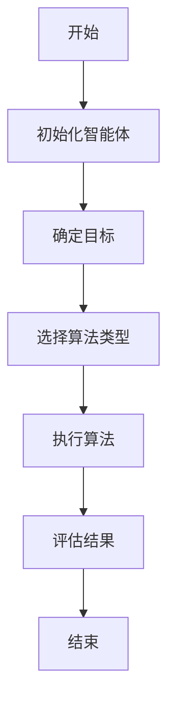
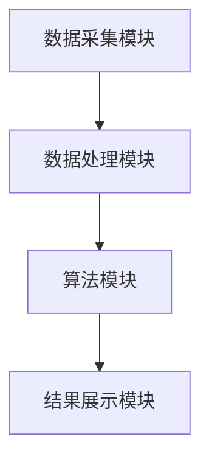
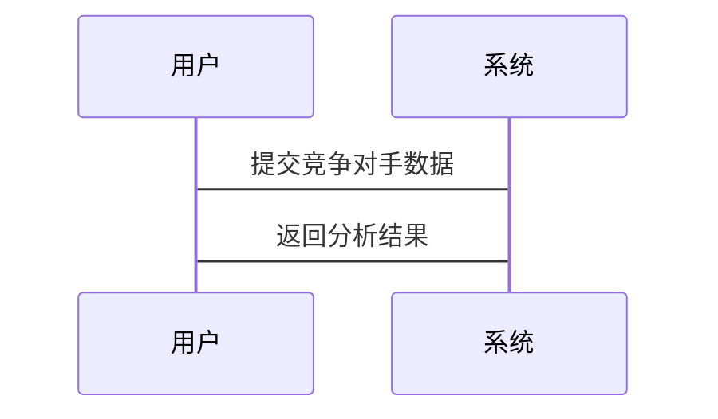

                 


```markdown
# 利用多智能体系统进行全面的竞争对手分析

> 关键词：多智能体系统、竞争对手分析、商业智能、分布式计算、系统架构、机器学习

> 摘要：本文将详细探讨如何利用多智能体系统进行全面的竞争对手分析。通过分析多智能体系统的定义、特点及其在竞争对手分析中的应用，结合算法原理、系统架构设计和项目实战，深入阐述多智能体系统在商业智能领域中的优势和实现方法。本文将为读者提供一套完整的竞争对手分析解决方案，帮助企业在复杂多变的商业环境中做出更明智的决策。

---

# 第一部分: 多智能体系统与竞争对手分析基础

## 第1章: 多智能体系统概述

### 1.1 多智能体系统的定义与特点
#### 1.1.1 多智能体系统的定义
多智能体系统（Multi-Agent System, MAS）是由多个智能体（Agent）组成的分布式系统，这些智能体能够自主决策、协作或竞争以完成特定任务。

#### 1.1.2 多智能体系统的五大特点
- **自主性**：智能体能够自主决策。
- **反应性**：能够感知环境并实时响应。
- **协作性**：多个智能体可以协作完成任务。
- **分布式性**：智能体分布在不同的节点上。
- **适应性**：能够适应环境的变化。

#### 1.1.3 多智能体系统与传统单智能体系统的区别
| 特性 | 多智能体系统 | 单智能体系统 |
|------|--------------|--------------|
| 决策 | 分布式决策 | 中央化决策 | 
| 通信 | 智能体之间可以通信 | 无通信或单向通信 |
| 协作 | 支持协作 | 不支持协作 |
| 效率 | 分散任务，提高效率 | 中央化任务，效率可能较低 |

### 1.2 多智能体系统的组成与架构
#### 1.2.1 多智能体系统的组成要素
- **智能体（Agent）**：能够感知环境并采取行动的实体。
- **环境（Environment）**：智能体所处的外部环境。
- **通信机制（Communication）**：智能体之间的交互方式。
- **协作机制（Collaboration）**：智能体如何协同工作。

#### 1.2.2 分布式架构的优缺点
- **优点**：
  - 提高系统的容错性和可靠性。
  - 增强系统的扩展性。
- **缺点**：
  - 增加了系统的复杂性。
  - 需要处理智能体之间的通信和协作问题。

#### 1.2.3 多智能体系统的通信机制
- **直接通信**：智能体之间直接交换信息。
- **间接通信**：通过中间媒介进行通信。

### 1.3 多智能体系统的应用场景
#### 1.3.1 竞争对手分析中的多智能体系统
- 多智能体系统可以用于实时监控竞争对手的市场动态。
- 通过协作智能体分析竞争对手的策略。

#### 1.3.2 多智能体系统在商业智能中的应用
- 支持企业决策制定。
- 优化企业资源分配。

#### 1.3.3 多智能体系统的未来发展趋势
- 更加智能化和自动化。
- 更加注重安全性和隐私保护。

### 1.4 本章小结
本章介绍了多智能体系统的定义、特点及其在竞争对手分析中的应用，为后续章节奠定了基础。

---

# 第二部分: 竞争对手分析的理论基础

## 第2章: 竞争对手分析的理论基础

### 2.1 竞争对手分析的核心概念
#### 2.1.1 竞争对手分析的定义
竞争对手分析是指对企业在市场中的竞争对手进行系统性研究，以获取竞争优势。

#### 2.1.2 竞争对手分析的边界与外延
- **边界**：竞争对手分析的范围和限制。
- **外延**：竞争对手分析的延伸领域。

#### 2.1.3 竞争对手分析的核心要素
- **市场定位**：竞争对手在市场中的位置。
- **产品分析**：竞争对手的产品特点。
- **财务状况**：竞争对手的财务健康状况。

### 2.2 多智能体系统与竞争对手分析的结合
#### 2.2.1 多智能体系统在竞争对手分析中的优势
- 提高分析的实时性和准确性。
- 支持大规模数据处理。

#### 2.2.2 多智能体系统与传统竞争对手分析方法的对比
| 特性 | 多智能体系统 | 传统方法 |
|------|--------------|-----------|
| 数据处理 | 高效 | 低效 |
| 分析深度 | 深入 | 浅显 |

#### 2.2.3 多智能体系统在竞争对手分析中的具体应用
- **市场动态监控**：实时监控竞争对手的市场动态。
- **策略制定**：基于多智能体系统的分析结果制定企业策略。

### 2.3 多智能体系统的ER实体关系图
#### 2.3.1 实体关系图的基本概念
实体关系图（Entity-Relationship Diagram, ER图）用于描述系统中的实体及其关系。

#### 2.3.2 多智能体系统中的实体关系图
```mermaid
erd
    title 多智能体系统中的实体关系图
    竞争对手信息表(competitor_info)
        Id 竞争对手ID
        竞争对手名称(competitor_name)
        市场份额(market_share)
    市场动态表(market_dynamic)
        Id 市场动态ID
        市场趋势(market_trend)
        时间戳(timestamp)
    智能体表(agent)
        Id 智能体ID
        智能体类型(agent_type)
        功能描述(function_description)
    关系
        竞争对手信息表 -- 关联--> 市场动态表
        智能体表 -- 关联--> 竞争对手信息表
```

#### 2.3.3 实体关系图的绘制方法
- **确定实体**：识别系统中的所有实体。
- **定义关系**：描述实体之间的关系。
- **绘制图形**：使用工具（如Lucidchart）绘制ER图。

### 2.4 本章小结
本章详细讲解了竞争对手分析的核心概念及其与多智能体系统的结合，并通过ER图展示了系统的实体关系。

---

# 第三部分: 多智能体系统的核心算法原理

## 第3章: 多智能体系统的核心算法原理

### 3.1 多智能体系统的算法概述
#### 3.1.1 多智能体系统的主要算法类型
- **协作算法**：智能体之间协作完成任务。
- **竞争算法**：智能体之间竞争资源。

#### 3.1.2 各算法的优缺点对比
| 特性 | 协作算法 | 竞争算法 |
|------|----------|----------|
| 优点 | 提高效率 | 促进创新 |
| 缺点 | 可能产生僵局 | 可能引发冲突 |

#### 3.1.3 算法选择的依据
- **任务需求**：根据任务需求选择算法类型。
- **系统规模**：系统规模影响算法的选择。

### 3.2 多智能体系统的协作机制
#### 3.2.1 协作机制的基本原理
协作机制通过智能体之间的协作实现共同目标。

#### 3.2.2 协作机制的数学模型
$$ C = \sum_{i=1}^{n} c_i $$
其中，$C$ 表示协作程度，$c_i$ 表示第 $i$ 个智能体的协作贡献。

#### 3.2.3 协作机制的实现步骤
1. 确定协作目标。
2. 设计协作策略。
3. 实现协作算法。

### 3.3 多智能体系统的竞争机制
#### 3.3.1 竞争机制的基本原理
竞争机制通过智能体之间的竞争优化系统性能。

#### 3.3.2 竞争机制的数学模型
$$ S = \max_{i=1}^{n} s_i $$
其中，$S$ 表示系统性能，$s_i$ 表示第 $i$ 个智能体的性能指标。

#### 3.3.3 竞争机制的实现步骤
1. 确定竞争规则。
2. 设计竞争策略。
3. 实现竞争算法。

### 3.4 多智能体系统的算法流程图


### 3.5 本章小结
本章详细讲解了多智能体系统的协作机制和竞争机制，并通过流程图展示了算法的实现步骤。

---

## 第4章: 竞争对手分析的算法实现

### 4.1 竞争对手分析的算法实现
#### 4.1.1 竞争对手分析的算法选择
根据具体需求选择合适的算法。

#### 4.1.2 竞争对手分析的实现步骤
1. 数据收集。
2. 数据处理。
3. 算法实现。
4. 结果分析。

### 4.2 竞争对手分析的Python实现
#### 4.2.1 环境安装
安装所需的Python库，如numpy、pandas、scikit-learn。

#### 4.2.2 核心代码实现
```python
import numpy as np
import pandas as pd

# 数据收集
data = pd.read_csv('competitor_data.csv')

# 数据处理
data_processed = data.dropna()

# 算法实现
from sklearn.cluster import KMeans
kmeans = KMeans(n_clusters=3)
clusters = kmeans.fit_predict(data_processed)
```

#### 4.2.3 代码解读与分析
- **数据收集**：读取CSV文件中的数据。
- **数据处理**：删除缺失值。
- **算法实现**：使用K-means算法进行聚类分析。

### 4.3 竞争对手分析的案例分析
#### 4.3.1 案例背景
假设我们有三个竞争对手，需要分析他们的市场份额。

#### 4.3.2 数据分析与结果展示
使用Python可视化工具（如Matplotlib）绘制市场份额分布图。

### 4.4 本章小结
本章通过Python代码实现竞争对手分析，并通过案例分析展示了算法的应用。

---

## 第5章: 系统架构设计与实现

### 5.1 系统架构设计
#### 5.1.1 系统功能模块设计
- **数据采集模块**：负责收集竞争对手数据。
- **数据处理模块**：对数据进行清洗和预处理。
- **算法模块**：实现竞争对手分析算法。
- **结果展示模块**：将分析结果以可视化形式展示。

#### 5.1.2 系统架构图


#### 5.1.3 系统接口设计
- **输入接口**：接收竞争对手数据。
- **输出接口**：输出分析结果。

### 5.2 系统交互流程图


### 5.3 系统实现与优化
#### 5.3.1 系统实现步骤
1. 确定系统需求。
2. 设计系统架构。
3. 实现各功能模块。
4. 测试系统性能。

#### 5.3.2 系统优化
- **性能优化**：提高系统的运行效率。
- **安全性优化**：增强系统的安全性。

### 5.4 本章小结
本章详细讲解了竞争对手分析系统的架构设计与实现，并通过交互流程图展示了系统的交互过程。

---

## 第6章: 项目实战与最佳实践

### 6.1 项目实战
#### 6.1.1 项目背景
假设我们需要分析一家公司的竞争对手。

#### 6.1.2 项目需求
- 数据收集与处理。
- 竞争对手分析。

#### 6.1.3 项目实现
使用Python和相关库实现竞争对手分析。

### 6.2 项目实现
#### 6.2.1 环境安装
安装所需的Python库。

#### 6.2.2 核心代码实现
```python
import pandas as pd
import matplotlib.pyplot as plt

data = pd.read_csv('competitor_data.csv')
data_processed = data.dropna()
data_processed.plot(kind='bar')
plt.show()
```

#### 6.2.3 代码解读与分析
- **数据收集**：读取CSV文件。
- **数据处理**：删除缺失值。
- **可视化**：绘制柱状图。

### 6.3 项目小结
本章通过项目实战展示了竞争对手分析的具体实现步骤，并通过代码示例帮助读者理解。

### 6.4 最佳实践
#### 6.4.1 小结
总结项目的主要收获和经验。

#### 6.4.2 注意事项
- 注意数据的准确性和完整性。
- 注意系统的安全性和稳定性。

#### 6.4.3 拓展阅读
推荐相关的书籍和资源，供读者进一步学习。

### 6.5 本章小结
本章通过项目实战和最佳实践，帮助读者巩固所学内容，并指导他们进一步学习。

---

# 第四部分: 总结与展望

## 第7章: 总结与展望

### 7.1 总结
#### 7.1.1 多智能体系统的定义与特点
- 多智能体系统是由多个智能体组成的分布式系统。

#### 7.1.2 多智能体系统在竞争对手分析中的应用
- 多智能体系统可以实时监控竞争对手的市场动态。

#### 7.1.3 竞争对手分析的理论基础
- 竞争对手分析的核心要素包括市场定位、产品分析和财务状况。

#### 7.1.4 多智能体系统的算法实现
- 竞争对手分析的算法实现包括数据收集、数据处理和算法实现。

#### 7.1.5 系统架构设计与实现
- 竞争对手分析系统的架构设计包括数据采集模块、数据处理模块、算法模块和结果展示模块。

#### 7.1.6 项目实战与最佳实践
- 项目实战通过Python代码实现了竞争对手分析。

### 7.2 展望
#### 7.2.1 多智能体系统的未来发展趋势
- 多智能体系统将更加智能化和自动化。

#### 7.2.2 竞争对手分析的未来发展方向
- 竞争对手分析将更加依赖人工智能和大数据技术。

### 7.3 本章小结
本章总结了全文的主要内容，并展望了多智能体系统和竞争对手分析的未来发展趋势。

---

# 作者：AI天才研究院/AI Genius Institute & 禅与计算机程序设计艺术 /Zen And The Art of Computer Programming

---

以上是一个详细的竞争对手分析系统的目录大纲，涵盖了从基础理论到实际应用的各个方面。每一章都详细讲解了核心概念、算法原理和系统实现，确保读者能够全面理解多智能体系统在竞争对手分析中的应用。

