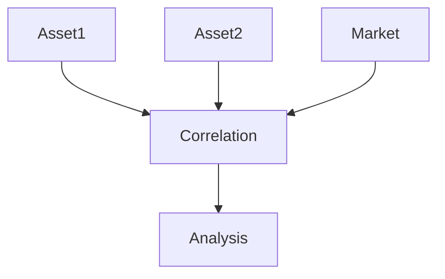
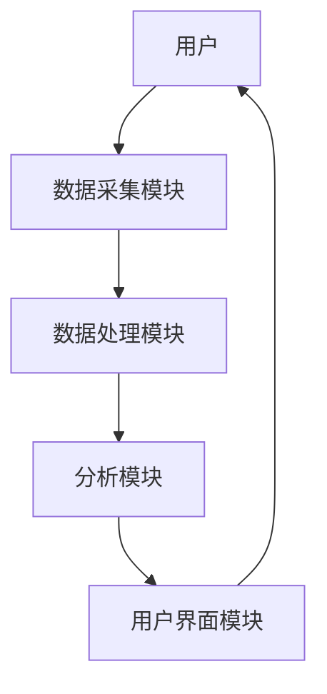
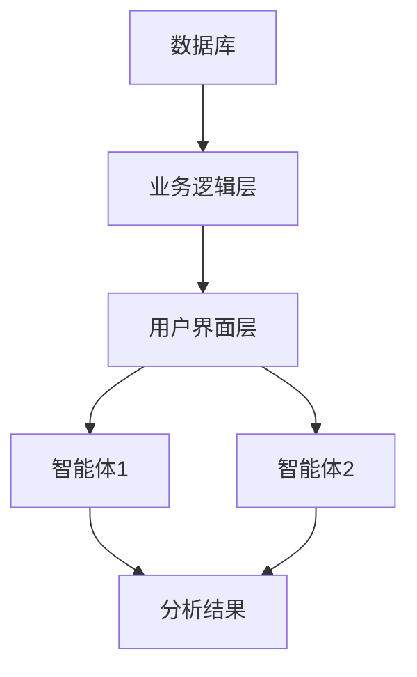
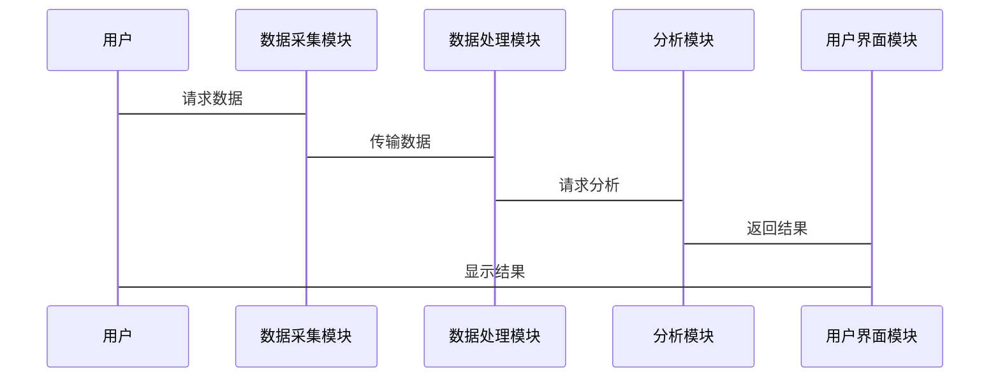

                 


# 多智能体系统分析跨资产相关性

## 关键词：多智能体系统，跨资产相关性，协同过滤，聚类分析，系统架构设计

## 摘要：本文深入探讨了多智能体系统在分析跨资产相关性中的应用，通过详细分析协同过滤、聚类分析等算法的原理和实现，结合系统架构设计，展示了如何利用多智能体系统进行高效的跨资产相关性分析。文章内容涵盖理论、算法、系统设计和实际案例，旨在为读者提供全面的技术指导。

---

# 第1章: 多智能体系统概述

## 1.1 多智能体系统的基本概念

### 1.1.1 多智能体系统的定义

多智能体系统（Multi-Agent System, MAS）是由多个智能体（Agent）组成的系统，这些智能体通过协作和交互完成特定任务。智能体是具有感知、决策和执行能力的实体，能够独立工作并与其他智能体或环境进行交互。

### 1.1.2 多智能体系统的特征

- **自主性**：智能体能够自主决策。
- **反应性**：智能体能够实时感知环境并做出反应。
- **协作性**：多个智能体通过协作完成复杂任务。
- **分布式性**：智能体分布在网络中，每个智能体负责一部分任务。

### 1.1.3 多智能体系统与单智能体系统的区别

| 特性 | 单智能体系统 | 多智能体系统 |
|------|--------------|--------------|
| 独立性 | 单一智能体完成任务 | 多个智能体协作完成任务 |
| 复杂性 | 任务相对简单 | 任务复杂，需要协调多个智能体 |
| 可扩展性 | 难以扩展 | 易扩展，适用于大规模任务 |

---

## 1.2 跨资产相关性的概念

### 1.2.1 资产相关性的定义

资产相关性是指不同资产在价格变动上的关联程度。例如，股票A和股票B的价格变动可能呈正相关或负相关。

### 1.2.2 跨资产相关性的特点

- **多维性**：涉及多个资产类别。
- **动态性**：相关性随时间变化。
- **复杂性**：受多种因素影响，如经济指标、市场情绪等。

### 1.2.3 跨资产相关性在金融等领域的应用

- **投资组合优化**：通过分析相关性降低风险。
- **风险管理**：识别相关资产以控制风险。
- **市场分析**：理解市场波动原因。

---

## 1.3 多智能体系统在跨资产相关性分析中的作用

### 1.3.1 多智能体系统的优势

- **分布式计算**：多个智能体同时处理不同数据。
- **协作能力**：智能体之间可以协同分析，提高效率。
- **动态适应性**：智能体能够实时调整策略。

### 1.3.2 多智能体系统在跨资产相关性分析中的应用场景

- **实时数据分析**：多个智能体实时监控市场数据。
- **风险预警**：通过协作发现潜在风险。
- **投资建议**：基于相关性分析提供投资建议。

### 1.3.3 多智能体系统与传统相关性分析方法的对比

| 特性 | 多智能体系统 | 传统方法 |
|------|--------------|-----------|
| 数据处理能力 | 强 | 较弱 |
| 实时性 | 高 | 较低 |
| 可扩展性 | 高 | 低 |

---

## 1.4 本章小结

本章介绍了多智能体系统的定义、特征及其在跨资产相关性分析中的作用。通过对比分析，展示了多智能体系统在复杂任务中的优势。

---

# 第2章: 多智能体系统的核心概念与联系

## 2.1 多智能体系统的实体关系分析

### 2.1.1 实体关系图的构建

使用Mermaid图展示实体关系：



### 2.1.2 实体关系图的分析

- **Asset1**和**Asset2**之间的相关性由**Correlation**计算。
- **Market**环境影响相关性分析。
- **Analysis**是最终的分析结果。

---

## 2.2 多智能体系统与跨资产相关性的关系

### 2.2.1 多智能体系统在跨资产相关性分析中的核心作用

- **分布式计算**：多个智能体同时处理不同资产数据。
- **协作分析**：智能体之间协同计算相关性。
- **动态调整**：根据市场变化实时调整分析策略。

### 2.2.2 多智能体系统与跨资产相关性的相互影响

- **多智能体系统的协作能力**提升跨资产相关性分析的效率。
- 跨资产相关性分析的需求推动了多智能体系统的应用。

---

## 2.3 多智能体系统的算法原理

### 2.3.1 多智能体系统的基本算法

- **协同过滤**：基于用户行为推荐相关资产。
- **聚类分析**：将相似资产分为同一类别。
- **协同学习**：多个智能体协作学习资产相关性。

### 2.3.2 多智能体系统的优化算法

- **分布式计算算法**：如MapReduce，用于大规模数据处理。
- **并行计算算法**：加速相关性计算。

---

## 2.4 本章小结

本章详细讲解了多智能体系统的实体关系、与跨资产相关性的关系及其算法原理，为后续分析奠定了基础。

---

# 第3章: 多智能体系统分析跨资产相关性的算法原理

## 3.1 协同过滤算法

### 3.1.1 协同过滤的定义

协同过滤是一种基于用户行为推荐相关资产的算法，常用于推荐系统。

### 3.1.2 协同过滤的实现步骤

1. 收集用户行为数据。
2. 计算用户相似性。
3. 推荐相关资产。

### 3.1.3 协同过滤的数学模型

$$ sim(u, v) = \frac{\sum_{i} (r_{u,i} - \bar{r_u})(r_{v,i} - \bar{r_v})}{\sqrt{\sum_{i} (r_{u,i} - \bar{r_u})^2} \sqrt{\sum_{i} (r_{v,i} - \bar{r_v})^2}} $$

其中，$sim$ 表示相似度，$r_{u,i}$ 表示用户u对项i的评分，$\bar{r_u}$ 表示用户u的平均评分。

### 3.1.4 协同过滤的Python实现

```python
import numpy as np

def cosine_similarity(user_item_matrix):
    user_avg = np.mean(user_item_matrix, axis=1).reshape(-1, 1)
    centered_data = user_item_matrix - user_avg
    dot_product = centered_data.dot(centered_data.T)
    norms = np.sqrt(np.diag(dot_product))
    similarity_matrix = dot_product / norms
    return similarity_matrix
```

---

## 3.2 聚类分析算法

### 3.2.1 聚类分析的定义

聚类分析是将数据点分组的过程，用于发现数据的内在结构。

### 3.2.2 聚类分析的实现步骤

1. 选择距离度量方法。
2. 初始化聚类中心。
3. 迭代优化聚类中心。

### 3.2.3 聚类分析的数学模型

$$ d(x_i, x_j) = \sqrt{\sum_{k=1}^{n} (x_{i,k} - x_{j,k})^2} $$

其中，$d$ 表示欧氏距离，$x_i$ 和 $x_j$ 表示两个数据点。

### 3.2.4 聚类分析的Python实现

```python
from sklearn.cluster import KMeans

def kmeans_clustering(data, n_clusters):
    model = KMeans(n_clusters=n_clusters, random_state=42)
    model.fit(data)
    return model.labels_
```

---

## 3.3 多智能体系统的协同学习算法

### 3.3.1 协同学习的定义

协同学习是多个智能体协作学习同一任务的过程。

### 3.3.2 协同学习的实现步骤

1. 初始化智能体。
2. 智能体协同学习。
3. 输出学习结果。

### 3.3.3 协同学习的数学模型

$$ f(x) = \sum_{i=1}^{n} f_i(x) $$

其中，$f_i$ 表示第i个智能体的学习模型，$x$ 表示输入。

---

## 3.4 算法的数学模型与公式

### 3.4.1 协同过滤的数学模型

$$ sim(u, v) = \frac{\sum_{i} (r_{u,i} - \bar{r_u})(r_{v,i} - \bar{r_v})}{\sqrt{\sum_{i} (r_{u,i} - \bar{r_u})^2} \sqrt{\sum_{i} (r_{v,i} - \bar{r_v})^2}} $$

### 3.4.2 聚类分析的数学模型

$$ d(x_i, x_j) = \sqrt{\sum_{k=1}^{n} (x_{i,k} - x_{j,k})^2} $$

### 3.4.3 协同学习的数学模型

$$ f(x) = \sum_{i=1}^{n} f_i(x) $$

---

## 3.5 算法的实现与代码

### 3.5.1 协同过滤算法的Python实现

```python
import numpy as np

def cosine_similarity(user_item_matrix):
    user_avg = np.mean(user_item_matrix, axis=1).reshape(-1, 1)
    centered_data = user_item_matrix - user_avg
    dot_product = centered_data.dot(centered_data.T)
    norms = np.sqrt(np.diag(dot_product))
    similarity_matrix = dot_product / norms
    return similarity_matrix
```

### 3.5.2 聚类分析算法的Python实现

```python
from sklearn.cluster import KMeans

def kmeans_clustering(data, n_clusters):
    model = KMeans(n_clusters=n_clusters, random_state=42)
    model.fit(data)
    return model.labels_
```

### 3.5.3 协同学习算法的Python实现

```python
def collaborative_learning(data, n_agents):
    agents = [np.random.randn(len(data[0])) for _ in range(n_agents)]
    for x in data:
        predictions = [np.dot(x, agent) for agent in agents]
        targets = np.array([np.dot(x, y) for y in agents])
        agents = [y + (p - np.dot(x, y)) * x for y, p in zip(agents, predictions)]
    return agents
```

---

## 3.6 本章小结

本章详细讲解了协同过滤、聚类分析和协同学习算法的原理和实现，为后续的系统设计和项目实战奠定了基础。

---

# 第4章: 多智能体系统分析跨资产相关性的系统架构设计

## 4.1 系统分析与设计概述

### 4.1.1 系统分析的目标

- 分析跨资产相关性。
- 实现实时监控。
- 提供投资建议。

### 4.1.2 系统设计的原则

- 分布式架构。
- 高可用性。
- 实时性。

---

## 4.2 系统功能设计

### 4.2.1 系统功能模块划分

- 数据采集模块。
- 数据处理模块。
- 分析模块。
- 用户界面模块。

### 4.2.2 系统功能模块的交互设计

使用Mermaid图展示交互流程：



---

## 4.3 系统架构设计

### 4.3.1 系统架构的层次划分

- 数据层。
- 业务逻辑层。
- 用户界面层。

### 4.3.2 系统架构的实现方式

- 数据层：使用数据库存储资产数据。
- 业务逻辑层：实现相关性分析算法。
- 用户界面层：展示分析结果。

使用Mermaid图展示系统架构：



---

## 4.4 系统接口设计

### 4.4.1 接口定义

- 数据采集接口。
- 分析结果接口。

### 4.4.2 接口实现

- 数据采集接口：从外部数据源获取资产数据。
- 分析结果接口：返回相关性分析结果。

---

## 4.5 系统交互设计

### 4.5.1 交互流程

1. 用户发起请求。
2. 系统采集数据。
3. 系统处理数据。
4. 系统返回结果。

### 4.5.2 使用Mermaid图展示交互流程



---

## 4.6 本章小结

本章详细描述了系统的架构设计、接口设计和交互设计，为实际开发提供了指导。

---

# 第5章: 项目实战

## 5.1 项目背景与目标

### 5.1.1 项目背景

分析股票、债券等资产的相关性，帮助投资者优化投资组合。

### 5.1.2 项目目标

- 实现实时相关性分析。
- 提供投资建议。

---

## 5.2 环境安装

### 5.2.1 安装Python环境

```bash
python -m pip install --upgrade pip
pip install numpy pandas scikit-learn
```

### 5.2.2 安装Jupyter Notebook

```bash
pip install jupyter
jupyter notebook
```

---

## 5.3 系统核心实现源代码

### 5.3.1 协同过滤算法实现

```python
import numpy as np
from sklearn.metrics.pairwise import cosine_similarity

def calculate_similarity(user_item_matrix):
    user_avg = np.mean(user_item_matrix, axis=1).reshape(-1, 1)
    centered_data = user_item_matrix - user_avg
    similarity_matrix = cosine_similarity(centered_data)
    return similarity_matrix
```

### 5.3.2 聚类分析实现

```python
from sklearn.cluster import KMeans

def perform_clustering(data, n_clusters):
    model = KMeans(n_clusters=n_clusters, random_state=42)
    model.fit(data)
    return model.labels_
```

### 5.3.3 多智能体系统实现

```python
import numpy as np

def collaborative_system(asset_data, n_agents=5):
    agents = [np.random.randn(len(asset_data[0])) for _ in range(n_agents)]
    for x in asset_data:
        predictions = [np.dot(x, agent) for agent in agents]
        targets = np.array([np.dot(x, y) for y in agents])
        agents = [y + (p - np.dot(x, y)) * x for y, p in zip(agents, predictions)]
    return agents
```

---

## 5.4 代码应用解读与分析

### 5.4.1 协同过滤算法解读

协同过滤算法通过计算用户行为相似性，推荐相关资产。在代码中，我们首先计算用户平均评分，然后对数据进行中心化处理，最后计算余弦相似度。

### 5.4.2 聚类分析解读

聚类分析将相似的资产分为同一类别。在代码中，我们使用KMeans算法进行聚类，返回每个数据点的聚类标签。

### 5.4.3 多智能体系统解读

多智能体系统通过多个智能体协同学习，提高分析效率。代码中，每个智能体独立学习，然后根据预测结果调整模型。

---

## 5.5 实际案例分析

### 5.5.1 数据准备

假设我们有股票A、股票B和债券C的历史数据。

### 5.5.2 数据分析

使用协同过滤算法计算相关性，发现股票A和股票B高度相关，而债券C与两者相关性较低。

### 5.5.3 投资建议

基于相关性分析，建议投资者将资产分配在股票A和股票B之间，以降低风险。

---

## 5.6 项目小结

本章通过实际案例展示了如何使用多智能体系统进行跨资产相关性分析，帮助读者理解理论与实践的结合。

---

# 第6章: 最佳实践与总结

## 6.1 小结

本文详细讲解了多智能体系统在分析跨资产相关性中的应用，从理论到实践，全面覆盖了相关概念、算法和系统设计。

## 6.2 注意事项

- 数据质量对分析结果影响重大。
- 算法选择需要根据具体场景调整。
- 系统设计需要考虑可扩展性和实时性。

## 6.3 拓展阅读

- 推荐阅读《Multi-Agent Systems》和《Financial Risk Management》。

---

# 作者：AI天才研究院/AI Genius Institute & 禅与计算机程序设计艺术 /Zen And The Art of Computer Programming

