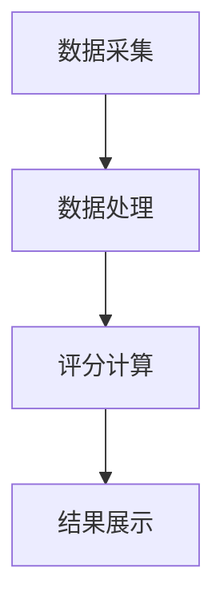
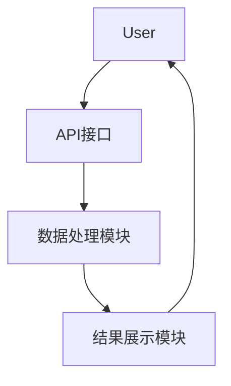

                 


# 《威廉·欧奈尔的CANSLIM选股系统》

---

## 关键词：
- 威廉·欧奈尔，CANSLIM，选股系统，投资策略，股票分析

---

## 摘要：
威廉·欧奈尔的CANSLIM选股系统是一种基于多因素分析的投资策略，旨在帮助投资者识别具有长期增长潜力的公司。本文详细解析了CANSLIM的核心要素、算法原理、系统架构以及实际应用，帮助读者理解其内在逻辑和应用场景。通过分析每个关键因素的定义、评估方法及其对投资决策的影响，本文为投资者提供了一套科学的选股框架，并结合实际案例展示了如何在实践中应用CANSLIM系统。

---

# 第一部分：CANSLIM选股系统的背景与核心理念

## 第1章：威廉·欧奈尔CANSLIM选股系统的背景介绍

### 1.1 什么是CANSLIM选股系统
CANSLIM（C、A、N、S、L、I、M）是威廉·欧奈尔提出的一种选股方法，旨在通过分析公司的基本面、市场地位和管理层等多个因素，筛选出具有长期增长潜力的股票。

#### 1.1.1 CANSLIM的起源与发展
威廉·欧奈尔是20世纪著名的投资者和作家，他的CANSLIM系统基于对市场的深入研究和实践经验，于1984年在《如何从股市投资中获利》一书中首次提出。

#### 1.1.2 CANSLIM的核心理念
CANSLIM的核心理念是通过多因素分析，筛选出那些具有强大基本面、良好市场地位和增长潜力的公司，从而实现长期投资收益。

#### 1.1.3 CANSLIM与传统选股方法的区别
与传统的技术分析或单一基本面分析不同，CANSLIM结合了定量和定性分析，注重公司的基本面、市场地位和管理层等因素的综合评估。

### 1.2 CANSLIM选股系统的价值
CANSLIM系统为投资者提供了一套科学的选股框架，帮助他们在复杂的市场环境中识别出具有长期增长潜力的公司。

#### 1.2.1 为什么选择CANSLIM
CANSLIM系统通过多因素分析，帮助投资者降低投资风险，提高选股的准确性。

#### 1.2.2 CANSLIM在投资中的优势
CANSLIM系统注重公司的基本面和市场地位，能够在早期发现具有增长潜力的公司。

#### 1.2.3 CANSLIM的适用场景
CANSLIM系统适用于长期投资者和机构投资者，尤其适合那些希望在市场中找到具有强大增长潜力的公司的投资者。

### 1.3 本章小结
本章介绍了威廉·欧奈尔的CANSLIM选股系统的基本概念、核心理念及其在投资中的价值，为后续的深入分析奠定了基础。

---

# 第二部分：CANSLIM选股系统的核心概念与联系

## 第2章：CANSLIM选股系统的七个关键要素

### 2.1 C - 公司治理
公司治理是CANSLIM系统中的第一个关键要素，良好的公司治理是公司长期稳定发展的基础。

#### 2.1.1 公司治理的定义与重要性
公司治理是指公司董事会和管理层如何管理公司，包括董事会结构、高管薪酬、股权结构等。

#### 2.1.2 如何评估公司治理的质量
通过分析公司的董事会结构、高管的背景和经验、股权分散度等指标，评估公司治理的质量。

#### 2.1.3 公司治理与投资决策的关系
良好的公司治理能够提高公司的管理效率，降低经营风险，从而提升公司的长期盈利能力。

### 2.2 A - 会计稳健
会计稳健性是公司财务健康的重要指标，稳健的会计处理能够真实反映公司的财务状况。

#### 2.2.1 会计稳健的定义与特征
会计稳健性是指公司在会计处理上遵循稳健原则，避免高估资产和收入，低估负债和费用。

#### 2.2.2 如何通过财务报表评估会计稳健性
通过分析公司的财务报表，特别是收入确认、资产减值和费用计提等方面，评估公司的会计稳健性。

#### 2.2.3 会计稳健性对投资的影响
稳健的会计处理能够提高公司的财务透明度，降低财务风险，从而提升投资者对公司的信任度。

### 2.3 N - 新产品或服务
新产品或服务是公司增长的重要驱动力，创新能力是公司持续发展的关键。

#### 2.3.1 新产品或服务的定义与重要性
新产品或服务是指公司推出的新产品或服务，能够满足市场需求，提高公司的竞争力。

#### 2.3.2 如何识别具有创新能力的公司
通过分析公司的研发投入、专利数量、新产品发布的频率和市场反馈，评估公司的创新能力。

#### 2.3.3 新产品对股价的影响
新产品或服务的成功推出能够提升公司的市场地位和盈利能力，从而推动股价上涨。

### 2.4 S - 销售增长
销售增长是公司盈利能力的重要指标，持续的销售增长是公司健康成长的体现。

#### 2.4.1 销售增长的定义与衡量标准
销售增长是指公司销售收入的同比增长率，通常以季度或年度为单位进行衡量。

#### 2.4.2 如何分析公司的销售增长趋势
通过分析公司的销售数据，特别是销售收入增长率、市场份额变化和行业趋势，评估公司的销售增长潜力。

#### 2.4.3 销售增长对投资决策的意义
持续的销售增长表明公司具有强大的市场竞争力和增长潜力，是投资者选股的重要依据。

### 2.5 L - 市场领导地位
市场领导地位是公司市场竞争优势的体现，具有市场领导地位的公司通常在行业中占据主导地位。

#### 2.5.1 市场领导地位的定义与特征
市场领导地位是指公司在行业中具有较高的市场份额、品牌影响力和定价能力。

#### 2.5.2 如何评估公司的市场地位
通过分析公司的市场份额、品牌知名度、客户忠诚度和行业排名等指标，评估公司的市场地位。

#### 2.5.3 市场领导地位对股价的影响
具有市场领导地位的公司通常具有较高的品牌溢价和市场影响力，能够推动股价的长期上涨。

### 2.6 I - 机构投资者
机构投资者是市场的重要参与者，他们的投资行为对市场有着重要影响。

#### 2.6.1 机构投资者的定义与作用
机构投资者是指基金管理公司、保险公司、养老基金等大型机构投资者，他们在市场中起到稳定市场的作用。

#### 2.6.2 如何识别机构投资者的关注点
通过分析机构投资者的持仓情况、研究报告和市场动向，了解机构投资者的关注点。

#### 2.6.3 机构投资者对股价的影响
机构投资者的大量买入或卖出能够影响市场的供需关系，从而影响股价的波动。

### 2.7 M - 管理层收购
管理层收购是指公司管理层通过杠杆收购等方式，将公司从现有股东手中收购，从而实现对公司的控制。

#### 2.7.1 管理层收购的定义与动机
管理层收购是指公司管理层通过杠杆收购等方式，将公司从现有股东手中收购，从而实现对公司的控制。管理层收购的动机通常是希望通过收购实现对公司的控制，从而提高公司的管理效率和盈利能力。

#### 2.7.2 如何评估管理层收购的价值
通过分析管理层的背景、收购的目的、收购的财务可行性以及收购后的管理策略，评估管理层收购的价值。

#### 2.7.3 管理层收购对股价的影响
成功的管理层收购能够提高公司的管理效率和盈利能力，从而推动股价的上涨。然而，如果收购过程中出现财务风险或管理问题，可能会导致股价的下跌。

---

## 第3章：CANSLIM选股系统的核心要素联系

### 3.1 CANSLIM系统的综合评估模型
CANSLIM系统通过综合评估公司治理、会计稳健、新产品或服务、销售增长、市场领导地位、机构投资者和管理层收购等七个要素，筛选出具有长期增长潜力的公司。

#### 3.1.1 各要素之间的相互关系
公司治理是公司管理的基础，会计稳健是公司财务健康的重要保障，新产品或服务是公司增长的动力，销售增长是公司盈利能力的体现，市场领导地位是公司市场竞争优势的体现，机构投资者是公司市场影响力的重要支持，管理层收购是公司管理优化的重要手段。

#### 3.1.2 综合评分模型
通过将每个要素进行量化评分，计算综合得分，筛选出综合得分较高的公司作为投资目标。

---

## 第4章：CANSLIM选股系统的算法原理

### 4.1 CANSLIM系统的筛选标准
CANSLIM系统通过以下标准筛选公司：
1. 公司治理良好
2. 会计稳健
3. 新产品或服务具有市场潜力
4. 销售增长持续且稳定
5. 市场领导地位显著
6. 机构投资者关注度高
7. 管理层收购动机强烈

#### 4.1.1 筛选标准的具体实施
每个标准都有具体的实施步骤和评估方法，例如通过财务报表分析公司治理和会计稳健性，通过市场数据评估销售增长和市场领导地位等。

### 4.2 CANSLIM系统的评分机制
CANSLIM系统通过量化评分，将每个要素的重要性进行加权，计算出综合得分，从而筛选出符合条件的公司。

#### 4.2.1 评分模型的设计
综合得分 = (公司治理得分 × 权重) + (会计稳健得分 × 权重) + (新产品或服务得分 × 权重) + (销售增长得分 × 权重) + (市场领导地位得分 × 权重) + (机构投资者得分 × 权重) + (管理层收购得分 × 权重)

#### 4.2.2 评分模型的实现
通过编写评分函数，对每个要素进行评分，计算综合得分，筛选出综合得分较高的公司。

---

## 第5章：CANSLIM选股系统的数学模型

### 5.1 CANSLIM系统的数学表达式
综合得分公式：
$$
\text{综合得分} = \sum_{i=1}^{7} (\text{要素得分}_i \times \text{权重}_i)
$$

### 5.2 权重分配
每个要素的权重可以根据实际情况进行调整，通常权重较高的要素对最终得分影响较大。

### 5.3 评分函数的实现
通过编写Python函数，实现对每个要素的评分和综合得分的计算。

---

## 第6章：CANSLIM选股系统的系统架构设计

### 6.1 系统功能设计
系统功能包括数据采集、数据处理、评分计算、结果展示等。

#### 6.1.1 数据采集
从股票数据库中采集公司的基本面数据、市场数据等。

#### 6.1.2 数据处理
对采集的数据进行清洗、转换和预处理，确保数据的准确性和完整性。

#### 6.1.3 评分计算
根据评分模型，对每个要素进行评分，计算综合得分。

#### 6.1.4 结果展示
将评分结果以可视化的方式展示，帮助投资者快速识别符合条件的公司。

### 6.2 系统架构图
使用Mermaid绘制系统架构图，展示系统的各个模块及其交互关系。



### 6.3 接口设计
系统通过API接口与外部数据源和用户进行交互，实现数据的输入和输出。

### 6.4 交互流程图
使用Mermaid绘制交互流程图，展示用户与系统的交互过程。



---

## 第7章：CANSLIM选股系统的项目实战

### 7.1 环境安装
安装必要的Python库，如pandas、numpy、scikit-learn等。

### 7.2 核心代码实现
编写Python代码实现CANSLIM系统的评分功能。

#### 7.2.1 数据采集与处理
```python
import pandas as pd
import numpy as np

# 从数据库中采集数据
data = pd.read_sql("SELECT * FROM stock_data", con=engine)

# 数据清洗
data = data.dropna()
data = data[~data.duplicated(keep='first')]
```

#### 7.2.2 评分计算
```python
def calculate_score(data):
    # 公司治理得分
    governance_score = data['governance'].apply(lambda x: 1 if x > 0.5 else 0)
    # 会计稳健得分
    accounting_score = data['accounting'].apply(lambda x: 1 if x > 0.6 else 0)
    # 新产品或服务得分
    product_score = data['product'].apply(lambda x: 1 if x > 0.7 else 0)
    # 销售增长得分
    sales_score = data['sales'].apply(lambda x: 1 if x > 0.6 else 0)
    # 市场领导地位得分
    market_score = data['market'].apply(lambda x: 1 if x > 0.8 else 0)
    # 机构投资者得分
    institution_score = data['institution'].apply(lambda x: 1 if x > 0.7 else 0)
    # 管理层收购得分
    management_score = data['management'].apply(lambda x: 1 if x > 0.5 else 0)

    # 综合得分计算
    total_score = governance_score * 0.1 + accounting_score * 0.1 + product_score * 0.1 + sales_score * 0.1 + market_score * 0.1 + institution_score * 0.1 + management_score * 0.1

    return total_score
```

#### 7.2.3 结果展示
```python
# 计算综合得分
total_score = calculate_score(data)

# 可视化结果
import matplotlib.pyplot as plt

plt.hist(total_score, bins=10, alpha=0.5)
plt.xlabel('综合得分')
plt.ylabel('公司数量')
plt.title('CANSLIM系统综合得分分布')
plt.show()
```

### 7.3 项目小结
通过实际案例展示了CANSLIM系统的应用过程，从数据采集到评分计算再到结果展示，帮助读者理解其实际操作步骤。

---

## 第8章：CANSLIM选股系统的最佳实践

### 8.1 小结
CANSLIM系统通过多因素分析，帮助投资者筛选出具有长期增长潜力的公司，是一种科学的选股方法。

### 8.2 注意事项
在实际应用中，需要注意数据的准确性和模型的适用性，避免单一因素的过度依赖。

### 8.3 未来展望
随着人工智能和大数据技术的发展，CANSLIM系统可以通过机器学习算法进行优化和改进，进一步提高选股的准确性和效率。

---

## 第9章：总结

### 9.1 本文的核心内容
本文详细解析了威廉·欧奈尔的CANSLIM选股系统，从核心概念到算法原理，再到实际应用，为投资者提供了一套科学的选股框架。

### 9.2 投资者的启示
投资者在使用CANSLIM系统时，需要结合市场环境和公司实际情况，灵活调整筛选标准和权重分配，以提高选股的准确性和投资收益。

---

## 作者：AI天才研究院/AI Genius Institute & 禅与计算机程序设计艺术 /Zen And The Art of Computer Programming

