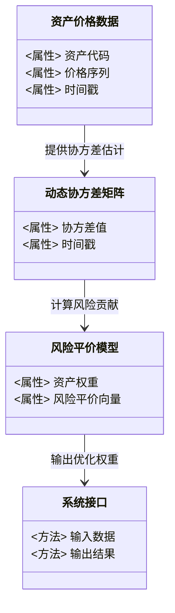
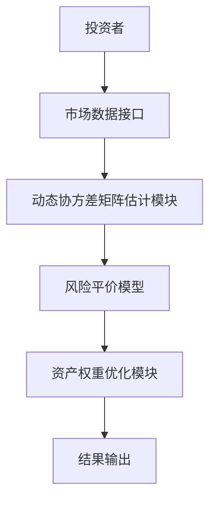

                 


# 智能算法构建动态风险平价模型

> **关键词**：智能算法，动态风险平价模型，风险管理，金融建模，数学优化

> **摘要**：本文详细探讨了如何利用智能算法构建动态风险平价模型。从背景介绍、核心概念到算法实现、数学模型，再到系统架构和项目实战，全面解析了动态风险平价模型的构建过程。文章结合理论与实践，通过具体的代码实现和案例分析，展示了如何利用智能算法优化风险管理，实现资产配置的动态调整。本文适合对金融建模、风险管理感兴趣的技术人员和研究人员阅读。

---

## 第一部分: 智能算法构建动态风险平价模型的背景与核心概念

### 第1章: 动态风险平价模型的背景与问题描述

#### 1.1 风险平价模型的定义与作用

##### 1.1.1 风险平价模型的基本概念
风险平价模型是一种用于资产配置的金融模型，旨在通过量化各资产的风险贡献，实现风险的均衡分配。传统的风险平价模型假设资产之间的风险关系是静态且不变的，但在实际金融市场中，资产的风险特征会随着市场环境的变化而动态调整。

##### 1.1.2 风险平价模型在金融中的作用
风险平价模型在金融领域具有重要作用，包括：
1. **风险分散**：通过量化各资产的风险贡献，优化资产配置，降低组合的整体风险。
2. **动态调整**：根据市场变化，实时调整资产权重，适应市场环境。
3. **风险定价**：为投资者提供风险调整后的资产定价参考。

##### 1.1.3 动态风险平价模型的必要性
传统的静态风险平价模型无法捕捉市场环境的变化，导致在极端市场条件下表现不佳。动态风险平价模型通过引入时间序列分析和机器学习算法，能够捕捉资产风险特征的动态变化，提升模型的适应性和准确性。

#### 1.2 动态风险平价模型的背景

##### 1.2.1 传统风险平价模型的局限性
传统风险平价模型假设资产之间的协方差矩阵是恒定的，但实际市场中协方差矩阵会受到市场波动、经济周期和突发事件的影响，导致模型在实际应用中效果不佳。

##### 1.2.2 动态风险平价模型的提出
随着大数据和人工智能技术的发展，动态风险平价模型应运而生。通过引入动态协方差矩阵估计和机器学习算法，动态风险平价模型能够实时捕捉市场变化，优化资产配置。

##### 1.2.3 动态风险平价模型的应用场景
动态风险平价模型广泛应用于机构投资、量化交易和风险管理领域，尤其适用于需要实时调整的动态资产配置场景。

#### 1.3 问题描述与目标

##### 1.3.1 动态风险平价模型的核心问题
如何构建一个能够实时捕捉市场变化的动态风险平价模型，优化资产配置，降低组合风险。

##### 1.3.2 模型的目标与边界
模型目标：
1. 实时估计资产的动态协方差矩阵。
2. 优化资产权重，实现风险的均衡分配。
3. 提供风险调整后的资产收益预测。

模型边界：
1. 仅考虑资产间的协方差变化，不考虑市场择时。
2. 假设市场数据的可得性和完整性。

##### 1.3.3 模型的核心要素与组成
动态风险平价模型的核心要素包括：
1. 动态协方差矩阵估计。
2. 资产风险贡献的计算。
3. 资产权重的优化。
4. 风险调整后的收益预测。

#### 1.4 本章小结
本章介绍了动态风险平价模型的背景、核心概念和应用场景，明确了模型的目标和核心要素，为后续章节的深入分析奠定了基础。

---

## 第2章: 动态风险平价模型的核心概念与联系

### 2.1 智能算法与动态风险平价模型的关系

#### 2.1.1 智能算法的定义与特点
智能算法是指模拟人类智能的算法，包括机器学习、深度学习和优化算法等。其特点是自适应性强、非线性建模能力和鲁棒性。

#### 2.1.2 智能算法在动态风险平价模型中的应用
智能算法在动态风险平价模型中的应用主要体现在：
1. 动态协方差矩阵的估计。
2. 资产风险贡献的预测。
3. 资产权重的优化。

#### 2.1.3 智能算法与传统算法的对比
传统算法通常基于线性假设，而智能算法能够捕捉非线性关系，适用于复杂动态环境。

### 2.2 动态风险平价模型的实体关系分析

#### 2.2.1 实体关系图（ER图）分析
```mermaid
erDiagram
    actor 投资者 {
        <属性> 资产列表
        <属性> 风险偏好
    }
    actor 市场数据 {
        <属性> 资产价格序列
        <属性> 时间戳
    }
    class 动态风险平价模型 {
        <属性> 协方差矩阵
        <属性> 资产权重
        <属性> 风险平价向量
    }
    投资者 --> 动态风险平价模型 : 提供风险偏好
    市场数据 --> 动态风险平价模型 : 提供价格序列
    动态风险平价模型 --> 投资者 : 输出优化权重
```

#### 2.2.2 模型的核心实体与关系
核心实体包括：
1. 投资者：提供风险偏好和资产列表。
2. 市场数据：提供资产价格序列。
3. 动态风险平价模型：计算协方差矩阵、风险平价向量和资产权重。

### 2.3 核心概念的原理与特征

#### 2.3.1 核心概念的原理分析
动态风险平价模型通过估计动态协方差矩阵，计算各资产的风险贡献，优化资产权重，实现风险的均衡分配。

#### 2.3.2 核心概念的特征对比
| 特性 | 静态风险平价模型 | 动态风险平价模型 |
|------|------------------|------------------|
| 协方差矩阵 | 静态 | 动态 |
| 计算频率 | 低频 | 高频 |
| 适应性 | 低 | 高 |

#### 2.3.3 核心概念的数学表达
风险平价模型的目标是最小化组合的风险，同时满足收益目标。数学表达如下：
$$ \text{minimize} \quad w^T \Sigma w $$
$$ \text{subject to} \quad w^T \mu = \text{target return} $$
其中，\( w \) 是资产权重向量，\( \Sigma \) 是协方差矩阵，\( \mu \) 是资产收益向量。

---

## 第3章: 动态风险平价模型的算法原理

### 3.1 智能算法的基本原理

#### 3.1.1 算法的基本流程
智能算法的基本流程包括：
1. 数据预处理：清洗和标准化数据。
2. 模型训练：训练智能模型，估计动态协方差矩阵。
3. 风险计算：计算各资产的风险贡献。
4. 权重优化：优化资产权重，实现风险平价。
5. 结果输出：输出优化后的资产权重。

#### 3.1.2 算法的核心步骤
核心步骤包括：
1. 动态协方差矩阵的估计。
2. 资产风险贡献的计算。
3. 资产权重的优化。

#### 3.1.3 算法的优化与改进
通过引入机器学习算法（如GARCH、因子模型等）优化协方差矩阵的估计，提高模型的准确性和鲁棒性。

### 3.2 动态风险平价模型的算法实现

#### 3.2.1 算法的输入与输出
输入：
- 资产价格序列
- 风险偏好

输出：
- 优化后的资产权重
- 风险平价向量

#### 3.2.2 算法的数学模型
动态风险平价模型的数学模型包括：
1. 动态协方差矩阵的估计：
$$ \Sigma_t = \text{GARCH}(p, q) $$
2. 资产风险贡献的计算：
$$ r_i = w_i \cdot \Sigma_{i,:} $$
3. 资产权重的优化：
$$ \text{minimize} \quad \sum_{i=1}^n (r_i - \frac{1}{n} \sum_{j=1}^n r_j)^2 $$
$$ \text{subject to} \quad \sum_{i=1}^n w_i = 1 $$

#### 3.2.3 算法的实现步骤
实现步骤包括：
1. 数据预处理：清洗和标准化资产价格数据。
2. 训练GARCH模型：估计动态协方差矩阵。
3. 计算资产风险贡献。
4. 优化资产权重。
5. 输出结果。

### 3.3 算法的优化与改进

#### 3.3.1 算法的优化方法
引入因子模型和机器学习算法，提高协方差矩阵估计的准确性和稳定性。

#### 3.3.2 算法的改进策略
1. 使用多因子模型捕捉资产之间的复杂关系。
2. 引入时间序列分析方法，捕捉协方差矩阵的动态变化。

#### 3.3.3 算法的性能评估
通过回测和风险指标（如VaR、CVaR）评估模型的性能。

---

## 第4章: 动态风险平价模型的数学模型与公式

### 4.1 模型的数学表达

#### 4.1.1 风险平价的数学公式
风险平价模型的目标是最小化组合的风险，同时满足收益目标：
$$ \text{minimize} \quad w^T \Sigma w $$
$$ \text{subject to} \quad w^T \mu = \text{target return} $$

#### 4.1.2 动态风险平价的数学推导
动态协方差矩阵的估计公式：
$$ \Sigma_t = \frac{\Sigma_{t-1} (1-\alpha) + \sigma_t^2 \alpha}{\text{diag}(\cdot)} $$
其中，\( \alpha \) 是平滑参数。

#### 4.1.3 模型的优化公式
资产权重的优化公式：
$$ w = \arg \text{minimize} \quad \sum_{i=1}^n (r_i - \frac{1}{n} \sum_{j=1}^n r_j)^2 $$

### 4.2 动态协方差矩阵的估计

#### 4.2.1 GARCH模型的数学表达
GARCH模型的数学表达式：
$$ \sigma_t^2 = \alpha_0 + \sum_{i=1}^p \alpha_i \sigma_{t-i}^2 + \sum_{j=1}^q \beta_j \sigma_{t-j}^2 $$

#### 4.2.2 动态协方差矩阵的计算
通过GARCH模型估计资产收益率的波动率和相关性，构建动态协方差矩阵。

---

## 第5章: 动态风险平价模型的系统架构与设计

### 5.1 问题场景介绍

#### 5.1.1 问题背景
动态风险平价模型的应用场景包括：
1. 机构投资组合管理。
2. 量化交易策略开发。
3. 风险管理系统的构建。

#### 5.1.2 问题目标
实现动态风险平价模型的系统架构，支持实时数据处理和资产权重优化。

### 5.2 系统功能设计

#### 5.2.1 领域模型设计


### 5.3 系统架构设计

#### 5.3.1 系统架构图


### 5.4 接口设计与交互流程

#### 5.4.1 系统接口设计
系统接口包括：
1. 数据输入接口。
2. 模型计算接口。
3. 结果输出接口。

#### 5.4.2 系统交互流程
1. 投资者提供资产列表和风险偏好。
2. 系统获取资产价格数据。
3. 动态协方差矩阵估计模块计算协方差矩阵。
4. 风险平价模型计算风险贡献。
5. 资产权重优化模块优化权重。
6. 结果输出模块提供优化后的权重。

---

## 第6章: 动态风险平价模型的项目实战

### 6.1 项目环境安装

#### 6.1.1 环境要求
- Python 3.8+
- NumPy、Pandas、Scikit-learn、GARCH库

#### 6.1.2 安装依赖
```bash
pip install numpy pandas scikit-learn garch
```

### 6.2 系统核心实现

#### 6.2.1 核心代码实现
```python
import numpy as np
import pandas as pd
from arch import models
from sklearn import linear_model

def estimate_garch(X):
    model = models.GARCH(p=1, q=1)
    result = model.fit(X)
    return result.forecast(h=1)

def compute_risk_contribution(weights, cov_matrix):
    risk_contribution = np.zeros(len(weights))
    for i in range(len(weights)):
        risk_contribution[i] = weights[i] * np.sqrt(cov_matrix[i, i])
    return risk_contribution

def optimize_weights(risk_contribution):
    n = len(risk_contribution)
    target_rc = np.mean(risk_contribution)
    X = np.ones(n)
    y = risk_contribution
    model = linear_model.LinearRegression(fit_intercept=False)
    model.fit(X, y)
    weights = model.coef_
    weights = weights / np.sum(weights)
    return weights
```

#### 6.2.2 代码应用解读与分析
上述代码实现包括：
1. GARCH模型的估计与预测。
2. 风险贡献的计算。
3. 资产权重的优化。

### 6.3 实际案例分析

#### 6.3.1 数据准备
假设我们有三支资产的价格数据，使用GARCH模型估计动态协方差矩阵。

#### 6.3.2 案例分析
1. 数据预处理：清洗和标准化数据。
2. 训练GARCH模型，估计动态协方差矩阵。
3. 计算资产风险贡献。
4. 优化资产权重。

### 6.4 项目小结
本章通过实际案例展示了动态风险平价模型的实现过程，包括环境安装、核心代码实现和案例分析，为读者提供了实践参考。

---

## 第7章: 动态风险平价模型的最佳实践与总结

### 7.1 最佳实践

#### 7.1.1 模型优化技巧
1. 引入因子模型提高协方差矩阵估计的准确性。
2. 使用机器学习算法捕捉非线性关系。

#### 7.1.2 模型风险管理
1. 定期回测，评估模型的性能。
2. 设置风险控制指标，如VaR和CVaR。

#### 7.1.3 模型维护与更新
1. 定期更新模型参数。
2. 监控模型的稳定性。

### 7.2 小结

#### 7.2.1 模型的优缺点
优点：
- 能够捕捉资产风险的动态变化。
- 实现了资产配置的实时优化。

缺点：
- 计算复杂度较高，需要大量的计算资源。
- 对模型假设的敏感性较高。

### 7.3 注意事项

#### 7.3.1 模型的应用边界
- 适用于中短期资产配置。
- 需要高频数据支持。

#### 7.3.2 模型的维护成本
动态风险平价模型需要定期更新和维护，增加了模型的维护成本。

### 7.4 拓展阅读

#### 7.4.1 推荐书籍
1. 《金融中的风险管理》
2. 《机器学习在金融中的应用》

#### 7.4.2 推荐论文
1. "Dynamic Covariance Estimation in Risk Parity Models"
2. "Machine Learning for Asset Allocation"

---

## 作者信息

作者：AI天才研究院/AI Genius Institute & 禅与计算机程序设计艺术/Zen And The Art of Computer Programming

---

以上是《智能算法构建动态风险平价模型》的完整目录和内容框架。如果需要进一步扩展或调整，请随时告知。

