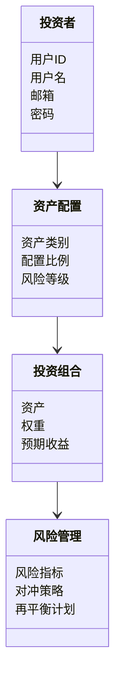
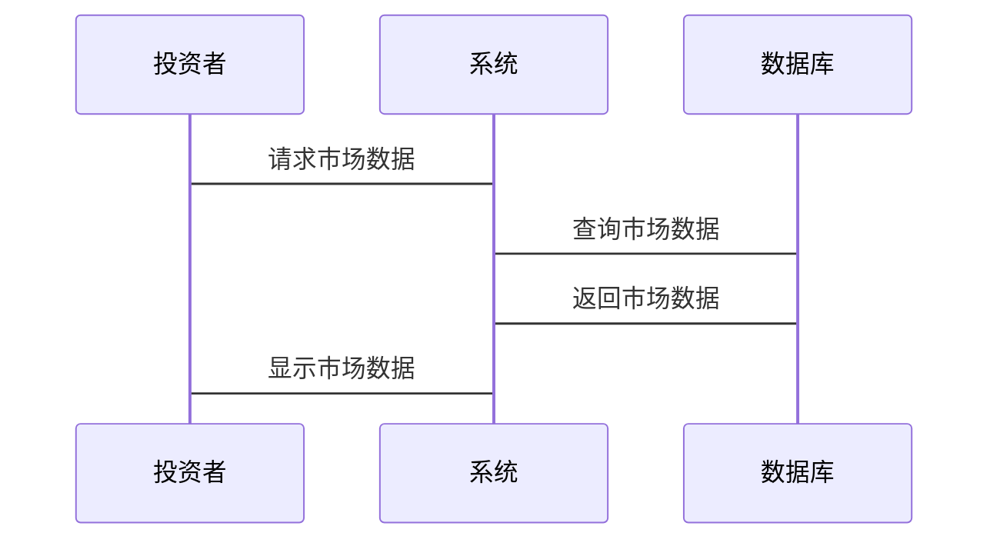

                 


# 约翰·伯格的投资者教育理念

> 关键词：投资者教育，约翰·伯格，投资理念，风险管理，资产配置，长期投资，指数基金

> 摘要：本文系统阐述了约翰·伯格的投资者教育理念，从其背景、核心概念到算法原理、系统架构，再到项目实战和最佳实践，全面解析了投资者教育的关键点。通过理论与实践相结合的方式，帮助读者理解并掌握科学的投资方法。

---

# 第一部分: 投资者教育理念的背景与核心概念

# 第1章: 投资者教育理念的背景介绍

## 1.1 投资者教育的重要性
### 1.1.1 投资者教育的定义与范围
- 投资者教育是指通过系统化的知识传递，帮助投资者理解市场运作机制、投资工具和风险控制方法。
- 范围涵盖股票、债券、基金等多种投资工具，涉及个人理财、资产配置和风险管理等领域。

### 1.1.2 当前投资市场的现状与问题
- 投资者普遍缺乏系统的投资知识，容易受到市场情绪的影响。
- 过度追求短期收益，忽视长期投资价值。
- 缺乏对风险的正确认识，导致投资决策失误。

### 1.1.3 投资者教育的核心目标
- 提高投资者的金融素养，帮助其做出理性的投资决策。
- 培养长期投资理念，避免盲目跟风。
- 帮助投资者理解风险与收益的平衡关系。

## 1.2 约翰·伯格的背景与投资理念
### 1.2.1 约翰·伯格的生平简介
- 约翰·伯格（John Bogle）是美国著名投资家，Vanguard集团的创始人。
- 他倡导低成本、被动投资策略，被誉为“指数基金之父”。

### 1.2.2 约翰·伯格的投资哲学
- 倡导长期投资，相信市场会回归理性。
- 强调分散投资，降低非系统性风险。
- 提倡低成本投资，反对频繁交易和高额费用。

### 1.2.3 约翰·伯格对投资者教育的贡献
- 创办Vanguard，提供低成本指数基金，降低投资者门槛。
- 通过书籍和演讲传播投资知识，帮助投资者建立正确的投资理念。

## 1.3 投资者教育的核心要素
### 1.3.1 投资者认知的形成过程
- 认知偏差：投资者容易受到 confirmation bias 和 loss aversion 的影响。
- 知识结构：投资者需要理解基础的财务知识和投资工具。
- 行为决策：投资者决策受情绪和环境影响。

### 1.3.2 投资者行为的驱动因素
- 心理因素：贪婪与恐惧交替驱动投资行为。
- 社会因素：羊群效应和从众心理影响投资决策。
- 信息因素：信息的不透明性和误导性导致决策偏差。

### 1.3.3 投资者决策的常见误区
- 过度自信：认为自己能准确预测市场走势。
- 追涨杀跌：基于短期市场波动做出决策。
- 忽略费用：忽视交易费用和管理费用对收益的影响。

## 1.4 本章小结
- 投资者教育是帮助投资者避免认知偏差和行为误区的关键。
- 约翰·伯格的投资理念强调长期、分散、低成本的投资策略。
- 投资者教育的核心目标是培养理性投资能力，避免常见误区。

---

# 第2章: 投资者教育的核心概念与联系

## 2.1 投资的基本原理
### 2.1.1 资产配置的核心作用
- 资产配置是投资组合管理的基础。
- 通过分散投资降低风险，提高收益稳定性。

### 2.1.2 分散投资的风险管理
- 通过投资不同资产类别、行业和地域降低风险。
- 分散投资可以有效避免单一资产的大幅波动对整体组合的影响。

### 2.1.3 长期投资的复利效应
- 复利效应是长期投资的核心优势。
- 长期持有优质资产可以最大化复利效应。

## 2.2 投资者心理与行为分析
### 2.2.1 投资者心理偏差的类型
- 确认偏差：过度相信与自己观点一致的信息。
- 损失厌恶：对损失的敏感程度高于收益。
- 过度自信：认为自己能预测市场走势。

### 2.2.2 心理偏差对投资决策的影响
- 导致追涨杀跌行为，增加交易成本。
- 造成非理性决策，如高位买入和低位卖出。

### 2.2.3 如何克服心理偏差
- 建立系统化的投资策略，避免情绪化决策。
- 定期审视投资组合，保持长期视角。

## 2.3 投资者教育中的关键概念对比
### 2.3.1 股票与债券的对比分析
- 股票：高风险、高收益，适合长期投资。
- 债券：低风险、稳定收益，适合保守投资者。

### 2.3.2 主动投资与被动投资的优劣势
- 主动投资：追求超额收益，但费用高、风险大。
- 被动投资：费用低、风险小，适合长期投资。

### 2.3.3 高风险与低风险投资的适用场景
- 高风险投资适合有较高风险承受能力的投资者。
- 低风险投资适合保守型投资者和长期稳健收益的需求。

## 2.4 本章小结
- 投资者需要理解不同资产类别的特点和适用场景。
- 理解主动投资与被动投资的优劣势，选择适合自己的策略。
- 通过分散投资和长期持有降低风险，提高收益。

---

# 第3章: 投资者教育的算法原理与数学模型

## 3.1 投资组合优化的数学模型
### 3.1.1 Markowitz现代投资组合理论（MPT）
- MPT是投资组合理论的基础，通过优化投资组合的收益和风险。

### 3.1.2 投资组合优化的数学公式
$$
\text{目标：} \min_w \left( \sigma^2(w) \right) \\
\text{约束：} \sum_{i=1}^n w_i = 1, \quad w_i \geq 0
$$

其中，$w_i$ 是第 $i$ 种资产的权重，$\sigma^2(w)$ 是投资组合的方差。

### 3.1.3 约翰·伯格对MPT的改进与应用
- 强调低成本和分散投资，简化投资组合管理。

## 3.2 风险管理的算法实现
### 3.2.1 风险调整后的收益模型
$$
\text{夏普比率} = \frac{E[r_i - r_f]}{\sigma_i}
$$

其中，$E[r_i - r_f]$ 是资产的超额收益期望值，$\sigma_i$ 是资产收益的标准差。

### 3.2.2 风险度量的数学公式
- 方差：衡量资产收益的波动性。
- 标准差：衡量资产收益的离散程度。

### 3.2.3 算法实现的Python代码示例
```python
import numpy as np
import pandas as pd

def calculate_sharpe_ratio(returns, risk_free_rate):
    excess_returns = returns - risk_free_rate
    return np.mean(excess_returns) / np.std(excess_returns)

# 示例数据
returns = pd.Series([0.1, 0.05, -0.02, 0.15], index=['A', 'B', 'C', 'D'])
risk_free_rate = 0.02

sharpe_ratio = calculate_sharpe_ratio(returns, risk_free_rate)
print(f"夏普比率：{sharpe_ratio}")
```

## 3.3 投资组合再平衡的策略分析
### 3.3.1 投资组合再平衡的定义与作用
- 定期调整投资组合，使其符合预定的资产配置比例。
- 通过再平衡降低风险，提高收益。

### 3.3.2 再平衡策略的数学模型
$$
\text{再平衡后权重} = \frac{\text{当前权重}}{\sum \text{当前权重}}
$$

### 3.3.3 算法实现的步骤与代码
```python
def rebalance_portfolio(weights, current_assets, target_assets):
    current_total = sum(current_assets)
    target_total = sum(target_assets)
    new_weights = {asset: weights[asset] * current_assets[asset] / current_total for asset in weights}
    return new_weights

# 示例数据
weights = {'A': 0.4, 'B': 0.3, 'C': 0.2, 'D': 0.1}
current_assets = {'A': 100, 'B': 75, 'C': 50, 'D': 25}
target_assets = {'A': 120, 'B': 60, 'C': 40, 'D': 30}

new_weights = rebalance_portfolio(weights, current_assets, target_assets)
print("再平衡后权重：", new_weights)
```

## 3.4 本章小结
- 投资组合优化和风险管理是投资者教育的重要组成部分。
- 通过数学模型和算法实现，帮助投资者科学地管理投资组合。

---

# 第4章: 投资者教育的系统分析与架构设计

## 4.1 投资者教育系统的功能设计
### 4.1.1 用户需求分析
- 投资者需要了解市场信息、投资工具和风险管理方法。
- 提供个性化的投资建议和模拟投资体验。

### 4.1.2 系统功能模块划分
- 用户界面：展示市场数据、投资工具和教育资源。
- 投资分析：提供投资组合优化和风险管理工具。
- 互动交流：投资者可以分享经验、讨论问题。

### 4.1.3 功能设计的领域模型（Mermaid类图）


## 4.2 系统架构设计
### 4.2.1 系统架构（Mermaid架构图）
```mermaid
graph TD
    I -> A
    A -> B
    B -> C
    C -> D
```
- I：投资者界面
- A：资产配置模块
- B：投资组合管理模块
- C：风险管理模块
- D：数据存储模块

## 4.3 系统接口设计
### 4.3.1 API接口
- 获取市场数据接口：`get_market_data()`
- 计算投资组合风险接口：`calculate_risk()`
- 提供投资建议接口：`get_recommendations()`

### 4.3.2 接口设计的交互流程（Mermaid序列图）


## 4.4 本章小结
- 系统架构设计为投资者教育提供了技术支持。
- 通过API接口和模块化设计，实现功能的灵活扩展。

---

# 第5章: 投资者教育的项目实战

## 5.1 环境安装与配置
### 5.1.1 Python环境安装
- 安装Python和必要的库（numpy, pandas, matplotlib）。

### 5.1.2 数据源配置
- 数据来源：Yahoo Finance API 或本地数据文件。

## 5.2 核心代码实现
### 5.2.1 投资组合优化的代码实现
```python
import pandas as pd
import numpy as np

def optimize_portfolio(returns):
    n = returns.shape[1]
    returns_vector = pd.DataFrame(returns.values.T, index=returns.columns, columns=range(n))
    covariance_matrix = returns_vector.cov()
    inv_covariance = np.linalg.inv(covariance_matrix.values)
    weights = np.dot(inv_covariance, np.ones(n))
    weights = weights / weights.sum()
    return pd.Series(weights, index=returns.columns)

# 示例数据
returns = pd.DataFrame({
    '股票': [0.1, 0.05, -0.02, 0.15],
    '债券': [0.05, 0.03, 0.02, 0.01],
    '基金': [0.12, 0.08, 0.05, 0.03]
})
optimal_weights = optimize_portfolio(returns)
print("最优权重：", optimal_weights)
```

### 5.2.2 风险管理的代码实现
```python
def calculate VaR(returns, confidence_level=0.95):
    returns_sorted = sorted(returns)
    VaR = returns_sorted[int(len(returns_sorted) * (1 - confidence_level))]
    return VaR

# 示例数据
returns = pd.Series([0.1, 0.05, -0.02, 0.15])
VaR = calculate_VaR(returns)
print(f"VaR在{confidence_level}置信水平下为：{VaR}")
```

## 5.3 案例分析与代码解读
### 5.3.1 投资组合优化案例
- 数据来源：某时间段的资产收益率数据。
- 优化结果：各资产的最优权重。

### 5.3.2 风险管理案例
- 计算VaR值，评估投资组合的风险。

## 5.4 本章小结
- 通过项目实战，读者可以掌握投资组合优化和风险管理的实现方法。
- 理论与实践相结合，帮助投资者更好地应用约翰·伯格的理念。

---

# 第6章: 投资者教育的最佳实践与小结

## 6.1 投资者教育的最佳实践
### 6.1.1 长期投资的重要性
- 避免频繁交易，减少交易成本。
- 通过复利效应实现财富增长。

### 6.1.2 风险管理的技巧
- 设定止损线，避免重大损失。
- 定期再平衡投资组合，降低风险。

### 6.1.3 避免常见错误
- 追涨杀跌：避免基于短期市场波动做出决策。
- 过度自信：保持谦逊，不断学习和调整。

## 6.2 项目小结
- 约翰·伯格的投资者教育理念强调长期、分散、低成本的投资策略。
- 通过系统化的知识传递和实践，帮助投资者建立科学的投资方法。

## 6.3 注意事项
- 投资有风险，需谨慎决策。
- 根据自身情况调整投资策略，避免盲目跟风。

## 6.4 拓展阅读
- 阅读约翰·伯格的著作，深入了解其投资哲学。
- 学习其他投资大师的理论，拓宽知识面。

---

# 作者：AI天才研究院/AI Genius Institute & 禅与计算机程序设计艺术 /Zen And The Art of Computer Programming

