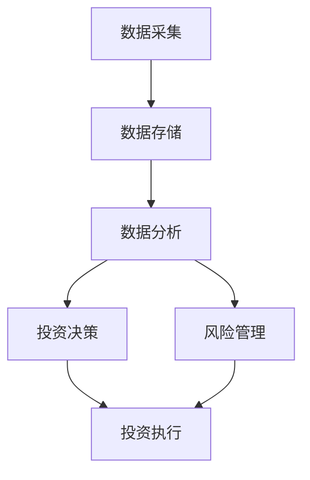
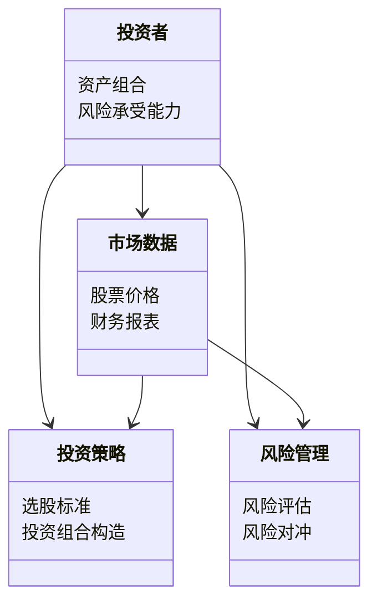
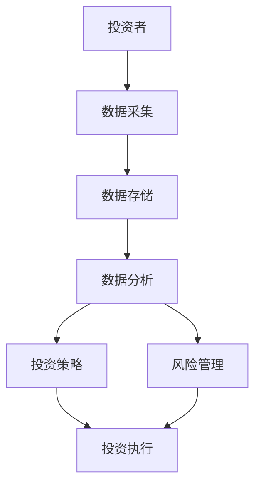
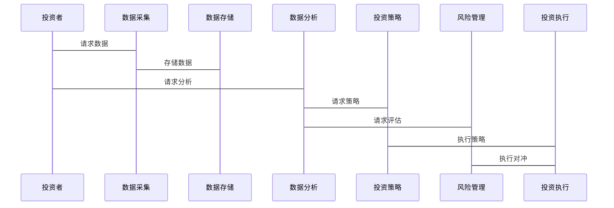

                 


# 马克·莫比乌斯的新兴市场价值投资策略

> 关键词：价值投资、新兴市场、马克·莫比乌斯、风险管理、投资策略

> 摘要：本文深入探讨了马克·莫比乌斯在新兴市场的价值投资策略，分析了其独特的选股标准、行业分析方法以及风险管理策略。通过系统的架构设计和实战案例，结合数学模型和算法流程图，详细阐述了如何在新兴市场中实现长期稳定的收益。

---

## 第一部分: 价值投资与新兴市场概述

### 第1章: 价值投资的定义与核心理念

#### 1.1 价值投资的基本定义

##### 1.1.1 价值投资的起源与发展
价值投资是一种投资策略，起源于20世纪30年代，由本杰明·格雷厄姆和戴维·多德提出。其核心理念是购买被市场低估的股票，长期持有，等待其价值回归。这一策略在20世纪的多次金融危机中表现出色，尤其是在2008年全球金融危机期间，价值投资策略帮助投资者规避了巨大损失。

##### 1.1.2 价值投资的核心理念
价值投资的核心理念是寻找市场定价低于其内在价值的股票。投资者需要深入分析公司的基本面，包括财务状况、盈利能力、管理团队和行业地位。价值投资强调长期投资和耐心持有，避免短期市场波动的干扰。

##### 1.1.3 价值投资与成长投资的区别
与成长投资不同，价值投资更关注低估值的股票，而非公司未来的高增长潜力。成长投资者愿意为高增长潜力支付更高的市盈率，而价值投资者则更注重当前的低估值和安全边际。

#### 1.2 新兴市场的特点与投资机会

##### 1.2.1 新兴市场的定义与分类
新兴市场是指那些经济正在快速发展，但尚未完全工业化的国家。这些市场通常包括中国、印度、巴西、南非等。新兴市场的特点是经济增长快、市场规模大、市场效率低，但风险较高。

##### 1.2.2 新兴市场的经济特征
新兴市场的经济特征包括高增长、高波动性、较高的外部依赖性以及不完善的法律和监管框架。这些特征使得新兴市场既有机会也有风险。

##### 1.2.3 新兴市场的投资机会
新兴市场提供了丰富的投资机会，尤其是在科技、消费、金融和基础设施等领域。随着这些国家的经济发展和人口增长，投资者可以通过投资新兴市场获得超额收益。

#### 1.3 马克·莫比乌斯的贡献与投资风格

##### 1.3.1 马克·莫比乌斯的生平简介
马克·莫比乌斯是新兴市场投资领域的权威，他管理的基金专注于投资新兴市场的优质企业。莫比乌斯的投资理念深受本杰明·格雷厄姆的影响，但他将价值投资的理念应用于新兴市场，取得了显著的成果。

##### 1.3.2 莫比乌斯的投资风格
莫比乌斯的投资风格以低估值、高安全边际和长期持有为核心。他注重公司的基本面分析，尤其是盈利能力、财务状况和管理团队。此外，莫比乌斯还强调分散投资，以降低市场风险。

##### 1.3.3 莫比乌斯对新兴市场的独特见解
莫比乌斯认为，新兴市场的波动性较高，但长期增长潜力巨大。他强调在新兴市场中寻找具有竞争优势的公司，并在市场低估时进行投资。他的投资策略在新兴市场中表现出色，尤其是在经济危机期间。

---

## 第二部分: 新兴市场的价值投资策略

### 第2章: 新兴市场的价值投资策略

#### 2.1 新兴市场的估值方法

##### 2.1.1 市盈率（P/E）分析
市盈率是衡量股票估值的重要指标，计算公式为：P/E = 市场价格 / 每股收益。在新兴市场中，低市盈率的股票通常被认为是低估的。

##### 2.1.2 市净率（P/B）分析
市净率是市场价格与每股净资产的比率，计算公式为：P/B = 市场价格 / 每股净资产。低市净率的股票通常具有较高的安全边际。

##### 2.1.3 EV/EBITDA 指标
企业价值与利息、税项、折旧及摊销前利润之比（EV/EBITDA）是衡量企业整体价值的重要指标。在新兴市场中，低EV/EBITDA的公司通常具有较高的投资价值。

#### 2.2 新兴市场的行业分析

##### 2.2.1 行业选择的标准
在新兴市场中，行业选择是投资成功的关键。投资者应选择那些具有高增长潜力、良好竞争格局和稳定需求的行业。

##### 2.2.2 新兴市场的优势行业
新兴市场的优势行业包括科技、消费、金融和基础设施等领域。这些行业通常受益于经济增长和人口结构的变化。

##### 2.2.3 行业风险评估
新兴市场的行业风险包括政策风险、经济波动风险和竞争风险。投资者需要对这些风险进行充分评估，并采取适当的对冲措施。

#### 2.3 新兴市场的公司分析

##### 2.3.1 公司基本面分析
公司基本面分析包括盈利能力、财务状况、管理团队和市场地位等方面。在新兴市场中，投资者应重点关注公司的财务健康状况和管理团队的稳定性。

##### 2.3.2 财务指标分析
财务指标分析包括ROE（净资产收益率）、ROA（资产回报率）和现金流等指标。在新兴市场中，高ROE和稳定的现金流通常意味着公司具有较强的盈利能力。

##### 2.3.3 管理团队评估
管理团队的素质和战略能力是公司成功的关键。在新兴市场中，投资者应重点关注管理团队的过往业绩和战略规划。

### 第3章: 马克·莫比乌斯的投资策略

#### 3.1 莫比乌斯的选股标准

##### 3.1.1 低估值股票的识别
莫比乌斯通常寻找那些市盈率、市净率和EV/EBITDA等指标低于行业平均水平的股票。这些股票通常具有较高的安全边际。

##### 3.1.2 公司竞争优势分析
莫比乌斯注重公司的竞争优势，包括成本优势、技术优势和市场地位等。他认为，具有强大竞争优势的公司更有可能在长期中获得超额收益。

##### 3.1.3 市场地位评估
市场地位是公司竞争优势的重要体现。莫比乌斯通常选择那些在行业中具有领先地位的公司，以确保公司在未来的发展中具有竞争优势。

#### 3.2 莫比乌斯的分散投资策略

##### 3.2.1 分散投资的重要性
分散投资是降低风险的重要手段。莫比乌斯通常将资金分散投资于多个行业和公司，以降低单一投资的风险。

##### 3.2.2 股票组合构建
莫比乌斯的股票组合通常包括多个行业的股票，且每个行业的权重相对均衡。这种分散化的组合有助于降低市场风险和行业风险。

##### 3.2.3 风险控制
莫比乌斯注重风险控制，通常会设定止损点和止盈点。在市场波动较大时，他会调整投资组合的结构，以降低风险。

#### 3.3 莫比乌斯的投资决策流程

##### 3.3.1 研究与分析阶段
莫比乌斯的投资决策流程通常包括深入的研究和分析。他会对公司进行基本面分析，并评估公司的财务状况、管理团队和行业地位。

##### 3.3.2 投资决策阶段
在投资决策阶段，莫比乌斯会根据研究结果和市场估值情况，决定是否买入或卖出某只股票。他通常会在市场低估时进行投资，以获得超额收益。

##### 3.3.3 投后管理与调整
莫比乌斯注重投后管理，定期评估投资组合的结构和市场估值情况。在市场变化时，他会及时调整投资组合，以确保投资目标的实现。

### 第4章: 新兴市场的风险管理

#### 4.1 新兴市场的风险类型

##### 4.1.1 政治风险
政治风险是新兴市场中的主要风险之一。政策变化、政治动荡等因素可能对市场产生重大影响。

##### 4.1.2 经济波动风险
新兴市场的经济波动较大，通货膨胀、货币贬值等因素可能对投资产生负面影响。

##### 4.1.3 市场流动性风险
新兴市场的流动性通常较低，尤其是在市场波动较大时，投资者可能难以以合理的价格买卖股票。

#### 4.2 风险评估与控制方法

##### 4.2.1 风险评估模型
莫比乌斯使用多种风险评估模型，包括VaR（在险价值）和情景分析等方法。这些模型有助于评估投资组合的风险，并制定相应的对冲策略。

##### 4.2.2 风险对冲策略
莫比乌斯通常使用衍生品进行风险对冲，如期货、期权等。这些工具可以帮助投资者降低市场风险和波动性风险。

##### 4.2.3 风险分散技术
分散投资是降低风险的重要手段。莫比乌斯通常将资金分散投资于多个行业和公司，以降低单一投资的风险。

#### 4.3 莫比乌斯的风险管理实践

##### 4.3.1 莫比乌斯的风险管理理念
莫比乌斯认为，风险管理是投资成功的关键。他强调分散投资和风险对冲的重要性，并定期评估投资组合的风险。

##### 4.3.2 具体案例分析
在2008年全球金融危机期间，莫比乌斯的投资组合表现优异，主要是因为他及时采取了风险对冲措施，并分散了投资风险。

##### 4.3.3 风险管理中的常见误区
莫比乌斯指出，许多投资者在风险管理中容易忽视市场风险和流动性风险。他认为，投资者应避免过度集中投资和忽视市场波动性。

### 第5章: 系统化投资策略与架构设计

#### 5.1 投资系统架构概述

##### 5.1.1 系统目标与范围
投资系统的目标是帮助投资者实现长期稳定的收益。系统的范围包括数据采集、分析、决策和风险管理等模块。

##### 5.1.2 系统功能模块划分
投资系统通常包括数据采集模块、分析模块、决策模块和风险管理模块。这些模块协同工作，帮助投资者做出科学的投资决策。

##### 5.1.3 系统架构设计图
以下是一个典型的投资系统架构设计图：



#### 5.2 投资策略的系统化实现

##### 5.2.1 系统功能设计

###### 5.2.1.1 领域模型
以下是一个投资系统的领域模型：



##### 5.2.2 系统架构设计

###### 5.2.2.1 系统架构图
以下是一个投资系统的架构图：



##### 5.2.3 系统接口设计

###### 5.2.3.1 接口描述
- 数据采集接口：从外部数据源获取市场数据，包括股票价格、财务报表等。
- 数据存储接口：将数据存储在数据库中，以便后续分析。
- 数据分析接口：对数据进行分析，生成投资建议。
- 投资策略接口：根据分析结果，制定投资策略。
- 风险管理接口：评估投资风险，并制定对冲策略。

##### 5.2.4 系统交互设计

###### 5.2.4.1 交互序列图
以下是一个典型的投资系统交互序列图：



---

## 第三部分: 项目实战与最佳实践

### 第6章: 项目实战

#### 6.1 环境安装

##### 6.1.1 安装Python
在开始之前，需要安装Python编程环境。以下是安装步骤：

1. 下载并安装Python：[https://www.python.org/downloads/](https://www.python.org/downloads/)
2. 安装必要的库：`pip install numpy pandas matplotlib`

##### 6.1.2 安装Jupyter Notebook
Jupyter Notebook是一个方便的数据分析工具，安装步骤如下：

1. 安装Jupyter Notebook：`pip install jupyter`

#### 6.2 系统核心实现源代码

##### 6.2.1 数据采集与预处理
以下是一个数据采集与预处理的示例代码：

```python
import pandas as pd
import numpy as np

# 数据采集
data = pd.read_csv('stock_data.csv')

# 数据预处理
data = data.dropna()
data = pd.get_dummies(data)
```

##### 6.2.2 投资组合优化

```python
from scipy.optimize import minimize

# 定义优化目标函数
def portfolio_return(weights, returns):
    return -weights.T.dot(returns)

# 定义约束条件
constraints = [{'type': 'eq', 'fun': lambda w: sum(w) - 1}]

# 优化过程
weights = minimize(portfolio_return, initial_guess, (returns,), constraints)

# 输出结果
print(weights.x)
```

##### 6.2.3 风险管理与对冲

```python
import pandas as pd
import numpy as np

# 计算VaR
def calculate VaR(returns, confidence_level):
    sorted_returns = np.sort(returns)
    VaR = sorted_returns[int(len(returns) * (1 - confidence_level))]
    return VaR

# 对冲策略
def hedge_strategy(positions, VaR):
    if positions > 0 and VaR < 0:
        return "买入对冲"
    elif positions < 0 and VaR > 0:
        return "卖出对冲"
    else:
        return "无对冲"
```

#### 6.3 代码应用解读与分析

##### 6.3.1 数据采集与预处理
数据采集与预处理是投资系统的核心步骤。通过使用Pandas库，我们可以轻松地读取和处理数据。在预处理阶段，我们通常会删除缺失值并进行独热编码，以便后续分析。

##### 6.3.2 投资组合优化
投资组合优化的目标是最大化收益或最小化风险。在上述代码中，我们使用了SciPy库中的最小化函数，结合约束条件，实现了投资组合的优化。优化结果给出了各个资产的最优权重。

##### 6.3.3 风险管理与对冲
VaR（在险价值）是衡量投资组合风险的重要指标。通过计算VaR，我们可以确定在给定置信水平下的潜在损失。在对冲策略中，我们根据VaR和当前头寸，决定是否进行买入或卖出对冲。

#### 6.4 实际案例分析和详细讲解剖析

##### 6.4.1 案例背景
假设我们有一个新兴市场的股票组合，包括科技、消费和金融三个行业的股票。我们需要对这个组合进行优化，并制定风险管理策略。

##### 6.4.2 数据分析与优化
通过数据采集和预处理，我们得到了各个股票的历史收益率。使用优化算法，我们计算出了各个股票的最优权重。

##### 6.4.3 风险评估与对冲
通过计算VaR，我们确定了在95%置信水平下的潜在损失。根据当前头寸和VaR，我们决定进行卖出对冲以降低风险。

#### 6.5 项目小结

##### 6.5.1 核心实现总结
- 数据采集与预处理：使用Pandas库进行数据清洗和特征工程。
- 投资组合优化：使用SciPy库进行优化计算。
- 风险管理与对冲：使用VaR指标进行风险评估，并制定对冲策略。

##### 6.5.2 项目成果
通过本项目的实施，我们成功构建了一个新兴市场的投资系统，实现了投资组合的优化和风险管理。该系统可以在实际投资中帮助投资者实现长期稳定的收益。

---

## 第四部分: 最佳实践与小结

### 第7章: 最佳实践 tips、小结、注意事项、拓展阅读

#### 7.1 最佳实践 tips

##### 7.1.1 分散投资
分散投资是降低风险的重要手段。投资者应将资金分散投资于多个行业和公司，以降低单一投资的风险。

##### 7.1.2 定期评估
定期评估投资组合的结构和市场估值情况，及时调整投资策略。

##### 7.1.3 风险管理
风险管理是投资成功的关键。投资者应使用VaR等工具评估风险，并制定相应的对冲策略。

#### 7.2 小结

马克·莫比乌斯的新兴市场价值投资策略以低估值、高安全边际和长期持有为核心。通过系统的架构设计和实战案例，我们深入分析了其投资策略，并结合数学模型和算法流程图，详细阐述了如何在新兴市场中实现长期稳定的收益。

#### 7.3 注意事项

##### 7.3.1 市场风险
新兴市场的波动性较高，投资者应充分考虑市场风险。

##### 7.3.2 行业风险
不同行业的风险不同，投资者应根据行业特点制定相应的投资策略。

##### 7.3.3 管理团队
管理团队的素质和战略能力是公司成功的关键，投资者应重点关注。

#### 7.4 拓展阅读

##### 7.4.1 推荐书籍
- 《投资最重要的事情》——本杰明·格雷厄姆
- 《新兴市场的投资机会》——马克·莫比乌斯

##### 7.4.2 推荐博客
- [投资策略博客](https://www.investorstrategy.com/)
- [风险管理博客](https://www.riskmanagement.com/)

---

## 作者信息

作者：AI天才研究院/AI Genius Institute & 禅与计算机程序设计艺术 /Zen And The Art of Computer Programming

---

以上是《马克·莫比乌斯的新兴市场价值投资策略》的完整目录大纲及详细内容。

