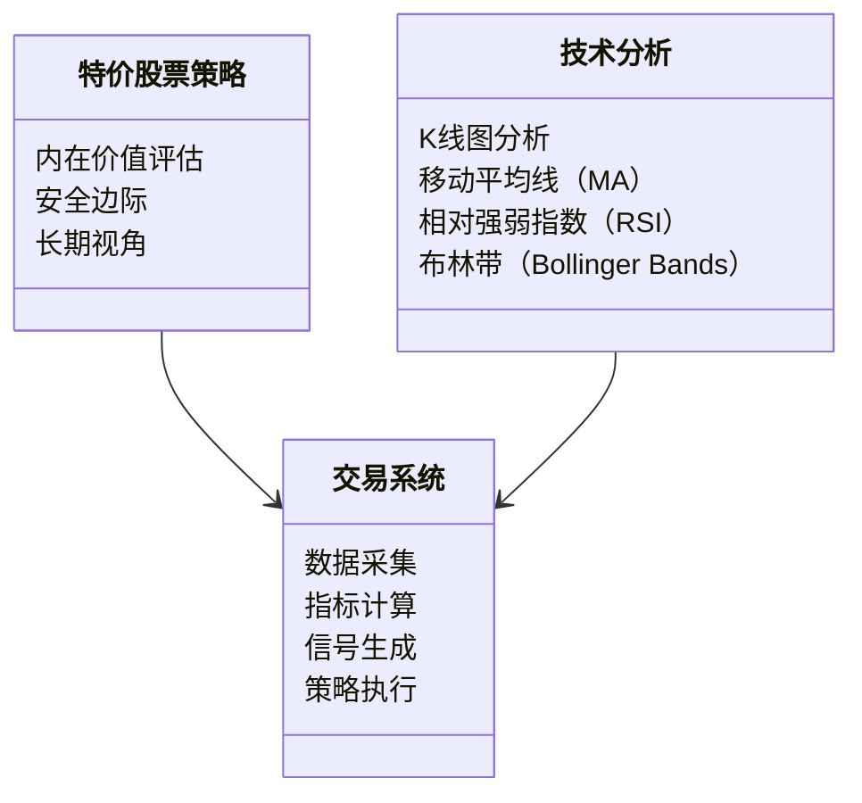
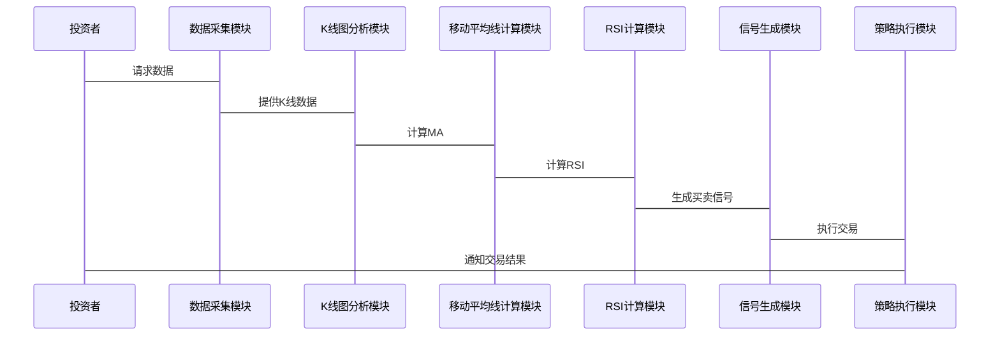

                 


# 如何将特价股票策略与技术分析相结合

> 关键词：特价股票策略，技术分析，投资策略，算法交易，系统架构

> 摘要：本文将详细介绍如何将特价股票策略与技术分析相结合，通过分析特价股票策略的核心概念、技术分析的主要方法，以及两者结合的优势和实现方式，帮助投资者更好地理解并应用这一策略。本文还将从算法原理、系统架构、项目实战等多个角度展开，为读者提供全面的指导。

---

## 第一部分: 特价股票策略与技术分析的背景与基础

### 第1章: 特价股票策略与技术分析的背景

#### 1.1 特价股票策略的定义与核心概念

##### 1.1.1 特价股票的定义
特价股票（Undervalued Stocks）是指市场价格低于其内在价值的股票。这种股票通常被认为具有较高的投资潜力，因为市场可能尚未完全认识到其价值。

##### 1.1.2 特价股票策略的核心要素
- **内在价值评估**：通过财务指标（如市盈率、市净率等）评估股票的真正价值。
- **安全边际**：以低于内在价值的价格买入股票，以降低投资风险。
- **长期视角**：特价股票策略通常需要耐心等待市场重新认识到其价值。

##### 1.1.3 特价股票策略的优缺点
- **优点**：
  - 长期来看，具有较高的回报潜力。
  - 适合价值投资者，能够在市场低估时买入优质资产。
- **缺点**：
  - 短期可能表现不佳，需要耐心等待。
  - 需要较高的分析能力，识别真正的低估股票。

#### 1.2 技术分析的基本原理

##### 1.2.1 技术分析的定义
技术分析是一种通过分析历史价格和成交量数据，预测未来价格走势的方法。它假设价格走势反映了市场的所有信息。

##### 1.2.2 技术分析的核心假设
- **市场行为包含一切信息**：价格走势反映了所有相关信息。
- **价格趋势具有延续性**：价格趋势一旦形成，往往会延续。
- **历史形态会重复出现**：历史的价格形态会再次出现。

##### 1.2.3 技术分析的主要工具与方法
- **K线图**：显示股票价格在某一时间段内的开盘价、收盘价、最高价和最低价。
- **移动平均线（MA）**：平滑价格走势，帮助识别趋势。
- **相对强弱指数（RSI）**：衡量股票超买或超卖状态。
- **布林带（Bollinger Bands）**：识别价格波动的范围。

#### 1.3 特价股票策略与技术分析的结合意义

##### 1.3.1 特价股票策略的优势
- **长期价值**：识别真正低估的股票，长期回报潜力大。
- **安全边际**：以低于内在价值的价格买入，降低风险。

##### 1.3.2 技术分析的优势
- **短期趋势预测**：通过技术指标预测价格走势。
- **信号提示**：识别买卖信号，优化交易时机。

##### 1.3.3 两者结合的潜在价值
- **互补优势**：技术分析提供短期信号，特价股票策略提供长期价值判断。
- **降低风险**：结合技术分析，避免仅依靠基本面分析的局限性。

#### 1.4 本章小结
本章介绍了特价股票策略和技术创新分析的基本概念，并分析了两者结合的潜在价值。接下来的章节将深入探讨两者的具体实现和结合方式。

---

## 第二部分: 特价股票策略与技术分析的核心概念与联系

### 第2章: 特价股票策略的核心概念与原理

#### 2.1 特价股票策略的分类

##### 2.1.1 价值投资策略
基于公司基本面分析，寻找市场价格低于内在价值的股票。典型代表是巴菲特的投资策略。

##### 2.1.2 投机策略
通过预测市场短期波动，利用价格波动获利。风险较高，需要较高的市场敏感性。

##### 2.1.3 其他相关策略
- **成长型投资**：寻找业绩增长快的公司，即使当前市场价格较高。
- **股息投资**：关注高股息率的股票，获取稳定的现金流。

#### 2.2 特价股票策略的关键指标

##### 2.2.1 市盈率（P/E）
公式：P/E = 市场价格 / 每股净利润
解读：P/E低于行业平均水平，可能意味着股票被低估。

##### 2.2.2 市净率（P/B）
公式：P/B = 市场价格 / 每股净资产
解读：P/B低于1，可能意味着股票被低估。

##### 2.2.3 股息率
公式：股息率 = 每股股息 / 市场价格
解读：高股息率可能意味着股票具有较高的分红能力。

##### 2.2.4 其他财务指标
- **ROE（净资产收益率）**：衡量公司盈利能力。
- **负债率**：衡量公司财务健康状况。

#### 2.3 特价股票策略的实施步骤

##### 2.3.1 确定投资目标
- **投资目标**：明确投资目的，是追求长期价值还是短期收益。
- **投资策略**：选择适合自己的策略，如价值投资、股息投资等。

##### 2.3.2 数据收集与筛选
- **数据来源**：收集股票的历史价格、财务报表等数据。
- **筛选标准**：根据P/E、P/B等指标筛选出潜在的低估股票。

##### 2.3.3 评估与决策
- **深入分析**：对筛选出的股票进行进一步分析，评估其内在价值。
- **风险评估**：评估投资风险，确定是否值得投资。

#### 2.4 本章小结
本章详细讲解了特价股票策略的核心概念、分类和实施步骤。接下来的章节将探讨技术分析的核心概念和原理。

### 第3章: 技术分析的核心概念与原理

#### 3.1 技术分析的主要方法

##### 3.1.1 K线图分析
K线图显示了股票价格在一段时间内的开盘价、收盘价、最高价和最低价。通过分析K线图，可以识别价格趋势和形态。

##### 3.1.2 移动平均线（MA）
- **简单移动平均线（SMA）**：计算过去N天的平均价格。
- **指数移动平均线（EMA）**：赋予近期价格更高的权重。

##### 3.1.3 相对强弱指数（RSI）
- **RSI公式**：RSI = 100 - (100 / (1 + 平均上涨幅度 / 平均下跌幅度))
- **解读**：RSI在0-100之间，RSI < 30表示超卖，RSI > 70表示超买。

##### 3.1.4 布林带（Bollinger Bands）
- **布林带公式**：Upper Band = MA + 2σ，Lower Band = MA - 2σ
- **解读**：价格接近布林带上轨可能面临回调风险，接近下轨可能面临反弹机会。

#### 3.2 技术分析的关键假设

##### 3.2.1 市场行为包含一切信息
- **假设**：价格走势反映了所有相关信息。
- **解读**：技术分析认为价格走势已经反映了所有市场信息，因此可以通过价格走势预测未来走势。

##### 3.2.2 价格趋势具有延续性
- **假设**：价格一旦形成趋势，往往会延续。
- **解读**：技术分析认为趋势一旦形成，往往不会轻易改变。

##### 3.2.3 历史形态会重复出现
- **假设**：历史价格形态会再次出现。
- **解读**：技术分析认为历史价格形态会重复出现，因此可以通过识别形态来预测未来走势。

#### 3.3 技术分析的优缺点

##### 3.3.1 技术分析的优点
- **客观性**：基于价格和成交量数据，分析结果相对客观。
- **及时性**：能够快速捕捉市场趋势变化。

##### 3.3.2 技术分析的缺点
- **短期性**：仅适用于短期预测，长期趋势难以准确预测。
- **主观性**：不同分析师可能对同一形态有不同的解读。

#### 3.4 本章小结
本章详细讲解了技术分析的核心概念和主要方法。接下来的章节将探讨如何将特价股票策略与技术分析相结合。

---

## 第三部分: 技术分析算法

### 第4章: 技术分析算法的实现

#### 4.1 技术分析算法的核心步骤

##### 4.1.1 数据采集
- **数据来源**：从股票交易平台或API获取历史价格数据。
- **数据格式**：包括日期、开盘价、收盘价、最高价、最低价、成交量等。

##### 4.1.2 指标计算
- **移动平均线（MA）**：计算过去N天的平均价格。
- **相对强弱指数（RSI）**：计算股票的超买或超卖状态。
- **布林带（Bollinger Bands）**：计算价格波动的范围。

##### 4.1.3 信号生成
- **买入信号**：当价格突破布林带下轨，或RSI低于30时，可能触发买入信号。
- **卖出信号**：当价格突破布林带上轨，或RSI高于70时，可能触发卖出信号。

##### 4.1.4 策略执行
- **交易策略**：根据生成的信号执行买卖操作。
- **风险管理**：设置止损和止盈点，控制投资风险。

#### 4.2 技术分析算法的实现步骤

##### 4.2.1 数据预处理
- **数据清洗**：处理缺失值、异常值等。
- **数据标准化**：将数据转换为适合算法分析的形式。

##### 4.2.2 指标计算
- **移动平均线（MA）**：使用Python中的pandas库计算。
- **相对强弱指数（RSI）**：使用 talib 库计算。
- **布林带（Bollinger Bands）**：使用 talib 库计算。

##### 4.2.3 信号生成
- **买入信号**：当RSI < 30时，生成买入信号。
- **卖出信号**：当RSI > 70时，生成卖出信号。

##### 4.2.4 策略执行
- **交易模拟**：在历史数据上模拟交易，评估策略的有效性。
- **风险管理**：设置止损和止盈点，控制投资风险。

#### 4.3 技术分析算法的代码实现

##### 4.3.1 数据采集与预处理
```python
import pandas as pd
import yfinance as yf

# 从Yahoo Finance获取股票数据
data = yf.download('AAPL', start='2020-01-01', end='2023-12-31')

# 数据预处理
data = data[['Close', 'Volume']]
data = data.dropna()
```

##### 4.3.2 指标计算
```python
import talib as ta

# 计算移动平均线（MA）
data['MA20'] = data['Close'].rolling(20).mean()

# 计算相对强弱指数（RSI）
data['RSI'] = ta.RSI(data['Close'], timeperiod=14)
```

##### 4.3.3 信号生成
```python
# 生成买入信号
data['Buy Signal'] = data['RSI'].apply(lambda x: 1 if x < 30 else 0)

# 生成卖出信号
data['Sell Signal'] = data['RSI'].apply(lambda x: 1 if x > 70 else 0)
```

##### 4.3.4 策略执行
```python
# 模拟交易
positions = 0
buy_signals = data['Buy Signal'].values
sell_signals = data['Sell Signal'].values

portfolio = []
for i in range(len(data)):
    if buy_signals[i] == 1 and positions == 0:
        portfolio.append(1)
        positions = 1
    elif sell_signals[i] == 1 and positions == 1:
        portfolio.append(0)
        positions = 0
    else:
        portfolio.append(portfolio[-1] if len(portfolio) > 0 else 0)
```

#### 4.4 本章小结
本章详细讲解了技术分析算法的实现步骤，并通过Python代码展示了如何计算常见技术指标并生成交易信号。接下来的章节将探讨如何将这些技术分析算法应用于特价股票策略中。

---

## 第四部分: 系统分析与架构设计

### 第5章: 系统分析与架构设计

#### 5.1 系统分析

##### 5.1.1 问题场景介绍
投资者希望通过结合特价股票策略和技术分析，开发一个自动化的股票交易系统，以提高投资效率和收益。

##### 5.1.2 项目介绍
本项目旨在开发一个结合特价股票策略和技术分析的股票交易系统，帮助投资者识别潜在的投资机会，并通过技术分析优化交易时机。

#### 5.2 系统功能设计

##### 5.2.1 领域模型（mermaid 类图）


##### 5.2.2 系统架构设计（mermaid 架构图）
```mermaid
container 特价股票策略系统 {
    数据采集模块
    指标计算模块
    信号生成模块
    策略执行模块
}
container 技术分析系统 {
    K线图分析模块
    移动平均线计算模块
    RSI计算模块
    布林带计算模块
}
数据采集模块 --> 指标计算模块
指标计算模块 --> 信号生成模块
信号生成模块 --> 策略执行模块
```

##### 5.2.3 系统接口设计
- **数据接口**：从Yahoo Finance获取股票数据。
- **交易接口**：模拟交易或连接真实交易账户。
- **通知接口**：通过邮件或短信通知交易信号。

##### 5.2.4 系统交互（mermaid 序列图）


#### 5.3 本章小结
本章详细讲解了系统分析与架构设计，展示了如何将特价股票策略和技术分析整合到一个系统中。接下来的章节将通过实际案例展示如何实现这一系统。

---

## 第五部分: 项目实战

### 第6章: 项目实战

#### 6.1 环境安装

##### 6.1.1 安装Python
```bash
python --version
pip install --upgrade pip
```

##### 6.1.2 安装必要的库
```bash
pip install pandas
pip install yfinance
pip install talib
```

#### 6.2 系统核心实现源代码

##### 6.2.1 数据采集与预处理
```python
import yfinance as yf

# 下载苹果公司（AAPL）的股票数据
data = yf.download('AAPL', start='2020-01-01', end='2023-12-31')

# 提取收盘价和成交量
data = data[['Close', 'Volume']]
data = data.dropna()
```

##### 6.2.2 指标计算
```python
import talib as ta

# 计算移动平均线（MA）
data['MA20'] = data['Close'].rolling(20).mean()

# 计算相对强弱指数（RSI）
data['RSI'] = ta.RSI(data['Close'], timeperiod=14)
```

##### 6.2.3 信号生成
```python
# 生成买入信号
data['Buy Signal'] = data['RSI'].apply(lambda x: 1 if x < 30 else 0)

# 生成卖出信号
data['Sell Signal'] = data['RSI'].apply(lambda x: 1 if x > 70 else 0)
```

##### 6.2.4 交易模拟
```python
positions = 0
portfolio = []
for i in range(len(data)):
    if data['Buy Signal'].iloc[i] == 1 and positions == 0:
        portfolio.append(1)
        positions = 1
    elif data['Sell Signal'].iloc[i] == 1 and positions == 1:
        portfolio.append(0)
        positions = 0
    else:
        if len(portfolio) > 0:
            portfolio.append(portfolio[-1])
        else:
            portfolio.append(0)
```

#### 6.3 代码应用解读与分析

##### 6.3.1 数据采集模块
从Yahoo Finance获取股票数据，提取收盘价和成交量。

##### 6.3.2 指标计算模块
计算20天移动平均线和14天RSI。

##### 6.3.3 信号生成模块
当RSI低于30时生成买入信号，当RSI高于70时生成卖出信号。

##### 6.3.4 交易模拟模块
根据生成的信号模拟交易，记录投资组合的变化。

#### 6.4 实际案例分析

##### 6.4.1 数据分析
以苹果公司（AAPL）为例，分析其历史价格数据和RSI指标。

##### 6.4.2 交易信号
根据RSI指标生成买入和卖出信号，模拟交易过程。

##### 6.4.3 交易结果
分析模拟交易的结果，评估策略的有效性。

#### 6.5 本章小结
本章通过实际案例展示了如何实现结合特价股票策略和技术分析的交易系统，并分析了模拟交易的结果。接下来的章节将总结最佳实践。

---

## 第六部分: 最佳实践

### 第7章: 最佳实践

#### 7.1 关键点总结

##### 7.1.1 特价股票策略
- 确定投资目标，选择适合自己的策略。
- 识别潜在的低估股票，评估其内在价值。
- 设置安全边际，降低投资风险。

##### 7.1.2 技术分析
- 选择适合的技术指标，如RSI、MA、布林带等。
- 理解技术分析的假设和局限性，避免过度依赖技术分析。
- 结合市场环境，灵活调整分析方法。

#### 7.2 小结
- 特价股票策略和技术分析各有优缺点，结合使用可以互补优势。
- 在实际操作中，需要根据市场环境和个人需求，灵活调整策略。
- 投资者需要不断学习和实践，优化自己的投资策略。

#### 7.3 注意事项

##### 7.3.1 风险提示
- 特价股票策略需要耐心等待，短期可能表现不佳。
- 技术分析仅适用于短期预测，长期趋势难以准确预测。
- 投资有风险，需谨慎操作。

##### 7.3.2 实践建议
- 学习和实践，通过模拟交易积累经验。
- 关注市场动态，及时调整策略。
- 保持理性，避免情绪化交易。

#### 7.4 拓展阅读
- 《投资学基础》
- 《技术分析实战指南》
- 《价值投资的真谛》

#### 7.5 本章小结
本章总结了本文的主要内容，并提出了实际操作中的注意事项和建议。希望读者能够通过本文的学习，更好地理解和应用特价股票策略与技术分析相结合的方法。

---

## 作者：AI天才研究院 & 禅与计算机程序设计艺术

本文作者：AI天才研究院（AI Genius Institute）  
联系方式：[联系作者](#)  
版权声明：本文版权归作者所有，转载请注明出处。  

---

**摘要**：通过本文的详细讲解，读者可以系统地了解如何将特价股票策略与技术分析相结合，并通过实际案例和系统设计，掌握如何在实际操作中应用这些策略。希望本文能够为投资者提供有价值的参考和启发。

