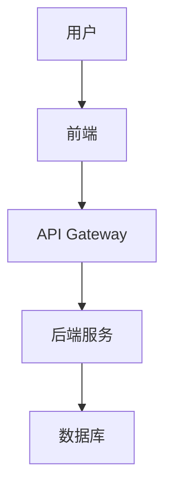
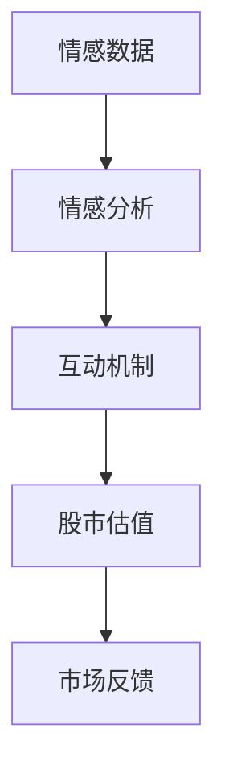

                 


```markdown
# 新兴市场股市估值与智慧校园情感计算应用的互动

> 关键词：新兴市场、股市估值、智慧校园、情感计算、互动机制、数据驱动

> 摘要：本文探讨新兴市场股市估值与智慧校园情感计算应用之间的互动关系。通过分析情感计算在智慧校园中的应用场景，结合股市估值的核心原理，构建互动机制模型，提出情感数据对股市估值的潜在影响。文章从背景介绍、核心概念、算法原理、数学模型、系统架构、项目实战等多个维度展开，结合具体案例和代码实现，详细阐述两者的互动机制与应用实践。

---

# 第一部分: 背景与核心概念

## 第1章: 新兴市场股市估值的背景与核心概念

### 1.1 问题背景与问题描述
#### 1.1.1 新兴市场的定义与特点
新兴市场是指那些经济快速增长、但尚未完全 industrialized 的国家或地区的金融市场。这些市场通常具有较高的波动性和不稳定性，但也伴随着高增长的潜力。

#### 1.1.2 股市估值的核心问题
股市估值的核心问题是如何准确评估上市公司的内在价值。这需要结合财务数据、市场情绪、宏观经济指标等多种因素进行综合分析。

#### 1.1.3 新兴市场股市估值的特殊性
新兴市场的股市估值具有以下特殊性：
1. 市场流动性较低，价格波动较大。
2. 企业财务数据不透明，难以准确评估。
3. 宏观经济环境不稳定，影响股市估值。

### 1.2 核心概念与边界
#### 1.2.1 股市估值的基本原理
股市估值的基本原理是通过分析企业的财务状况、行业地位、市场前景等因素，确定其股票的合理价格。

#### 1.2.2 新兴市场的独特性
新兴市场与成熟市场相比，具有以下独特性：
1. 市场参与者较少，信息不对称严重。
2. 宏观经济波动对股市影响较大。
3. 企业成长性强，但风险也较高。

#### 1.2.3 估值方法的边界与外延
估值方法的边界包括：
1. 数据的可获得性。
2. 市场的波动性。
3. 宏观经济环境的影响。

## 第2章: 智慧校园情感计算的核心概念

### 2.1 情感计算的定义与特点
#### 2.1.1 情感计算的定义
情感计算（Affective Computing）是通过计算机技术来识别、理解和响应人类情感的过程。它涉及自然语言处理、计算机视觉、机器学习等多种技术。

#### 2.1.2 情感计算的核心要素
1. 数据采集：通过文本、语音、图像等方式获取情感数据。
2. 数据分析：使用机器学习算法对情感数据进行分类和预测。
3. 应用场景：在教育、医疗、娱乐等领域进行情感分析和情感反馈。

#### 2.1.3 情感计算与传统计算的区别
情感计算注重情感信息的处理，传统计算注重逻辑信息的处理。

### 2.2 智慧校园中的情感计算应用
#### 2.2.1 智慧校园的定义
智慧校园是指通过互联网、物联网、大数据等技术，实现校园管理、教学、科研等各个环节的智能化。

#### 2.2.2 情感计算在智慧校园中的应用场景
1. 学生情绪监测：通过分析学生的文本、语音、行为数据，监测学生的情绪状态。
2. 教师情感反馈：通过情感计算技术，为教师提供学生对课程的反馈。
3. 校园氛围优化：通过情感数据分析，优化校园环境和氛围。

#### 2.2.3 情感计算与智慧校园的互动机制
1. 情感数据的采集与分析。
2. 情感数据对校园管理的反馈作用。
3. 情感数据对教育决策的支持。

## 第3章: 互动机制与核心要素

### 3.1 股市估值与情感计算的互动关系
#### 3.1.1 情感数据对股市估值的影响
情感数据可以通过分析投资者的情绪，预测股市的波动。

#### 3.1.2 股市数据对情感计算的反馈作用
股市数据可以通过分析市场的波动，为情感计算提供反馈。

#### 3.1.3 互动机制的核心模型
1. 情感数据采集：通过社交媒体、新闻等获取投资者情绪。
2. 情感数据分析：使用机器学习算法对情感数据进行分类和预测。
3. 股市数据采集：通过股票市场数据接口获取股市数据。
4. 股市数据分析：使用时间序列分析、回归分析等方法对股市数据进行分析。
5. 互动机制：通过情感数据预测股市波动，通过股市数据优化情感计算模型。

### 3.2 核心要素对比分析
#### 3.2.1 情感计算的核心要素对比表
| 要素 | 情感计算 |
|------|----------|
| 数据源 | 文本、语音、图像 |
| 算法 | 机器学习、深度学习 |
| 应用场景 | 教育、医疗、娱乐 |

#### 3.2.2 股市估值的核心要素对比表
| 要素 | 股市估值 |
|------|----------|
| 数据源 | 财务数据、宏观经济数据、市场数据 |
| 算法 | 时间序列分析、回归分析、ARIMA |
| 应用场景 | 投资决策、风险管理、市场研究 |

#### 3.2.3 互动机制中的关键变量分析
1. 情感强度：通过分析社交媒体上的文本，计算投资者的情绪强度。
2. 市场波动：通过分析股市数据，计算市场的波动性。
3. 时间因素：通过时间序列分析，预测未来市场的波动。

---

# 第二部分: 技术方法与数学模型

## 第4章: 情感计算的算法原理

### 4.1 情感分析的基本原理
#### 4.1.1 基于规则的情感分析
基于规则的情感分析是通过预定义的规则和词典，对文本进行情感分类。

#### 4.1.2 基于机器学习的情感分析
基于机器学习的情感分析是通过训练数据，学习情感分类的特征，然后进行预测。

#### 4.1.3 基于深度学习的情感分析
基于深度学习的情感分析是通过神经网络模型，如LSTM、BERT等，进行情感分类。

### 4.2 情感计算的数学模型
#### 4.2.1 情感强度计算公式
$$ \text{情感强度} = \sum_{i=1}^{n} w_i \cdot s_i $$

其中，$w_i$ 是第i个情感词的权重，$s_i$ 是第i个情感词的情感值。

#### 4.2.2 情感分类模型
$$ P(y|x) = \frac{P(x|y)P(y)}{P(x)} $$

其中，$P(y|x)$ 是条件概率，表示在给定x的情况下，y发生的概率。

---

## 第5章: 股市估值的数学模型与算法

### 5.1 股市估值的核心算法
#### 5.1.1 时间序列分析
时间序列分析是通过分析股票价格的历史数据，预测未来的股票价格。

#### 5.1.2 回归分析
回归分析是通过分析股票价格与影响因素之间的关系，预测未来的股票价格。

#### 5.1.3 ARIMA模型
ARIMA模型是一种常用的时间序列预测模型。

### 5.2 股市估值的数学模型
#### 5.2.1 ARIMA模型公式
$$ ARIMA(p, d, q) $$

其中，p是自回归阶数，d是差分阶数，q是移动平均阶数。

#### 5.2.2 回归分析公式
$$ y = \beta_0 + \beta_1 x_1 + \beta_2 x_2 + \ldots + \beta_n x_n + \epsilon $$

其中，$y$ 是因变量，$x_i$ 是自变量，$\beta_i$ 是回归系数，$\epsilon$ 是误差项。

---

## 第6章: 互动机制的数学模型与算法

### 6.1 情感数据与股市数据的融合
#### 6.1.1 情感数据的预处理
对社交媒体上的文本数据进行清洗、分词、情感分类等预处理。

#### 6.1.2 股市数据的预处理
对股票价格数据进行清洗、标准化、滑动窗口分割等预处理。

### 6.2 情感数据与股市数据的互动模型
#### 6.2.1 情感强度与市场波动的关系
$$ \text{市场波动} = \alpha \cdot \text{情感强度} + \beta \cdot \text{宏观经济指标} + \gamma \cdot \text{行业因素} + \epsilon $$

其中，$\alpha$、$\beta$、$\gamma$ 是回归系数，$\epsilon$ 是误差项。

#### 6.2.2 股市数据对情感计算的反馈模型
$$ \text{情感计算模型优化} = \theta \cdot \text{市场反馈} + (1 - \theta) \cdot \text{原始模型} $$

其中，$\theta$ 是反馈权重。

---

# 第三部分: 系统分析与架构设计方案

## 第7章: 智慧校园情感计算系统架构设计

### 7.1 问题场景介绍
智慧校园情感计算系统的目标是通过情感计算技术，优化校园管理、教学、科研等环节。

### 7.2 系统功能设计
#### 7.2.1 数据采集模块
- 文本数据采集：从社交媒体、论坛等获取文本数据。
- 语音数据采集：通过语音识别技术获取语音数据。
- 图像数据采集：通过图像识别技术获取图像数据。

#### 7.2.2 数据分析模块
- 情感分析：对采集到的数据进行情感分类。
- 数据挖掘：通过数据挖掘技术发现数据中的规律。

#### 7.2.3 数据存储模块
- 数据库设计：设计关系型数据库存储情感数据和股市数据。
- 数据存储优化：通过索引优化、分库分表等技术优化数据存储。

#### 7.2.4 系统接口设计
- API接口设计：设计RESTful API接口，方便其他系统调用。
- 接口安全设计：通过HTTPS、JWT等技术保证接口安全。

#### 7.2.5 系统交互设计
- 用户界面设计：设计直观的用户界面，方便用户使用。
- 系统反馈设计：通过图形化界面展示情感计算结果和股市估值结果。

### 7.3 系统架构设计
#### 7.3.1 系统架构图


#### 7.3.2 系统模块设计
- 用户模块：负责用户身份认证和权限管理。
- 数据采集模块：负责数据的采集和预处理。
- 数据分析模块：负责情感分析和数据挖掘。
- 数据存储模块：负责数据的存储和管理。
- 系统接口模块：负责系统与其他系统的交互。

## 第8章: 互动机制的系统架构设计

### 8.1 互动机制的场景描述
互动机制的场景是通过情感计算技术，优化股市估值模型。

### 8.2 系统功能设计
#### 8.2.1 情感数据采集模块
- 从社交媒体、新闻网站等获取文本数据。
- 使用自然语言处理技术进行文本分析。

#### 8.2.2 股市数据采集模块
- 从股票市场数据接口获取股票价格数据。
- 使用时间序列分析技术进行数据分析。

#### 8.2.3 互动机制模块
- 使用回归分析技术，建立情感强度与市场波动的关系模型。
- 使用反馈机制，优化情感计算模型。

### 8.3 系统架构设计
#### 8.3.1 系统架构图


#### 8.3.2 系统模块设计
- 情感数据采集模块：负责情感数据的采集和预处理。
- 股市数据采集模块：负责股市数据的采集和预处理。
- 互动机制模块：负责情感数据与股市数据的互动分析。
- 市场反馈模块：负责市场反馈数据的采集和分析。

---

# 第四部分: 项目实战

## 第9章: 互动机制的项目实战

### 9.1 环境安装与配置
#### 9.1.1 系统环境
- 操作系统：Linux/Windows/MacOS
- 开发工具：PyCharm/VS Code
- 依赖管理工具：pip

#### 9.1.2 项目依赖
- Python版本：3.8+
- 依赖库：numpy, pandas, scikit-learn, tensorflow, pymongo

### 9.2 核心代码实现

#### 9.2.1 情感数据采集模块
```python
import requests
from bs4 import BeautifulSoup

def get_stock_news():
    url = "https://www.stocknews.com"
    response = requests.get(url)
    soup = BeautifulSoup(response.text, 'html.parser')
    news_list = soup.find_all('div', class_='news-item')
    return news_list
```

#### 9.2.2 情感分析模块
```python
from textblob import TextBlob

def analyze_sentiment(text):
    blob = TextBlob(text)
    return blob.sentiment.polarity
```

#### 9.2.3 股市估值模块
```python
from statsmodels.tsa.arima_model import ARIMA

def predict_stock_price(prices, order):
    model = ARIMA(prices, order=order)
    model_fit = model.fit(disp=0)
    forecast = model_fit.forecast(steps=1)
    return forecast[0][0]
```

#### 9.2.4 互动机制模块
```python
import pandas as pd
import numpy as np

def interact_sentiment(prices, news_sentiment):
    # 计算市场波动
    market_volatility = np.std(prices)
    # 计算情感强度
    sentiment_strength = np.mean(abs(news_sentiment))
    # 建立回归模型
    X = np.array([market_volatility, sentiment_strength]).reshape(-1, 2)
    y = np.array(prices)
    from sklearn.linear_model import LinearRegression
    model = LinearRegression()
    model.fit(X, y)
    return model.predict(X)
```

### 9.3 代码应用解读与分析
#### 9.3.1 情感数据采集模块
上述代码通过爬取新闻网站，获取股票新闻数据。

#### 9.3.2 情感分析模块
上述代码使用TextBlob库，对文本进行情感分析，返回情感极性值。

#### 9.3.3 股市估值模块
上述代码使用ARIMA模型，对股票价格进行预测。

#### 9.3.4 互动机制模块
上述代码通过回归分析，建立情感强度与市场波动的关系模型，预测股票价格。

### 9.4 实际案例分析
#### 9.4.1 数据来源
- 情感数据：从社交媒体获取股票相关文本。
- 股市数据：从股票市场数据接口获取股票价格。

#### 9.4.2 数据分析
- 对情感数据进行分类，计算情感强度。
- 对股市数据进行时间序列分析，预测股票价格。
- 建立回归模型，分析情感强度与市场波动的关系。

### 9.5 项目小结
通过项目实战，我们可以看到情感数据对股市估值的潜在影响。情感计算技术可以为股市估值提供新的视角和方法。

---

# 第五部分: 总结与展望

## 第10章: 总结与展望

### 10.1 全文总结
本文探讨了新兴市场股市估值与智慧校园情感计算应用的互动关系。通过分析情感计算在智慧校园中的应用场景，结合股市估值的核心原理，构建了互动机制模型，提出了情感数据对股市估值的潜在影响。

### 10.2 未来展望
未来的研究方向包括：
1. 情感计算技术的进一步优化。
2. 互动机制的进一步完善。
3. 新兴市场股市估值的进一步研究。

### 10.3 最佳实践 tips
1. 情感计算技术的应用需要结合具体场景。
2. 股市估值需要结合多维度数据进行分析。
3. 互动机制需要不断优化和调整。

### 10.4 小结
通过本文的研究，我们可以看到情感计算技术在股市估值中的潜在应用价值。未来的研究将更加关注如何通过技术手段，实现情感数据与股市数据的深度融合。

---

# 作者：AI天才研究院/AI Genius Institute & 禅与计算机程序设计艺术 /Zen And The Art of Computer Programming
```

