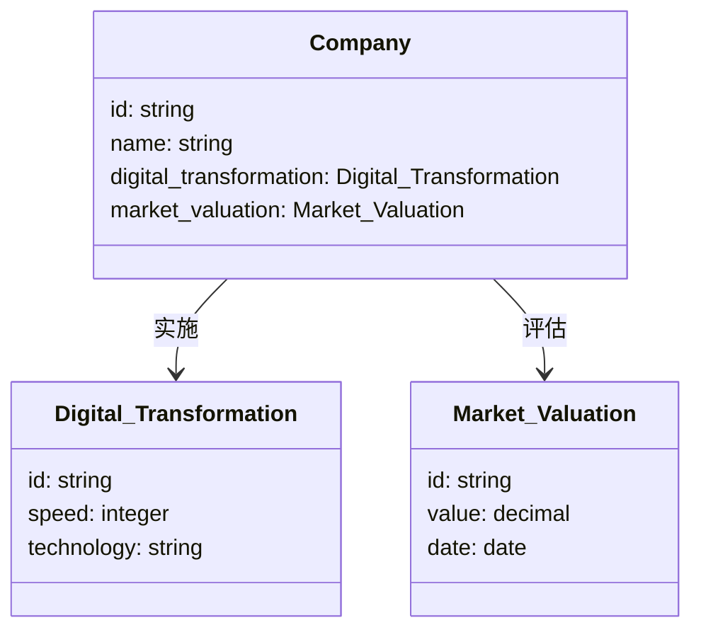

                 


# 股市估值高低对企业数字化转型速度的影响

> 关键词：股市估值，数字化转型，企业价值，投资者信心，技术投资

> 摘要：本文探讨了股市估值的高低对企业数字化转型速度的影响。通过分析股市估值与企业数字化转型之间的关系，提出了一个数学模型，并通过实际案例和项目实战，展示了如何利用这些模型和方法来优化企业的数字化转型过程。文章还总结了最佳实践和注意事项，为企业的数字化转型提供了有价值的参考。

---

# 第一部分: 背景介绍

## 第1章: 数字化转型的背景与挑战

### 1.1 数字化转型的定义与内涵

#### 1.1.1 数字化转型的定义
数字化转型是指企业通过采用新兴技术（如人工智能、大数据、云计算等）来改变其业务模式、流程、文化、 governance 和思维方式，以实现更高效、更具创新性的业务成果。

#### 1.1.2 数字化转型的核心要素
- **技术驱动**：包括大数据、人工智能、区块链、物联网等技术的运用。
- **业务模式创新**：通过数字化手段优化或重构业务流程。
- **组织文化变革**：推动组织文化从传统模式向数字化模式转变。
- **数据驱动决策**：利用数据进行实时分析和决策。

#### 1.1.3 数字化转型对企业的影响
- 提高效率和生产力。
- 降低成本。
- 提升客户体验。
- 开拓新的市场机会。
- 增强企业的竞争力。

### 1.2 股市估值的基本概念

#### 1.2.1 股市估值的定义
股市估值是指通过对企业的财务状况、市场地位、盈利能力等多方面进行评估，确定企业在股市中的价值。

#### 1.2.2 股市估值的主要指标
- 市盈率（P/E）：股价与每股收益的比率。
- 市净率（P/B）：股价与每股净资产的比率。
- 企业价值（EV）：企业整体价值的评估指标。
- 股息率：股息与股价的比率。

#### 1.2.3 股市估值与企业价值的关系
股市估值是市场对企业价值的反映，高估值意味着市场对企业未来盈利能力的看好，低估值则可能意味着市场对企业前景的担忧。

### 1.3 数字化转型与股市估值的关系

#### 1.3.1 数字化转型对企业价值的影响
- 提升企业效率和生产力，增强盈利能力。
- 通过技术创新，开拓新的市场和客户群体。
- 优化业务流程，降低运营成本。

#### 1.3.2 股市估值对企业数字化转型的反馈作用
- 高估值企业有更多的资金进行数字化投资。
- 低估值企业可能面临资金短缺，影响数字化转型的速度和规模。

#### 1.3.3 两者的相互作用机制
- 数字化转型通过提升企业价值，间接提高股市估值。
- 股市估值的高低影响企业的资金投入，进而影响数字化转型的速度。

## 第2章: 核心概念与联系

### 2.1 核心概念的原理

#### 2.1.1 数字化转型的驱动因素
- 技术进步：人工智能、大数据等技术的发展为企业数字化转型提供了技术支持。
- 市场需求：客户对数字化服务的需求增加，推动企业进行数字化转型。
- 竞争压力：竞争对手的数字化转型迫使企业加快步伐。

#### 2.1.2 股市估值的决定因素
- 企业盈利能力：净利润率、ROE等指标。
- 财务状况：资产负债率、现金流等指标。
- 市场前景：行业发展趋势、市场需求等。

#### 2.1.3 两者关系的数学模型
- 数字化转型速度与股市估值呈正相关关系。
- 股市估值通过影响企业的资金和资源分配，间接影响数字化转型的速度。

### 2.2 核心概念的对比分析

#### 2.2.1 数字化转型与传统转型的对比
| 方面       | 数字化转型                   | 传统转型                     |
|------------|------------------------------|-------------------------------|
| 技术依赖    | 高                          | 低                          |
| 速度        | 快                          | 较慢                         |
| 成本        | 中等                        | 较高                         |
| 效益        | 高                          | 中等                        |

#### 2.2.2 股市估值与传统估值的对比
| 方面       | 股市估值                   | 传统估值                     |
|------------|------------------------------|-------------------------------|
| 考虑因素    | 市场预期、技术创新          | 财务状况、历史业绩            |
| 反应速度    | 快                          | 较慢                         |
| 稳定性      | 较不稳定                   | 较稳定                      |

#### 2.2.3 数字化转型对股市估值的特殊影响
- 数字化转型能够提升企业的未来盈利能力，从而提高股市估值。
- 投资者对数字化转型的预期也会影响股市估值。

### 2.3 实体关系图（ER图）

```mermaid
erDiagram
    customer[投资者] {
        id: string
        name: string
        investment: decimal
    }
    company[企业] {
        id: string
        name: string
        digital_transformation_speed: integer
        market_value: decimal
    }
    digital_transition[数字化转型] {
        id: string
        speed: integer
        technology: string
    }
    valuation[股市估值] {
        id: string
        value: decimal
        date: date
    }
    customer --> valuation: 投资
    company --> digital_transition: 实施
    digital_transition --> valuation: 影响
    company --> valuation: 评估
```

---

# 第3章: 数学模型与算法原理

## 3.1 数学模型的建立

### 3.1.1 数字化转型速度的量化
将数字化转型速度量化为一个指标，例如通过企业的技术投资比例、数字化项目完成率等来衡量。

### 3.1.2 股市估值的量化
使用市盈率（P/E）作为股市估值的指标。

### 3.1.3 两者关系的回归模型
建立一个回归模型，将数字化转型速度作为因变量，股市估值作为自变量。

$$
y = \beta_0 + \beta_1 x + \epsilon
$$
其中：
- \( y \) 是数字化转型速度
- \( x \) 是股市估值
- \( \beta_0 \) 是截距
- \( \beta_1 \) 是斜率
- \( \epsilon \) 是误差项

---

## 3.2 算法原理

### 3.2.1 回归分析的原理
回归分析是一种统计学方法，用于研究变量之间的关系。通过最小二乘法，找到最佳拟合直线，预测因变量的变化趋势。

### 3.2.2 时间序列分析的原理
时间序列分析用于研究数据随时间的变化趋势，适用于分析股市估值和数字化转型速度的动态关系。

### 3.2.3 聚类分析的原理
聚类分析将企业按照数字化转型速度和股市估值进行分组，识别不同类型的企业的特征。

---

## 3.3 算法实现

### 3.3.1 回归分析的Python代码实现

```python
import pandas as pd
import numpy as np
import statsmodels.api as sm

# 假设我们有以下数据
data = {
    'digital_speed': [80, 70, 60, 90, 80],
    'market_valuation': [25, 20, 18, 30, 25]
}

df = pd.DataFrame(data)

# 增加常数项
df['intercept'] = 1

# 回归分析
model = sm.OLS(df['digital_speed'], df[['intercept', 'market_valuation']])
results = model.fit()

print(results.summary())
```

### 3.3.2 时间序列分析的Python代码实现

```python
import pandas as pd
import numpy as np
import matplotlib.pyplot as plt
from statsmodels.tsa.arima_model import ARIMA

# 假设我们有以下时间序列数据
data = {
    'year': [2018, 2019, 2020, 2021, 2022],
    'digital_speed': [60, 70, 80, 90, 100]
}

df = pd.DataFrame(data)

# 建立ARIMA模型
model = ARIMA(df['digital_speed'], order=(1, 0, 0))
model_fit = model.fit()

# 预测未来一年的数字化转型速度
forecast = model_fit.forecast(steps=1)
print(forecast)
```

### 3.3.3 聚类分析的Python代码实现

```python
import pandas as pd
import numpy as np
from sklearn.cluster import KMeans

# 假设我们有以下数据
data = {
    'digital_speed': [80, 70, 60, 90, 80],
    'market_valuation': [25, 20, 18, 30, 25]
}

df = pd.DataFrame(data)

# 聚类分析
kmeans = KMeans(n_clusters=2)
clusters = kmeans.fit_predict(df)

print(clusters)
```

---

# 第4章: 系统分析与架构设计

## 4.1 问题场景介绍

### 4.1.1 数字化转型中的问题场景
企业希望通过数字化转型提升竞争力，但由于资金不足或市场预期不明确，转型速度受到影响。

### 4.1.2 股市估值中的问题场景
高估值可能导致市场过度乐观，而低估值可能导致投资者信心不足。

### 4.1.3 两者结合的综合问题场景
企业的数字化转型速度受到股市估值的双重影响，如何优化这一过程是一个复杂的系统性问题。

## 4.2 系统功能设计

### 4.2.1 领域模型（Mermaid类图）



### 4.2.2 系统架构设计（Mermaid架构图）

```mermaid
client
    service -- HTTP
server
    database -- SQL
```

---

# 第5章: 项目实战

## 5.1 环境安装

### 5.1.1 安装Python
```bash
python --version
pip install --upgrade pip
```

### 5.1.2 安装相关库
```bash
pip install pandas numpy statsmodels scikit-learn
```

## 5.2 系统核心实现源代码

### 5.2.1 数字化转型速度预测

```python
import pandas as pd
import numpy as np
from sklearn.linear_model import LinearRegression

# 数据准备
data = {
    'market_valuation': [25, 20, 18, 30, 25],
    'digital_speed': [80, 70, 60, 90, 80]
}

df = pd.DataFrame(data)

# 训练模型
model = LinearRegression()
model.fit(df[['market_valuation']], df['digital_speed'])

# 预测
new_valuation = np.array([[22]])
predicted_speed = model.predict(new_valuation)
print(predicted_speed)
```

### 5.2.2 股市估值预测

```python
import pandas as pd
from statsmodels.tsa.arima_model import ARIMA

# 数据准备
data = {
    'year': [2018, 2019, 2020, 2021, 2022],
    'market_valuation': [25, 20, 18, 30, 25]
}

df = pd.DataFrame(data)

# 建立ARIMA模型
model = ARIMA(df['market_valuation'], order=(1, 0, 0))
model_fit = model.fit()

# 预测
forecast = model_fit.forecast(steps=1)
print(forecast)
```

---

# 第6章: 最佳实践、小结、注意事项、扩展阅读

## 6.1 最佳实践

### 6.1.1 保持技术领先
企业应持续关注技术进步，及时引入新技术，保持竞争优势。

### 6.1.2 优化资金配置
合理分配资金，确保数字化转型和股市估值之间的平衡。

### 6.1.3 加强投资者沟通
通过透明的沟通，增强投资者信心，提升股市估值。

## 6.2 小结
本文通过分析股市估值与企业数字化转型之间的关系，提出了一个数学模型，并通过实际案例展示了如何利用这些模型和方法来优化企业的数字化转型过程。

## 6.3 注意事项

- 数字化转型需要长期投入，不可急于求成。
- 股市估值受多种因素影响，需综合考虑。
- 技术创新与企业战略需紧密结合。

## 6.4 扩展阅读
- 《企业数字化转型的策略与实践》
- 《股市估值分析与投资策略》
- 《大数据与人工智能在金融领域的应用》

---

# 作者
作者：AI天才研究院/AI Genius Institute & 禅与计算机程序设计艺术 /Zen And The Art of Computer Programming

---

本文通过系统的分析和详细的案例，探讨了股市估值高低对企业数字化转型速度的影响，并提出了相关的数学模型和算法。希望本文能为企业在数字化转型过程中提供有价值的参考和指导。

