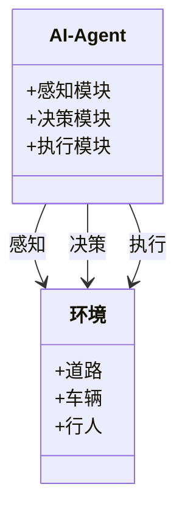
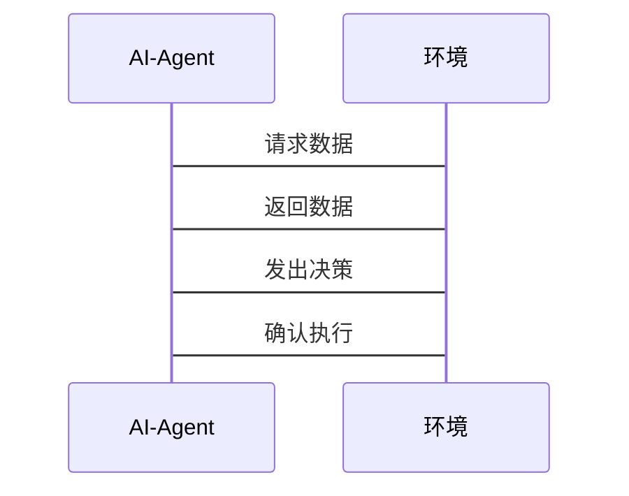

                 


# AI Agent在智能交通事故预防中的实践

## 关键词：AI Agent, 智能交通, 交通事故预防, 强化学习, 系统架构

## 摘要：AI Agent通过感知、决策和执行三大部分，在智能交通系统中预防交通事故。本文深入分析了AI Agent的核心概念、算法原理、系统架构，并通过实战案例和最佳实践提供全面的解决方案。

---

# 第1章: AI Agent与智能交通事故预防的背景介绍

## 1.1 AI Agent的基本概念

### 1.1.1 AI Agent的定义
AI Agent是一种智能体，能够感知环境、自主决策并执行操作，以实现特定目标。它具备感知、推理、规划和学习能力，广泛应用于自动驾驶、交通管理等领域。

### 1.1.2 AI Agent的核心特征
- **自主性**：无需外部干预，自主完成任务。
- **反应性**：实时感知环境变化并做出反应。
- **目标导向**：基于目标优化行为。

### 1.1.3 AI Agent在智能系统中的作用
AI Agent作为智能系统的核心，负责处理复杂环境中的决策和执行，提升系统的智能化水平。

## 1.2 智能交通事故预防的现状

### 1.2.1 当前交通事故的主要问题
- **人为错误**：驾驶员疲劳、酒驾等。
- **交通拥堵**：影响通行效率。
- **复杂环境**：恶劣天气、道路状况不佳。

### 1.2.2 AI技术在交通事故预防中的潜力
AI技术通过实时数据分析和预测，辅助驾驶员或自动驾驶系统做出决策，降低事故发生率。

### 1.2.3 AI Agent在交通事故预防中的独特优势
AI Agent具备实时感知、快速决策和高效执行的能力，能够在复杂环境中预防交通事故。

## 1.3 AI Agent在交通事故预防中的应用前景

### 1.3.1 AI Agent在自动驾驶中的角色
AI Agent作为自动驾驶的核心，负责车辆的感知、决策和控制。

### 1.3.2 AI Agent在智能交通管理中的作用
通过优化交通流量和信号控制，减少交通事故的发生。

### 1.3.3 AI Agent在交通事故预防中的未来发展方向
结合5G、边缘计算等技术，提升AI Agent的实时性和准确性。

## 1.4 本章小结
本章介绍了AI Agent的基本概念、交通事故预防的现状及AI Agent的应用前景，为后续章节奠定基础。

---

# 第2章: AI Agent的核心概念与技术原理

## 2.1 AI Agent的感知与决策机制

### 2.1.1 感知模块的核心原理
感知模块通过传感器（如摄像头、激光雷达）收集环境数据，识别障碍物、行人等。

### 2.1.2 决策模块的逻辑架构
基于感知数据，决策模块通过算法（如强化学习）制定最优行驶策略。

### 2.1.3 执行模块的实现方式
执行模块根据决策结果，控制车辆动作（如转向、加速）。

## 2.2 AI Agent的多目标优化算法

### 2.2.1 多目标优化的基本概念
多目标优化在AI Agent中用于平衡多个目标（如安全性、效率）。

### 2.2.2 基于强化学习的多目标优化算法
通过强化学习，AI Agent在复杂环境中学习最优策略。

### 2.2.3 基于遗传算法的多目标优化方法
遗传算法模拟自然选择，优化AI Agent的行为。

## 2.3 AI Agent的实时性与可靠性分析

### 2.3.1 AI Agent的实时性要求
AI Agent需要实时处理数据，快速做出决策。

### 2.3.2 AI Agent的可靠性保障措施
通过冗余设计和容错机制，提升系统的可靠性。

### 2.3.3 AI Agent在复杂环境中的适应性
AI Agent通过自适应学习，增强在复杂环境中的适应能力。

## 2.4 本章小结
本章详细讲解了AI Agent的核心概念与技术原理，为后续章节的应用奠定基础。

---

# 第3章: AI Agent在交通事故预防中的算法与数学模型

## 3.1 强化学习算法在AI Agent中的应用

### 3.1.1 强化学习的基本原理
强化学习通过奖励机制，训练AI Agent做出最优决策。

### 3.1.2 基于DQN算法的AI Agent实现
DQN算法结合深度神经网络，提升AI Agent的学习能力。

### 3.1.3 强化学习在交通场景中的应用案例
通过模拟训练，AI Agent在复杂交通环境中做出正确决策。

## 3.2 监督学习在AI Agent中的应用

### 3.2.1 监督学习的基本原理
监督学习通过标注数据，训练AI Agent识别模式。

### 3.2.2 基于CNN的交通场景识别
使用卷积神经网络，AI Agent能够识别交通标志和障碍物。

### 3.2.3 监督学习在事故预防中的应用
通过监督学习，AI Agent能够预测潜在的危险情况。

## 3.3 算法的数学模型与公式

### 3.3.1 强化学习的Q-learning算法
$$ Q(s,a) = Q(s,a) + \alpha (r + \gamma \max Q(s',a') - Q(s,a)) $$

### 3.3.2 监督学习的损失函数
$$ \text{Loss} = \frac{1}{n}\sum_{i=1}^{n} (y_i - \hat{y}_i)^2 $$

## 3.4 本章小结
本章详细讲解了强化学习和监督学习在AI Agent中的应用，并通过数学模型展示了算法的实现。

---

# 第4章: AI Agent的系统架构与设计

## 4.1 交通事故预防的场景介绍

### 4.1.1 城市道路场景
AI Agent在城市道路中识别行人、车辆，避免碰撞。

### 4.1.2 高速公路场景
AI Agent在高速公路上保持车道，避免追尾。

### 4.1.3 复杂交通场景
AI Agent在复杂交通环境中做出决策，确保安全。

## 4.2 系统功能设计

### 4.2.1 领域模型设计
使用Mermaid类图展示系统的功能模块。



### 4.2.2 系统架构设计
使用Mermaid架构图展示系统的整体架构。


## 4.3 系统接口设计

### 4.3.1 接口定义
- 数据采集接口：接收传感器数据。
- 决策接口：输出驾驶指令。
- 执行接口：控制车辆动作。

### 4.3.2 接口交互流程
使用Mermaid序列图展示接口交互流程。



## 4.4 本章小结
本章详细讲解了AI Agent的系统架构与设计，并通过Mermaid图展示了系统的实现。

---

# 第5章: AI Agent的项目实战

## 5.1 项目环境安装

### 5.1.1 安装Python
安装Python 3.8及以上版本。

### 5.1.2 安装依赖库
安装numpy、pandas、tensorflow等库。

## 5.2 核心代码实现

### 5.2.1 感知模块实现
使用OpenCV进行图像处理。

```python
import cv2
def detect_obstacle(image):
    # 图像处理代码
    return obstacles
```

### 5.2.2 决策模块实现
基于强化学习的决策算法。

```python
import numpy as np
def decide_action(state, model):
    return model.predict(state)
```

### 5.2.3 执行模块实现
控制车辆动作。

```python
def execute_action(action):
    # 控制车辆代码
    pass
```

## 5.3 案例分析与解读

### 5.3.1 案例场景
城市道路中的车辆识别与避让。

### 5.3.2 实际案例分析
通过具体案例，展示AI Agent在交通事故预防中的应用。

## 5.4 本章小结
本章通过实战项目，详细讲解了AI Agent的实现过程，并展示了其在交通事故预防中的实际应用。

---

# 第6章: AI Agent的最佳实践与注意事项

## 6.1 最佳实践

### 6.1.1 数据质量
确保数据的多样性和代表性。

### 6.1.2 算法选择
根据场景选择合适的算法。

### 6.1.3 系统优化
优化系统的实时性和可靠性。

## 6.2 小结

## 6.3 注意事项

### 6.3.1 数据隐私
保护用户数据隐私。

### 6.3.2 系统安全
确保系统的安全性，防止攻击。

### 6.3.3 法律法规
遵守相关法律法规，确保合规性。

## 6.4 拓展阅读
推荐相关书籍和论文，供读者深入学习。

---

# 附录

## 附录A: 参考文献

## 附录B: 工具与资源

---

通过以上结构，您可以撰写一篇详细且专业的技术博客文章，涵盖AI Agent在智能交通事故预防中的各个方面。

