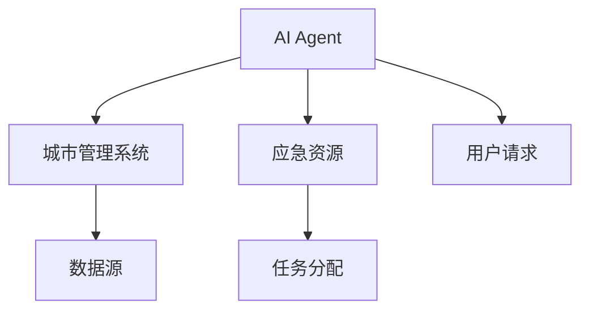
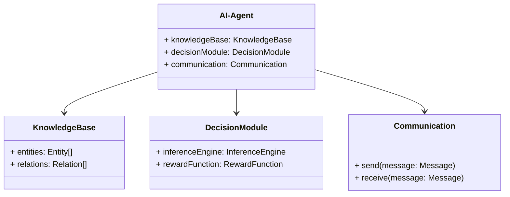
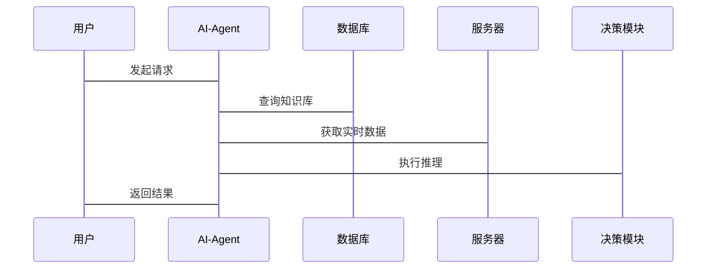

                 


# AI Agent在智能城市应急响应中的角色

> 关键词：AI Agent、智能城市、应急响应、算法、系统架构、多智能体协作

> 摘要：本文深入探讨了AI Agent在智能城市应急响应中的核心作用，从背景、概念、算法原理到系统设计、项目实战，全面剖析了AI Agent如何优化应急响应流程，提升城市安全管理水平。通过详细的技术分析和实际案例，本文为智能城市应急响应的未来发展提供了新的思路。

---

## 第一部分: AI Agent与智能城市应急响应的背景介绍

### 第1章: AI Agent与智能城市的概述

#### 1.1 AI Agent的基本概念
##### 1.1.1 AI Agent的定义与特点
AI Agent（人工智能代理）是指能够感知环境、自主决策并执行任务的智能实体。其特点包括：
- **自主性**：能够在无外部干预的情况下独立运行。
- **反应性**：能够实时感知环境并做出响应。
- **社会性**：能够与其他Agent或人类进行协作或竞争。
- **学习能力**：通过数据和经验不断优化自身行为。

##### 1.1.2 AI Agent的核心要素与功能
AI Agent的功能模块通常包括：
- **感知模块**：通过传感器、数据源获取环境信息。
- **推理模块**：基于知识库进行逻辑推理。
- **决策模块**：基于推理结果制定行动计划。
- **执行模块**：将决策转化为具体操作。

##### 1.1.3 AI Agent在智能城市中的应用背景
智能城市的核心目标是通过技术创新提升城市管理效率，优化资源配置。AI Agent作为智能城市的重要组成部分，能够实时处理城市中的复杂问题，如交通调度、应急响应等。

---

#### 1.2 智能城市应急响应的现状与挑战
##### 1.2.1 智能城市的定义与目标
智能城市是通过物联网、大数据、人工智能等技术手段，实现城市资源优化配置和高效管理的城市形态。其目标包括：
- 提升城市运行效率
- 优化市民生活质量
- 增强城市抗风险能力

##### 1.2.2 应急响应的定义与关键问题
应急响应是指在突发事件（如自然灾害、交通事故等）发生时，城市管理部门迅速启动的救援和应对机制。关键问题包括：
- **响应速度慢**：传统的人工决策流程效率低下。
- **资源分配不均**：难以快速调配最优资源。
- **信息孤岛**：各部门之间数据不通，导致决策失误。

##### 1.2.3 当前应急响应中的痛点与不足
- **信息处理能力不足**：传统应急系统难以处理复杂场景。
- **资源协调困难**：各部门之间缺乏高效的协作机制。
- **决策不够智能**：依赖人工经验，缺乏数据支持。

---

#### 1.3 AI Agent在应急响应中的优势
##### 1.3.1 提高响应效率
AI Agent能够实时感知突发事件，快速分析并制定最优响应方案，大幅缩短应急响应时间。

##### 1.3.2 增强决策能力
通过大数据分析和知识推理，AI Agent能够提供更精准的决策支持，减少人为失误。

##### 1.3.3 实现资源优化配置
AI Agent能够根据实时数据动态调配资源，确保资源利用最大化，降低浪费。

---

### 第2章: AI Agent的核心概念与联系

#### 2.1 AI Agent的核心原理
##### 2.1.1 知识表示与推理
知识表示是AI Agent理解世界的基础，常见的表示方法包括：
- **语义网络**：通过节点和边表示概念及其关系。
- **逻辑推理**：基于逻辑规则进行推导。
- **概率推理**：基于概率模型进行不确定性推理。

##### 2.1.2 行为决策机制
行为决策是AI Agent的核心功能，常见的决策方法包括：
- **基于规则的决策**：根据预设规则进行判断。
- **基于模型的决策**：通过构建数学模型进行预测。
- **基于强化学习的决策**：通过试错优化决策策略。

##### 2.1.3 多智能体协作
在智能城市中，AI Agent通常需要与其他Agent或系统协作，共同完成任务。多智能体协作的核心机制包括：
- **通信协议**：定义Agent之间的交互规则。
- **任务分配**：根据Agent的能力分配任务。
- **协同推理**：通过信息共享提高整体决策能力。

---

#### 2.2 AI Agent与相关概念的对比
##### 2.2.1 AI Agent与传统自动化的区别
- **传统自动化**：基于预设规则执行任务，缺乏灵活性。
- **AI Agent**：能够自主决策，适应复杂环境。

##### 2.2.2 AI Agent与机器学习模型的联系
AI Agent通常结合机器学习模型进行决策优化，但两者有以下区别：
- **AI Agent**：具备自主性和目标导向性。
- **机器学习模型**：专注于数据模式识别。

##### 2.2.3 AI Agent与物联网（IoT）的结合
AI Agent可以通过物联网获取实时数据，实现更精准的决策。例如，在应急响应中，AI Agent可以通过IoT设备实时监测灾情，动态调整救援方案。

---

#### 2.3 AI Agent的实体关系架构


---

## 第二部分: AI Agent的算法原理与数学模型

### 第3章: AI Agent的核心算法原理

#### 3.1 基于强化学习的AI Agent算法
##### 3.1.1 强化学习的基本原理
强化学习是一种通过试错优化决策策略的算法。其核心机制包括：
- **状态（State）**：环境的当前情况。
- **动作（Action）**：Agent的行为选择。
- **奖励（Reward）**：对动作的评价。

##### 3.1.2 Q-learning算法的实现
Q-learning是一种常用的强化学习算法，其核心公式为：
$$ Q(s, a) = Q(s, a) + \alpha [r + V(s')] - Q(s, a) $$
其中，$\alpha$是学习率，$r$是奖励，$V(s')$是下一状态的值函数。

##### 3.1.3 Deep Q-Network (DQN) 的应用
DQN通过神经网络近似Q值函数，适用于复杂环境下的决策问题。

---

#### 3.2 基于知识图谱的推理算法
##### 3.2.1 知识图谱的构建与表示
知识图谱通过实体和关系构建语义网络，例如：
- 实体：地点、人员、资源。
- 关系：属于、位于、连接。

##### 3.2.2 基于RDF的推理规则
RDF（Resource Description Framework）通过三元组表示知识，推理规则可以通过SPARQL查询实现。

##### 3.2.3 图神经网络的应用
图神经网络能够处理图结构数据，适用于复杂关系推理。

---

#### 3.3 基于多智能体协作的算法
##### 3.3.1 多智能体系统的基本模型
多智能体系统通常包括：
- **通信协议**：定义Agent之间的交互规则。
- **任务分配**：根据Agent的能力分配任务。
- **协同推理**：通过信息共享提高整体决策能力。

##### 3.3.2 基于通信协议的协作机制
通信协议通常包括：
- **请求-响应**：Agent之间通过请求和响应实现协作。
- **订阅-发布**：Agent可以通过订阅主题接收信息。

##### 3.3.3 联合学习（Federated Learning）的应用
联合学习通过分布式数据训练模型，保护数据隐私的同时实现协作。

---

### 第4章: AI Agent的数学模型与公式

#### 4.1 强化学习的数学
- **Q值更新公式**：$$ Q(s, a) = Q(s, a) + \alpha (r + V(s') - Q(s, a)) $$
- **策略优化公式**：$$ \pi(a|s) = \arg\max_a Q(s, a) $$

#### 4.2 知识图谱的推理公式
- **SPARQL查询**：`SELECT * WHERE { ?x rdfs:label ?y }`
- **图神经网络公式**：$$ z = \sum_{i=1}^{n} w_{i}x_{i} $$

---

## 第三部分: AI Agent的系统分析与架构设计

### 第5章: AI Agent的系统分析

#### 5.1 应急响应场景介绍
智能城市应急响应场景包括：
- 火灾报警
- 交通事故处理
- 自然灾害应对

#### 5.2 系统功能设计
- **信息采集模块**：通过传感器和数据源获取实时信息。
- **决策支持模块**：基于AI算法提供决策建议。
- **任务分配模块**：动态调配资源。

---

### 第6章: AI Agent的架构设计方案

#### 6.1 领域模型（Mermaid类图）


#### 6.2 系统架构图（Mermaid架构图）


#### 6.3 接口设计
- **API接口**：提供RESTful API，支持HTTP请求。
- **消息队列**：通过Kafka实现异步通信。

#### 6.4 交互流程图（Mermaid序列图）


---

## 第四部分: AI Agent的项目实战

### 第7章: 项目实战

#### 7.1 环境搭建
- 安装Python和相关库（如TensorFlow、PyTorch）
- 安装依赖：pip install numpy、scikit-learn

#### 7.2 系统核心实现
```python
class AI-Agent:
    def __init__(self):
        self.knowledge_base = KnowledgeBase()
        self.decision_module = DecisionModule()
        self.communication = Communication()

    def process_request(self, request):
        # 获取知识库信息
        knowledge = self.knowledge_base.query(request)
        # 执行决策
        decision = self.decision_module.inference(knowledge)
        # 通信模块处理
        self.communication.send(decision)
        return decision
```

#### 7.3 代码应用解读
- **知识库查询**：通过自然语言处理技术解析请求，查询知识库。
- **决策推理**：基于强化学习算法优化决策。
- **通信模块**：通过消息队列实现异步通信。

#### 7.4 实际案例分析
- **案例1**：火灾报警
  - 请求：某地发生火灾。
  - 响应：AI Agent查询知识库，确定最优救援方案，动态调配消防资源。

#### 7.5 项目小结
通过本项目，我们可以看到AI Agent在智能城市应急响应中的巨大潜力。未来，随着技术的不断发展，AI Agent将在更多领域发挥重要作用。

---

## 第五部分: 最佳实践与未来展望

### 第8章: 最佳实践

#### 8.1 小结
AI Agent通过实时感知、自主决策和协作执行，显著提升了智能城市应急响应的效率和质量。

#### 8.2 注意事项
- **数据隐私**：确保数据的安全性和隐私性。
- **系统容错**：设计容错机制，避免单点故障。
- **持续优化**：定期更新知识库和算法模型。

#### 8.3 拓展阅读
- 推荐阅读《强化学习入门》、《知识图谱构建与应用》。

---

### 附录: 参考文献
- Russell, S., & Norvig, P. (2010). Artificial Intelligence: A Modern Approach.
- LeCun, Y., Bengio, Y., & Hinton, G. (2015). Deep learning. Nature, 521(7555), 436-444.

---

通过以上内容，我们全面分析了AI Agent在智能城市应急响应中的角色与作用，从理论到实践，从算法到架构，为未来的研究和应用提供了丰富的思路和参考。

