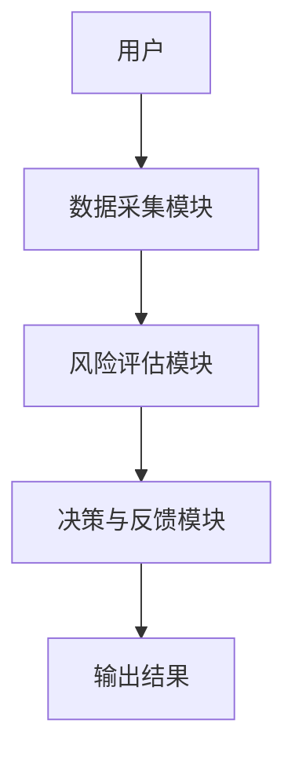
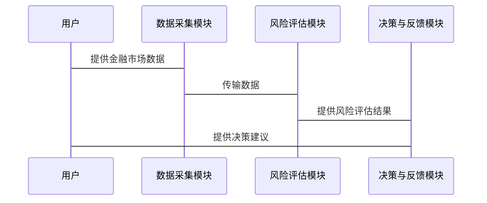

                 


# AI Agent在智能金融风险评估中的应用

## 关键词：AI Agent, 强化学习, 金融风险评估, 多智能体系统, DQN算法

## 摘要：本文深入探讨了AI Agent在智能金融风险评估中的应用，结合强化学习和多智能体系统，分析了其在金融风险评估中的优势，并通过实际案例展示了AI Agent的系统架构和实现过程，最后总结了最佳实践和未来发展方向。

---

## 第1章：AI Agent的基本概念与核心原理

### 1.1 AI Agent的定义与特点

**AI Agent**（人工智能代理）是指能够感知环境并采取行动以实现目标的智能实体。其特点包括自主性、反应性、主动性、社会性和学习性。

**特点对比表：**

| 特性    | 描述                                                                 |
|---------|----------------------------------------------------------------------|
| 自主性   | 能够独立决策，无需外部干预                                             |
| 反应性   | 能够根据环境变化实时调整行为                                         |
| 主动性   | 能够主动采取行动以实现目标                                           |
| 社会性   | 能够与其他Agent或人类进行交互和协作                                 |
| 学习性   | 能够通过经验或数据进行学习和优化                                     |

### 1.2 多智能体系统（Multi-Agent System）

**多智能体系统**是由多个相互作用的智能体组成的系统，这些智能体可以协同工作以完成复杂任务。

**多智能体系统的分类：**

- **分布式智能体系统**：智能体之间通过分布式计算协同工作。
- **集中式智能体系统**：所有智能体在一个中心系统中协同工作。
- **混合式智能体系统**：结合分布式和集中式的特点。

**应用场景：**

- 金融交易：多个智能体协同进行实时交易。
- 资源分配：智能体协作优化资源分配。
- 风险评估：多个智能体协同分析和评估风险。

### 1.3 强化学习与AI Agent

**强化学习**是一种机器学习范式，通过智能体与环境的交互来最大化累积奖励。

**强化学习在AI Agent中的应用：**

- **DQN算法**：Deep Q-Network，通过神经网络近似Q值函数，实现智能体的决策优化。
- **策略网络**：直接学习最优策略，简化决策过程。
- **经验回放**：通过存储历史经验，增强学习效果。

---

## 第2章：智能金融风险评估的背景与挑战

### 2.1 金融风险评估的定义与分类

**金融风险**是指在金融活动中可能发生的损失或收益波动。主要分类包括市场风险、信用风险、操作风险和流动性风险。

**分类对比表：**

| 风险类型 | 描述                                   |
|----------|----------------------------------------|
| 市场风险 | 资产价格波动导致的风险               |
| 信用风险 | 债务人违约导致的风险               |
| 操作风险 | 操作失误或系统故障导致的风险       |
| 流动性风险 | 资产难以变现导致的风险             |

### 2.2 传统金融风险评估的局限性

- **数据量与复杂性问题**：传统模型难以处理海量数据。
- **模型的静态性与简化性**：传统模型难以适应动态变化。
- **人工干预的局限性**：人工评估效率低且易出错。

### 2.3 AI Agent在金融风险评估中的优势

- **高效性与实时性**：AI Agent能够实时处理数据，快速做出决策。
- **智能性与自适应性**：AI Agent能够学习和适应环境变化。
- **数据驱动的精准性**：通过大量数据训练，提高风险评估的准确性。

---

## 第3章：基于强化学习的AI Agent算法

### 3.1 强化学习的基本原理

**强化学习**通过智能体与环境的交互来优化策略。智能体通过感知环境状态，采取行动，获得奖励，并更新策略。

**DQN算法的基本结构：**

1. 环境感知：智能体接收环境状态。
2. 状态处理：将状态输入神经网络，输出Q值。
3. 行动选择：基于Q值选择最优动作。
4. 状态转移：执行动作，获得新的状态。
5. 奖励获得：获得奖励，更新Q值。

### 3.2 基于DQN算法的AI Agent设计

**DQN算法的数学推导：**

- **Q-learning算法**：Q(s, a) = Q(s, a) + α(r + γ max Q(s', a') - Q(s, a))
- **神经网络逼近**：使用深度神经网络近似Q值函数。
- **经验回放**：存储经验，随机抽取样本进行训练。

### 3.3 多智能体强化学习

**多智能体强化学习的挑战：**

- **协调与竞争**：多个智能体之间需要协调行动，避免竞争导致的冲突。
- **通信与同步**：智能体之间需要高效通信和同步。

**算法选择：**

- **基于价值的多智能体算法**：通过价值函数协调多个智能体的行为。
- **基于策略的多智能体算法**：通过策略网络直接优化各智能体的策略。

---

## 第4章：风险评估的数学模型与公式

### 4.1 风险评估的基本数学模型

**风险值计算公式：**

$$ R = \sum_{i=1}^{n} w_i \cdot r_i $$

其中，\( w_i \) 是风险因素的权重，\( r_i \) 是风险因素的值。

### 4.2 基于强化学习的损失函数

**均方误差损失函数：**

$$ L = \frac{1}{m} \sum_{i=1}^{m} (y_i - \hat{y}_i)^2 $$

**对数损失函数：**

$$ L = -\frac{1}{m} \sum_{i=1}^{m} \log(p_i) $$

### 4.3 基于DQN的数学推导

**DQN算法的数学模型：**

- **状态空间**：\( S \)
- **动作空间**：\( A \)
- **奖励函数**：\( R(s, a) \)
- **转移概率**：\( P(s' | s, a) \)

**Q值更新公式：**

$$ Q(s, a) = Q(s, a) + \alpha \left( r + \gamma \max_{a'} Q(s', a') - Q(s, a) \right) $$

---

## 第5章：AI Agent在金融风险评估中的系统架构

### 5.1 系统功能设计

**模块功能对比表：**

| 模块        | 功能描述                                   |
|-------------|--------------------------------------------|
| 数据采集模块 | 收集金融数据，包括市场数据和交易记录     |
| 风险评估模块 | 使用AI Agent算法评估风险                 |
| 决策与反馈模块 | 根据风险评估结果，做出决策并反馈结果   |

### 5.2 系统架构设计

**系统架构图（Mermaid）：**



### 5.3 系统接口设计

**接口设计：**

- **输入接口**：接收金融市场数据和交易请求。
- **输出接口**：输出风险评估结果和决策建议。

### 5.4 系统交互设计

**交互流程（Mermaid）：**



---

## 项目实战

### 5.5 项目实战

**环境安装：**

```bash
pip install numpy tensorflow matplotlib
```

**核心实现代码：**

```python
import numpy as np
import tensorflow as tf

class DQNAgent:
    def __init__(self, state_size, action_size):
        self.state_size = state_size
        self.action_size = action_size
        self.model = self.build_model()

    def build_model(self):
        model = tf.keras.Sequential()
        model.add(tf.keras.layers.Dense(64, activation='relu', input_dim=self.state_size))
        model.add(tf.keras.layers.Dense(self.action_size, activation='linear'))
        model.compile(optimizer='adam', loss='mse')
        return model

    def get_action(self, state):
        state = np.array([state])
        Q = self.model.predict(state)
        return np.argmax(Q[0])

    def train(self, state, action, reward, next_state):
        state = np.array([state])
        next_state = np.array([next_state])
        target = self.model.predict(state)
        next_Q = self.model.predict(next_state)
        target[0][action] = reward + 0.95 * np.max(next_Q[0])
        self.model.fit(state, target, epochs=1, verbose=0)
```

**案例分析：**

假设我们有一个包含股票价格和市场波动的数据集，训练AI Agent进行风险评估和交易决策。通过不断迭代，AI Agent能够学习如何在不同市场条件下做出最优决策。

---

## 第6章：最佳实践与小结

### 6.1 最佳实践

- **数据质量**：确保数据的完整性和准确性。
- **模型调优**：根据实际情况调整模型参数。
- **风险管理**：设置风险控制机制，防止模型失效。

### 6.2 小结

本文详细探讨了AI Agent在智能金融风险评估中的应用，结合强化学习和多智能体系统，分析了其在金融风险评估中的优势，并通过实际案例展示了AI Agent的系统架构和实现过程。

### 6.3 注意事项

- AI Agent的应用需要结合具体业务场景。
- 模型需要定期更新，以适应市场变化。
- 需要考虑模型的可解释性和透明性。

### 6.4 拓展阅读

- 《Reinforcement Learning: Theory and Algorithms》
- 《Multi-Agent Systems: Complexity and Coordination》

---

通过本文的分析，可以看到AI Agent在金融风险评估中的巨大潜力。未来，随着技术的不断发展，AI Agent将在金融领域发挥更重要的作用。

