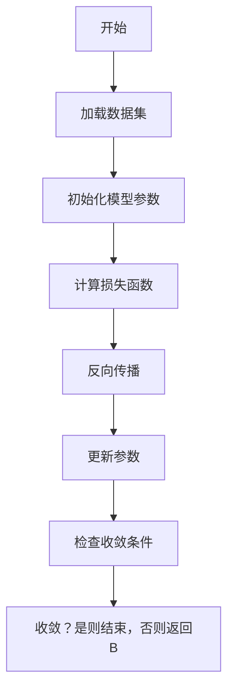
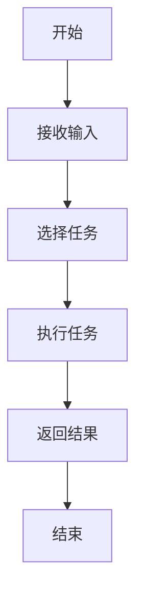
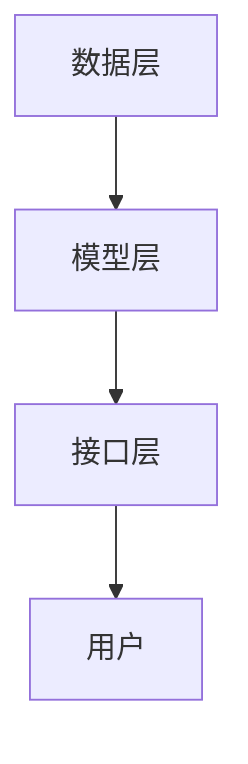

                 


# AI Agent的多任务学习：构建通用智能助手

> 关键词：AI Agent，多任务学习，通用智能助手，系统架构，算法原理

> 摘要：本文将深入探讨AI Agent的多任务学习方法，从基本概念到算法实现，再到系统设计，逐步构建一个通用智能助手。通过分析多任务学习的核心原理、系统架构设计、项目实战案例等，帮助读者全面理解并掌握AI Agent多任务学习的技术细节和实现方法。

---

# 第1章: AI Agent与多任务学习概述

## 1.1 AI Agent的基本概念

### 1.1.1 AI Agent的定义与特点
AI Agent（人工智能代理）是指能够感知环境、自主决策并执行任务的智能实体。它具备以下特点：
- **自主性**：能够自主决策，无需外部干预。
- **反应性**：能够实时感知环境并做出响应。
- **学习能力**：能够通过数据和经验改进自身性能。
- **适应性**：能够适应不同场景和任务需求。

### 1.1.2 多任务学习的定义与目标
多任务学习（Multi-Task Learning, MTL）是指让模型同时学习多个相关任务，通过共享部分参数或特征来提高模型的泛化能力和效率。其目标是：
- **提升性能**：通过共享任务间的共性特征，提高模型在多个任务上的表现。
- **减少数据需求**：利用任务间的关联性，减少对每个任务单独数据的需求。
- **增强通用性**：构建能够处理多种任务的通用模型。

### 1.1.3 AI Agent在多任务学习中的作用
AI Agent通过多任务学习能够同时处理多种任务，例如信息检索、语音识别、图像处理等。这种能力使其成为构建通用智能助手的核心技术。

## 1.2 多任务学习的背景与应用

### 1.2.1 多任务学习的背景
随着人工智能技术的发展，单任务学习的局限性逐渐显现，例如需要大量任务特异性数据、难以应对复杂场景等问题。多任务学习作为一种解决方案，逐渐成为研究热点。

### 1.2.2 多任务学习的应用场景
- **智能助手**：如Siri、Alexa等，能够处理多种任务，例如播放音乐、设置提醒、查询天气等。
- **医疗领域**：多任务学习可以用于疾病诊断、药物推荐等。
- **金融领域**：用于风险评估、股票预测等。

### 1.2.3 多任务学习的挑战与机遇
- **挑战**：任务间的干扰、参数共享的设计难度、训练效率等问题。
- **机遇**：提升模型的通用性、降低数据需求、提高任务处理效率。

## 1.3 本章小结
本章介绍了AI Agent和多任务学习的基本概念，并探讨了多任务学习的背景、应用场景以及面临的挑战与机遇，为后续章节奠定了基础。

---

# 第2章: 多任务学习的核心概念与联系

## 2.1 多任务学习的核心原理

### 2.1.1 多任务学习的基本原理
多任务学习通过共享任务间的特征或参数，使模型能够同时优化多个任务。其核心思想是任务之间存在某种关联性，可以通过共享部分参数来提升模型的泛化能力。

### 2.1.2 多任务学习的数学模型
多任务学习的损失函数通常表示为多个任务损失的加权和：
$$L = \sum_{i=1}^{n} \lambda_i L_i$$
其中，$\lambda_i$ 是任务 $i$ 的权重，$L_i$ 是任务 $i$ 的损失函数。

### 2.1.3 多任务学习的优缺点对比
| 优点 | 缺点 |
|------|------|
| 提高模型的泛化能力 | 任务间可能存在干扰 |
| 降低数据需求 | 参数共享的设计难度较高 |
| 提高任务处理效率 | 部分任务性能可能下降 |

## 2.2 多任务学习与单任务学习的对比

### 2.2.1 任务之间的关系
任务之间的关系可以分为以下几种：
- **相关任务**：任务之间存在较强的关联性，例如翻译任务和文本摘要。
- **弱相关任务**：任务之间关联性较弱，例如图像分类和语音识别。
- **完全独立任务**：任务之间无明显关联，例如棋类游戏和自然语言处理。

### 2.2.2 任务之间的依赖性
任务之间的依赖性可以通过以下方式体现：
- **顺序依赖**：任务之间需要按特定顺序执行，例如翻译和语音合成。
- **并行依赖**：任务之间可以并行执行，例如图像分类和目标检测。

### 2.2.3 任务之间的独立性
任务之间的独立性是指任务之间没有共享的参数或特征，每个任务独立优化。

## 2.3 多任务学习的ER实体关系图

```mermaid
er
actor(Agent, Task, Model)
rectangle(Agent) {
  has Task
  has Model
}
rectangle(Task) {
  has Model
}
rectangle(Model) {
  has Agent
  has Task
}
```

## 2.4 本章小结
本章详细探讨了多任务学习的核心原理、任务之间的关系以及多任务学习与单任务学习的对比，为后续的算法设计和系统实现提供了理论基础。

---

# 第3章: 多任务学习的算法原理

## 3.1 多任务学习的算法概述

### 3.1.1 多任务学习的基本算法
多任务学习的基本算法包括：
- **共享参数模型**：共享部分参数，每个任务独立优化。
- **任务特定参数模型**：任务之间共享部分参数，每个任务有特定的参数。

### 3.1.2 多任务学习的高级算法
高级算法包括：
- **层次化多任务学习**：将任务划分为不同的层次，共享更高层次的特征。
- **关系网络**：通过网络结构建模任务之间的关系。

### 3.1.3 算法选择的依据
算法选择的依据包括任务之间的关联性、数据量大小、计算资源等。

## 3.2 多任务学习的数学模型与公式

### 3.2.1 损失函数的定义
多任务学习的损失函数可以表示为：
$$L = \sum_{i=1}^{n} \lambda_i L_i$$
其中，$\lambda_i$ 是任务 $i$ 的权重，$L_i$ 是任务 $i$ 的损失函数。

### 3.2.2 优化器的选择
常用的优化器包括随机梯度下降（SGD）、Adam等。优化器的选择需要考虑任务之间的关联性和模型的复杂度。

## 3.3 多任务学习的算法流程图



## 3.4 本章小结
本章详细介绍了多任务学习的算法原理，包括基本算法、数学模型和优化器选择，并通过流程图展示了算法的实现过程。

---

# 第4章: 多任务学习的系统分析与架构设计

## 4.1 系统功能设计

### 4.1.1 系统功能模块划分
系统功能模块包括：
- **输入模块**：接收用户输入。
- **处理模块**：根据输入执行相应的任务。
- **输出模块**：返回处理结果。

### 4.1.2 系统功能流程图



### 4.1.3 系统功能的实现细节
- **输入模块**：支持多种输入方式，例如文本输入、语音输入等。
- **处理模块**：根据任务类型调用相应的处理函数。
- **输出模块**：根据任务需求返回结果，例如文本、图像等。

## 4.2 系统架构设计

### 4.2.1 系统架构的层次划分
系统架构通常分为以下层次：
- **数据层**：存储和管理数据。
- **模型层**：实现多任务学习的模型。
- **接口层**：提供与外部系统的接口。

### 4.2.2 系统架构图



### 4.2.3 系统架构的实现细节
- **数据层**：使用数据库或数据存储系统存储数据。
- **模型层**：实现多任务学习的模型，例如共享参数模型。
- **接口层**：提供RESTful API或其他接口供外部调用。

## 4.3 本章小结
本章详细探讨了多任务学习系统的功能设计和架构设计，为后续的项目实现提供了理论依据。

---

# 第5章: 多任务学习的项目实战

## 5.1 项目环境安装与配置

### 5.1.1 环境安装
需要安装以下工具和库：
- Python 3.8+
- PyTorch 1.9+
- Transformers库
- Mermaid工具

### 5.1.2 环境配置
```bash
pip install torch transformers mermaid
```

## 5.2 系统核心实现源代码

### 5.2.1 代码实现
```python
import torch
from torch import nn
from torch.utils.data import DataLoader
import mermaid

class MultiTaskModel(nn.Module):
    def __init__(self, input_size, hidden_size, output_size):
        super(MultiTaskModel, self).__init__()
        self.shared_layer = nn.Linear(input_size, hidden_size)
        self.task_layers = nn.ModuleList([
            nn.Linear(hidden_size, output_size) for _ in range(num_tasks)
        ])
    
    def forward(self, x):
        x = torch.relu(self.shared_layer(x))
        outputs = []
        for task_layer in self.task_layers:
            outputs.append(torch.relu(task_layer(x)))
        return outputs

# 示例数据集
class Dataset(torch.utils.data.Dataset):
    def __init__(self, input_size, num_samples):
        self.inputs = torch.randn(num_samples, input_size)
        self.targets = [torch.randn(num_samples, 1) for _ in range(num_tasks)]
    
    def __len__(self):
        return len(self.inputs)
    
    def __getitem__(self, idx):
        return self.inputs[idx], [target[idx] for target in self.targets]

# 训练函数
def train_model(model, dataloader, optimizer, criterion, num_epochs=100):
    for epoch in range(num_epochs):
        for inputs, targets in dataloader:
            outputs = model(inputs)
            loss = sum(criterion(output, target) for output, target in zip(outputs, targets))
            loss.backward()
            optimizer.step()
            optimizer.zero_grad()

# 测试函数
def test_model(model, dataloader):
    model.eval()
    with torch.no_grad():
        for inputs, targets in dataloader:
            outputs = model(inputs)
            for output, target in zip(outputs, targets):
                # 这里可以添加具体的评估指标
                pass

# 示例使用
input_size = 10
hidden_size = 5
output_size = 1
num_tasks = 3
batch_size = 32

model = MultiTaskModel(input_size, hidden_size, output_size)
optimizer = torch.optim.Adam(model.parameters())
criterion = nn.MSELoss()
dataset = Dataset(input_size, 100)
dataloader = DataLoader(dataset, batch_size=batch_size, shuffle=True)
train_model(model, dataloader, optimizer, criterion)
```

### 5.2.2 代码解读与分析
- **模型定义**：`MultiTaskModel` 包含共享层和任务特定层。
- **数据集**：`Dataset` 生成输入和目标数据。
- **训练函数**：`train_model` 实现模型的训练过程。
- **测试函数**：`test_model` 实现模型的测试过程。

## 5.3 实际案例分析与详细讲解

### 5.3.1 案例背景
以一个简单的多任务学习案例为例，任务包括分类任务、回归任务和生成任务。

### 5.3.2 案例实现步骤
1. **环境安装与配置**
2. **数据集准备**
3. **模型定义**
4. **训练与测试**
5. **结果分析**

### 5.3.3 案例结果分析
通过训练和测试，可以观察到多任务学习在多个任务上的性能表现，验证模型的泛化能力。

## 5.4 本章小结
本章通过实际案例详细讲解了多任务学习的项目实现，包括环境配置、代码实现和结果分析。

---

# 第6章: 总结与展望

## 6.1 本章总结
本文详细探讨了AI Agent的多任务学习方法，从基本概念到算法实现，再到系统设计，逐步构建了一个通用智能助手。

## 6.2 未来展望
未来，多任务学习将在以下方面继续发展：
- **更高效的算法设计**：探索更高效的参数共享方法。
- **更广泛的应用场景**：拓展到更多领域，例如自动驾驶、智能医疗等。
- **更复杂的任务组合**：研究如何处理更多复杂任务的组合。

## 6.3 注意事项
在实际应用中，需要注意任务之间的平衡，避免某些任务的性能下降。

## 6.4 最佳实践 tips
- **选择合适的算法**：根据任务需求选择合适的多任务学习算法。
- **合理分配权重**：根据任务的重要性合理分配权重。
- **持续优化模型**：通过持续学习和优化提升模型性能。

## 6.5 本章小结
本章总结了全文内容，并展望了多任务学习的未来发展方向，同时给出了实际应用中的注意事项和最佳实践建议。

---

# 结语

通过本文的详细讲解，读者可以全面理解AI Agent的多任务学习方法，并能够将其应用于实际场景中。多任务学习作为一种重要的技术手段，将继续推动人工智能技术的发展，为构建通用智能助手提供强有力的支持。

