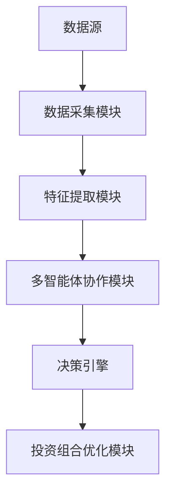
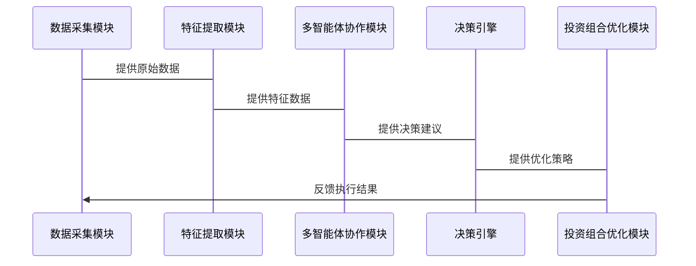

                 


# AI多智能体系统革新价值投资：传统与科技的完美融合

---

## 关键词：
- 多智能体系统
- 价值投资
- 强化学习
- 金融科技
- 投资组合优化

---

## 摘要：
本文探讨了AI多智能体系统如何革新传统价值投资方法，通过分析多智能体系统的数学模型、算法原理、系统架构以及在价值投资中的实战应用，展示了传统金融与科技的完美融合。文章从背景介绍、核心概念、算法实现、系统设计到项目实战，全面解析了AI多智能体系统在价值投资中的潜力和应用价值，为读者提供了深入的技术见解和实践指导。

---

# 第一部分：AI多智能体系统与价值投资的结合

## 第1章：多智能体系统与价值投资的背景介绍

### 1.1 多智能体系统的定义与特点

#### 1.1.1 多智能体系统的定义
多智能体系统（Multi-Agent System, MAS）是由多个智能体（Agent）组成的系统，这些智能体能够自主决策、协作或竞争，以完成特定任务。每个智能体都有自己的目标、知识和行为规则。

#### 1.1.2 多智能体系统的核心特点
- **自主性**：智能体能够自主决策，无需外部干预。
- **反应性**：能够感知环境并实时响应。
- **协作性**：多个智能体之间可以协作完成复杂任务。
- **分布式性**：智能体分布在整个系统中，不依赖于单一中心节点。

#### 1.1.3 多智能体系统的应用场景
多智能体系统在金融领域的应用包括算法交易、风险管理和投资组合优化等。

### 1.2 价值投资的传统方法与挑战

#### 1.2.1 价值投资的基本概念
价值投资是一种投资策略，通过分析公司的基本面，寻找被市场低估的投资标的。传统价值投资依赖于分析师的主观判断和经验。

#### 1.2.2 传统价值投资的局限性
- **信息不对称**：市场信息分布不均，难以全面掌握。
- **情绪影响**：投资者情绪波动可能影响决策。
- **效率低下**：依赖人工分析，耗时且成本高。

#### 1.2.3 价值投资的科技化趋势
随着科技的发展，传统价值投资逐渐向量化、数据化方向转型，AI技术的应用为价值投资带来了新的可能性。

### 1.3 多智能体系统在金融领域的潜力

#### 1.3.1 金融市场的复杂性与不确定性
金融市场受到多种因素影响，包括经济指标、政策变化和市场情绪等，导致高度的不确定性和复杂性。

#### 1.3.2 多智能体系统在金融中的应用优势
多智能体系统能够模拟市场参与者的多种行为，捕捉市场动态，提供更精准的投资决策支持。

#### 1.3.3 传统价值投资与科技融合的必要性
通过多智能体系统的应用，传统价值投资可以实现数据驱动的决策，提高效率和准确性。

---

## 第2章：多智能体系统的数学模型与算法原理

### 2.1 多智能体系统的数学模型

#### 2.1.1 多智能体系统的状态表示
状态表示包括市场数据、资产价格、交易量等。

#### 2.1.2 多智能体系统的动作空间
动作包括买入、卖出、持有等交易操作。

#### 2.1.3 多智能体系统的奖励机制
奖励机制用于评估智能体的决策效果，例如收益、风险等。

### 2.2 基于强化学习的多智能体协作算法

#### 2.2.1 强化学习的基本原理
强化学习通过智能体与环境的交互，学习最优策略。智能体通过试错获得最大化的累积奖励。

#### 2.2.2 多智能体协作的挑战
多智能体协作需要解决通信、协调和合作问题，避免智能体之间的冲突。

#### 2.2.3 基于Q-learning的多智能体协作算法
基于Q-learning的算法通过智能体之间的协作，实现全局最优策略。

### 2.3 多智能体系统的数学公式

#### 2.3.1 Q-learning算法公式
$$ Q(s, a) = (1-\alpha)Q(s, a) + \alpha (r + \max Q(s', a')) $$

#### 2.3.2 多智能体协作的联合奖励公式
$$ R = \sum_{i=1}^{n} r_i $$

---

## 第3章：价值投资中的多智能体系统架构

### 3.1 系统架构设计

#### 3.1.1 系统整体架构图


### 3.2 系统功能模块

#### 3.2.1 数据采集模块
负责收集市场数据，包括股票价格、财务报表等。

#### 3.2.2 特征提取模块
将原始数据转化为有用的特征，如市盈率、市净率等。

#### 3.2.3 多智能体协作模块
实现多个智能体的协作，进行投资决策。

#### 3.2.4 决策引擎模块
根据智能体的决策生成投资策略。

#### 3.2.5 投资组合优化模块
优化投资组合，降低风险，提高收益。

### 3.3 系统接口设计

#### 3.3.1 数据接口
定义数据输入和输出的格式，确保模块之间的数据交互。

#### 3.3.2 智能体间通信接口
实现智能体之间的通信，确保协作顺畅。

#### 3.3.3 决策输出接口
将决策结果输出到投资组合优化模块。

---

## 第4章：多智能体系统在价值投资中的实战应用

### 4.1 项目环境安装

#### 4.1.1 安装Python环境
使用Anaconda安装Python 3.8及以上版本。

#### 4.1.2 安装相关库
安装TensorFlow、Keras、Pandas等库。

### 4.2 核心代码实现

#### 4.2.1 多智能体协作算法实现
```python
import numpy as np
import tensorflow as tf

# 定义智能体类
class Agent:
    def __init__(self, state_size, action_size):
        self.state_size = state_size
        self.action_size = action_size
        self.model = self.build_model()

    def build_model(self):
        model = tf.keras.Sequential()
        model.add(tf.keras.layers.Dense(32, activation='relu', input_dim=self.state_size))
        model.add(tf.keras.layers.Dense(self.action_size, activation='linear'))
        model.compile(optimizer='adam', loss='mean_squared_error')
        return model

    def act(self, state):
        state = np.reshape(state, [1, self.state_size])
        prediction = self.model.predict(state)[0]
        return np.argmax(prediction)
```

#### 4.2.2 系统交互流程图


### 4.3 实际案例分析

#### 4.3.1 案例背景
假设我们有一个包含10只股票的组合，目标是通过多智能体系统优化投资组合。

#### 4.3.2 数据处理
从数据库中提取过去一年的股票数据，计算技术指标如移动平均线、相对强弱指数等。

#### 4.3.3 智能体协作
每个智能体负责分析不同的股票，协作生成最终的投资策略。

#### 4.3.4 投资组合优化
通过优化算法，调整投资比例，降低风险，提高收益。

---

## 第5章：系统实现与测试

### 5.1 系统实现

#### 5.1.1 系统功能测试
测试每个模块的功能，确保数据处理、智能体协作和决策输出正常工作。

#### 5.1.2 性能测试
测试系统的处理速度和稳定性，确保在高负载下系统仍能正常运行。

### 5.2 系统优化

#### 5.2.1 模型优化
通过调整神经网络的结构和参数，提高智能体的决策准确性。

#### 5.2.2 算法优化
优化强化学习算法，提高训练效率和效果。

---

## 第6章：结论与展望

### 6.1 研究结论
多智能体系统在价值投资中的应用显著提高了投资决策的效率和准确性，为传统金融注入了科技的力量。

### 6.2 未来展望
未来的研究方向包括更复杂的智能体协作算法、更高效的数据处理技术以及更智能化的投资策略。

---

## 参考文献
1. Russell, S. J., & Norvig, P. (2010). Artificial Intelligence: A Modern Approach.
2. Sutton, R. S., & Barto, A. G. (2018). Reinforcement Learning: An Introduction.

---

## 致谢
感谢读者的耐心阅读，感谢技术社区的支持与帮助。

---

通过以上内容，文章详细介绍了AI多智能体系统在价值投资中的应用，从理论到实践，为读者提供了全面的技术指导和实践参考。

