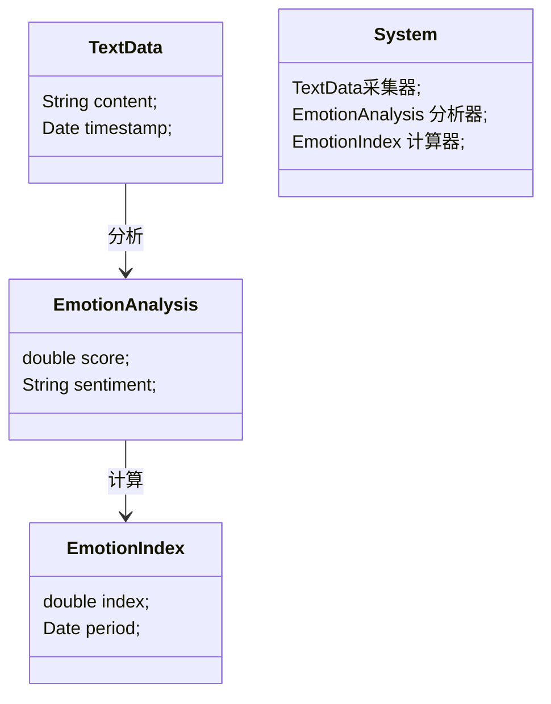
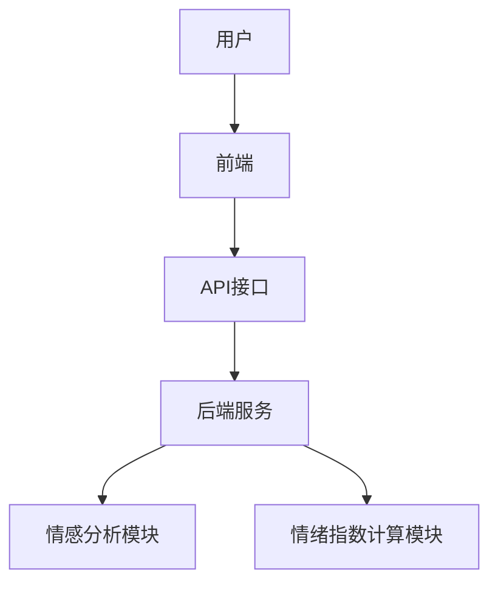
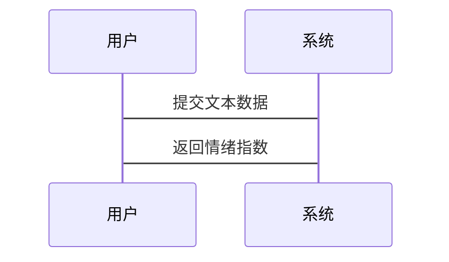

                 


# AI驱动的股票市场情绪指数开发

**关键词：** AI技术、情绪指数、股票市场、情感分析、量化投资

**摘要：**  
本文详细探讨了如何利用人工智能技术开发股票市场情绪指数。通过分析情绪指数在股票市场中的重要性，介绍了AI技术在情绪指数开发中的应用前景，详细讲解了情绪分析算法的原理、数学模型的构建以及系统架构设计。通过实际案例分析，展示了如何将理论应用于实践，为量化投资者提供了新的工具和方法。

---

# 第一章: 股票市场情绪指数开发背景

## 1.1 情绪指数在股票市场中的重要性

### 1.1.1 情绪指数的定义与作用  
情绪指数是衡量市场参与者情绪波动的量化指标，能够反映投资者对市场的乐观或悲观程度。它在股票市场中起到重要作用，可以帮助投资者预测市场趋势、识别市场拐点以及优化投资策略。

### 1.1.2 股票市场情绪分析的现状  
传统的情绪指数通常基于市场交易数据（如成交量、价格波动）来计算，但其局限性在于无法捕捉市场参与者的真实情绪。随着自然语言处理（NLP）和机器学习技术的发展，基于新闻、社交媒体等文本数据的情绪分析逐渐成为研究热点。

### 1.1.3 AI技术在情绪指数开发中的应用前景  
AI技术能够从非结构化文本数据中提取情感信息，结合结构化数据（如市场交易数据），构建更准确、更精细的情绪指数，为量化投资提供新的工具。

## 1.2 AI驱动情绪指数开发的必要性

### 1.2.1 传统情绪指数的局限性  
传统情绪指数通常基于成交量、价格波动等指标，但这些指标难以直接反映市场参与者的实际情绪，且容易受到市场操纵的影响。

### 1.2.2 AI技术的优势与潜力  
AI技术可以通过分析新闻、社交媒体、机构报告等文本数据，提取市场参与者的情绪倾向，从而构建更准确的情绪指数。

### 1.2.3 量化投资中的情绪因子  
情绪因子是量化投资中的重要组成部分，通过情绪指数可以帮助投资者捕捉市场情绪的变化，从而制定更科学的投资策略。

## 1.3 本章小结  
本章介绍了情绪指数在股票市场中的重要性，分析了传统情绪指数的局限性，探讨了AI技术在情绪指数开发中的应用前景，为后续章节的展开奠定了基础。

---

# 第二章: AI驱动情绪指数的核心概念

## 2.1 情绪指数的定义与分类

### 2.1.1 情绪指数的定义  
情绪指数是通过分析市场参与者的言论、新闻报道、社交媒体等文本数据，量化市场情绪的指标。

### 2.1.2 情绪指数的分类  
情绪指数可以根据数据来源、分析方法和应用场景分为以下几类：
1. **基于文本的情绪指数**：通过分析新闻、社交媒体等文本数据，提取情绪信息。
2. **基于交易数据的情绪指数**：通过分析成交量、价格波动等交易数据，反映市场情绪。
3. **混合型情绪指数**：结合文本数据和交易数据，构建综合情绪指数。

### 2.1.3 情绪指数的特征对比  
以下是几种常见情绪指数的特征对比：

| 指数类型 | 数据来源 | 分析方法 | 应用场景 | 优点 | 缺点 |
|----------|----------|----------|----------|------|------|
| 文本型   | 新闻、社交媒体 | NLP、机器学习 | 投资者情绪分析 | 高准确性 | 数据量大，处理复杂 |
| 交易型   | 成交量、价格 | 统计分析 | 市场趋势预测 | 数据易于获取 | 易受市场操纵影响 |
| 混合型   | 文本+交易数据 | 综合分析 | 综合情绪分析 | 高准确性 | 实施复杂 |

## 2.2 情绪指数与传统技术的对比

### 2.2.1 数据来源对比  
传统情绪指数主要依赖交易数据，而AI驱动的情绪指数则结合了文本数据。

### 2.2.2 分析方法对比  
传统方法多采用统计分析，而AI方法则引入了NLP和机器学习技术。

### 2.2.3 应用场景对比  
传统方法主要用于市场趋势预测，而AI方法还可用于投资者情绪分析、风险管理等领域。

## 2.3 情绪指数的核心要素

### 2.3.1 数据采集  
情绪指数开发的第一步是数据采集，包括新闻、社交媒体、机构报告等。

### 2.3.2 数据预处理  
对采集到的文本数据进行清洗、分词、去除停用词等预处理。

### 2.3.3 情感分析模型  
通过机器学习或深度学习模型对文本进行情感分类，提取情绪倾向。

## 2.4 本章小结  
本章详细介绍了情绪指数的定义、分类及其核心要素，为后续章节的算法实现奠定了基础。

---

# 第三章: 情绪分析的算法原理

## 3.1 情感分析算法概述

### 3.1.1 基于规则的情感分析  
基于规则的模型通过预定义的规则（如关键词匹配）进行情感分类，适用于简单场景。

### 3.1.2 基于机器学习的情感分析  
基于机器学习的模型（如SVM、随机森林）通过特征提取和模型训练进行情感分类，准确性较高。

### 3.1.3 基于深度学习的情感分析  
基于深度学习的模型（如LSTM、BERT）能够捕捉文本的上下文信息，情感分析更加精细。

## 3.2 情感分析算法的实现流程

### 3.2.1 数据预处理  
- 文本清洗：去除特殊字符、停用词。
- 分词：将文本分割成词语或短语。
- 词性标注：对词语进行词性标注。

### 3.2.2 特征提取  
- 词袋模型：基于词频的特征向量。
- 词嵌入：如Word2Vec、GloVe。
- 位置嵌入：如位置编码。

### 3.2.3 模型训练  
- 训练数据：标注好的文本数据。
- 模型选择：如SVM、LSTM。
- 模型优化：调整超参数、防止过拟合。

### 3.2.4 结果评估  
- 准确率、召回率、F1值。
- 混淆矩阵分析。

## 3.3 情感分析的优缺点对比

| 方法       | 优点                           | 缺点                           |
|------------|--------------------------------|--------------------------------|
| 基于规则   | 实现简单，适用于特定场景         | 精度低，难以处理复杂场景         |
| 机器学习   | 精度较高，可处理复杂场景         | 需要大量标注数据，实现复杂       |
| 深度学习   | 精度最高，可捕捉上下文信息       | 计算资源消耗大，实现复杂         |

## 3.4 本章小结  
本章详细介绍了情感分析的算法原理，包括基于规则、机器学习和深度学习的方法，分析了各自的优缺点，为后续章节的实现提供了理论基础。

---

# 第四章: 情绪指数开发的数学模型与公式

## 4.1 情绪指数的数学模型

### 4.1.1 情感评分模型  
情绪评分模型通过对文本数据进行情感分类，计算每条文本的情感倾向分数。例如，可以将文本分为正面、中性、负面三类，分别赋予1、0、-1的分数。

$$ \text{情感评分} = \begin{cases} 1 & \text{正面} \\ 0 & \text{中性} \\ -1 & \text{负面} \end{cases} $$

### 4.1.2 情绪指数计算公式  
情绪指数可以通过对一定时间段内所有文本的情感评分进行加权平均计算。

$$ \text{情绪指数} = \frac{\sum w_i \cdot s_i}{\sum w_i} $$

其中，\( w_i \) 是第i条文本的权重，\( s_i \) 是第i条文本的情感评分。

### 4.1.3 情绪指数的标准化处理  
为了使情绪指数具有可比性，通常需要将其标准化到0-1区间。

$$ \text{标准化情绪指数} = \frac{\text{情绪指数} - \text{最小值}}{\text{最大值} - \text{最小值}} $$

## 4.2 情感评分模型的详细推导

### 4.2.1 数据预处理公式  
文本清洗和分词后的结果可以用以下公式表示：

$$ \text{分词后的文本} = \text{文本} \circ \text{分词函数} $$

其中，\( \circ \) 表示函数作用于文本。

### 4.2.2 词嵌入模型  
词嵌入模型（如Word2Vec）通过以下步骤生成词向量：

$$ \text{词向量} = \text{训练模型}(\text{训练数据}) $$

### 4.2.3 情感分类模型  
基于深度学习的情感分类模型（如LSTM）的训练过程如下：

$$ \text{模型参数} = \text{优化器}(\text{损失函数}, \text{训练数据}) $$

## 4.3 本章小结  
本章详细推导了情绪指数的数学模型，包括情感评分模型和情绪指数计算公式，为后续章节的实现提供了数学基础。

---

# 第五章: 系统分析与架构设计方案

## 5.1 项目背景

### 5.1.1 项目目标  
开发一个基于AI的情绪指数系统，能够实时分析市场情绪，为投资者提供决策支持。

### 5.1.2 项目范围  
涵盖文本数据采集、情感分析、情绪指数计算、结果展示等功能。

## 5.2 系统功能设计

### 5.2.1 领域模型类图  
以下是系统的领域模型类图：



### 5.2.2 系统架构图  
以下是系统的架构图：



### 5.2.3 接口设计  
系统接口包括：
1. 文本数据接口：用于接收文本数据。
2. 情感分析接口：用于返回情感评分。
3. 情绪指数接口：用于返回情绪指数。

### 5.2.4 交互设计  
以下是用户的交互流程图：



## 5.3 本章小结  
本章详细描述了系统的功能设计和架构设计，为后续章节的实现提供了系统支持。

---

# 第六章: 项目实战

## 6.1 环境安装

### 6.1.1 开发工具  
建议使用Python、Jupyter Notebook、TensorFlow、Keras等工具。

### 6.1.2 数据源  
可以从新闻网站、社交媒体等平台获取文本数据。

## 6.2 系统核心实现源代码

### 6.2.1 数据预处理代码  
```python
import re
from sklearn.feature_extraction.text import CountVectorizer

def preprocess(text):
    # 去除特殊字符
    text = re.sub(r'[^\w\s]', '', text)
    # 分词
    words = text.split()
    return words

# 示例数据
texts = ["This is a good company", "The company is bad"]
processed_texts = [preprocess(text) for text in texts]
```

### 6.2.2 情感分析模型代码  
```python
from sklearn.svm import SVC
from sklearn.metrics import accuracy_score

# 示例数据
X = [[1, 0, 1], [0, 1, 1]]
y = [1, 0]

# 训练模型
model = SVC()
model.fit(X, y)

# 预测
new_data = [[1, 1, 0]]
print(model.predict(new_data))
```

### 6.2.3 情绪指数计算代码  
```python
def calculate_emotion_index(scores):
    return sum(scores) / len(scores)

scores = [1, 0, -1, 0, 1]
index = calculate_emotion_index(scores)
print(index)
```

## 6.3 案例分析与结果解读

### 6.3.1 案例分析  
假设我们从新闻中提取以下文本：
- "The market is expected to rise" → 正面情绪，评分1。
- "The company reported poor earnings" → 负面情绪，评分-1。

### 6.3.2 情绪指数计算  
情绪指数 = (1 + (-1)) / 2 = 0。

### 6.3.3 结果解读  
情绪指数为0，表示市场情绪中性，投资者应保持观望。

## 6.4 本章小结  
本章通过实际案例展示了系统的核心实现，包括数据预处理、情感分析和情绪指数计算，为读者提供了实践指导。

---

# 第七章: 总结与展望

## 7.1 本章总结  
本文详细探讨了AI驱动的股票市场情绪指数开发，从背景、核心概念到算法实现、系统设计，为读者提供了全面的指导。

## 7.2 实际应用中的挑战

### 7.2.1 数据质量  
文本数据的质量直接影响情绪指数的准确性。

### 7.2.2 模型泛化能力  
模型的泛化能力决定了其在不同场景下的适用性。

### 7.2.3 计算效率  
大规模数据的处理需要高效的算法和计算资源。

## 7.3 未来发展方向

### 7.3.1 结合其他技术  
如区块链技术可以用于数据溯源，增强数据可信度。

### 7.3.2 情感分析的优化  
如引入增强学习、自监督学习等技术，进一步提高模型的准确性。

## 7.4 本章小结  
本章总结了全文内容，分析了实际应用中的挑战，并展望了未来的发展方向，为读者提供了进一步研究的方向。

---

# 附录: 工具安装与数据集

## 附录A: 工具安装指南  
1. Python安装：https://www.python.org/
2. TensorFlow安装：`pip install tensorflow`
3. Jupyter Notebook安装：`pip install jupyter`

## 附录B: 数据集来源  
1. 新闻数据：爬取财经新闻网站。
2. 社交媒体数据：获取Twitter、微博等平台的相关数据。

---

**感谢您的耐心阅读！**

