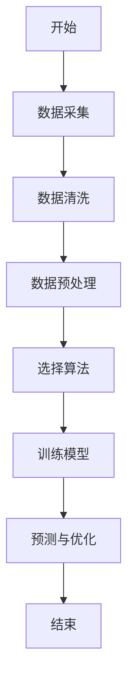

                 


# 价值投资中的智能城市废水处理与再利用系统分析

> 关键词：智能城市，废水处理，价值投资，系统分析，优化算法

> 摘要：本文从价值投资的角度，分析智能城市中废水处理与再利用系统的潜力与实现方案。通过技术与经济的双重视角，探讨如何利用智能系统优化废水处理流程，降低运营成本，提升投资回报率。

---

## 第1章：智能城市废水处理与再利用系统概述

### 1.1 问题背景与价值投资机会

#### 1.1.1 智慧城市建设的背景
随着城市化进程的加快，水资源短缺问题日益严重。智能城市的建设为解决这一问题提供了新的思路。

#### 1.1.2 废水处理与再利用的必要性
废水处理不仅是环保的需要，更是资源再利用的重要途径。通过智能系统优化处理流程，可以降低成本，创造经济价值。

#### 1.1.3 价值投资视角下的行业机会
废水处理行业的市场规模不断扩大，智能化改造为企业带来了更高的利润率和投资回报率。

### 1.2 系统核心概念与分析框架

#### 1.2.1 智能城市废水处理系统定义
智能城市废水处理系统是一种利用物联网、大数据和人工智能技术，实现废水处理过程的智能化和优化管理的系统。

#### 1.2.2 系统核心组成部分与功能
- 数据采集模块：实时采集废水处理过程中的各项参数。
- 智能分析模块：利用算法优化处理流程，预测设备维护需求。
- 决策支持模块：为运营管理者提供数据支持和决策建议。

#### 1.2.3 价值投资分析框架
- 行业分析：市场规模、增长潜力。
- 企业分析：技术优势、成本结构。
- 财务分析：投资回报率、成本节约。

---

## 第2章：智能城市废水处理系统的原理与技术

### 2.1 废水处理与再利用技术

#### 2.1.1 传统废水处理技术概述
- 物理处理：过滤、沉淀。
- 化学处理：絮凝、氧化还原。
- 生物处理：好氧、厌氧处理。

#### 2.1.2 智能化废水处理技术特点
- 自动化控制：实时监测和调整处理参数。
- 数据驱动：基于大数据分析优化处理流程。
- 智能预测：利用机器学习预测设备故障和优化处理方案。

#### 2.1.3 废水再利用的主要方法
- 回用工业用水：冷却水、清洗水。
- 城市绿化用水：公园、道路洒水。
- 农业灌溉：处理后的废水用于农业灌溉。

### 2.2 智能化废水处理系统的算法原理

#### 2.2.1 数据采集与处理算法
- 数据采集：通过传感器获取实时数据。
- 数据清洗：去除异常值和噪声。
- 数据预处理：标准化、归一化处理。

#### 2.2.2 智能优化算法（如遗传算法、神经网络）

##### 遗传算法
- 算法步骤：
  1. 初始化种群。
  2. 计算适应度。
  3. 选择、交叉、变异。
  4. 重复迭代。

- 代码示例：
  ```python
  def fitness(individual):
      # 计算适应度值
      return sum(individual)
  
  def evolve_population(population):
      # 选择、交叉、变异
      pass
  ```

##### 神经网络
- 网络结构：输入层、隐藏层、输出层。
- 训练过程：反向传播、梯度下降。

- 代码示例：
  ```python
  import tensorflow as tf
  model = tf.keras.Sequential([
      tf.keras.layers.Dense(64, activation='relu'),
      tf.keras.layers.Dense(1, activation='sigmoid')
  ])
  model.compile(optimizer='adam', loss='binary_crossentropy')
  ```

#### 2.2.3 算法流程图（使用 Mermaid）



---

## 第3章：系统架构与功能设计

### 3.1 系统架构设计

#### 3.1.1 系统分层架构图（Mermaid）


#### 3.1.2 各模块功能描述
- 数据采集层：实时采集废水处理数据。
- 数据处理层：清洗、分析数据。
- 决策支持层：提供优化建议和预测。
- 用户界面层：展示数据和操作界面。

#### 3.1.3 系统接口设计
- 数据接口：与传感器和数据库交互。
- 用户接口：Web 界面供管理者使用。
- API 接口：与其他系统（如ERP）集成。

### 3.2 功能需求分析

#### 3.2.1 数据采集与监控功能
- 实时监控废水处理参数。
- 报警系统：异常值触发警报。

#### 3.2.2 智能优化与控制功能
- 自动调整处理参数。
- 设备状态监测与预测。

#### 3.2.3 数据分析与决策支持功能
- 数据可视化：图表展示处理效果。
- 报告生成：定期生成分析报告。

---

## 第4章：价值投资分析与系统评估

### 4.1 价值投资分析框架

#### 4.1.1 行业分析与市场潜力
- 行业规模：全球废水处理市场规模。
- 市场增长：智能化改造带来的增量空间。

#### 4.1.2 企业竞争力分析
- 技术优势：是否拥有核心算法和专利。
- 成本优势：是否具备规模效应和成本控制能力。

#### 4.1.3 财务指标与投资回报分析
- 投资回报率（ROI）：系统建设与运营的经济性。
- 成本节约：智能化改造带来的成本降低。

### 4.2 系统评估与优化

#### 4.2.1 系统性能评估指标
- 处理效率：单位时间内处理水量。
- 节能效果：能源消耗降低比例。
- 系统稳定性：故障率和维护成本。

#### 4.2.2 优化算法在投资决策中的应用
- 预测模型：预测市场需求和价格波动。
- 投资组合优化：选择最优的投资项目组合。

#### 4.2.3 系统经济效益分析
- 投资回收期：系统建设成本与运营收益的平衡点。
- 边际收益：每增加一单位处理能力带来的收益。

---

## 第5章：项目实战与案例分析

### 5.1 项目环境与工具安装

#### 5.1.1 开发环境搭建
- 操作系统：Linux 或 Windows。
- 开发工具：Python、Jupyter Notebook。
- 数据库：MySQL 或 PostgreSQL。

#### 5.1.2 数据采集工具安装
- 传感器：Modbus、MQTT 协议。
- 数据采集库：Pandas、NumPy。

#### 5.1.3 智能算法库引入
- 机器学习：Scikit-learn、TensorFlow。
- 优化算法：PyGAD（遗传算法库）。

### 5.2 系统核心实现

#### 5.2.1 数据采集与处理代码
```python
import pandas as pd
import numpy as np

# 数据采集
data = pd.read_csv('wastewater.csv')

# 数据清洗
data.dropna(inplace=True)
data = data[~data['value'].isin([0])]
```

#### 5.2.2 智能优化算法实现
```python
import pygad

# 遗传算法优化
def fitness_func(solution, solution_idx):
    return np.sum(solution)

ga = pygad.GA(
    num_generations=10,
    num_parents_mating=2,
    population_size=10,
    fitness_function=fitness_func,
    crossover_type='single_point',
    mutation_type='random',
    mutation_rate=0.1
)

ga.run()
```

#### 5.2.3 系统功能模块代码
```python
# 数据可视化
import matplotlib.pyplot as plt

plt.plot(data['time'], data['value'])
plt.xlabel('Time')
plt.ylabel('Value')
plt.show()
```

### 5.3 实际案例分析

#### 5.3.1 某城市废水处理项目案例
- 项目背景：某城市污水处理厂升级改造。
- 技术应用：引入智能优化算法，降低能耗 30%。
- 投资回报：投资回收期 3 年，年收益 10%。

#### 5.3.2 投资回报分析与优化建议
- 系统成本：硬件投资占比 60%，软件开发占比 20%。
- 运营成本：电费、维护费降低 20%。
- 投资建议：优先投资技术领先的项目，关注政策支持区域。

---

## 第6章：系统优化与最佳实践

### 6.1 系统优化建议

#### 6.1.1 技术层面优化
- 算法优化：改进遗传算法的收敛速度。
- 系统集成：优化数据采集和处理的效率。

#### 6.1.2 业务流程优化
- 数据共享：打通上下游数据链。
- 人员培训：提升操作人员技术水平。

#### 6.1.3 投资策略优化
- 风险控制：分散投资，降低市场波动影响。
- 技术锁定：选择成熟可靠的技术方案。

### 6.2 最佳实践与注意事项

#### 6.2.1 项目实施中的常见问题与解决方案
- 数据不足：增加传感器，延长数据采集时间。
- 算法效果不佳：调整参数，更换算法模型。

#### 6.2.2 投资决策中的风险控制
- 市场风险：关注政策变化和行业趋势。
- 技术风险：选择有技术保障的企业。

#### 6.2.3 系统维护与更新策略
- 定期维护：检查设备，更新软件。
- 技术升级：跟随行业技术发展，持续优化系统。

---

## 第7章：总结与展望

### 7.1 系统总结

#### 7.1.1 系统设计总结
智能城市废水处理系统通过数据驱动和算法优化，显著提升了处理效率和资源利用率。

#### 7.1.2 投资分析总结
智能化改造具备较高的投资回报率，是价值投资者的理想选择。

#### 7.1.3 实战经验总结
实际案例证明，系统优化能够带来显著的成本节约和效率提升。

### 7.2 未来展望

#### 7.2.1 技术发展趋势
- AI 技术：深度学习在废水处理中的应用。
- 物联网：更广泛的数据采集和实时监控。

#### 7.2.2 价值投资机会分析
- 新兴技术：关注 AI 和 IoT 相关企业。
- 政策支持：关注政府鼓励的区域和行业。

#### 7.2.3 智能城市废水处理系统的未来方向
- 绿色能源：结合可再生能源降低能耗。
- 循环经济：构建废水处理与再利用的完整产业链。

---

## 附录：相关公式与代码

### 附录A：优化算法数学模型

#### 遗传算法基本公式
$$适应度 = \sum_{i=1}^{n} x_i$$

#### 神经网络基本公式
$$y = \sigma(wx + b)$$
其中，$\sigma$ 是激活函数，$w$ 是权重，$x$ 是输入，$b$ 是偏置。

### 附录B：系统实现代码
```python
# 数据采集与处理
import pandas as pd
import numpy as np

data = pd.read_csv('wastewater.csv')
data.dropna(inplace=True)
data = data[~data['value'].isin([0])]

# 遗传算法优化
import pygad

def fitness_func(solution, solution_idx):
    return np.sum(solution)

ga = pygad.GA(
    num_generations=10,
    num_parents_mating=2,
    population_size=10,
    fitness_function=fitness_func,
    crossover_type='single_point',
    mutation_type='random',
    mutation_rate=0.1
)

ga.run()

# 数据可视化
import matplotlib.pyplot as plt

plt.plot(data['time'], data['value'])
plt.xlabel('Time')
plt.ylabel('Value')
plt.show()
```

---

以上是《价值投资中的智能城市废水处理与再利用系统分析》的完整目录和文章内容，涵盖了从技术实现到价值投资分析的各个方面，适合专业人士阅读和参考。

