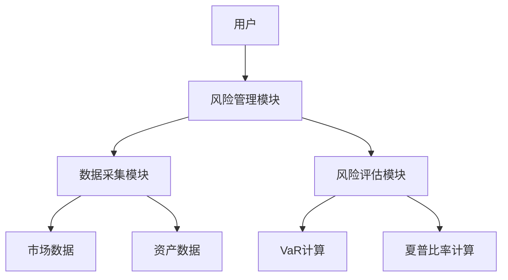

                 


# 价值投资中的风险管理策略

> 关键词：价值投资，风险管理，VaR模型，蒙特卡洛模拟，投资组合优化

> 摘要：本文详细探讨了价值投资中的风险管理策略，从风险识别、量化到具体的风险管理模型和算法，结合实际案例分析，提供了一套系统化的风险管理框架。通过数学模型、算法实现和系统架构设计，本文为价值投资者提供了实用的风险管理工具和方法。

---

## 第一部分: 价值投资的背景与概述

### 第1章: 价值投资的基本概念

#### 1.1 价值投资的定义与特点
##### 1.1.1 价值投资的定义
价值投资是一种投资策略，其核心思想是买入市场价格低于其内在价值的资产。这种方法强调长期投资和对公司基本面的深入分析，旨在通过安全边际实现稳定的超额收益。

##### 1.1.2 价值投资的核心特点
- **长期视角**：注重长期价值，而非短期市场波动。
- **基本面分析**：通过分析公司的财务状况、行业地位和竞争优势，评估其内在价值。
- **安全边际**：买入价格低于内在价值，以降低风险。

##### 1.1.3 价值投资与其它投资策略的区别
- **区别**：与趋势投资、技术分析等策略不同，价值投资强调内在价值和长期持有。

#### 1.2 风险管理的重要性
##### 1.2.1 投资中的风险来源
- 市场风险：市场波动导致资产价格下跌。
- 信用风险：债券发行人违约的风险。
- 操作风险：投资决策中的错误或失误。

##### 1.2.2 风险管理在投资决策中的作用
- **降低损失**：通过风险管理减少潜在损失。
- **提高收益稳定性**：通过分散投资降低波动性，提高收益的稳定性。

##### 1.2.3 风险与收益的平衡
- 风险与收益成正比，但通过合理的风险管理可以实现收益与风险的最佳平衡。

### 第2章: 价值投资的核心理念

#### 2.1 价值投资的核心理念
##### 2.1.1 买入低于内在价值的资产
- 通过分析公司基本面，找到市场价格低于内在价值的资产。

##### 2.1.2 长期投资与价值发现
- 长期持有优质资产，等待市场回归其内在价值。

##### 2.1.3 安全边际的概念
- 安全边际 = 内在价值 - 市场价格，确保在市场波动中仍能获得正收益。

#### 2.2 风险管理在价值投资中的应用
##### 2.2.1 风险评估的基本方法
- **定性分析**：分析公司的财务健康状况、行业前景等。
- **定量分析**：通过财务指标（如PE、PB）评估资产的估值水平。

##### 2.2.2 安全边际与风险控制的关系
- 安全边际越高，风险越低，但收益可能较低；反之，安全边际越低，风险越高，收益可能更高。

##### 2.2.3 价值投资中的风险管理策略
- **分散投资**：通过投资不同行业、不同公司的资产，降低特定风险。
- **定期再平衡**：定期调整投资组合，确保风险暴露在可接受范围内。

---

## 第二部分: 风险管理策略的核心概念

### 第3章: 风险识别与量化

#### 3.1 风险识别的基本方法
##### 3.1.1 定性分析法
- 通过专家判断、行业分析等方法识别风险来源。

##### 3.1.2 定量分析法
- 使用数学模型（如VaR模型）量化风险。

##### 3.1.3 综合分析法
- 结合定性与定量分析，全面评估风险。

#### 3.2 风险的量化指标
##### 3.2.1 波动率的计算
- 波动率反映资产价格的波动程度，计算公式为标准差。

##### 3.2.2 VaR（Value at Risk）模型
- VaR模型用于估算在特定置信水平下，可能的最大损失。
- 计算公式：
  $$VaR = \alpha \times \sigma$$
  其中，α为置信水平对应的分位数，σ为资产收益的标准差。

##### 3.2.3 风险调整后的收益指标
- Sharpe比率：衡量投资收益相对于其风险的表现。
  $$Sharpe = \frac{E[r - r_f]}{\sigma}$$
  其中，E[r - r_f]为超额收益的期望值，σ为收益的标准差。

### 第4章: 风险管理中的情景分析

#### 4.1 情景分析的基本步骤
##### 4.1.1 确定情景目标
- 明确情景分析的目标，如评估不同经济周期下的风险。

##### 4.1.2 收集相关信息
- 收集宏观经济数据、行业趋势等信息。

##### 4.1.3 构建情景模型
- 根据收集的信息，构建不同情景下的资产收益和风险模型。

#### 4.2 不同情景下的风险管理策略
##### 4.2.1 上行情景下的投资机会
- 在上行市场中，增加高成长性资产的配置。

##### 4.2.2 下行情景下的风险控制
- 在下行市场中，增加防御性资产的配置，降低风险敞口。

##### 4.2.3 恶劣情景下的止损策略
- 设置止损点，避免重大损失。

---

## 第三部分: 风险管理的数学模型与算法

### 第5章: 风险管理中的数学模型

#### 5.1 风险量化模型
##### 5.1.1 方差-协方差矩阵
- 用于计算资产之间的相关性，构建投资组合的风险模型。
  $$\Sigma = \begin{bmatrix}
  \sigma_1^2 & \sigma_{1,2} & \dots & \sigma_{1,n} \\
  \sigma_{2,1} & \sigma_2^2 & \dots & \sigma_{2,n} \\
  \vdots & \vdots & \ddots & \vdots \\
  \sigma_{n,1} & \sigma_{n,2} & \dots & \sigma_n^2
  \end{bmatrix}$$

##### 5.1.2 资产配置模型
- 使用均值-方差优化模型，实现投资组合的最优化配置。
  $$\text{Minimize } \sigma^2 \text{ subject to } \mathbf{w}^T \mathbf{1} = 1$$

##### 5.1.3 风险调整后的收益模型
- 使用夏普比率评估风险调整后的收益。

#### 5.2 蒙特卡洛模拟在风险管理中的应用
##### 5.2.1 蒙特卡洛模拟的基本原理
- 通过随机抽样，模拟资产价格的波动，评估投资组合的风险。

##### 5.2.2 蒙特卡洛模拟在投资组合中的应用
- 使用蒙特卡洛模拟生成大量的资产收益路径，计算投资组合的 VaR。

##### 5.2.3 蒙特卡洛模拟的实现
```python
import numpy as np
import pandas as pd

# 假设资产收益服从正态分布
mu = 0.05
sigma = 0.2
n_simulations = 10000

# 生成随机收益
np.random.seed(42)
simulated_returns = np.random.normal(mu, sigma, n_simulations)

# 计算VaR
quantile = np.percentile(simulated_returns, 5)
VaR = -quantile
```

---

## 第四部分: 系统架构与风险管理策略

### 第6章: 风险管理的系统架构设计

#### 6.1 系统功能设计
##### 6.1.1 风险评估模块
- 实现资产风险的量化评估。

##### 6.1.2 投资组合优化模块
- 使用数学模型优化投资组合的风险和收益。

#### 6.2 系统架构图


#### 6.3 系统交互设计
```mermaid
sequenceDiagram
    participant 用户
    participant 风险管理模块
    participant 数据采集模块
    participant 风险评估模块
    用户->风险管理模块: 请求风险评估
    风险管理模块->数据采集模块: 获取市场数据
    风险管理模块->风险评估模块: 计算VaR
    风险评估模块->风险管理模块: 返回VaR结果
    用户<-风险管理模块: 显示VaR结果
```

---

## 第五部分: 项目实战

### 第7章: 风险管理的项目实战

#### 7.1 环境安装
- 安装Python和相关库（numpy, pandas, matplotlib）。

#### 7.2 核心实现源代码
```python
import numpy as np
import pandas as pd

def calculate_var(data, confidence_level=95):
    # 计算收益分布
    returns = np.log(data / data.shift(1)).dropna()
    # 计算VaR
    quantile = np.percentile(returns, confidence_level)
    var = -quantile
    return var

# 示例数据
data = pd.read_csv('stock_prices.csv')
var = calculate_var(data)
print(f"VaR at {confidence_level}% confidence level: {var}")
```

#### 7.3 实际案例分析
- 分析某上市公司的财务数据，使用VaR模型评估投资风险。

#### 7.4 代码应用解读与分析
- 解释代码的每一步，展示如何将风险管理模型应用于实际投资决策。

---

## 第六部分: 总结与展望

### 第8章: 总结与展望

#### 8.1 总结
- 本文详细探讨了价值投资中的风险管理策略，从理论到实践，提供了完整的解决方案。

#### 8.2 展望
- 未来的风险管理可以结合机器学习算法，进一步提高风险预测的准确性。

---

## 最佳实践 Tips

- **风险管理是投资成功的关键**：无论市场如何波动，科学的风险管理策略都能帮助投资者稳定收益。
- **定期审视和调整**：市场环境不断变化，投资者需要定期审视投资组合，调整风险管理策略。
- **分散投资，降低风险**：通过分散投资不同资产类别，降低特定风险。

---

通过本文的系统化分析，读者可以全面理解价值投资中的风险管理策略，并将其应用于实际投资中。

