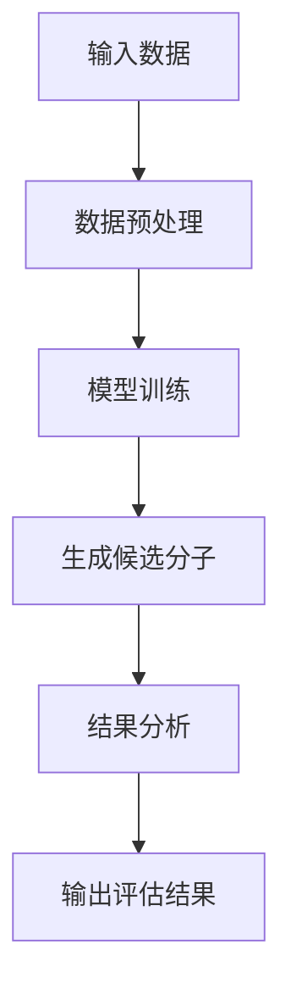
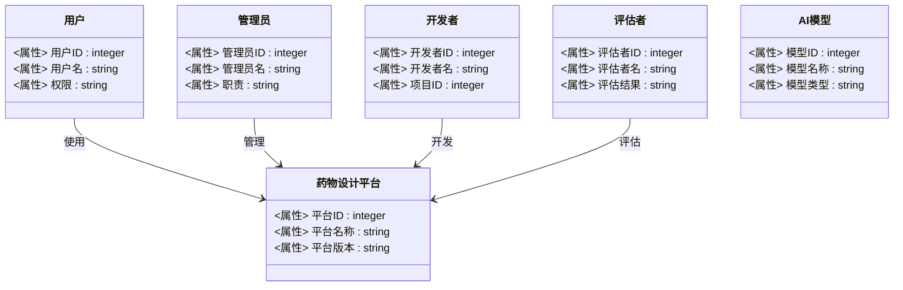
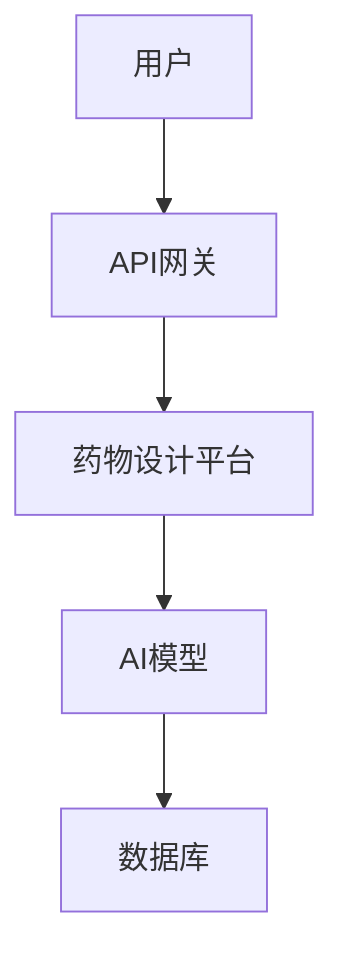
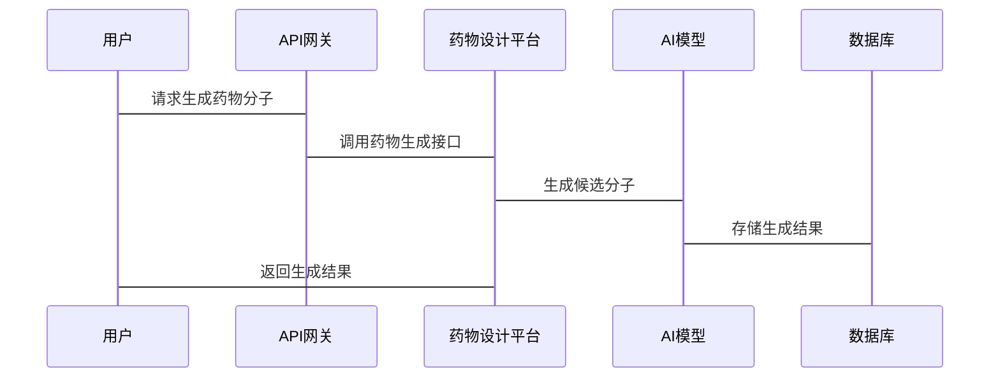

                 


# 企业估值中的AI驱动的药物设计平台评估

> **关键词**：企业估值，AI驱动，药物设计平台，深度学习，药物筛选

> **摘要**：本文详细探讨了AI技术在药物设计平台评估中的应用，从背景、核心概念、算法原理到系统架构设计，全面分析了AI如何帮助企业更高效、更准确地评估药物设计平台的价值。文章结合实际案例，详细解读了AI驱动的药物设计平台的实现过程，并总结了相关经验与最佳实践。

---

## 第一部分: 企业估值中的AI驱动的药物设计平台评估基础

### 第1章: 背景介绍与核心概念

#### 1.1 问题背景与问题描述
- **1.1.1 传统药物设计与估值的局限性**
  - 传统药物设计依赖大量实验和试错，耗时长、成本高。
  - 药物筛选效率低，难以应对日益复杂的疾病挑战。
  - 传统估值方法主观性强，难以量化平台的实际价值。

- **1.1.2 AI技术在药物设计中的应用潜力**
  - AI技术可以快速生成和优化药物分子结构。
  - 基于深度学习的模型能够预测药物的药效和毒性。
  - AI可以显著提高药物筛选的效率和准确性。

- **1.1.3 药物设计平台评估的必要性**
  - 企业需要评估AI驱动的药物设计平台的实际价值。
  - 通过评估确定平台的投资回报率和竞争优势。
  - 为企业的战略决策提供数据支持。

#### 1.2 核心概念与问题解决
- **1.2.1 AI驱动的药物设计平台定义**
  - AI驱动的药物设计平台是结合人工智能技术，用于药物分子生成、优化和筛选的平台。
  - 平台通常包括数据输入、模型训练、分子生成、结果分析等功能模块。

- **1.2.2 企业估值中的关键问题**
  - 如何量化AI平台对药物研发效率的提升作用。
  - 如何评估AI平台的成本效益。
  - 如何衡量AI平台的可扩展性和稳定性。

- **1.2.3 AI如何解决药物设计中的估值问题**
  - AI技术可以快速生成大量候选药物分子，显著降低研发成本。
  - 基于AI的模型能够预测药物的药效和毒性，提高筛选效率。
  - AI平台可以通过数据驱动的方法，提供客观的估值依据。

#### 1.3 概念结构与核心要素
- **1.3.1 药物设计平台的构成要素**
  - 数据输入模块：包括疾病靶点、化合物库等数据。
  - 模型训练模块：基于深度学习的药物生成模型。
  - 分子生成模块：生成候选药物分子结构。
  - 结果分析模块：评估分子的药效和毒性。

- **1.3.2 AI技术在平台中的应用层次**
  - 数据层：AI驱动的平台需要大量高质量的数据输入。
  - 模型层：基于深度学习的生成模型是平台的核心。
  - 应用层：AI技术在药物筛选和优化中的具体应用。

- **1.3.3 企业估值的关键指标**
  - 平台的处理速度和吞吐量。
  - 平台的准确率和召回率。
  - 平台的成本效益比。

---

### 第2章: AI驱动的药物设计平台核心原理

#### 2.1 核心概念原理
- **2.1.1 AI在药物分子生成中的作用**
  - 基于生成对抗网络（GAN）的药物分子生成。
  - 基于变分自编码器（VAE）的药物分子生成。
  - 深度强化学习在药物优化中的应用。

- **2.1.2 深度学习模型在药物筛选中的应用**
  - 基于卷积神经网络（CNN）的药物分子表征。
  - 基于循环神经网络（RNN）的药物序列生成。
  - 基于图神经网络（GNN）的药物结构分析。

- **2.1.3 平台的可扩展性和稳定性**
  - 平台的扩展性：支持大规模数据处理和模型训练。
  - 平台的稳定性：确保模型的稳定性和结果的可靠性。

#### 2.2 核心概念属性对比
- **2.2.1 AI驱动平台与传统平台的对比**
  | 特性                | AI驱动平台          | 传统平台          |
  |---------------------|--------------------|------------------|
  | 处理速度            | 快速生成候选分子    | 依赖实验和试错    |
  | 成本效益            | 成本低，效率高       | 成本高，效率低     |
  | 可扩展性            | 支持大规模数据处理  | 数据处理能力有限  |

- **2.2.2 不同AI模型的性能对比**
  | 模型类型            | GAN                | VAE              | GNN              |
  |---------------------|--------------------|------------------|------------------|
  | 生成效果            | 高                 | 中               | 高               |
  | 训练难度            | 中                 | 高               | 中               |
  | 应用场景            | 分子生成           | 分子生成         | 结构分析         |

- **2.2.3 平台的可定制化与灵活性**
  - AI平台可以根据具体需求进行定制化开发。
  - 平台支持多种数据格式和接口，具有良好的灵活性。

#### 2.3 ER实体关系图
```mermaid
erDiagram
    用户 {
        <属性> 用户ID : integer
        <属性> 用户名 : string
        <属性> 权限 : string
    }
    管理员 {
        <属性> 管理员ID : integer
        <属性> 管理员名 : string
        <属性> 职责 : string
    }
    开发者 {
        <属性> 开发者ID : integer
        <属性> 开发者名 : string
        <属性> 项目ID : integer
    }
    评估者 {
        <属性> 评估者ID : integer
        <属性> 评估者名 : string
        <属性> 评估结果 : string
    }
    药物设计平台 {
        <属性> 平台ID : integer
        <属性> 平台名称 : string
        <属性> 平台版本 : string
    }
    AI模型 {
        <属性> 模型ID : integer
        <属性> 模型名称 : string
        <属性> 模型类型 : string
    }
    用户 -> 药物设计平台 : 使用
    管理员 -> 药物设计平台 : 管理
    开发者 -> 药物设计平台 : 开发
    评估者 -> 药物设计平台 : 评估
```

---

### 第3章: AI驱动的药物设计平台评估算法原理

#### 3.1 算法原理概述
- **3.1.1 基于深度学习的药物分子生成**
  - 使用生成对抗网络（GAN）生成药物分子结构。
  - 使用变分自编码器（VAE）对分子进行编码和解码。

- **3.1.2 深度学习模型在药物筛选中的应用**
  - 基于卷积神经网络（CNN）的药物分子表征。
  - 基于循环神经网络（RNN）的药物序列生成。

- **3.1.3 平台的可扩展性和稳定性**
  - 平台支持大规模数据处理和模型训练。
  - 平台具有良好的稳定性和结果可靠性。

#### 3.2 算法流程图


#### 3.3 Python代码实现
```python
import numpy as np
import tensorflow as tf

class Generator:
    def __init__(self):
        self.model = self.build_model()

    def build_model(self):
        model = tf.keras.Sequential([
            tf.keras.layers.Dense(256, activation='relu'),
            tf.keras.layers.Dense(128, activation='relu'),
            tf.keras.layers.Dense(64, activation='sigmoid')
        ])
        return model

class Discriminator:
    def __init__(self):
        self.model = self.build_model()

    def build_model(self):
        model = tf.keras.Sequential([
            tf.keras.layers.Dense(64, activation='relu'),
            tf.keras.layers.Dense(32, activation='relu'),
            tf.keras.layers.Dense(1, activation='sigmoid')
        ])
        return model

# 损失函数
def loss_fn(generated, real):
    real_loss = tf.nn.sigmoid_cross_entropy_with_logits(labels=tf.ones_like(real), logits=real)
    generated_loss = tf.nn.sigmoid_cross_entropy_with_logits(labels=tf.zeros_like(generated), logits=generated)
    total_loss = tf.reduce_mean(real_loss + generated_loss)
    return total_loss

# 优化器
optimizer = tf.keras.optimizers.Adam(0.0002)

# 训练过程
def train_step(generator, discriminator, x):
    with tf.GradientTape() as tape:
        generated = generator.model(x)
        real_output = discriminator.model(x)
        generated_output = discriminator.model(generated)
        d_loss = loss_fn(real_output, generated_output)
    gradients = tape.gradient(d_loss, discriminator.model.trainable_weights)
    discriminator.optimizer.apply_gradients(zip(gradients, discriminator.model.trainable_weights))
    with tf.GradientTape() as tape:
        generated = generator.model(x)
        generated_output = discriminator.model(generated)
        g_loss = tf.reduce_mean(tf.nn.sigmoid_cross_entropy_with_logits(labels=tf.ones_like(generated_output), logits=generated_output))
    gradients = tape.gradient(g_loss, generator.model.trainable_weights)
    generator.optimizer.apply_gradients(zip(gradients, generator.model.trainable_weights))
    return d_loss, g_loss
```

#### 3.4 数学模型与公式
- **生成对抗网络（GAN）损失函数**
  $$ \mathcal{L}_{\text{GAN}} = \mathcal{L}_D + \mathcal{L}_G $$
  其中，判别器损失函数为：
  $$ \mathcal{L}_D = -\mathbb{E}[\log(D(x))] - \mathbb{E}[\log(1-D(G(z)))] $$
  生成器损失函数为：
  $$ \mathcal{L}_G = -\mathbb{E}[\log(D(G(z)))] $$

- **变分自编码器（VAE）损失函数**
  $$ \mathcal{L}_{\text{VAE}} = \mathbb{E}[\text{KL}(q(z|x)||p(z))] + \mathbb{E}[\log p(x|z)] $$

---

## 第四部分: 系统分析与架构设计方案

### 第4章: 系统分析与架构设计

#### 4.1 问题场景介绍
- 药物设计平台需要支持大量数据的输入和处理。
- 平台需要提供高效的药物分子生成和筛选功能。
- 平台需要具备良好的扩展性和稳定性。

#### 4.2 系统功能设计


#### 4.3 系统架构设计


#### 4.4 系统接口设计
- 用户接口：提供药物分子生成和筛选的API接口。
- 管理员接口：提供平台管理和监控功能。
- 开发者接口：提供模型训练和优化功能。

#### 4.5 系统交互流程


---

## 第五部分: 项目实战

### 第5章: 项目实战

#### 5.1 环境安装与配置
- 安装Python和TensorFlow框架。
- 安装必要的依赖库，如numpy、pandas等。

#### 5.2 核心功能实现
- 实现生成对抗网络（GAN）模型。
- 实现变分自编码器（VAE）模型。
- 实现药物分子生成和筛选功能。

#### 5.3 代码实现与解读
```python
import numpy as np
import tensorflow as tf

class Generator:
    def __init__(self):
        self.model = self.build_model()

    def build_model(self):
        model = tf.keras.Sequential([
            tf.keras.layers.Dense(256, activation='relu'),
            tf.keras.layers.Dense(128, activation='relu'),
            tf.keras.layers.Dense(64, activation='sigmoid')
        ])
        return model

class Discriminator:
    def __init__(self):
        self.model = self.build_model()

    def build_model(self):
        model = tf.keras.Sequential([
            tf.keras.layers.Dense(64, activation='relu'),
            tf.keras.layers.Dense(32, activation='relu'),
            tf.keras.layers.Dense(1, activation='sigmoid')
        ])
        return model

# 损失函数
def loss_fn(generated, real):
    real_loss = tf.nn.sigmoid_cross_entropy_with_logits(labels=tf.ones_like(real), logits=real)
    generated_loss = tf.nn.sigmoid_cross_entropy_with_logits(labels=tf.zeros_like(generated), logits=generated)
    total_loss = tf.reduce_mean(real_loss + generated_loss)
    return total_loss

# 优化器
optimizer = tf.keras.optimizers.Adam(0.0002)

# 训练过程
def train_step(generator, discriminator, x):
    with tf.GradientTape() as tape:
        generated = generator.model(x)
        real_output = discriminator.model(x)
        generated_output = discriminator.model(generated)
        d_loss = loss_fn(real_output, generated_output)
    gradients = tape.gradient(d_loss, discriminator.model.trainable_weights)
    discriminator.optimizer.apply_gradients(zip(gradients, discriminator.model.trainable_weights))
    with tf.GradientTape() as tape:
        generated = generator.model(x)
        generated_output = discriminator.model(generated)
        g_loss = tf.reduce_mean(tf.nn.sigmoid_cross_entropy_with_logits(labels=tf.ones_like(generated_output), logits=generated_output))
    gradients = tape.gradient(g_loss, generator.model.trainable_weights)
    generator.optimizer.apply_gradients(zip(gradients, generator.model.trainable_weights))
    return d_loss, g_loss
```

#### 5.4 案例分析与详细解读
- 通过实际案例分析AI驱动的药物设计平台的评估过程。
- 解释生成模型和优化算法在实际中的应用。

#### 5.5 项目小结
- 总结项目实施过程中的关键点和经验教训。
- 提出改进建议和未来发展方向。

---

## 第六部分: 总结与展望

### 第6章: 总结与展望

#### 6.1 最佳实践 tips
- 确保数据质量，选择合适的AI模型。
- 定期更新模型，保持平台的先进性。
- 注重平台的可扩展性和稳定性。

#### 6.2 小结
- AI技术在药物设计平台评估中的应用前景广阔。
- 通过合理的系统设计和算法优化，可以显著提高药物研发效率。

#### 6.3 注意事项
- 数据隐私和安全问题需要高度重视。
- 确保模型的稳定性和可靠性。
- 及时跟踪AI技术的发展动态，保持平台的技术领先性。

#### 6.4 拓展阅读
- 推荐相关书籍和论文，供读者进一步学习和研究。

---

通过以上详细的内容，您可以系统地了解AI驱动的药物设计平台在企业估值中的应用。希望本文能为您提供有价值的见解和实践指导。

