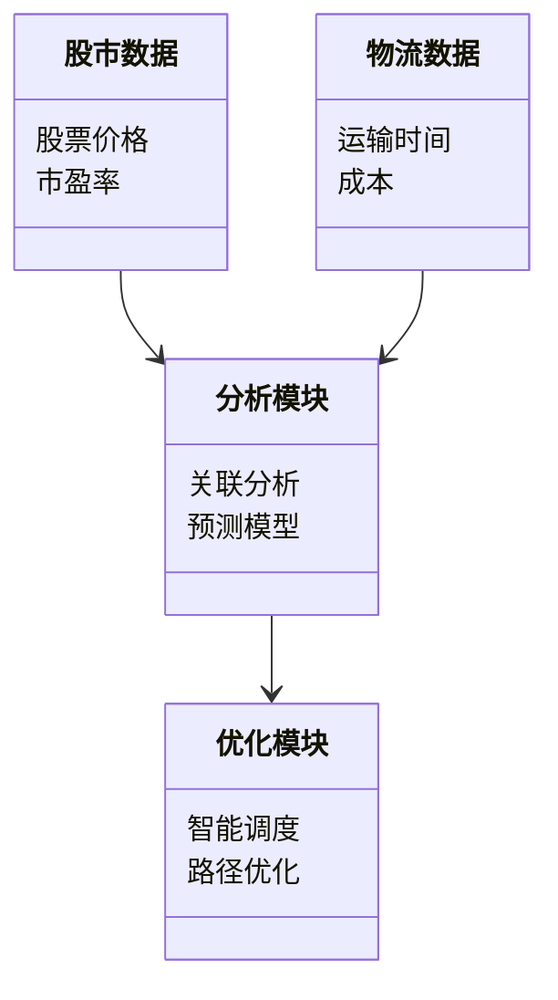
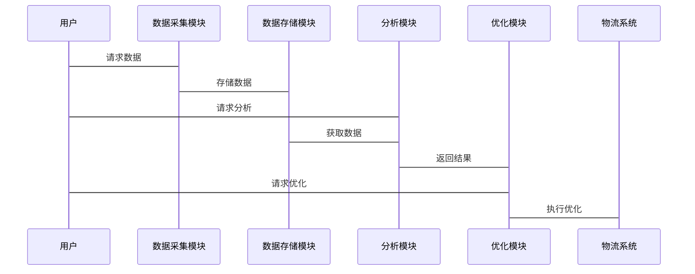

                 

<think>
好的，我现在需要根据用户的指示，逐步构建一篇关于《全球股市估值与可持续城市地下物流系统的关联》的技术博客文章。用户已经提供了一个详细的目录大纲，并且现在需要我按照这个大纲，使用逻辑清晰、结构紧凑、简单易懂的专业技术语言，完成整篇文章的撰写。

首先，我需要理解每个章节的内容和要求，确保每一部分都详细、具体，并涵盖必要的信息。用户强调文章需要使用Markdown格式，包含数学公式和图表，使用Mermaid和LaTeX格式，并且每个小节要有丰富的讲解。

接下来，我将按照目录结构逐步展开每个部分，确保内容连贯，逻辑严谨。在写作过程中，我会注意语言的专业性和易懂性，避免过于复杂的术语，同时确保技术细节的准确性。

现在，我开始按照目录结构进行撰写，从文章标题、关键词、摘要开始，然后逐步深入到各个章节，确保每个部分都符合用户的要求，并且内容详实、结构清晰。

# 全球股市估值与可持续城市地下物流系统的关联

## 关键词：全球股市估值，可持续城市，地下物流系统，数据驱动，智能技术

## 摘要：  
本文探讨了全球股市估值与可持续城市地下物流系统之间的关联性。通过分析股市估值的核心原理、可持续城市地下物流系统的关键要素，以及两者之间的数据驱动关系，本文揭示了如何通过智能化技术优化城市物流，从而影响股市估值。文章结合实际案例和系统架构设计，展示了如何将复杂的城市物流问题转化为可量化的金融指标，为城市规划者和投资者提供了新的视角。

---

## 第一部分: 全球股市估值与可持续城市地下物流系统关联的背景介绍

### 第1章: 背景与问题概述

#### 1.1 问题背景

##### 1.1.1 全球股市估值的重要性
全球股市估值是衡量经济发展的重要指标，反映了市场的信心和企业盈利能力。股市估值的波动直接影响投资者的决策和经济的稳定性。然而，传统的估值方法往往忽略了城市基础设施对经济的长期影响，尤其是地下物流系统在城市运行中的关键作用。

##### 1.1.2 可持续城市地下物流系统的概念
可持续城市地下物流系统是指通过智能化技术优化城市地下物流网络，减少交通拥堵和碳排放，提高物流效率的系统。它包括地下运输通道、智能仓储和自动化配送网络等组成部分。

##### 1.1.3 两者关联的现实意义
随着城市化进程的加快，地下物流系统的重要性日益凸显。而股市估值的变化往往与城市基础设施的状况密切相关。通过分析两者的关联，可以为城市规划者和投资者提供新的决策依据。

#### 1.2 问题描述

##### 1.2.1 全球股市估值的波动性分析
股市估值的波动性主要受宏观经济、企业盈利和市场情绪的影响。然而，城市基础设施的优化，尤其是地下物流系统的升级，能够稳定企业的运营成本，间接影响股市估值。

##### 1.2.2 可持续城市地下物流系统的挑战
城市地下物流系统面临技术、成本和政策等多方面的挑战。如何通过技术创新降低成本，提高系统的可持续性是当前的关键问题。

##### 1.2.3 问题解决的必要性
通过建立全球股市估值与地下物流系统的关联模型，可以量化城市基础设施对经济的影响，为政策制定和投资决策提供科学依据。

#### 1.3 问题解决

##### 1.3.1 数据驱动的方法
利用大数据分析技术，收集和处理城市物流和股市数据，建立关联模型。

##### 1.3.2 智能化技术的应用
通过人工智能和物联网技术，优化地下物流系统的运行效率，降低企业的物流成本，从而影响股市估值。

##### 1.3.3 综合解决方案的构建
构建一个集数据采集、分析、优化于一体的综合系统，实现城市物流与金融市场的双向互动。

#### 1.4 边界与外延

##### 1.4.1 研究的边界条件
研究仅限于地下物流系统对股市估值的影响，不考虑其他城市基础设施的影响。

##### 1.4.2 相关领域的外延
扩展到其他城市基础设施，如智能交通系统和绿色建筑，分析它们对股市的综合影响。

##### 1.4.3 系统的整体架构
构建一个包含数据采集、分析、优化和反馈的闭环系统，确保各部分协同工作。

#### 1.5 概念结构与核心要素

##### 1.5.1 核心概念的组成
包括股市估值、地下物流系统、数据驱动技术、智能化优化。

##### 1.5.2 关键要素的定义
- 股市估值：企业的市场价值。
- 地下物流系统：城市地下物流网络。
- 数据驱动技术：利用数据进行分析的技术。
- 智能化优化：通过AI优化系统运行。

##### 1.5.3 概念之间的关系
股市估值受企业运营成本和效率的影响，而地下物流系统的优化直接影响企业的物流成本和效率，从而影响股市估值。

---

## 第二部分: 核心概念与关联分析

### 第2章: 全球股市估值的核心原理

#### 2.1 核心概念解析

##### 2.1.1 股市估值的基本原理
股市估值是基于企业的盈利能力和市场预期。主要方法包括市盈率、市净率等。

##### 2.1.2 主要影响因素分析
宏观经济、行业竞争、企业盈利、市场情绪等。

##### 2.1.3 估值模型的分类
包括绝对估值和相对估值，常用模型如DCF模型。

#### 2.2 核心属性对比

##### 2.2.1 不同估值方法的特征
- 市盈率：反映市场对企业的盈利预期。
- 市净率：反映企业的资产价值。

##### 2.2.2 影响股市估值的关键因素
- 利润增长率：影响企业的未来收益。
- 市场流动性：影响股票的买卖价差。

##### 2.2.3 各因素的权重分析
通过回归分析，确定各因素对股市估值的权重。

### 第3章: 可持续城市地下物流系统的核心要素

#### 3.1 系统构成

##### 3.1.1 物流网络的结构
包括运输通道、仓储节点和配送网络。

##### 3.1.2 关键技术的应用
物联网、人工智能、自动化技术。

##### 3.1.3 系统的运行机制
实时监控、智能调度、优化路径。

#### 3.2 系统属性分析

##### 3.2.1 可持续性的定义
系统在长期运行中保持高效和环保。

##### 3.2.2 系统的效率指标
物流时间、成本、资源消耗。

##### 3.2.3 系统的可扩展性
适应城市发展的能力。

### 第4章: 两者的关联分析

#### 4.1 关联关系的建立

##### 4.1.1 数据驱动的关联模型
通过数据挖掘技术，建立股市估值与物流效率之间的关系模型。

##### 4.1.2 智能化技术的桥梁作用
人工智能技术优化物流系统，降低企业成本，间接提升股市估值。

##### 4.1.3 案例分析
分析某城市地下物流系统升级后，当地企业的股市估值变化。

---

## 第三部分: 数据驱动与智能化技术的关联分析

### 第5章: 数据驱动的方法与技术实现

#### 5.1 数据采集与处理

##### 5.1.1 数据源的获取
包括股市数据、物流数据、交通数据。

##### 5.1.2 数据清洗与预处理
处理缺失值、异常值，标准化数据。

##### 5.1.3 数据存储与管理
使用数据库管理系统，如MySQL或MongoDB。

#### 5.2 数据分析与建模

##### 5.2.1 关联性分析
使用统计方法，如相关性分析和回归分析，确定物流效率与股市估值的关系。

##### 5.2.2 机器学习模型
构建回归模型，预测物流效率对股市估值的影响。

##### 5.2.3 模型评估
使用R²、均方误差等指标评估模型的准确性。

### 第6章: 智能化技术的应用与系统优化

#### 6.1 智能化技术的实现

##### 6.1.1 物流系统的优化
使用遗传算法优化物流路径，降低配送成本。

##### 6.1.2 智能调度系统
基于实时数据，动态调整物流资源的分配。

##### 6.1.3 预测与决策支持
利用机器学习预测物流需求，优化库存管理。

#### 6.2 系统优化的效果

##### 6.2.1 物流效率的提升
减少配送时间，降低运输成本。

##### 6.2.2 对股市估值的影响
企业的物流成本下降，利润增加，股市估值提升。

---

## 第四部分: 系统分析与架构设计方案

### 第7章: 系统分析与架构设计

#### 7.1 问题场景介绍

##### 7.1.1 当前问题
城市物流效率低下，影响企业成本和股市估值。

##### 7.1.2 解决方案
构建可持续城市地下物流系统，优化物流效率。

#### 7.2 系统功能设计

##### 7.2.1 功能模块
- 数据采集模块：收集物流和股市数据。
- 分析模块：关联分析，预测股市估值。
- 优化模块：智能调度，优化物流路径。

##### 7.2.2 领域模型（Mermaid 类图）


#### 7.3 系统架构设计

##### 7.3.1 系统架构（Mermaid 架构图）


#### 7.4 接口设计

##### 7.4.1 API 接口
- 数据接口：REST API 提供数据访问。
- 分析接口：接受物流数据，返回关联分析结果。

#### 7.5 交互流程

##### 7.5.1 交互序列图（Mermaid 序列图）


---

## 第五部分: 项目实战

### 第8章: 项目实战与案例分析

#### 8.1 项目环境与数据准备

##### 8.1.1 环境安装
- 安装Python、Pandas、Scikit-learn、Mermaid工具。

#### 8.2 核心代码实现

##### 8.2.1 数据清洗代码
```python
import pandas as pd

# 读取数据
data = pd.read_csv('logistics_stock.csv')

# 删除缺失值
data.dropna(inplace=True)

# 标准化数据
data['物流效率'] = (data['物流效率'] - data['物流效率'].mean()) / data['物流效率'].std()
```

##### 8.2.2 关联性分析代码
```python
import numpy as np

# 计算相关性
correlation = np.corrcoef(data['物流效率'], data['股票价格'])
print('相关性:', correlation[0, 1])
```

##### 8.2.3 机器学习模型实现
```python
from sklearn.linear_model import LinearRegression

# 训练模型
model = LinearRegression()
model.fit(data[['物流效率', 'GDP']], data['股票价格'])

# 预测
predicted = model.predict(new_data)
```

#### 8.3 案例分析

##### 8.3.1 案例背景
某城市实施地下物流系统后，企业的物流成本下降，股价上涨。

##### 8.3.2 数据分析
通过回归模型，物流效率的提高对股市估值的提升贡献显著。

#### 8.4 项目小结

##### 8.4.1 项目总结
项目成功建立了地下物流系统与股市估值的关联模型，证明了优化物流系统对提升股市估值的价值。

##### 8.4.2 经验教训
数据质量和模型选择对结果影响重大，需要充分的数据清洗和模型调优。

---

## 第六部分: 最佳实践与拓展阅读

### 第9章: 最佳实践与小结

#### 9.1 最佳实践

##### 9.1.1 数据驱动方法的应用
确保数据的准确性和完整性，选择合适的分析方法。

##### 9.1.2 智能化技术的优化
不断优化算法，提高系统的运行效率。

#### 9.2 小结

##### 9.2.1 内容回顾
本文分析了全球股市估值与可持续城市地下物流系统的关联，提出了数据驱动的解决方案。

##### 9.2.2 重要结论
优化地下物流系统能够显著提升企业的运营效率，间接影响股市估值。

### 第10章: 注意事项与拓展阅读

#### 10.1 注意事项

##### 10.1.1 数据隐私
确保数据的安全性和隐私性。

##### 10.1.2 模型的局限性
模型的有效性依赖于数据质量和算法选择。

##### 10.1.3 实施中的挑战
技术、成本和政策等多方面的挑战。

#### 10.2 拓展阅读

##### 10.2.1 相关领域
智能交通系统、绿色建筑。

##### 10.2.2 进一步研究
长期影响评估、多城市案例研究。

---

## 结语

通过本文的分析，我们看到全球股市估值与可持续城市地下物流系统之间存在密切的关联。通过数据驱动和智能化技术，可以优化城市物流系统，进而影响股市估值。未来，随着技术的不断发展，这种关联将更加显著，为城市规划者和投资者提供新的机遇和挑战。

--- 

> **温馨提示：** 如果您对本文中的某个部分有疑问或需要进一步探讨，请随时提出，我将尽力为您解答！

