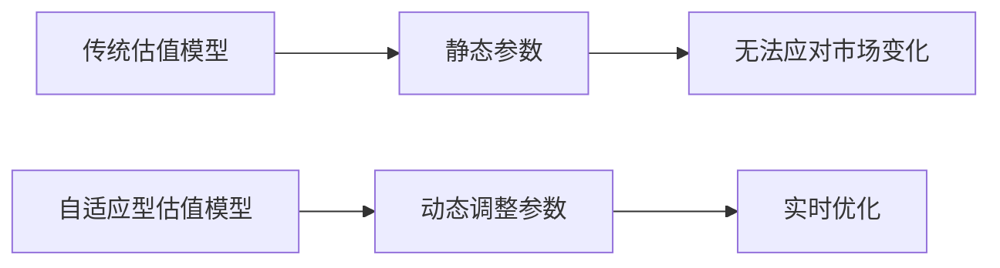

                 


# 《利用AI agents构建自适应型估值模型：应对市场变化》

---

## 关键词：
- AI agents
- 自适应型估值模型
- 市场变化
- 机器学习
- 强化学习
- 时间序列分析
- 系统架构设计

---

## 摘要：
随着市场的快速变化，传统的静态估值模型难以应对动态环境中的不确定性。本文将探讨如何利用AI代理（AI agents）构建自适应型估值模型，以实时调整和优化估值策略。通过结合强化学习、时间序列分析和系统架构设计，本文将深入分析自适应型估值模型的核心原理、算法实现、系统架构，并通过实际案例展示其在金融、经济等领域的广泛应用。最终，本文将为读者提供一套应对市场变化的高效解决方案。

---

## 目录大纲：

### 第一部分：引言

#### 1.1 问题背景与目标
- 1.1.1 传统估值模型的局限性
  - 静态模型无法应对市场波动
  - 数据依赖性过强，难以实时调整
- 1.1.2 问题描述
  - 市场变化对估值模型的挑战
  - 数据动态变化对模型准确性的冲击
- 1.1.3 解决方案
  - 引入AI代理实现动态调整
  - 基于强化学习的自适应优化
- 1.1.4 本书目标与结构
  - 通过AI代理构建自适应型估值模型
  - 分步讲解算法原理与系统实现

---

### 第二部分：自适应型估值模型概述

#### 2.1 自适应型估值模型的核心概念
- 2.1.1 自适应型估值模型的定义
  - 能够实时调整参数的动态估值模型
  - 基于反馈机制优化估值结果
- 2.1.2 自适应型估值模型的特点
  - 灵活性：快速响应市场变化
  - 智能性：基于数据驱动的优化
  - 鲁棒性：抗干扰能力强
- 2.1.3 自适应型估值模型与传统模型的对比
  - 表格对比：功能、优缺点、适用场景



---

#### 2.2 AI代理的基本原理
- 2.2.1 AI代理的定义与分类
  - 定义：能够感知环境并采取行动的智能体
  - 分类：基于规则的代理、基于模型的代理、强化学习代理
- 2.2.2 AI代理的核心功能
  - 环境感知：数据采集与分析
  - 决策制定：基于策略的选择
  - 行动执行：输出结果或触发操作
- 2.2.3 AI代理在自适应型估值模型中的作用
  - 数据采集与处理
  - 策略优化与调整
  - 实时反馈与修正


---

#### 2.3 自适应型估值模型的构建框架
- 2.3.1 数据采集与处理
  - 数据源：市场数据、用户反馈、历史记录
  - 数据预处理：清洗、转换、特征提取
- 2.3.2 模型训练与优化
  - 算法选择：强化学习、时间序列分析
  - 参数调优：超参数优化
- 2.3.3 模型部署与应用
  - 实时监控：动态调整模型参数
  - 结果输出：可视化与反馈

---

### 第三部分：自适应型估值模型的数学基础

#### 3.1 基础数学模型
- 3.1.1 线性回归模型
  - 简单线性回归：$y = \beta_0 + \beta_1x + \epsilon$
  - 多元线性回归：$y = \beta_0 + \beta_1x_1 + \beta_2x_2 + \dots + \beta_nx_n + \epsilon$
- 3.1.2 时间序列分析
  - ARIMA模型：$y_t = \phi y_{t-1} + \theta \epsilon_{t-1} + \epsilon_t$
  - LSTM网络：长短期记忆网络
- 3.1.3 贝叶斯网络
  - 贝叶斯定理：$P(A|B) = \frac{P(B|A)P(A)}{P(B)}$

#### 3.2 基于AI代理的强化学习模型
- 3.2.1 强化学习的基本原理
  - 状态（State）、动作（Action）、奖励（Reward）的三元组
  - Q-learning算法：$Q(s, a) = r + \gamma \max Q(s', a')$
- 3.2.2 Q-learning算法
  - 状态空间：S
  - 动作空间：A
  - 奖励函数：R
- 3.2.3 策略梯度方法
  - 策略梯度：$\nabla\theta J(\theta) = \mathbb{E}[ \nabla\theta \log \pi(a|s) Q(s,a) ]$

#### 3.3 深度学习模型在估值中的应用
- 3.3.1 卷积神经网络（CNN）
  - 卷积层：提取空间特征
  - 池化层：降低维度
- 3.3.2 循环神经网络（RNN）
  - LSTM层：处理序列数据
  - GRU层：简化时序建模
- 3.3.3 图神经网络（GNN）
  - 图结构数据：节点与边的关系
  - GAT层：注意力机制

---

### 第四部分：系统分析与架构设计

#### 4.1 问题场景介绍
- 项目背景：金融市场的动态估值需求
- 项目目标：构建实时调整的自适应型估值模型

#### 4.2 系统功能设计
- 领域模型：自适应型估值系统
  ```mermaid
  graph LR
  A[数据采集模块] --> B[数据预处理模块]
  B --> C[模型训练模块]
  C --> D[模型优化模块]
  D --> E[结果输出模块]
  ```

#### 4.3 系统架构设计
- 系统架构：分层架构
  ```mermaid
  graph LR
  A[数据层] --> B[数据采集模块]
  B --> C[数据处理模块]
  C --> D[模型训练模块]
  D --> E[模型优化模块]
  E --> F[结果输出模块]
  ```

#### 4.4 系统接口设计
- 接口定义：RESTful API
  - 输入：市场数据、用户请求
  - 输出：估值结果、反馈信息

#### 4.5 系统交互设计
- 交互流程：实时反馈机制
  ```mermaid
  graph LR
  A[用户请求] --> B[数据采集模块]
  B --> C[数据处理模块]
  C --> D[模型训练模块]
  D --> E[模型优化模块]
  E --> F[结果输出模块]
  F --> G[用户反馈]
  ```

---

### 第五部分：项目实战

#### 5.1 环境安装与配置
- 环境要求：Python 3.8+
- 安装依赖：TensorFlow、Keras、Mermaid、Jupyter

#### 5.2 系统核心实现
- 源代码实现：自适应型估值模型
  ```python
  import tensorflow as tf
  from tensorflow.keras import layers

  model = tf.keras.Sequential([
      layers.Dense(64, activation='relu'),
      layers.Dense(1, activation='linear')
  ])
  model.compile(optimizer='adam', loss='mean_squared_error')
  ```

#### 5.3 案例分析与详细解读
- 实际案例：金融市场的动态估值
  - 数据来源：股票价格、市场指数
  - 模型训练：使用历史数据进行训练
  - 模型优化：实时调整参数

---

### 第六部分：最佳实践与未来展望

#### 6.1 小结
- 本文总结了利用AI代理构建自适应型估值模型的核心内容
- 强调了动态调整与实时反馈的重要性

#### 6.2 注意事项
- 数据质量的重要性
- 模型调优的复杂性
- 系统架构的可扩展性

#### 6.3 拓展阅读
- 推荐书籍：《强化学习导论》
- 推荐文章：《时间序列分析与机器学习》

---

### 结语
通过本文的详细讲解，读者可以掌握利用AI代理构建自适应型估值模型的核心方法，并能够将其应用于实际场景中。未来，随着AI技术的不断发展，自适应型估值模型将在更多领域展现出其强大的应用潜力。

