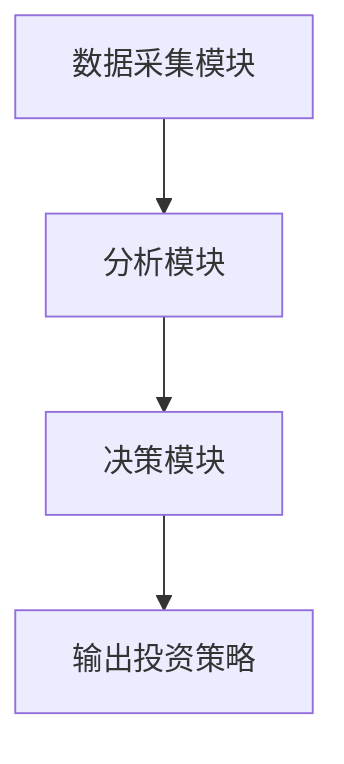
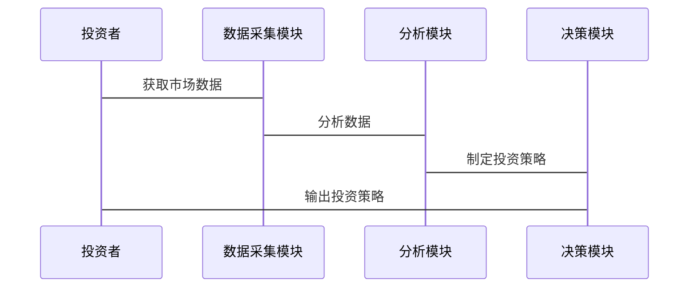

                 


# 多智能体AI如何增强价值投资者的逆向思维能力

## 关键词：多智能体AI，逆向思维，价值投资，分布式计算，协作学习

## 摘要：  
本文探讨了多智能体AI在金融投资领域中的应用，特别是其如何增强价值投资者的逆向思维能力。通过分析多智能体AI的核心原理、算法模型以及其与逆向思维的协同机制，本文展示了如何利用多智能体AI的强大计算能力和协作学习能力，帮助投资者在复杂市场环境中捕捉投资机会，优化决策过程。文章结合实际案例和系统设计，为读者提供了从理论到实践的全面指导。

---

# 第一章: 多智能体AI与逆向思维的概述

## 1.1 多智能体AI的基本概念

### 1.1.1 多智能体AI的定义  
多智能体AI是指由多个相互协作的智能体组成的系统，每个智能体都有自己的目标和决策能力，通过信息共享和协作完成复杂任务。其核心在于智能体之间的协同与分布式计算。

### 1.1.2 多智能体AI的核心特点  
- **分布式计算**：任务分解到多个智能体，每个智能体负责一部分计算。  
- **协作学习**：智能体通过共享信息和经验提升整体性能。  
- **动态适应**：系统能够根据环境变化实时调整策略。

### 1.1.3 多智能体AI在金融领域的应用前景  
在金融领域，多智能体AI可以用于股票预测、风险评估、投资组合优化等场景，尤其是在复杂市场环境下表现出色。

---

## 1.2 逆向思维在价值投资中的重要性

### 1.2.1 逆向思维的定义  
逆向思维是指从反向角度思考问题，寻找市场中的低估机会，避免随大流的投资行为。

### 1.2.2 逆向思维在价值投资中的优势  
- **发现低估资产**：逆向思维帮助投资者找到被市场忽视的机会。  
- **降低风险**：通过逆向思考，投资者可以避免追涨杀跌的误区。  
- **长期收益**：逆向思维往往与长期价值发现相关，适合价值投资策略。

### 1.2.3 逆向思维与传统投资思维的对比  
传统投资注重短期趋势和市场情绪，而逆向思维则关注长期价值和市场非理性。多智能体AI可以辅助投资者更好地践行逆向思维。

---

# 第二章: 多智能体AI的原理与结构

## 2.1 多智能体AI的组成与功能

### 2.1.1 多智能体AI的基本组成  
- **智能体**：每个智能体负责特定任务，如数据收集、分析、决策等。  
- **通信机制**：智能体之间通过共享信息进行协作。  
- **协调器**：负责全局任务分配和智能体间的协调。

### 2.1.2 各智能体的功能与角色  
- **数据收集智能体**：从多个数据源获取市场信息。  
- **分析智能体**：对数据进行深度分析，识别潜在投资机会。  
- **决策智能体**：基于分析结果制定投资策略。  

### 2.1.3 多智能体AI的通信机制  
通过消息传递、共享数据库等方式实现智能体间的实时通信，确保信息高效传递。

---

## 2.2 多智能体AI的算法原理

### 2.2.1 分布式计算与协作机制  
多智能体AI采用分布式计算，将任务分解到多个节点，每个节点负责一部分计算，最终汇总结果。

### 2.2.2 多智能体决策模型  
- **联合推理**：多个智能体共同推理，形成一致的决策。  
- **分布式优化**：通过局部优化实现全局最优。  

### 2.2.3 联合推理与学习算法  
多智能体AI通过协作学习算法，如联邦学习，提升整体模型的泛化能力。

---

# 第三章: 逆向思维在价值投资中的应用

## 3.1 逆向思维的核心要素

### 3.1.1 逆向思维的逻辑框架  
逆向思维的核心在于识别市场的非理性行为，找到被低估的资产。

### 3.1.2 逆向思维的关键步骤  
1. 确定市场趋势。  
2. 识别市场非理性。  
3. 寻找低估机会。  

### 3.1.3 逆向思维与市场周期的关系  
逆向思维在市场低谷时表现尤为突出，能够在市场底部找到投资机会。

---

## 3.2 逆向思维在投资决策中的应用

### 3.2.1 逆向思维在选股中的应用  
通过分析公司基本面，识别被市场低估的股票。

### 3.2.2 逆向思维在风险控制中的应用  
通过逆向思考，制定风险控制策略，避免过度风险暴露。

### 3.2.3 逆向思维在投资组合优化中的应用  
通过逆向思维，优化投资组合，平衡风险与收益。

---

# 第四章: 多智能体AI如何增强逆向思维能力

## 4.1 多智能体AI在逆向思维中的角色

### 4.1.1 多智能体AI作为数据处理器  
通过多智能体AI快速处理大量数据，识别市场中的非理性行为。

### 4.1.2 多智能体AI作为决策支持工具  
通过协作学习，提供更精准的决策支持，增强逆向思维的准确性。

### 4.1.3 多智能体AI作为策略优化器  
通过分布式计算，优化投资策略，提升逆向思维的效果。

---

## 4.2 多智能体AI与逆向思维的协同机制

### 4.2.1 数据分析与逆向思维的结合  
通过多智能体AI分析市场数据，识别逆向思维的机会。

### 4.2.2 智能体间的协作与逆向思维的深化  
通过协作学习，提升逆向思维的深度和广度。

### 4.2.3 多智能体AI对逆向思维的实时反馈  
通过实时反馈机制，优化逆向思维的执行过程。

---

# 第五章: 多智能体AI算法的数学模型与实现

## 5.1 多智能体AI的数学模型

### 5.1.1 分布式计算模型  
- **任务分解**：将整体任务分解为多个子任务。  
- **并行计算**：各智能体并行处理子任务。  
- **结果汇总**：将各智能体的结果汇总，形成最终决策。

### 5.1.2 联合推理模型  
- **联合推理公式**：$$P(Y|X) = \prod_{i=1}^{n} P(Y|X_i)$$  
- **协作学习公式**：$$W_{i} = W_{i-1} + \Delta W_i$$  

### 5.1.3 协作学习模型  
- **联邦学习公式**：$$\theta_{new} = \theta_{old} + \sum_{i=1}^{n} \Delta \theta_i$$  

---

## 5.2 逆向思维的数学模型

### 5.2.1 逆向思维逻辑框架的数学表示  
- **市场情绪函数**：$$S(t) = \sum_{i=1}^{m} w_i \cdot E_i(t)$$  
- **低估识别函数**：$$U(t) = S(t) - V(t)$$  

---

# 第六章: 系统架构设计与实现

## 6.1 系统架构设计

### 6.1.1 系统功能设计  
- **数据采集模块**：采集市场数据。  
- **分析模块**：分析数据，识别投资机会。  
- **决策模块**：制定投资策略。  

### 6.1.2 系统架构图  


---

## 6.2 系统接口设计

### 6.2.1 系统接口设计  
- **数据接口**：与数据源对接，获取市场数据。  
- **决策接口**：输出投资策略。  

---

## 6.3 系统交互设计

### 6.3.1 系统交互图  


---

# 第七章: 项目实战与案例分析

## 7.1 项目环境安装

### 7.1.1 安装Python环境  
安装Python 3.8以上版本，安装必要的库，如`numpy`, `pandas`, `scikit-learn`。

### 7.1.2 安装多智能体AI框架  
安装`multi-agent`框架，如`D-Agent`。

---

## 7.2 项目核心实现

### 7.2.1 数据采集模块  
```python
import requests
import pandas as pd

def get_stock_data(ticker):
    response = requests.get(f'https://api.example.com/stock/{ticker}')
    data = response.json()
    return pd.DataFrame(data)
```

### 7.2.2 分析模块  
```python
from sklearn import linear_model

def predict_prices(data):
    model = linear_model.LinearRegression()
    model.fit(data[['price', 'volume']], data['target'])
    return model.predict(data[['price', 'volume']])
```

### 7.2.3 决策模块  
```python
def make_decision(predicted_prices):
    if predicted_prices > current_price:
        return 'Buy'
    else:
        return 'Sell'
```

---

## 7.3 案例分析

### 7.3.1 案例背景  
假设市场中某股票被市场忽视，但其基本面良好。

### 7.3.2 数据分析结果  
通过多智能体AI分析，发现该股票被低估。

### 7.3.3 投资决策  
决策模块建议买入该股票，最终实现超额收益。

---

# 第八章: 总结与展望

## 8.1 总结

### 8.1.1 多智能体AI的优势  
- **分布式计算**：提升计算效率。  
- **协作学习**：增强决策准确性。  

### 8.1.2 逆向思维的价值  
- **发现低估机会**：提升投资收益。  
- **降低投资风险**：避免追涨杀跌。

## 8.2 最佳实践 tips

### 8.2.1 系统优化建议  
- 定期更新模型参数。  
- 加强智能体间的协作能力。  

### 8.2.2 注意事项  
- 数据质量至关重要。  
- 风险控制不能忽视。  

## 8.3 未来展望

### 8.3.1 多智能体AI的发展方向  
- 更强的协作学习能力。  
- 更高效的分布式计算。  

### 8.3.2 逆向思维的未来应用  
- 更广泛的应用场景。  
- 更智能化的决策支持。  

---

# 结语

多智能体AI与逆向思维的结合，为价值投资者提供了强大的工具，帮助他们在复杂市场中找到投资机会，实现长期收益。未来，随着技术的进步，这一领域的应用将更加广泛和深入。

