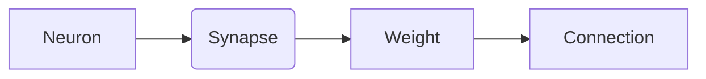
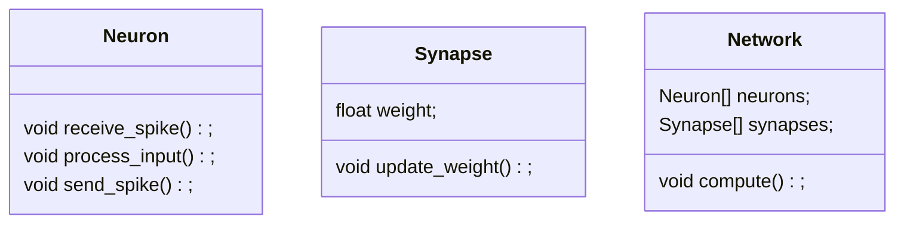
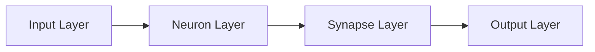
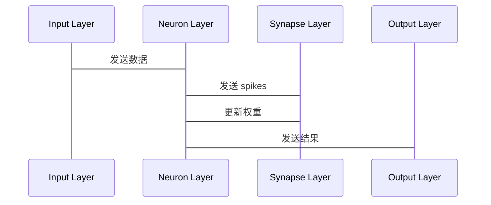

                 


# 如何识别企业的神经形态计算芯片优势

> 关键词：神经形态计算，类脑芯片，计算模型，硬件架构，能效分析

> 摘要：神经形态计算芯片是一种模仿生物神经系统结构和功能的新型计算芯片，能够在特定场景下实现高效的计算。本文将从硬件架构、计算模型、能效分析、系统设计等多方面详细解析神经形态计算芯片的优势，帮助企业更好地识别和应用这一技术。

---

# 第一部分：神经形态计算芯片背景与概念

## 第1章：神经形态计算芯片概述

### 1.1 神经形态计算的基本概念

#### 1.1.1 神经形态计算的定义
神经形态计算（Neuromorphic Computing）是一种模拟生物神经系统结构和功能的计算范式。它通过模仿人脑的神经元和突触的工作方式，实现高效的信息处理和计算。

#### 1.1.2 神经形态计算与传统计算的对比
- **传统计算**：基于冯·诺依曼架构，数据存储和计算分离，计算效率受限于数据搬运。
- **神经形态计算**：数据存储与计算一体化，事件驱动，适合实时处理和并行计算。

#### 1.1.3 神经形态计算在企业中的应用价值
神经形态芯片在图像处理、语音识别、实时数据分析等领域表现出色，能够显著降低能耗并提高计算效率。

### 1.2 神经形态计算芯片的背景与现状

#### 1.2.1 神经形态计算的历史发展
- 20世纪50年代：神经网络概念提出。
- 20世纪末：神经形态芯片研究开始兴起。
- 近年来：随着AI需求增长，神经形态芯片技术快速发展。

#### 1.2.2 当前神经形态芯片的技术现状
- 研究机构：如英特尔的Loihi芯片、IBM的TrueNorth芯片。
- 商业化应用：部分芯片已应用于特定领域，如边缘计算和实时数据分析。

#### 1.2.3 神经形态计算在企业中的应用趋势
随着AI技术的普及，企业对高效、低功耗计算的需求增加，神经形态芯片的应用前景广阔。

### 1.3 本章小结
本章介绍了神经形态计算的基本概念、发展历程及其在企业中的应用价值，为后续内容奠定了基础。

---

# 第二部分：神经形态计算芯片的核心概念与原理

## 第2章：神经形态计算芯片的核心概念

### 2.1 神经形态芯片的生物启发性

#### 2.1.1 神经元模型与计算原理
神经元通过 spikes（脉冲）传递信息，具有事件驱动的特性，适合处理实时动态数据。

#### 2.1.2 突触模型与信息处理机制
突触通过权重调整实现信息的存储和传递，支持自适应学习和记忆功能。

#### 2.1.3 神经网络的并行计算特点
神经网络通过并行计算实现高效的信息处理，适用于复杂的模式识别任务。

### 2.2 神经形态计算芯片的计算模型

#### 2.2.1 基于 spikes 的计算模型
- **spikes 生成**：神经元接收到足够输入后，触发 spikes 发放。
- **spikes 传递**：通过突触将 spikes 传递到下一个神经元。
- **网络计算**：整个网络通过 spikes 的传递完成信息处理和计算。

#### 2.2.2 基于模拟电路的计算模型
- **模拟电路实现**：使用模拟电路模拟神经元和突触的动态特性。
- **事件驱动计算**：仅在 spikes 事件发生时触发计算，降低能耗。

#### 2.2.3 神经形态芯片的事件驱动机制
- **事件驱动**：只在有数据变化时进行处理，减少无效计算。
- **高效处理**：适用于实时数据流处理，如视觉和听觉场景。

### 2.3 神经形态芯片的性能特征对比

#### 2.3.1 与传统 CPU 的对比
- **计算效率**：神经形态芯片在特定任务上效率更高。
- **能耗**：神经形态芯片具有更低的能耗。

#### 2.3.2 与 GPU 的对比
- **并行计算**：神经形态芯片的并行计算能力更强。
- **应用场景**：神经形态芯片更适合实时性和低功耗场景。

#### 2.3.3 与专用加速器的对比
- **专用性**：神经形态芯片针对特定任务优化，性能更优。
- **通用性**：传统加速器针对通用任务优化。

### 2.4 神经形态芯片的核心概念与联系

#### 2.4.1 神经形态芯片的核心概念原理
- **神经元的生物特性**：模拟生物神经元的 spikes 发放和响应特性。
- **突触的权重调整机制**：通过学习算法调整突触权重，实现自适应计算。
- **神经网络的可塑性**：网络结构和参数可以根据任务动态调整。

#### 2.4.2 神经形态芯片的核心概念对比表

| 对比维度       | 神经形态芯片                   | 传统 CPU                   |
|----------------|-------------------------------|-----------------------------|
| 处理模式       | 事件驱动，spikes 传递          | 周期性处理，数据存储与计算分离 |
| 能耗           | 低能耗，适合实时任务          | 高能耗，适合通用计算         |
| 并行能力       | 强，适用于复杂模式识别         | 弱，适用于单线程任务         |

#### 2.4.3 神经形态芯片的 ER 实体关系图


## 第3章：神经形态计算芯片的核心原理

### 3.1 神经形态芯片的硬件架构

#### 3.1.1 神经元电路设计
- **生物神经元模拟**：通过电路模拟神经元的 spikes 发放特性。
- **动态阈值调整**：根据输入信号动态调整阈值，实现自适应计算。

#### 3.1.2 突触电路设计
- **权重调整**：通过电路实现突触权重的动态调整，支持学习和记忆。
- **事件驱动传输**：仅在 spikes 事件发生时触发突触权重更新。

#### 3.1.3 芯片的层次结构
- **神经元层**：负责 spikes 的生成和传递。
- **突触层**：负责权重调整和信息传递。
- **控制层**：负责协调各层的计算和通信。

### 3.2 神经形态芯片的计算流程

#### 3.2.1 输入处理
- **数据采集**：通过传感器或其他输入接口获取数据。
- **事件编码**：将连续数据转换为 spikes 信号。

#### 3.2.2 神经网络计算
- **spikes 传播**：神经元接收到足够的 spikes 后触发 spikes 发放。
- **权重更新**：根据学习算法调整突触权重，优化网络性能。

#### 3.2.3 输出结果生成
- **spikes 解码**：将最终的 spikes 信号转换为可读的输出结果。
- **结果输出**：通过输出接口将结果传递给其他系统或设备。

### 3.3 神经形态芯片的能效分析

#### 3.3.1 能效计算模型
- **能效定义**：计算单位时间内完成的计算量与能耗的比值。
- **能效优化**：通过减少不必要的计算和优化电路设计提高能效。

#### 3.3.2 神经形态芯片的能效优势
- **低能耗**：由于事件驱动和 spikes 传递的特性，神经形态芯片在特定任务中能耗远低于传统芯片。
- **高效计算**：在实时数据处理和模式识别任务中，神经形态芯片表现出色。

#### 3.3.3 能效优化策略
- **电路优化**：采用低功耗电路设计，减少能耗。
- **算法优化**：通过优化算法减少不必要的计算步骤。

---

# 第三部分：神经形态计算芯片的系统分析与架构设计

## 第4章：神经形态计算芯片的系统分析与架构设计方案

### 4.1 问题场景介绍
- **场景描述**：企业需要在实时数据流处理、边缘计算等场景中实现高效的计算。
- **问题分析**：传统芯片在这些场景中能耗高、效率低，难以满足需求。

### 4.2 系统功能设计

#### 4.2.1 领域模型设计


#### 4.2.2 系统架构设计


#### 4.2.3 系统接口设计
- **输入接口**：接收外部数据流。
- **输出接口**：发送计算结果。
- **控制接口**：配置网络参数和启动/停止计算。

### 4.3 系统交互设计

#### 4.3.1 系统交互流程


---

# 第四部分：神经形态计算芯片的项目实战

## 第5章：项目实战

### 5.1 环境安装与配置

#### 5.1.1 环境需求
- **硬件需求**：支持神经形态芯片的开发板或仿真环境。
- **软件需求**：安装相关开发工具和库，如 Intel 的 Loihi 工具包。

#### 5.1.2 环境配置步骤
1. 安装必要的开发工具。
2. 配置神经形态芯片的开发环境。
3. 下载并安装相关库和依赖项。

### 5.2 系统核心实现

#### 5.2.1 核心代码实现
```python
class Neuron:
    def __init__(self, threshold):
        self.threshold = threshold
        self.v = 0

    def receive_input(self, input_value):
        self.v += input_value
        if self.v >= self.threshold:
            self.v = 0
            return True
        return False

class Synapse:
    def __init__(self, weight):
        self.weight = weight

    def update_weight(self, learning_rate, error):
        self.weight += learning_rate * error
```

#### 5.2.2 代码功能解读
- **Neuron 类**：模拟神经元的 spikes 发放特性。
- **Synapse 类**：实现突触的权重调整功能。
- **交互逻辑**：通过神经元和突触的协作完成信息处理和计算。

### 5.3 实际案例分析

#### 5.3.1 案例背景
- **任务描述**：实时图像处理，检测特定目标。
- **数据流处理**：通过神经形态芯片实现高效的图像识别。

#### 5.3.2 案例实现
```python
# 初始化神经元和突触
neuron = Neuron(threshold=1.0)
synapse = Synapse(weight=0.5)

# 输入数据
input_value = 0.8
neuron.receive_input(input_value * synapse.weight)

# 更新突触权重
error = 0.1
synapse.update_weight(learning_rate=0.1, error=error)
```

#### 5.3.3 案例结果分析
- **计算效率**：神经形态芯片在实时图像处理中表现出更高的效率和更低的能耗。
- **结果准确性**：通过调整突触权重，神经网络能够更好地识别目标。

### 5.4 项目小结
本章通过实际案例展示了神经形态芯片的应用，验证了其在特定任务中的优势，为企业提供了宝贵的实践经验。

---

# 第五部分：神经形态计算芯片的最佳实践

## 第6章：最佳实践

### 6.1 小结
- **神经形态芯片的优势**：在特定场景下表现出高效的计算能力和低能耗的优势。
- **实际应用中的注意事项**：选择合适的任务，合理配置资源，优化算法和电路设计。

### 6.2 注意事项
- **任务选择**：神经形态芯片适用于实时性要求高、数据量小但变化快的场景。
- **资源配置**：合理配置硬件和软件资源，确保系统高效运行。
- **算法优化**：通过优化算法和调整网络结构进一步提升性能。

### 6.3 拓展阅读
- **推荐书籍**：《神经形态计算：从生物启发到芯片设计》。
- **推荐论文**：《Loihi：一种类脑计算芯片的设计与实现》。

---

# 附录

## 附录A：工具与资源

### A.1 开发工具
- **Intel Loihi 工具包**：用于开发和测试神经形态芯片的应用。
- **IBM TrueNorth 工具包**：提供神经形态计算的开发环境。

### A.2 数据集与测试用例
- **公开数据集**：如MNIST手写数字识别数据集。
- **自定义数据集**：根据具体任务需求设计测试用例。

### A.3 在线资源
- **GitHub 仓库**：提供神经形态芯片的开源实现和示例代码。
- **技术博客与论坛**：分享神经形态计算的最新技术和实践经验。

---

# 结语

神经形态计算芯片作为一种新兴的技术，为企业提供了在特定场景下高效计算的解决方案。通过本文的系统分析和实际案例，读者可以更好地识别和应用神经形态芯片的优势，为企业技术发展注入新的活力。

