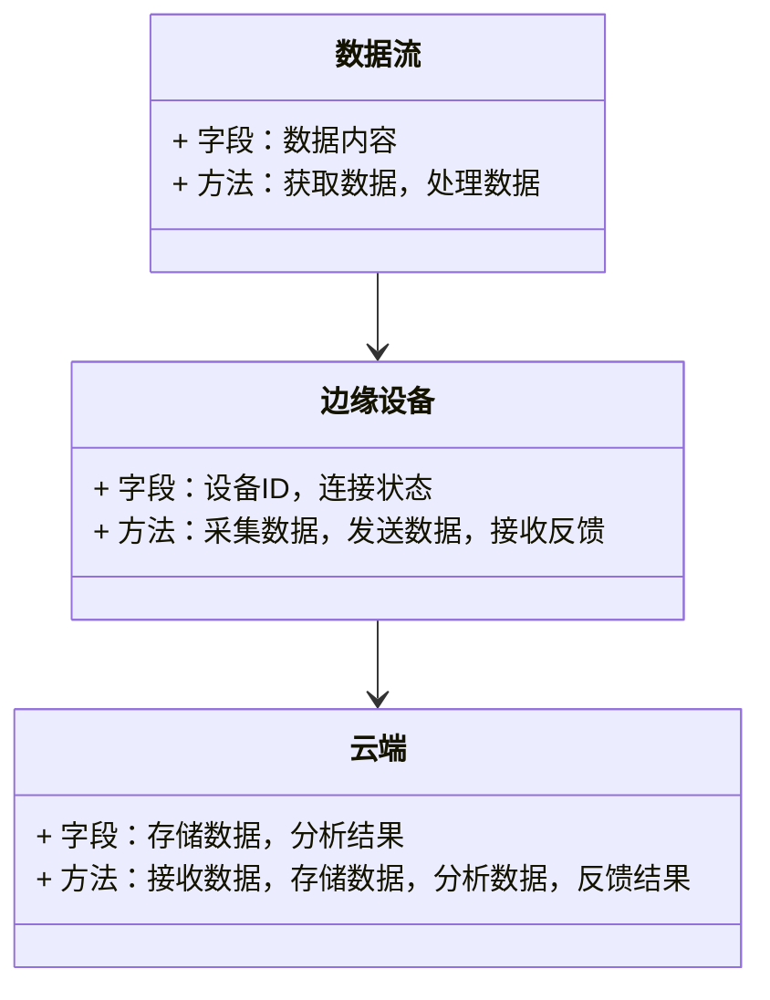
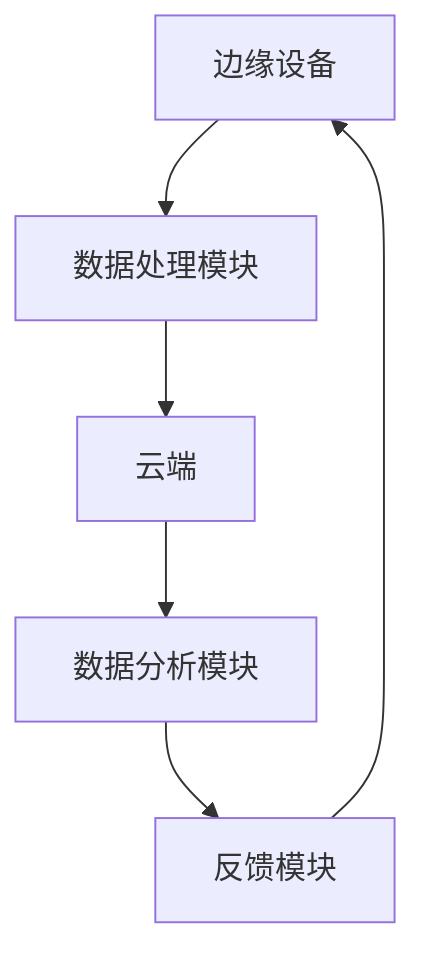
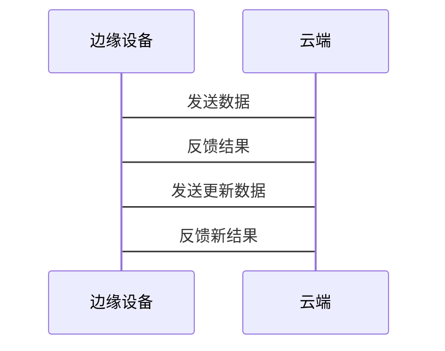

                 


# 如何识别企业的边缘计算实时数据分析优势

## 关键词：边缘计算，实时数据分析，企业优势，数据处理，系统架构

## 摘要：本文将详细探讨如何识别企业边缘计算实时数据分析的优势。通过分析边缘计算和实时数据分析的核心概念、算法原理、系统架构以及项目实战，本文将帮助企业理解如何利用边缘计算技术提升实时数据处理能力，从而在竞争中获得优势。

---

# 第一部分: 边缘计算与实时数据分析的背景

## 第1章: 边缘计算与实时数据分析的背景

### 1.1 边缘计算的定义与特点

#### 1.1.1 边缘计算的定义
边缘计算是一种分布式计算范式，强调在数据生成的位置（边缘）进行数据处理和分析，而不是将所有数据传输到云端进行集中处理。边缘计算的特点包括低延迟、高实时性、本地化处理和分布式架构。

#### 1.1.2 边缘计算的核心特点
- **低延迟**：数据在边缘进行处理，减少了数据传输到云端的延迟。
- **高实时性**：实时数据分析可以在边缘快速完成，适用于需要即时响应的场景。
- **本地化处理**：数据在边缘设备上进行处理，减少了对云端的依赖。
- **分布式架构**：边缘计算通过分布式架构提升了系统的可靠性和容错能力。

#### 1.1.3 边缘计算与云计算的区别与联系
- **区别**：边缘计算将数据处理放在边缘设备上，而云计算依赖于集中式的云端服务器。
- **联系**：边缘计算和云计算可以结合使用，边缘处理实时数据，云端负责长期存储和复杂分析。

### 1.2 实时数据分析的重要性

#### 1.2.1 实时数据分析的定义
实时数据分析是指在数据生成的那一刻立即进行处理、分析和响应，以满足对实时洞察的需求。

#### 1.2.2 实时数据分析的挑战
- **数据量大**：实时数据生成速度快，数据量大，处理难度高。
- **数据多样性**：数据来源多样化，格式复杂，增加了处理的难度。
- **处理延迟**：实时数据分析要求在极短的时间内完成处理，这对系统性能提出了更高的要求。

#### 1.2.3 实时数据分析的价值
- **快速响应**：实时数据分析能够帮助企业快速响应市场变化和客户需求。
- **提高效率**：实时数据分析可以优化企业运营流程，提高效率。
- **降低成本**：通过在边缘处理数据，可以减少数据传输到云端的成本。

### 1.3 企业边缘计算实时数据分析的背景

#### 1.3.1 企业数字化转型的背景
随着数字化转型的推进，企业需要更加高效地处理数据，以应对快速变化的市场需求。

#### 1.3.2 边缘计算在企业中的应用场景
- **智能制造**：边缘计算可以帮助工厂实时监控生产线，快速检测和修复故障。
- **智慧城市**：边缘计算可以用于实时监控交通流量、环境数据等，优化城市管理。
- **零售业**：边缘计算可以帮助零售企业实时分析销售数据，优化库存管理。

#### 1.3.3 实时数据分析在企业中的需求
- **实时监控**：企业需要实时监控生产、销售、物流等各个环节。
- **快速决策**：实时数据分析可以帮助企业在关键时刻快速做出决策。
- **优化运营**：实时数据分析可以优化企业的运营流程，降低成本。

### 1.4 本章小结
本章介绍了边缘计算和实时数据分析的基本概念、特点和应用场景，强调了边缘计算在企业中的重要性。通过实时数据分析，企业可以快速响应市场变化，优化运营流程，提高竞争力。

---

# 第二部分: 边缘计算实时数据分析的核心概念与联系

## 第2章: 边缘计算实时数据分析的核心概念

### 2.1 数据流与数据处理

#### 2.1.1 数据流的定义与特点
数据流是指在系统中流动的数据，具有实时性、连续性和动态性的特点。

#### 2.1.2 数据处理的流程与方法
数据处理包括数据采集、预处理、分析和反馈四个阶段。边缘计算通过在数据生成的位置进行数据处理，减少了数据传输的延迟。

#### 2.1.3 数据流的实时性要求
实时性要求数据在生成后立即进行处理和分析，以满足实时响应的需求。

### 2.2 边缘设备与云端协同

#### 2.2.1 边缘设备的定义与功能
边缘设备是指靠近数据源的设备，如传感器、摄像头、工业机器人等。边缘设备负责数据的采集和初步处理。

#### 2.2.2 云端协同的定义与作用
云端协同是指边缘设备与云端服务器之间的数据交互和协同工作。云端负责存储和分析复杂的数据，边缘设备则负责实时数据处理和反馈。

#### 2.2.3 边缘与云端的数据同步机制
边缘设备和云端之间需要通过数据同步机制保持数据的一致性。数据同步机制包括数据推送、数据拉取和数据缓存三种方式。

### 2.3 实时数据分析的数学模型

#### 2.3.1 数据流的数学建模
数据流可以看作是一个时间序列，可以用随机过程理论进行建模。假设数据流X(t)服从参数为μ和σ²的正态分布，我们可以用概率论的方法进行数据分析。

#### 2.3.2 数据处理的算法模型
实时数据分析的算法模型包括滑动窗口算法、增量学习算法和流数据压缩算法。滑动窗口算法用于处理有限历史数据，增量学习算法用于动态更新模型参数，流数据压缩算法用于减少数据传输量。

#### 2.3.3 实时数据分析的性能优化
实时数据分析的性能优化包括减少计算复杂度、降低存储需求和提高数据处理速度。可以通过优化算法和硬件配置来实现性能优化。

### 2.4 核心概念对比分析

#### 2.4.1 数据流与数据处理的对比
数据流是指数据的流动过程，数据处理是指对数据进行操作。数据流是数据处理的基础，数据处理是数据流的目标。

#### 2.4.2 边缘设备与云端的对比
边缘设备负责数据的采集和初步处理，云端负责数据的存储和复杂分析。边缘设备具有低延迟和高实时性的特点，云端具有高存储和高计算能力的特点。

#### 2.4.3 实时数据分析的性能与延迟对比
实时数据分析的性能指标包括处理速度、准确性和稳定性。延迟是指数据从生成到处理完成的时间间隔，实时数据分析要求延迟尽可能低。

### 2.5 本章小结
本章详细讲解了边缘计算实时数据分析的核心概念，包括数据流、边缘设备和云端协同等内容。通过对比分析，强调了边缘计算在实时数据分析中的优势和作用。

---

# 第三部分: 边缘计算实时数据分析的算法原理

## 第3章: 实时数据分析的核心算法

### 3.1 数据流处理算法

#### 3.1.1 数据流处理的基本原理
数据流处理的基本原理包括数据采集、预处理、分析和反馈。边缘计算通过在数据生成的位置进行数据处理，减少了数据传输的延迟。

#### 3.1.2 数据流处理的算法实现
数据流处理的算法包括滑动窗口算法、增量学习算法和流数据压缩算法。滑动窗口算法用于处理有限历史数据，增量学习算法用于动态更新模型参数，流数据压缩算法用于减少数据传输量。

#### 3.1.3 数据流处理的优化方法
数据流处理的优化方法包括减少计算复杂度、降低存储需求和提高数据处理速度。可以通过优化算法和硬件配置来实现性能优化。

### 3.2 边缘计算中的实时数据分析算法

#### 3.2.1 实时数据分析算法的定义
实时数据分析算法是指在数据生成的那一刻立即进行处理、分析和反馈的算法。

#### 3.2.2 实时数据分析算法的实现步骤
实时数据分析算法的实现步骤包括数据采集、预处理、分析和反馈。边缘计算通过在数据生成的位置进行数据处理，减少了数据传输的延迟。

#### 3.2.3 实时数据分析算法的性能评估
实时数据分析算法的性能评估包括处理速度、准确性和稳定性。处理速度是指算法在单位时间内处理的数据量，准确性是指算法的预测结果与实际结果的接近程度，稳定性是指算法在长时间运行中的表现。

### 3.3 算法的数学模型与公式

#### 3.3.1 数据流处理的数学模型
数据流处理的数学模型可以表示为：
$$
X(t) = \mu + \epsilon
$$
其中，X(t)是数据流在时间t的值，μ是数据流的均值，ε是随机噪声。

#### 3.3.2 实时数据分析的数学公式
实时数据分析的数学公式可以表示为：
$$
P(y|x) = \frac{P(x|y)P(y)}{P(x)}
$$
其中，P(y|x)是后验概率，P(x|y)是似然概率，P(y)是先验概率，P(x)是边缘概率。

#### 3.3.3 算法优化的数学推导
算法优化的数学推导可以通过最小化损失函数来实现。损失函数可以表示为：
$$
L = \sum_{i=1}^{n} (y_i - \hat{y}_i)^2
$$
其中，y_i是实际值，$\hat{y}_i$是预测值，n是数据样本的数量。

### 3.4 本章小结
本章详细讲解了边缘计算实时数据分析的核心算法，包括数据流处理算法和实时数据分析算法。通过数学模型和公式，强调了算法优化的重要性。

---

# 第四部分: 边缘计算实时数据分析的系统分析与架构设计

## 第4章: 系统分析与架构设计

### 4.1 问题场景介绍

#### 4.1.1 边缘计算实时数据分析的场景
边缘计算实时数据分析的场景包括智能制造、智慧城市和零售业等。在智能制造中，边缘计算可以帮助工厂实时监控生产线，快速检测和修复故障。

#### 4.1.2 问题的复杂性与挑战
边缘计算实时数据分析的复杂性包括数据量大、数据多样性、处理延迟等。企业需要在边缘设备上处理大量数据，同时保证实时性和准确性。

#### 4.1.3 系统的目标
系统的目标包括快速响应、提高效率和降低成本。通过在边缘设备上进行实时数据分析，企业可以快速响应市场变化，优化运营流程，降低成本。

### 4.2 系统功能设计

#### 4.2.1 领域模型类图
以下是领域模型类图：



### 4.3 系统架构设计

#### 4.3.1 系统架构图
以下是系统架构图：



### 4.4 系统接口设计

#### 4.4.1 系统接口设计
系统接口设计包括数据采集接口、数据处理接口和数据反馈接口。数据采集接口用于边缘设备采集数据，数据处理接口用于边缘设备和云端的数据处理，数据反馈接口用于云端向边缘设备反馈结果。

#### 4.4.2 系统交互流程图
以下是系统交互流程图：



### 4.5 本章小结
本章详细讲解了边缘计算实时数据分析的系统分析与架构设计，包括问题场景介绍、系统功能设计和系统架构设计等内容。通过系统架构图和交互流程图，强调了系统设计的重要性。

---

# 第五部分: 边缘计算实时数据分析的项目实战

## 第5章: 项目实战

### 5.1 环境安装

#### 5.1.1 系统环境
项目实战需要安装Linux系统，版本为Ubuntu 20.04。

#### 5.1.2 工具安装
需要安装以下工具：
- Python 3.8
- Apache Kafka 2.13
- Apache Flink 1.12

#### 5.1.3 依赖管理
使用pip安装以下依赖：
- kafka-python
- pyflink

### 5.2 系统核心实现

#### 5.2.1 数据流处理代码
以下是数据流处理代码：

```python
from kafka import KafkaProducer
from kafka import KafkaConsumer
import json

# 数据流处理代码
class DataStreamProcessor:
    def __init__(self, bootstrap_servers):
        self.producer = KafkaProducer(bootstrap_servers=bootstrap_servers)
    
    def send_data(self, data):
        self.producer.send('DataStreamTopic', json.dumps(data).encode('utf-8'))
```

#### 5.2.2 实时数据分析代码
以下是实时数据分析代码：

```python
from pyflink.datastream import StreamExecutionEnvironment
from pyflink.table import TableEnvironment, inference_schema
import json

# 实时数据分析代码
env = StreamExecutionEnvironment.get_execution_environment()
table_env = TableEnvironment.create(env)

DataStreamTopic = 'DataStreamTopic'
DataStreamSource = table_env.socket/tcp/...'DataStreamTopic'

DataStreamSource =DataStreamSource.infer_schema(...)

DataStreamSource.to_datapackage('DataStreamPackage').execute()
```

#### 5.2.3 系统功能实现
系统功能实现包括数据采集、数据处理、数据分析和数据反馈四个阶段。边缘设备负责采集数据，数据处理模块负责对数据进行预处理，数据分析模块负责对数据进行分析，数据反馈模块负责将分析结果反馈给边缘设备。

### 5.3 代码应用解读与分析

#### 5.3.1 数据流处理代码解读
数据流处理代码使用Kafka生产者将数据发送到指定的主题，边缘设备通过Kafka消费者接收数据。

#### 5.3.2 实时数据分析代码解读
实时数据分析代码使用Apache Flink进行流数据处理，通过定义数据流和处理逻辑，实现实时数据分析功能。

#### 5.3.3 系统功能实现解读
系统功能实现包括数据采集、数据处理、数据分析和数据反馈四个阶段。边缘设备负责采集数据，数据处理模块负责对数据进行预处理，数据分析模块负责对数据进行分析，数据反馈模块负责将分析结果反馈给边缘设备。

### 5.4 实际案例分析

#### 5.4.1 案例背景
以智能制造为例，边缘设备包括传感器和工业机器人。传感器负责采集生产线上的数据，工业机器人负责执行操作。

#### 5.4.2 数据流处理
传感器采集数据，通过Kafka生产者发送到DataStreamTopic主题，边缘设备通过Kafka消费者接收数据。

#### 5.4.3 数据分析与反馈
数据分析模块通过Apache Flink对数据流进行分析，生成分析结果，通过数据反馈模块将结果反馈给边缘设备，边缘设备根据反馈结果执行相应的操作。

### 5.5 本章小结
本章详细讲解了边缘计算实时数据分析的项目实战，包括环境安装、系统核心实现和实际案例分析等内容。通过代码实现，强调了项目实战的重要性。

---

# 第六部分: 边缘计算实时数据分析的最佳实践与注意事项

## 第6章: 最佳实践与注意事项

### 6.1 最佳实践

#### 6.1.1 系统设计
系统设计需要考虑实时性、可靠性和可扩展性。边缘计算系统需要在边缘设备上进行数据处理，确保系统的实时性和可靠性。

#### 6.1.2 数据安全
数据安全是边缘计算实时数据分析的重要考虑因素。企业需要采取数据加密、访问控制等措施，确保数据的安全性。

#### 6.1.3 系统优化
系统优化包括算法优化、硬件配置优化和系统架构优化。通过优化算法和硬件配置，可以提高系统的性能和效率。

### 6.2 注意事项

#### 6.2.1 数据处理的延迟
数据处理的延迟是指数据从生成到处理完成的时间间隔。边缘计算需要在边缘设备上进行实时数据分析，减少数据处理的延迟。

#### 6.2.2 数据存储与管理
数据存储与管理需要考虑数据的生命周期和存储效率。边缘设备上的数据需要定期清理，避免占用过多存储空间。

#### 6.2.3 系统容错与恢复
系统容错与恢复是指系统在出现故障时能够快速恢复，保证系统的可用性。边缘计算系统需要在边缘设备上进行数据处理，确保系统的容错与恢复能力。

### 6.3 本章小结
本章总结了边缘计算实时数据分析的最佳实践与注意事项，包括系统设计、数据安全和系统优化等内容。通过注意事项，强调了数据处理的延迟、数据存储与管理和系统容错与恢复的重要性。

---

# 结语

通过本文的详细讲解，读者可以全面了解如何识别企业的边缘计算实时数据分析优势。从核心概念到算法原理，从系统架构到项目实战，再到最佳实践与注意事项，本文为读者提供了全面的指导。希望本文能够帮助企业更好地利用边缘计算技术，提升实时数据分析能力，从而在竞争中获得优势。

---

# 拓展阅读

1. 《边缘计算入门指南》
2. 《实时数据分析的数学基础》
3. 《分布式系统架构设计》
4. 《Apache Flink实战手册》
5. 《数据安全与隐私保护》

---

# 附录

## 附录A: 边缘计算实时数据分析的术语表

## 附录B: 常用工具与技术

## 附录C: 参考文献

---

# END

