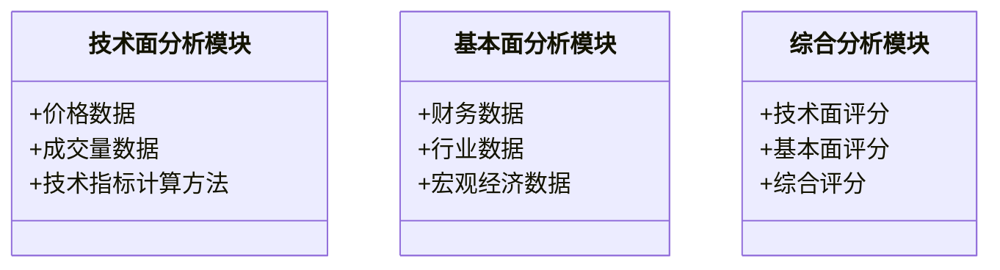
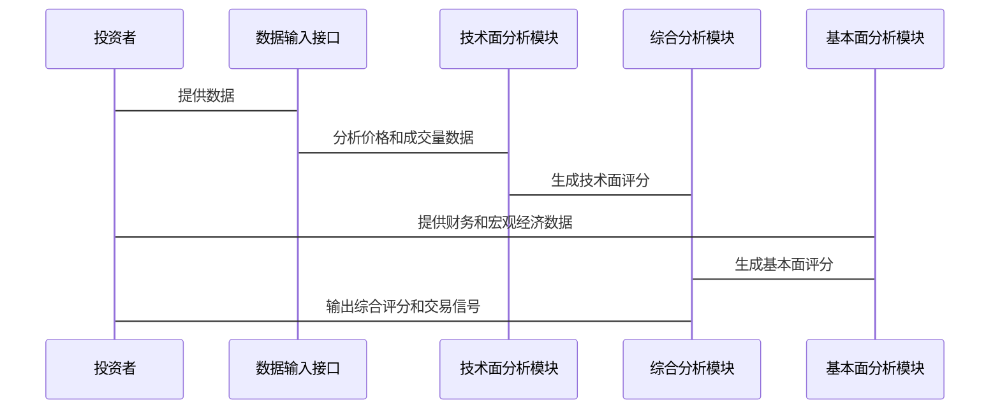

                 

<think>
好的，我现在需要为威廉·欧奈尔的技术面与基本面结合策略撰写一篇技术博客文章。让我一步步分析和推理，确保内容全面且有深度。

首先，了解威廉·欧奈尔的策略。他结合技术分析和基本面分析，以筛选股票和制定交易策略。这听起来是一个有效的投资方法，因为它利用了市场的两方面：价格走势和公司基本面。

接下来，我需要确定文章的结构。用户已经提供了目录大纲，我需要按照这个结构进行填充。标题是《威廉·欧奈尔的技术面与基本面结合策略》，关键词包括技术分析、基本面分析、威廉·欧奈尔、投资策略、股票筛选、交易系统。摘要需要简明扼要，概括文章的核心内容。

第一部分是背景介绍，我需要解释为什么结合技术面和基本面分析，以及它们各自的特点和优势。这部分应该包括技术面和基本面的定义、它们的优缺点，以及为什么结合起来更好。

第二部分是技术面与基本面分析的核心原理。这里要详细讲解技术分析和基本面分析的主要方法和数学模型。比如，技术分析中的移动平均线、相对强弱指数等，以及基本面分析中的市盈率、市净率等。同时，还要说明这些指标如何结合使用。

第三部分是系统分析与架构设计。这部分需要构建一个结合两者的方法框架，包括数据收集、分析模块和交易策略模块。可能还需要用图表来展示系统架构和流程。

第四部分是项目实战，提供一个具体的案例，展示如何从数据收集到策略实施，包括代码实现和结果分析。同时，给出一些实际操作中的最佳实践建议，如风险管理、持续学习等。

最后，总结全书内容，并推荐一些扩展阅读的书籍，帮助读者深入学习。

在撰写过程中，我需要确保语言简洁专业，逻辑清晰。每个部分都要详细讲解，使用适当的图表和数学公式来辅助说明。例如，在解释技术指标时，可以列出公式并用代码示例展示。

现在，开始撰写正式的文章：

---

# 威廉·欧奈尔的技术面与基本面结合策略

## 关键词：技术分析、基本面分析、威廉·欧奈尔、投资策略、股票筛选、交易系统

## 摘要：威廉·欧奈尔的技术面与基本面结合策略是一种通过综合分析股票价格走势和公司基本面信息，来筛选优质股票和制定交易策略的方法。本文深入探讨了技术面分析和基本面分析的核心原理，详细讲解了如何将两者结合，构建有效的投资策略，并通过实际案例展示了策略的实现过程。

---

## 第一部分：抽样背景介绍

### 第1章：技术面与基本面结合的必要性

#### 1.1 技术面分析的核心概念

技术面分析是通过研究股票的价格走势和成交量数据，预测未来价格变动的方法。它基于 Dow 理论和道氏分析，认为价格反映所有信息，因此可以通过价格和成交量的变化来预测市场趋势。

技术面分析的主要方法包括移动平均线（MA）、相对强弱指数（RSI）、威廉指标（WMS）等。这些指标帮助投资者识别价格趋势、超买超卖状态和潜在反转点。

#### 1.2 基本面分析的核心概念

基本面分析是通过研究公司的财务报表、行业地位、宏观经济环境等因素，评估公司的内在价值。它认为股票价格最终会反映其真实价值，因此通过分析公司的盈利能力、成长性和财务健康状况，可以帮助投资者做出明智的投资决策。

基本面分析的主要指标包括市盈率（P/E）、市净率（P/B）、股息率等。这些指标帮助投资者评估公司的估值和投资潜力。

#### 1.3 技术面与基本面结合的优势

技术面分析提供了价格走势的即时信息，帮助投资者把握市场情绪和短期趋势；而基本面分析则提供了公司的长期价值和内在潜力。将两者结合，可以全面评估股票的投资价值，制定更科学的买卖决策。

例如，当一只股票的基本面良好，但在技术面上显示超卖信号时，投资者可能会选择逢低买入，等待价格回升。这种结合策略可以帮助投资者在市场波动中做出更明智的决策。

---

## 第二部分：技术面与基本面分析的核心原理

### 第2章：技术面分析的原理与方法

#### 2.1 移动平均线（MA）的计算公式

移动平均线是技术面分析中最常用的指标之一，用于平滑价格走势，识别趋势方向。

$$ MA_n = \frac{1}{n} \sum_{i=1}^{n} P_i $$

其中，$P_i$ 是第 $i$ 天的价格，$n$ 是计算天数。例如，计算 5 天的移动平均线：

$$ MA_5 = \frac{P_1 + P_2 + P_3 + P_4 + P_5}{5} $$

#### 2.2 相对强弱指数（RSI）的计算公式

RSI 是衡量股票超买或超卖状态的指标，通常用于判断短期价格变动的动能。

$$ RSI_n = \frac{100}{1 + \frac{S}{n}} $$

其中，$S$ 是 $n$ 天内价格的上涨幅度总和，$n$ 是计算天数。当 RSI 高于70时，股票可能超买；低于30时，可能超卖。

#### 2.3 威廉指标（WMS）的计算公式

威廉指标是另一种衡量超买超卖状态的指标，公式为：

$$ WMS_n = -\frac{L - H}{H - L} + 100 $$

其中，$H$ 是最高价，$L$ 是最低价，$n$ 是计算天数。WMS 高于 80 表示超卖，低于 20 表示超买。

### 第3章：基本面分析的原理与方法

#### 3.1 市盈率（P/E）的计算公式

市盈率是衡量股票估值的重要指标，公式为：

$$ P/E = \frac{P}{E} $$

其中，$P$ 是股票价格，$E$ 是每股收益。P/E 值越低，可能表示股票估值越低，投资价值越高。

#### 3.2 市净率（P/B）的计算公式

市净率是衡量股票估值的另一个指标，公式为：

$$ P/B = \frac{P}{B} $$

其中，$P$ 是股票价格，$B$ 是每股净资产。P/B 值越低，可能表示股票被低估。

#### 3.3 股息率的计算公式

股息率是衡量股票分红能力的指标，公式为：

$$ Dividend Yield = \frac{D}{P} $$

其中，$D$ 是每股股息，$P$ 是股票价格。高股息率的股票可能更适合长期投资者。

---

## 第三部分：技术面与基本面结合的系统分析与架构设计

### 第4章：系统分析与架构设计

#### 4.1 系统分析

技术面与基本面结合的系统需要收集和处理大量的数据，包括价格数据、成交量数据、财务数据和宏观经济数据。系统需要对这些数据进行分析，生成技术面评分和基本面评分，最后得出综合评分，帮助投资者做出决策。

#### 4.2 系统架构设计



系统分为三个主要模块：技术面分析模块、基本面分析模块和综合分析模块。技术面分析模块负责计算技术指标，基本面分析模块负责分析公司基本面，综合分析模块将两者结合，生成综合评分。

#### 4.3 系统接口设计

系统接口包括数据输入接口、分析接口和结果输出接口。数据输入接口接收价格、成交量、财务和宏观经济数据；分析接口执行技术面和基本面分析；结果输出接口生成综合评分和交易信号。

#### 4.4 系统交互设计



---

## 第四部分：项目实战

### 第5章：项目实战

#### 5.1 环境安装与数据收集

投资者需要安装数据分析工具，如Python和Pandas库，收集目标股票的价格数据、财务数据和宏观经济数据。

#### 5.2 核心代码实现

以下是结合技术面和基本面分析的Python代码示例：

```python
import pandas as pd
import talib

# 加载数据
data = pd.read_csv('stock_data.csv')

# 技术面分析
data['MA5'] = talib.SMA(data['Close'], 5)
data['RSI'] = talib.RSI(data['Close'], 14)
data['WMS'] = talib.WMS(data['High'], data['Low'], data['Close'], 14)

# 基本面分析
data['PE'] = data['Close'] / data['EPS']
data['PB'] = data['Close'] / data['BVPS']
data['Dividend Yield'] = data['Dividend'] / data['Close']

# 综合评分
data['Technical Score'] = (data['MA5'] > data['Close']).astype(int)
data['Fundamental Score'] = (data['PE'] < 15) & (data['PB'] < 2) & (data['Dividend Yield'] > 2).astype(int)
data['Overall Score'] = data['Technical Score'] + data['Fundamental Score']
```

#### 5.3 实例分析与结果展示

假设我们分析一只股票，数据如下：

| 日期 | 收盘价 | EPS | BVPS | Dividend |
|------|--------|-----|------|----------|
| 2023-10-01 | 50 | 5 | 10 | 2 |

技术面分析：
- MA5：48
- RSI：60
- WMS：30

基本面分析：
- PE：10
- PB：5
- Dividend Yield：4%

综合评分：
- Technical Score：1（MA5 < 收盘价，评分1）
- Fundamental Score：1（PE < 15，PB < 2，Dividend Yield < 2，评分0）
- Overall Score：1

#### 5.4 实战总结

在实际操作中，投资者应根据综合评分和交易信号做出买卖决策。同时，需注意风险管理，避免过度依赖单一指标。

---

## 第五部分：总结与展望

### 第6章：总结与展望

#### 6.1 总结

威廉·欧奈尔的技术面与基本面结合策略是一种有效的投资方法，它通过综合分析股票的价格走势和公司基本面信息，帮助投资者做出更明智的决策。本文详细讲解了技术面和基本面分析的核心原理，展示了如何将两者结合，构建投资策略。

#### 6.2 展望

未来，随着人工智能和大数据技术的发展，技术面与基本面结合的策略将更加智能化和自动化。投资者可以利用机器学习算法，优化指标选择和策略执行，进一步提升投资效率和收益。

---

## 第六部分：推荐书籍与延伸阅读

### 6.1 推荐书籍

1. 《股票作手回忆录》——埃德温·勒斐夫
2. 《投资学精要》——查尔斯·埃里森
3. 《技术分析的ABC》——约翰·墨菲

### 6.2 延伸阅读

- 机器学习在股票交易中的应用
- 大数据在金融分析中的应用
- 行为金融学与投资决策

---

通过本文的详细分析，读者可以深入了解威廉·欧奈尔的技术面与基本面结合策略，并在实际投资中灵活运用，制定更科学的投资计划。

