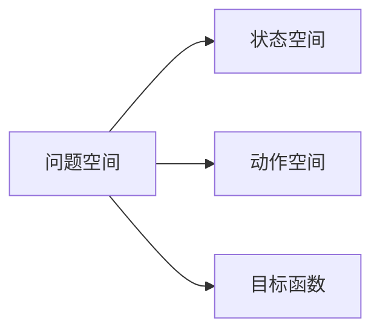
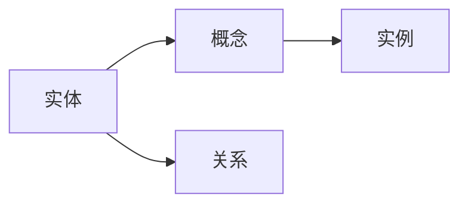
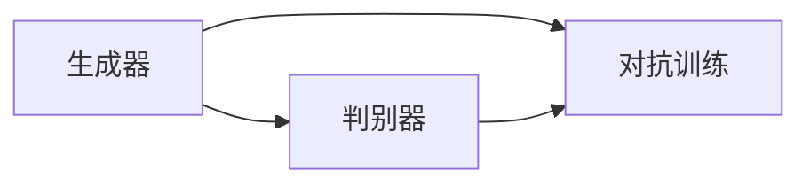
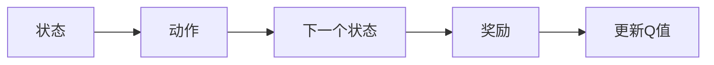
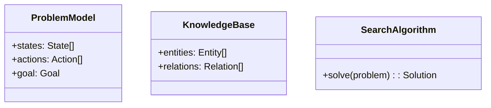
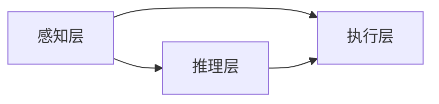
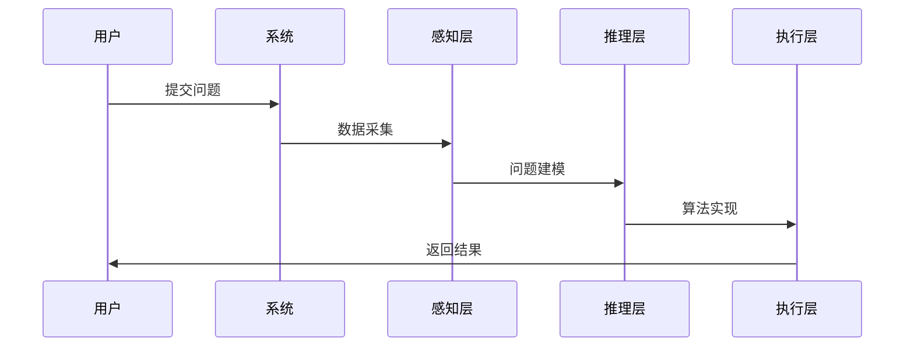

                 

# 开发具有创造性问题解决能力的AI Agent

## 关键词：
- AI Agent
- 创造性问题解决
- 生成模型
- 强化学习
- 知识表示
- 系统架构

## 摘要：
本文旨在探讨如何开发具有创造性问题解决能力的AI Agent。通过分析创造性思维的核心概念、相关算法原理以及系统架构，结合实际项目案例，为读者提供从理论到实践的全面指导。文章内容涵盖问题建模、知识表示、搜索算法、生成模型与强化学习的应用，以及系统设计与实现，帮助读者深入理解并掌握开发具有创造性问题解决能力的AI Agent的方法。

---

# 第1章: AI Agent与创造性问题解决概述

## 1.1 AI Agent的基本概念

### 1.1.1 人工智能代理的定义
人工智能代理（AI Agent）是指能够感知环境并采取行动以实现目标的智能实体。它可以是一个软件程序、机器人或其他智能系统，具备以下核心特征：
- **自主性**：能够在没有外部干预的情况下自主决策。
- **反应性**：能够根据环境输入做出实时反应。
- **目标导向**：通过目标驱动来优化决策和行动。

### 1.1.2 创造性问题解决能力的定义
创造性问题解决能力是指AI Agent能够超越现有知识和经验，提出新颖且有效的解决方案的能力。这种能力依赖于创新的思维方式和灵活的决策过程。

### 1.1.3 AI Agent在问题解决中的作用
AI Agent可以通过分析问题、生成解决方案和优化决策过程，帮助人类更高效地解决问题。特别是在复杂和动态的环境中，AI Agent能够快速适应变化，提供创新的解决方案。

## 1.2 创造性思维与问题解决的关系

### 1.2.1 创造性思维的定义
创造性思维是指在解决问题时，能够突破常规思维模式，产生新颖且有价值的思路。它包括发散思维、联想思维和逆向思维等。

### 1.2.2 创造性思维在问题解决中的应用
创造性思维在问题解决中起到关键作用，特别是在处理非结构化问题和模糊场景时，能够提供多样化的解决方案。例如，在设计优化算法时，创造性思维可以帮助发现新的优化路径。

### 1.2.3 AI Agent如何模拟创造性思维
AI Agent可以通过生成模型和强化学习等技术模拟创造性思维。生成模型（如GPT）能够生成多样化的候选方案，而强化学习算法（如AlphaGo）则可以通过策略优化选择最优解决方案。

## 1.3 AI Agent的类型与应用场景

### 1.3.1 基于规则的AI Agent
基于规则的AI Agent通过预定义的规则和逻辑进行决策。这种类型的AI Agent适用于规则明确且静态的环境，例如简单的游戏AI或自动回复系统。

### 1.3.2 基于机器学习的AI Agent
基于机器学习的AI Agent通过训练数据学习模式和规律，从而做出决策。这种类型的AI Agent适用于复杂和动态的环境，例如自动驾驶汽车和推荐系统。

### 1.3.3 基于生成模型的AI Agent
基于生成模型的AI Agent能够生成新的数据或方案，例如通过GPT生成创意文本或通过生成对抗网络（GAN）设计新的图像。这种类型的AI Agent在艺术创作和产品设计等领域具有广泛的应用。

## 1.4 创造性问题解决能力的重要性

### 1.4.1 在复杂问题中的应用
创造性问题解决能力使AI Agent能够在复杂和多变的环境中找到最优解决方案。例如，在城市交通管理中，AI Agent可以通过创造性思维优化交通流量。

### 1.4.2 在创新领域中的潜力
创造性问题解决能力为AI Agent在创新领域中的应用提供了可能。例如，在药物研发中，AI Agent可以通过创造性思维发现新的药物分子结构。

### 1.4.3 在实际生活中的价值
创造性问题解决能力能够提升AI Agent在实际生活中的应用价值。例如，在客户服务中，AI Agent可以通过创造性思维提供个性化的解决方案，提升客户满意度。

## 1.5 本章小结
本章介绍了AI Agent的基本概念、创造性问题解决能力的定义以及AI Agent的类型与应用场景。通过分析创造性思维在问题解决中的作用，强调了创造性问题解决能力在复杂和创新领域中的重要性。

---

# 第2章: 创造性问题解决的核心概念

## 2.1 问题建模与表示

### 2.1.1 问题空间的定义
问题空间是指所有可能的状态和动作的集合。在创造性问题解决中，问题空间的定义需要考虑多样性和创新性。

### 2.1.2 状态空间与动作空间
状态空间是问题在某一时刻的所有可能状态，而动作空间是AI Agent在给定状态下可以采取的所有动作。

### 2.1.3 目标函数的构建
目标函数用于衡量AI Agent的解决方案是否符合预期。在创造性问题解决中，目标函数需要能够评估创新性和有效性。

### 图2-1: 问题空间的mermaid图

## 2.2 知识表示与推理

### 2.2.1 知识图谱的构建
知识图谱是一种用于表示知识的图形结构，由节点和边组成。节点代表实体或概念，边代表它们之间的关系。

### 2.2.2 逻辑推理与演绎推理
逻辑推理是通过已知事实和规则推导出新的结论。演绎推理是一种从一般到具体的推理方法，常用于知识图谱中的推理任务。

### 2.2.3 类比推理与归纳推理
类比推理是通过比较不同事物的相似性来推导结论。归纳推理是通过观察具体实例来推导一般规律。

### 图2-2: 知识图谱的mermaid图

## 2.3 搜索算法与优化

### 2.3.1 常见搜索算法（如A*、遗传算法）
- **A*算法**：一种基于优先队列的最短路径搜索算法，适用于明确目标的问题。
- **遗传算法**：一种模拟自然选择和遗传的优化算法，适用于复杂问题的全局优化。

### 2.3.2 搜索空间的优化
通过优化搜索空间的表示和算法，可以提高搜索效率。例如，使用启发式函数引导A*算法，或使用适应度函数优化遗传算法。

### 2.3.3 多目标优化问题
多目标优化问题是指在多个目标之间进行权衡和优化。例如，在设计汽车时，需要在成本、性能和安全性之间进行平衡。

## 2.4 创造性思维的数学模型

### 2.4.1 创造性思维的数学表示
创造性思维可以表示为一种概率分布，其中创新性与概率的分布范围有关。例如，均匀分布表示完全随机的创新，而偏态分布表示有倾向性的创新。

### 2.4.2 创造性问题解决的数学模型
创造性问题解决的数学模型可以表示为一个优化问题，目标函数为创新性与有效性的乘积。

### 2.4.3 创造性思维与数学优化的关系
创造性思维可以看作是一种非线性优化问题，其中创新性是目标函数的优化方向，而有效性是约束条件。

## 2.5 本章小结
本章详细介绍了创造性问题解决的核心概念，包括问题建模、知识表示和搜索算法。通过数学模型的分析，揭示了创造性思维与数学优化之间的关系。

---

# 第3章: 创造性问题解决的算法原理

## 3.1 生成模型与创造性思维

### 3.1.1 变量关系与生成模型
生成模型是一种通过学习数据分布来生成新数据的模型。在创造性问题解决中，生成模型可以用于生成多样化的解决方案。

### 3.1.2 GAN（生成对抗网络）的原理
GAN由生成器和判别器组成，通过对抗训练生成逼真的数据。在创造性问题解决中，GAN可以用于生成创新的图像、文本等。

### 3.1.3 Transformer模型的创造性应用
Transformer模型通过自注意力机制捕捉上下文信息，适用于生成多样化的文本内容，如创意写作和诗歌生成。

### 图3-1: GAN的mermaid图

## 3.2 强化学习与问题解决

### 3.2.1 强化学习的基本原理
强化学习通过智能体与环境的交互，学习策略以最大化累积奖励。在创造性问题解决中，强化学习可以用于优化决策过程。

### 3.2.2 Q-learning算法在问题解决中的应用
Q-learning是一种基于值函数的强化学习算法，适用于离散动作空间的问题。在创造性问题解决中，Q-learning可以用于选择最优动作。

### 3.2.3 AlphaGo的创造性决策过程
AlphaGo通过深度强化学习在围棋中实现创造性决策，展示了强化学习在复杂问题中的应用潜力。

### 图3-2: Q-learning算法的mermaid图

## 3.3 创造性思维的数学模型

### 3.3.1 创造性思维的数学表示
创造性思维可以表示为一个概率生成模型，其中创新性与生成分布的熵有关。熵越高，生成的多样性越大。

### 3.3.2 创造性问题解决的数学模型
创造性问题解决的数学模型可以表示为一个优化问题，目标函数为创新性与有效性的加权和。

### 3.3.3 创造性思维与数学优化的关系
创造性思维可以看作是一种生成性优化问题，其中创新性是目标函数的生成方向，而有效性是目标函数的约束条件。

## 3.4 本章小结
本章分析了生成模型和强化学习在创造性问题解决中的应用，揭示了创造性思维的数学模型与优化算法之间的关系。

---

# 第4章: 创造性问题解决的系统架构设计

## 4.1 问题场景介绍
本章以一个智能助手开发项目为例，介绍如何设计具有创造性问题解决能力的AI Agent系统架构。

## 4.2 系统功能设计

### 4.2.1 领域模型设计
领域模型是系统的核心逻辑，包括问题建模、知识表示和搜索算法。通过领域模型的构建，可以实现AI Agent的核心功能。

### 图4-1: 领域模型的mermaid类图

### 4.2.2 系统架构设计
系统架构包括感知层、推理层和执行层。感知层负责数据采集和处理，推理层负责问题建模和知识表示，执行层负责算法实现和结果输出。

### 图4-2: 系统架构的mermaid架构图

### 4.2.3 系统接口设计
系统接口包括用户接口、数据接口和算法接口。用户接口用于与用户交互，数据接口用于数据的输入和输出，算法接口用于算法的调用和结果返回。

### 4.2.4 系统交互设计
系统交互通过序列图描述用户与系统的交互过程，包括问题输入、模型推理和结果输出。

### 图4-3: 系统交互的mermaid序列图

## 4.3 本章小结
本章通过一个具体的项目案例，详细介绍了系统架构设计的各个环节，包括领域模型、系统架构、系统接口和系统交互。

---

# 第5章: 创造性问题解决的项目实战

## 5.1 环境安装与配置

### 5.1.1 开发工具安装
安装Python、TensorFlow、Keras等开发工具和库。

### 5.1.2 数据集准备
准备相关领域的数据集，例如文本数据、图像数据等。

## 5.2 核心代码实现

### 5.2.1 生成模型的实现
使用Keras或TensorFlow实现生成模型，例如GAN或Transformer模型。

### 5.2.2 强化学习算法的实现
实现Q-learning或AlphaGo等强化学习算法。

### 5.2.3 系统架构的实现
实现感知层、推理层和执行层的接口和交互。

## 5.3 功能解读与分析

### 5.3.1 生成模型的功能
生成模型用于生成多样化的解决方案，例如生成创意文本或图像。

### 5.3.2 强化学习的功能
强化学习用于优化决策过程，例如选择最优动作或策略。

### 5.3.3 系统架构的功能
系统架构实现各模块之间的协同工作，例如数据采集、问题建模和算法实现。

## 5.4 实际案例分析

### 5.4.1 案例背景介绍
介绍一个具体的案例，例如智能助手的设计与实现。

### 5.4.2 案例功能实现
详细描述案例的功能实现过程，包括问题建模、知识表示和算法实现。

### 5.4.3 案例结果分析
分析案例的实验结果，验证系统的设计和实现效果。

## 5.5 本章小结
本章通过一个具体的项目案例，详细介绍了环境安装、核心代码实现和实际案例分析，帮助读者理解创造性问题解决能力的实现过程。

---

# 第6章: 创造性问题解决的优化与展望

## 6.1 开发经验总结

### 6.1.1 关键技术总结
总结创造性问题解决的关键技术，包括生成模型、强化学习和知识表示。

### 6.1.2 需要注意的问题
在开发过程中需要注意的问题，例如模型的泛化能力、计算资源的消耗等。

## 6.2 小结与展望

### 6.2.1 小结
总结本文的主要内容和研究成果，强调创造性问题解决能力的重要性。

### 6.2.2 展望
展望未来的研究方向，例如更高效的生成模型、更智能的强化学习算法等。

## 6.3 注意事项

### 6.3.1 模型的泛化能力
在设计生成模型时，需要注意模型的泛化能力，避免过拟合。

### 6.3.2 计算资源的消耗
在实现强化学习算法时，需要注意计算资源的消耗，优化算法效率。

### 6.3.3 问题的边界条件
在处理实际问题时，需要充分考虑问题的边界条件，避免遗漏重要信息。

## 6.4 本章小结
本章总结了创造性问题解决能力的开发经验，并展望了未来的研究方向。

---

# 第7章: 结语

## 7.1 重要性回顾
创造性问题解决能力是AI Agent的核心能力之一，能够帮助AI Agent在复杂和动态的环境中找到最优解决方案。

## 7.2 未来展望
随着人工智能技术的不断发展，创造性问题解决能力将更加智能化和高效化，为人类社会的发展带来更多的创新和价值。

---

# 参考文献
（此处列出相关的参考文献，例如书籍、论文、技术文档等。）

---

# 致谢
感谢读者的耐心阅读，感谢同行的支持与帮助。

