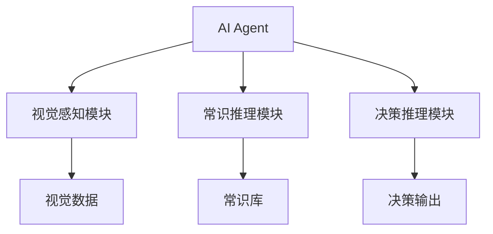
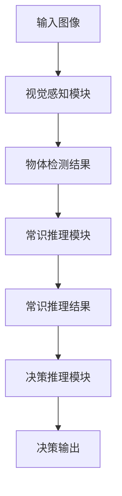
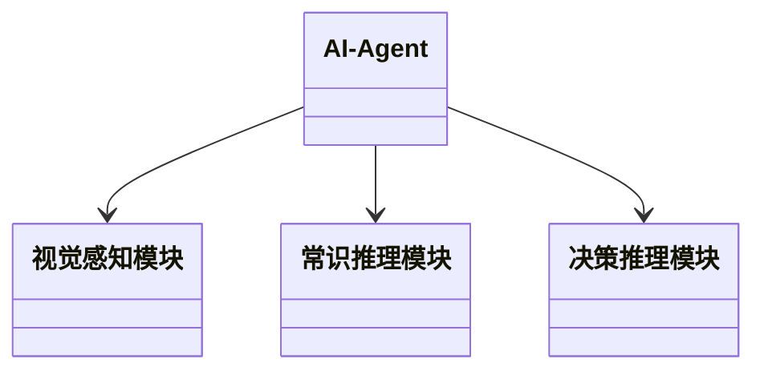
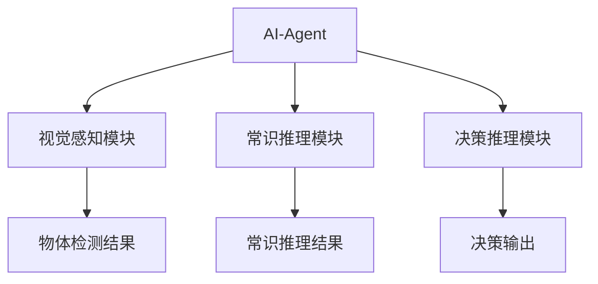
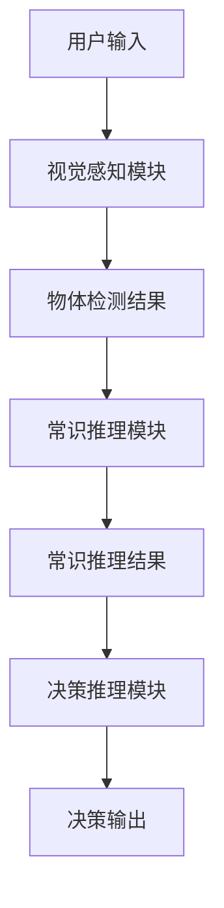

                 


# 开发具有视觉常识推理能力的AI Agent

## 关键词：AI Agent, 视觉常识推理, 人工智能, 视觉感知, 决策推理, 系统架构

## 摘要：  
本文旨在探讨如何开发具备视觉常识推理能力的AI Agent。通过分析视觉感知、常识推理和决策推理的核心原理，结合具体的算法实现和系统架构设计，提供一个从理论到实践的全面指南。本文将详细介绍各个模块的功能与实现方法，并通过实际案例展示如何构建一个能够理解视觉信息并进行常识推理的AI Agent。

---

# 第一部分: 开发具有视觉常识推理能力的AI Agent背景介绍

## 第1章: 问题背景与概念解析

### 1.1 问题背景
#### 1.1.1 当前AI Agent的发展现状
人工智能（AI）代理（Agent）是指能够感知环境、自主决策并执行任务的智能实体。近年来，随着深度学习和计算机视觉技术的快速发展，AI Agent在多个领域取得了显著进展，例如自动驾驶、智能助手和机器人等。然而，现有的AI Agent大多依赖于单一任务处理，缺乏对复杂视觉场景的深度理解和常识推理能力。

#### 1.1.2 视觉常识推理的必要性
视觉常识推理是指AI Agent能够结合视觉感知信息和常识知识，理解场景中的隐含信息并做出合理决策的能力。例如，在一张厨房图片中，AI Agent不仅需要识别出锅、刀等物体，还需要理解这些物体之间的关系（如刀可以用来切菜）以及可能的操作流程（如烹饪步骤）。这种能力对于实现更智能、更自然的AI交互至关重要。

#### 1.1.3 问题解决的核心目标
本文的核心目标是开发一种能够结合视觉感知和常识推理的AI Agent，使其在面对复杂视觉场景时，能够理解场景中的物体、关系和潜在操作，并做出合理决策。

### 1.2 问题描述
#### 1.2.1 视觉常识推理的定义
视觉常识推理是指AI Agent能够结合视觉感知数据和常识知识，理解场景中的物体、关系和潜在操作，并能够根据这些理解做出推理和决策。

#### 1.2.2 AI Agent的基本功能与需求
AI Agent需要具备以下功能：
- **视觉感知**：能够从图像中提取物体、场景信息。
- **常识推理**：基于常识知识库，理解物体之间的关系和潜在操作。
- **决策推理**：根据视觉信息和常识推理结果，做出决策并执行操作。

#### 1.2.3 问题的边界与外延
本文主要关注AI Agent的视觉常识推理能力，不涉及具体的执行操作（如物理机器人动作）或复杂的情感理解。我们的目标是构建一个能够在视觉场景中进行基本常识推理的AI Agent。

### 1.3 概念结构与核心要素
#### 1.3.1 AI Agent的组成要素
AI Agent通常包括以下几个核心要素：
- **感知模块**：负责获取环境信息（如视觉、听觉等）。
- **推理模块**：负责理解和推理环境信息。
- **决策模块**：根据推理结果做出决策。
- **执行模块**：执行具体的任务或动作。

#### 1.3.2 视觉常识推理的核心模块
视觉常识推理的核心模块包括：
- **视觉感知模块**：从图像中提取物体、场景信息。
- **常识推理模块**：基于常识知识库，理解物体之间的关系和潜在操作。
- **决策推理模块**：根据视觉信息和常识推理结果，做出决策。

#### 1.3.3 相关概念的对比分析
以下是相关概念的对比分析：

| 概念       | 描述                                                                 |
|------------|----------------------------------------------------------------------|
| 视觉感知   | 从图像中提取物体、场景信息                                             |
| 常识推理   | 基于常识知识库，理解物体之间的关系和潜在操作                           |
| 决策推理   | 根据视觉信息和常识推理结果，做出决策                                   |

### 1.4 本章小结
本章主要介绍了AI Agent的背景、问题背景、问题描述以及概念结构。通过本章的介绍，读者可以理解视觉常识推理的重要性和基本需求。

---

## 第2章: AI Agent的核心概念原理

### 2.1 视觉感知模块
#### 2.1.1 视觉感知的定义与功能
视觉感知是指AI Agent通过视觉传感器（如摄像头）获取环境信息，并从中提取物体、场景信息的过程。视觉感知的核心功能包括物体检测、场景理解等。

#### 2.1.2 常用视觉模型的原理
目前常用的视觉模型包括卷积神经网络（CNN）、区域卷积神经网络（RCNN）、YOLO等。这些模型能够从图像中提取物体的特征并进行分类或定位。

#### 2.1.3 视觉感知与常识推理的接口设计
视觉感知模块需要与常识推理模块进行交互，提供物体检测结果和场景信息。接口设计需要确保数据格式的兼容性和信息传递的高效性。

### 2.2 常识推理模块
#### 2.2.1 常识推理的定义与特点
常识推理是指基于常识知识库，理解物体之间的关系和潜在操作的过程。常识推理的特点包括知识的广泛性、推理的隐含性等。

#### 2.2.2 常识推理的实现方法
常识推理的实现方法包括基于规则的推理、基于知识图谱的推理、基于深度学习的推理等。其中，基于知识图谱的推理是目前较为常用的方法。

#### 2.2.3 常识推理与视觉感知的结合
常识推理需要结合视觉感知模块提供的物体检测结果和场景信息，进一步理解场景中的物体关系和潜在操作。

### 2.3 决策推理模块
#### 2.3.1 决策推理的定义与功能
决策推理是指根据视觉信息和常识推理结果，做出决策并执行操作的过程。决策推理的核心功能包括目标识别、路径规划、动作决策等。

#### 2.3.2 决策推理的算法选择
决策推理的算法选择取决于具体任务的需求。常用的算法包括基于规则的决策算法、基于强化学习的决策算法等。

#### 2.3.3 决策推理与视觉常识推理的协同
决策推理需要与视觉感知和常识推理模块协同工作，确保决策的合理性和可行性。

### 2.4 核心概念对比分析
以下是核心概念的对比分析：

| 概念       | 描述                                                                 |
|------------|----------------------------------------------------------------------|
| 视觉感知   | 从图像中提取物体、场景信息                                             |
| 常识推理   | 基于常识知识库，理解物体之间的关系和潜在操作                           |
| 决策推理   | 根据视觉信息和常识推理结果，做出决策                                   |

### 2.5 ER实体关系图


### 2.6 本章小结
本章详细介绍了AI Agent的核心概念原理，包括视觉感知模块、常识推理模块和决策推理模块的功能与实现方法，并通过对比分析和ER实体关系图，明确了各模块之间的关系。

---

## 第3章: 视觉常识推理的算法原理

### 3.1 视觉感知算法
#### 3.1.1 基于CNN的物体检测
使用卷积神经网络（CNN）进行物体检测的经典算法包括YOLO、Faster R-CNN等。以下是一个简化的YOLO算法流程：

1. 将输入图像输入CNN网络，提取特征图。
2. 在特征图上进行目标检测和定位。

#### 3.1.2 视觉感知的数学模型
YOLO算法的数学模型如下：
- 输入：图像$I$，大小为$H \times W \times 3$。
- 输出：边界框坐标$(x, y, w, h)$和类别概率$P$。

### 3.2 常识推理算法
#### 3.2.1 基于知识图谱的推理
知识图谱是一种图结构，节点表示实体，边表示实体之间的关系。基于知识图谱的推理算法包括路径查询、规则推理等。

#### 3.2.2 常识推理的数学模型
知识图谱的数学模型可以表示为三元组$(头，关系，尾)$，其中头和尾是实体，关系是连接实体的边。

### 3.3 决策推理算法
#### 3.3.1 基于强化学习的决策
强化学习是一种通过奖励机制来优化决策策略的方法。常用的算法包括Q-Learning、Deep Q-Network（DQN）等。

#### 3.3.2 决策推理的数学模型
强化学习的数学模型包括状态空间$S$、动作空间$A$、奖励函数$R$和策略$\pi$。

### 3.4 算法流程图


### 3.5 本章小结
本章详细介绍了视觉常识推理的算法原理，包括视觉感知算法、常识推理算法和决策推理算法的实现方法，并通过流程图展示了各模块之间的协作关系。

---

## 第4章: 视觉常识推理的系统架构设计

### 4.1 系统功能设计
#### 4.1.1 领域模型类图


#### 4.1.2 系统架构图


### 4.2 系统接口设计
#### 4.2.1 视觉感知模块接口
- 输入：图像数据
- 输出：物体检测结果

#### 4.2.2 常识推理模块接口
- 输入：物体检测结果
- 输出：常识推理结果

#### 4.2.3 决策推理模块接口
- 输入：常识推理结果
- 输出：决策输出

### 4.3 系统交互流程图


### 4.4 本章小结
本章详细介绍了视觉常识推理系统的架构设计，包括系统功能设计、系统架构图和系统接口设计。

---

## 第5章: 视觉常识推理的项目实战

### 5.1 环境搭建
#### 5.1.1 安装Python和相关库
```bash
pip install numpy
pip install matplotlib
pip install tensorflow
pip install keras
```

#### 5.1.2 安装视觉感知库
```bash
pip install opencv-python
pip install pytorch
```

### 5.2 核心代码实现
#### 5.2.1 视觉感知模块实现
```python
import cv2
def detect_objects(image):
    # 使用OpenCV进行物体检测
    gray = cv2.cvtColor(image, cv2.COLOR_BGR2GRAY)
    # 使用HOG特征提取
    hog = cv2.HOGSVM()
    return hog.detectMultiScale(gray)
```

#### 5.2.2 常识推理模块实现
```python
from knowledge_graph import KnowledgeGraph
def common_sense_reasoning(facts):
    kg = KnowledgeGraph()
    return kg.reason(facts)
```

#### 5.2.3 决策推理模块实现
```python
from reinforcement_learning import DQN
def decision_making(state):
    dqn = DQN()
    return dqn.predict(state)
```

### 5.3 案例分析与解读
#### 5.3.1 案例分析
假设我们有一个厨房场景的图像，AI Agent需要识别出锅、刀等物体，并推理出可能的操作流程（如切菜、炒菜等）。

#### 5.3.2 代码应用解读
视觉感知模块识别出物体后，常识推理模块根据物体之间的关系进行推理，最后决策推理模块根据推理结果做出决策。

### 5.4 项目小结
本章通过实际案例分析和代码实现，展示了如何将视觉感知、常识推理和决策推理模块结合起来，构建一个具备视觉常识推理能力的AI Agent。

---

## 第6章: 总结与展望

### 6.1 本章总结
本文详细介绍了开发具有视觉常识推理能力的AI Agent的核心概念、算法原理和系统架构设计，并通过实际案例展示了如何实现这一目标。

### 6.2 注意事项
在实际应用中，需要注意以下几点：
- 确保视觉感知模块的准确性
- 合理设计常识推理模块的知识库
- 优化决策推理模块的算法性能

### 6.3 未来展望
未来的研究方向包括：
- 更复杂的视觉场景理解
- 更高效的常识推理算法
- 更智能的决策推理模型

---

# 附录: 更多资源与参考资料

## 附录A: 相关技术术语解释
- AI Agent：人工智能代理，能够感知环境、自主决策并执行任务的智能实体。
- 视觉感知：通过视觉传感器获取环境信息，并从中提取物体、场景信息的过程。
- 常识推理：基于常识知识库，理解物体之间的关系和潜在操作的过程。

## 附录B: 常用工具与库
- 视觉感知：OpenCV、PyTorch、TensorFlow
- 常识推理：Knowledge Graph、WordNet、ConceptNet
- 决策推理：强化学习库（如OpenAI Gym）

---

以上是《开发具有视觉常识推理能力的AI Agent》的完整内容，涵盖了从理论到实践的各个方面，希望对读者有所帮助。

