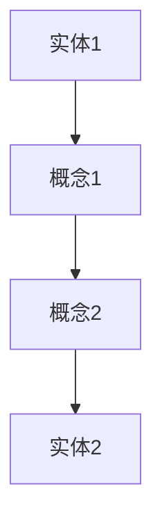

                 


# 构建具有概念学习能力的AI Agent

> 关键词：AI Agent，概念学习，概念抽取，概念关联，概念推理，系统架构，项目实战

> 摘要：本文将详细介绍如何构建一个具有概念学习能力的AI Agent。文章从概念学习的背景出发，分析其核心原理，探讨系统设计与实现，并通过实际案例展示如何将概念学习能力应用于AI Agent中。内容涵盖概念学习的核心概念、算法原理、系统架构设计以及项目实战，旨在为读者提供全面的技术指导。

---

## 第一部分：概念学习与AI Agent的背景介绍

### 第1章：概念学习的背景与问题背景

#### 1.1 概念学习的背景

- **1.1.1 从传统AI到概念学习的演进**
  传统AI主要依赖规则和数据，而概念学习则引入了更高层次的抽象和理解能力，使AI Agent能够更好地处理复杂任务。
  
- **1.1.2 概念学习的核心概念与特点**
  概念学习是指AI Agent能够理解、提取和应用概念的能力，其特点是层次性、关联性和可解释性。

- **1.1.3 概念学习在AI Agent中的重要性**
  概念学习使AI Agent能够从数据中提取更高层次的知识，提升其问题解决和决策能力。

#### 1.2 问题背景与问题描述

- **1.2.1 当前AI Agent的局限性**
  当前AI Agent主要依赖规则和模式匹配，缺乏对概念的理解和抽象能力。

- **1.2.2 概念学习能力的必要性**
  通过概念学习，AI Agent可以更好地处理复杂场景和不确定性问题。

- **1.2.3 概念学习能力的定义与目标**
  概念学习能力是指AI Agent能够识别、理解和应用概念的能力，其目标是提升AI Agent的智能水平。

#### 1.3 问题解决与边界外延

- **1.3.1 概念学习能力的实现路径**
  通过概念抽取、关联和推理等技术实现概念学习能力。

- **1.3.2 概念学习的边界与限制**
  概念学习依赖于数据质量和模型的泛化能力，存在一定的边界和限制。

- **1.3.3 概念学习能力的外延与扩展**
  概念学习能力可以扩展到知识图谱构建和智能推理等领域。

#### 1.4 概念结构与核心要素

- **1.4.1 概念的层次结构**
  概念可以通过层次结构表示，从上至下逐步细化。

- **1.4.2 概念学习的核心要素**
  包括概念抽取、关联和推理。

- **1.4.3 概念网络与关联性分析**
  概念网络通过节点和边表示概念及其关联关系。

---

## 第二部分：概念学习的核心概念与联系

### 第2章：概念学习的核心原理

#### 2.1 概念学习的原理分析

- **2.1.1 概念抽取的原理**
  通过统计或深度学习方法从数据中提取概念。

- **2.1.2 概念关联的原理**
  分析概念之间的关系，构建概念网络。

- **2.1.3 概念推理的原理**
  基于概念网络进行推理，得出新的概念或结论。

#### 2.2 概念属性特征对比

| 属性 | 概念层次性 | 概念关联性 | 概念可解释性 |
|------|------------|------------|-------------|
| 描述 | 概念的层次化结构 | 概念之间的关系 | 概念的解释能力 |

#### 2.3 ER实体关系图架构



### 第3章：概念学习的算法原理

#### 3.1 概念抽取算法

- **3.1.1 基于统计的抽取算法**
  使用频率统计方法提取概念。

- **3.1.2 基于深度学习的抽取算法**
  使用神经网络模型（如BERT）提取概念。

- **3.1.3 概念网络构建算法**
  使用图嵌入方法构建概念网络。

#### 3.2 概念关联与推理算法

- **3.2.1 基于图的关联算法**
  使用图遍历算法（如BFS）发现概念关联。

- **3.2.2 基于逻辑推理的算法**
  使用逻辑规则进行概念推理。

- **3.2.3 基于概率的推理算法**
  使用贝叶斯网络进行概率推理。

#### 3.3 概念学习的数学模型

- **3.3.1 概念抽取的数学模型**
  使用矩阵分解方法（如奇异值分解）提取概念。

- **3.3.2 概念关联的数学模型**
  使用图论中的邻接矩阵表示概念关联。

- **3.3.3 概念推理的数学模型**
  使用逻辑推理公式进行概念推理。

---

## 第三部分：概念学习的系统分析与架构设计

### 第4章：系统分析与架构设计

#### 4.1 问题场景介绍

- **4.1.1 概念学习的场景分析**
  例如，在自然语言处理中，AI Agent需要理解文本中的概念。

- **4.1.2 AI Agent的功能需求**
  包括概念抽取、关联和推理功能。

- **4.1.3 系统的性能需求**
  高效处理大规模数据和复杂概念关系。

#### 4.2 系统功能设计

- **4.2.1 领域模型设计**
  使用领域模型（如自然语言处理）进行概念学习。

- **4.2.2 功能模块划分**
  包括概念抽取模块、关联模块和推理模块。

- **4.2.3 模块之间的关系**
  各模块协同工作，实现概念学习的完整流程。

#### 4.3 系统架构设计

- **4.3.1 系统架构图**
  ```mermaid
  graph TD
      A[概念抽取模块] --> B[关联模块]
      B --> C[推理模块]
  ```

- **4.3.2 模块之间的接口设计**
  使用API接口实现模块之间的通信。

- **4.3.3 系统的交互流程**
  从输入数据开始，依次经过概念抽取、关联和推理模块，最终输出结果。

### 第5章：系统接口与交互设计

#### 5.1 系统接口设计

- **5.1.1 API接口设计**
  定义RESTful API接口，如`/api/concept/extract`。

- **5.1.2 数据格式设计**
  使用JSON格式传递数据，例如：
  ```json
  {
      "input": "文本数据",
      "output": "提取的概念"
  }
  ```

- **5.1.3 接口调用流程**
  客户端调用API接口，服务端处理请求并返回结果。

#### 5.2 系统交互设计

- **5.2.1 用户与系统的交互流程**
  用户输入数据，系统返回处理结果。

- **5.2.2 模块之间的交互流程**
  各模块之间通过API接口传递数据和结果。

- **5.2.3 交互过程中的异常处理**
  捕获并处理可能出现的异常，如数据格式错误。

---

## 第四部分：项目实战

### 第6章：项目实战与案例分析

#### 6.1 环境安装

- **6.1.1 安装Python环境**
  使用Anaconda安装Python 3.8及以上版本。

- **6.1.2 安装依赖库**
  安装必要的库，如`numpy`, `scikit-learn`, `networkx`, `pymermaid`.

#### 6.2 系统核心实现源代码

```python
import numpy as np
from sklearn.feature_extraction.text import TfidfVectorizer
from networkx import Graph

# 概念抽取模块
def extract_concepts(texts):
    vectorizer = TfidfVectorizer()
    tfidf = vectorizer.fit_transform(texts)
    concepts = vectorizer.get_feature_names_out()
    return concepts

# 概念关联模块
def build_concept_graph(concepts):
    graph = Graph()
    for i in range(len(concepts)):
        for j in range(i+1, len(concepts)):
            graph.add_edge(concepts[i], concepts[j])
    return graph

# 概念推理模块
def infer_concepts(graph, known_concepts):
    inferred = set()
    for concept in known_concepts:
        neighbors = graph.neighbors(concept)
        inferred.update(neighbors)
    return inferred
```

#### 6.3 代码应用解读与分析

- **代码解读**
  上述代码实现了概念抽取、关联和推理功能。

- **代码分析**
  使用TF-IDF提取概念，构建概念图，并基于图结构进行推理。

#### 6.4 实际案例分析和详细讲解剖析

- **案例分析**
  以自然语言处理任务为例，展示如何使用上述代码实现概念学习。

- **详细讲解**
  展示代码的运行过程和结果，分析其在实际应用中的表现。

#### 6.5 项目小结

- **项目总结**
  本项目展示了如何通过概念学习构建AI Agent的核心能力。

- **注意事项**
  在实际应用中，需注意数据质量和模型优化。

- **拓展阅读**
  建议读者深入学习知识图谱和深度学习技术。

---

## 第五部分：总结与展望

### 7.1 总结

- **核心内容回顾**
  本文详细讲解了概念学习的原理、算法和系统设计。

### 7.2 最佳实践 tips

- **实践建议**
  在实际项目中，结合具体场景选择合适的概念学习方法。

- **注意事项**
  注重数据质量和模型优化，避免过拟合和欠拟合。

### 7.3 未来展望

- **技术发展**
  概念学习将与知识图谱和深度学习结合，推动AI Agent的进一步发展。

---

通过本文的系统讲解，读者可以全面理解概念学习的原理和实现方法，并能够将其应用于实际的AI Agent开发中。

