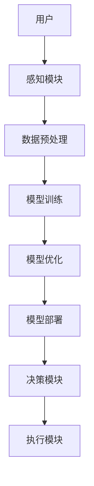
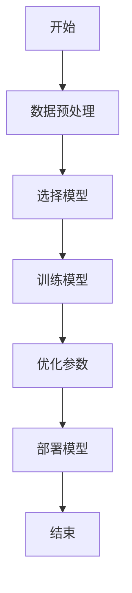
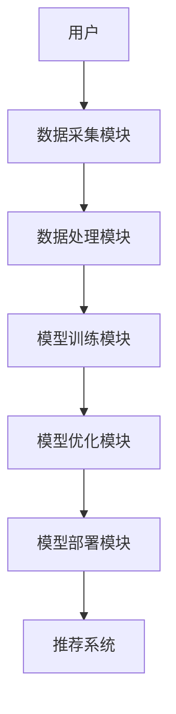
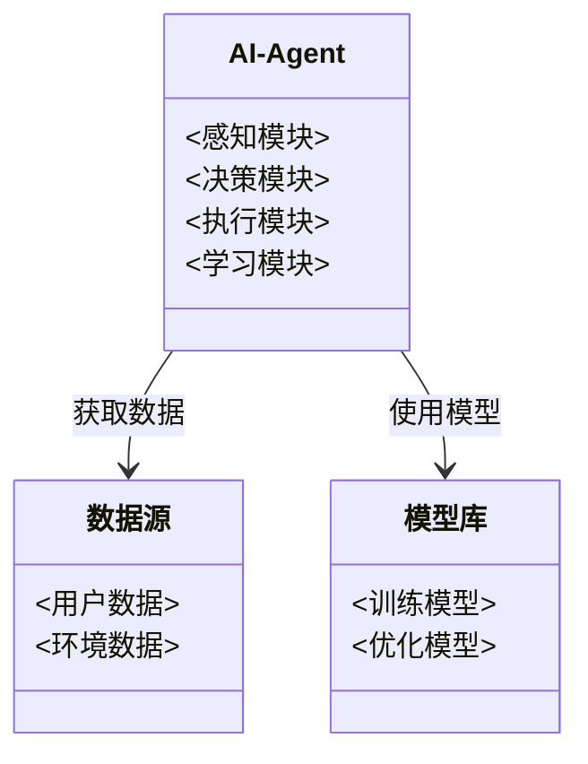
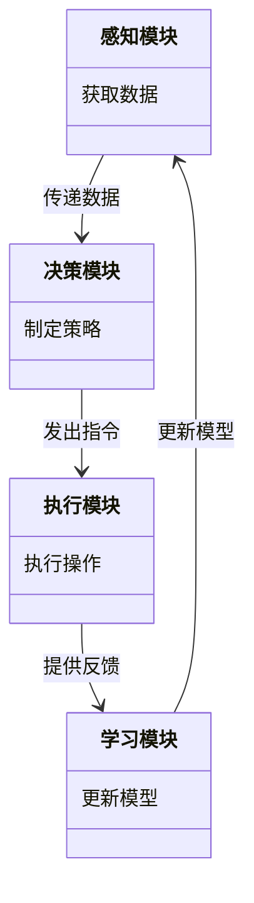
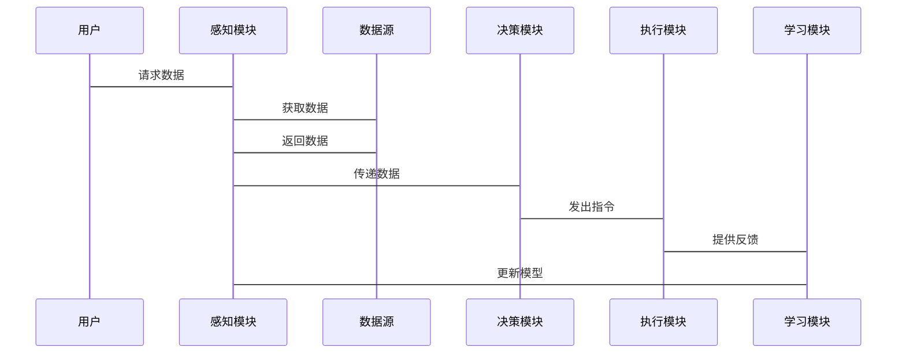
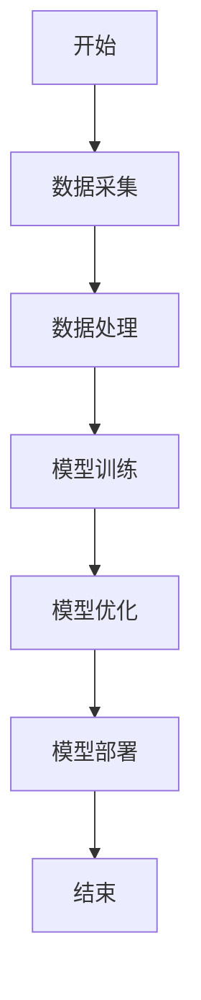

                 


# 构建具有自动机器学习能力的AI Agent

## 关键词：
AI Agent、自动机器学习、强化学习、系统架构、算法实现

## 摘要：
本文详细探讨了构建具有自动机器学习能力的AI Agent的全过程，从核心概念的理解到系统架构的设计，再到具体算法的实现。通过分析AI Agent的基本概念、自动机器学习的原理、算法实现的数学模型，以及系统架构的详细设计，最终结合实际项目案例，为读者提供一个全面而深入的技术指南。

---

# 第一部分: AI Agent与自动机器学习概述

## 第1章: AI Agent与自动机器学习概述

### 1.1 AI Agent的基本概念

#### 1.1.1 AI Agent的定义与分类
AI Agent（人工智能代理）是指能够感知环境、自主决策并执行任务的智能实体。根据功能和应用场景的不同，AI Agent可以分为以下几类：
- **简单反射型AI Agent**：基于预定义规则进行简单决策。
- **基于模型的反射型AI Agent**：利用内部模型进行状态推理和决策。
- **目标驱动型AI Agent**：根据目标优化行为。
- **效用驱动型AI Agent**：通过最大化效用函数进行决策。

#### 1.1.2 自动机器学习的定义与特点
自动机器学习（AutoML）是指通过自动化工具和算法，减少人工干预，使机器学习模型的构建和优化变得更加高效和便捷。其特点包括：
- **自动化**：从数据预处理到模型部署的全自动化。
- **易用性**：用户无需深入了解机器学习原理即可使用。
- **高效性**：通过算法优化提升模型性能。

#### 1.1.3 AI Agent与自动机器学习的关系
AI Agent需要通过自动机器学习来提升其自主决策和适应能力。自动机器学习为AI Agent提供了强大的模型构建和优化工具，而AI Agent则为自动机器学习提供了丰富的应用场景。

### 1.2 问题背景与需求分析

#### 1.2.1 当前AI Agent的发展现状
尽管AI Agent在许多领域取得了显著进展，但其性能仍然依赖于人工设计的规则和模型，缺乏足够的灵活性和自适应能力。

#### 1.2.2 自动机器学习在AI Agent中的应用痛点
- **数据多样性**：不同场景下的数据分布差异较大。
- **模型泛化能力**：单一模型难以适应多种任务。
- **计算资源限制**：复杂的模型需要大量的计算资源。

#### 1.2.3 用户需求与技术实现的结合
通过自动机器学习，AI Agent能够根据实时数据和环境反馈动态调整其行为策略，从而更好地满足用户需求。

### 1.3 问题解决与边界定义

#### 1.3.1 AI Agent自动机器学习的核心问题
如何设计一个能够自适应学习的AI Agent，使其能够在动态环境中持续优化其行为策略。

#### 1.3.2 问题的边界与外延
- **边界**：限定在特定任务和数据范围内。
- **外延**：扩展到更多应用场景和数据类型。

#### 1.3.3 核心概念与系统架构的关系
AI Agent的系统架构决定了其自动机器学习能力的实现方式，而核心概念则是系统架构设计的基础。

### 1.4 核心概念与系统架构

#### 1.4.1 AI Agent的系统组成
- **感知模块**：负责收集环境信息。
- **决策模块**：基于感知信息进行策略选择。
- **执行模块**：根据决策结果执行具体操作。
- **学习模块**：通过反馈优化模型。

#### 1.4.2 自动机器学习的实现机制
- **数据预处理**：自动清洗和特征提取。
- **模型选择**：根据任务选择合适的算法。
- **参数优化**：通过自动调参提升模型性能。

#### 1.4.3 核心概念的ER实体关系图
```mermaid
erDiagram
    actor User {
        <name>
    }
    class AI-Agent {
        <id>
        <type>
    }
    class Task {
        <id>
        <description>
    }
    class Model {
        <id>
        <algorithm>
    }
    User --> AI-Agent: 使用
    AI-Agent --> Task: 执行
    AI-Agent --> Model: 使用
```

---

## 第2章: 自动机器学习的核心原理

### 2.1 核心概念与原理分析

#### 2.1.1 自动机器学习的定义与实现机制
自动机器学习通过自动化工具（如AutoML平台）实现模型的自动构建和优化。其实现机制包括：
- **自动化数据预处理**：处理缺失值、归一化等。
- **自动化模型选择**：根据数据特性选择合适的算法。
- **自动化参数调优**：通过网格搜索或随机搜索优化模型参数。

#### 2.1.2 AI Agent中的自动机器学习流程
1. **数据收集**：感知模块获取环境数据。
2. **数据处理**：自动预处理数据。
3. **模型训练**：选择合适的算法训练模型。
4. **模型部署**：将模型集成到AI Agent中。
5. **实时优化**：根据反馈持续优化模型。

#### 2.1.3 核心算法与模型选择
常用的自动机器学习算法包括：
- **基于遗传算法的模型选择**：通过模拟进化过程选择最优模型。
- **基于梯度下降的参数优化**：通过优化目标函数选择最优参数。

### 2.2 核心概念对比分析

#### 2.2.1 自动机器学习与传统机器学习的对比
| 特性            | 自动机器学习                  | 传统机器学习                |
|-----------------|------------------------------|-----------------------------|
| 数据预处理      | 全自动化                     | 需要手动处理                |
| 模型选择        | 自动选择最优模型             | 需要手动选择                |
| 参数优化        | 自动调优                     | 需要手动调整                |

#### 2.2.2 不同自动机器学习算法的对比
| 算法名称        | 优缺点                        | 适用场景                  |
|-----------------|-------------------------------|---------------------------|
| 遗传算法        | 全局优化能力强               | 适合复杂的优化问题         |
| 梯度下降        | 收敛速度快                   | 适合连续变量优化           |
| 网格搜索        | 确保最优解                   | 适合参数空间较小的情况     |

#### 2.2.3 AI Agent中的核心概念属性特征对比表格
| 概念             | 属性                         | 特征                       |
|------------------|------------------------------|---------------------------|
| 感知模块         | 输入数据类型                 | 多样性                     |
| 决策模块         | 决策策略                     | 灵活性                     |
| 执行模块         | 执行方式                     | 及时性                     |
| 学习模块         | 学习算法                     | 自适应性                   |

### 2.3 系统架构与流程图

#### 2.3.1 自动机器学习的系统架构图


#### 2.3.2 核心概念的ER实体关系图
```mermaid
erDiagram
    class AI-Agent {
        id
        type
    }
    class Task {
        id
        description
    }
    class Model {
        id
        algorithm
    }
    AI-Agent --> Task: 执行
    AI-Agent --> Model: 使用
```

#### 2.3.3 算法实现的mermaid流程图


---

## 第3章: 自动机器学习算法原理

### 3.1 算法原理概述

#### 3.1.1 自动机器学习的算法分类
- **基于规则的自动机器学习**：通过预定义规则进行决策。
- **基于模型的自动机器学习**：通过模型推理进行决策。
- **强化学习的自动机器学习**：通过试错和奖励机制优化模型。

#### 3.1.2 AI Agent中的自动机器学习流程
1. **环境感知**：AI Agent通过传感器或API获取环境数据。
2. **数据处理**：自动清洗和特征提取。
3. **模型训练**：选择合适的算法训练模型。
4. **模型优化**：通过反馈优化模型参数。
5. **模型部署**：将优化后的模型部署到AI Agent中。

#### 3.1.3 算法实现的数学模型
自动机器学习的数学模型可以表示为：
$$
\text{目标函数} = f(x) + \lambda \cdot g(x)
$$
其中，$f(x)$ 是目标损失函数，$\lambda$ 是正则化系数，$g(x)$ 是正则化项。

### 3.2 算法实现的数学公式

#### 3.2.1 优化算法的数学推导
以随机梯度下降为例：
$$
\theta_{t+1} = \theta_t - \eta \cdot \frac{\partial L}{\partial \theta}
$$
其中，$\theta$ 是模型参数，$\eta$ 是学习率，$L$ 是损失函数。

#### 3.2.2 模型训练的数学公式
线性回归的损失函数：
$$
L = \frac{1}{2n}\sum_{i=1}^{n}(y_i - \hat{y_i})^2
$$
其中，$y_i$ 是真实值，$\hat{y_i}$ 是预测值，$n$ 是样本数量。

#### 3.2.3 模型推理的数学公式
以分类任务为例，概率计算公式：
$$
P(y|x) = \frac{e^{w_x}}{\sum_{k}e^{w_k}}
$$
其中，$w_x$ 是输入$x$对应的权重，$\sum_{k}e^{w_k}$ 是归一化常数。

### 3.3 算法实现的Python代码示例

#### 3.3.1 简单自动机器学习算法实现
```python
def auto_ml(X, y):
    # 数据预处理
    from sklearn.preprocessing import StandardScaler
    scaler = StandardScaler().fit(X)
    X_scaled = scaler.transform(X)
    
    # 模型选择
    from sklearn.model_selection import GridSearchCV
    from sklearn.svm import SVC
    param_grid = {'C': [1, 10], 'kernel': ['linear', 'rbf']}
    grid_search = GridSearchCV(SVC(), param_grid, cv=5)
    grid_search.fit(X_scaled, y)
    
    # 模型优化
    best_model = grid_search.best_estimator_
    return best_model
```

#### 3.3.2 复杂自动机器学习算法实现
```python
import numpy as np
from sklearn.metrics import accuracy_score

def train_test(X, y):
    # 数据分割
    X_train, X_test, y_train, y_test = train_test_split(X, y, test_size=0.2)
    
    # 模型训练
    model = RandomForestClassifier(n_estimators=100, max_depth=10, random_state=42)
    model.fit(X_train, y_train)
    
    # 模型评估
    y_pred = model.predict(X_test)
    print(f'Accuracy: {accuracy_score(y_test, y_pred)}')
```

---

## 第4章: 系统分析与架构设计

### 4.1 项目介绍

#### 4.1.1 项目背景
构建一个能够自动学习和优化的AI Agent，用于智能推荐系统。

#### 4.1.2 系统功能设计
- **数据采集**：从数据库中获取用户行为数据。
- **数据处理**：清洗和特征提取。
- **模型训练**：选择合适的算法训练推荐模型。
- **模型优化**：根据反馈优化推荐策略。
- **模型部署**：将优化后的模型部署到推荐系统中。

#### 4.1.3 系统架构设计


### 4.2 系统架构设计

#### 4.2.1 系统整体架构


#### 4.2.2 系统功能模块的类图


#### 4.2.3 系统交互的序列图


---

## 第5章: 项目实战

### 5.1 环境安装与配置

#### 5.1.1 安装依赖
```bash
pip install scikit-learn numpy pandas mermaid4jupyter
```

#### 5.1.2 配置开发环境
- 安装Jupyter Notebook
- 配置Python版本（建议3.8以上）

### 5.2 系统核心实现源代码

#### 5.2.1 数据采集模块
```python
import pandas as pd

def get_data():
    data = pd.read_csv('data.csv')
    return data
```

#### 5.2.2 数据处理模块
```python
from sklearn.preprocessing import StandardScaler

def preprocess(data):
    scaler = StandardScaler()
    data_scaled = scaler.fit_transform(data)
    return data_scaled
```

#### 5.2.3 模型训练模块
```python
from sklearn.ensemble import RandomForestClassifier

def train_model(X, y):
    model = RandomForestClassifier(n_estimators=100, max_depth=10)
    model.fit(X, y)
    return model
```

#### 5.2.4 模型优化模块
```python
from sklearn.model_selection import GridSearchCV

def optimize_model(X, y):
    model = RandomForestClassifier()
    param_grid = {'n_estimators': [100, 200], 'max_depth': [10, 20]}
    grid_search = GridSearchCV(model, param_grid, cv=5)
    grid_search.fit(X, y)
    best_model = grid_search.best_estimator_
    return best_model
```

#### 5.2.5 模型部署模块
```python
def deploy_model(model, X_new):
    y_pred = model.predict(X_new)
    return y_pred
```

### 5.3 代码应用解读与分析

#### 5.3.1 代码实现细节
- 数据采集模块：从CSV文件中读取数据。
- 数据处理模块：使用标准Scaler进行数据归一化。
- 模型训练模块：使用随机森林进行分类。
- 模型优化模块：通过网格搜索优化模型参数。
- 模型部署模块：将优化后的模型部署到实际应用中。

#### 5.3.2 代码实现的流程图


### 5.4 实际案例分析和详细讲解剖析

#### 5.4.1 案例背景
构建一个基于自动机器学习的智能推荐系统，用于推荐电影给用户。

#### 5.4.2 数据准备
从电影评分数据集中获取用户评分和电影特征。

#### 5.4.3 模型实现
使用随机森林模型进行电影推荐。

#### 5.4.4 系统优化
通过网格搜索优化随机森林模型的参数。

#### 5.4.5 系统部署
将优化后的模型部署到推荐系统中，实时为用户推荐电影。

### 5.5 项目小结

#### 5.5.1 项目实现的关键点
- 数据预处理的准确性
- 模型选择的合理性
- 模型优化的有效性

#### 5.5.2 项目实现的注意事项
- 数据泄漏问题
- 模型过拟合问题
- 计算资源限制

---

## 第6章: 总结与展望

### 6.1 总结
本文详细探讨了构建具有自动机器学习能力的AI Agent的全过程，从核心概念的理解到系统架构的设计，再到具体算法的实现，为读者提供了一个全面而深入的技术指南。

### 6.2 展望
未来，随着人工智能技术的不断发展，AI Agent的自动机器学习能力将更加智能化和自动化，能够更好地适应复杂多变的环境需求。

### 6.3 最佳实践 Tips
- 在实际应用中，要充分考虑数据的质量和多样性。
- 在模型优化过程中，要注意防止过拟合和数据泄漏。
- 在系统部署时，要确保计算资源的充足性和稳定性。

---

通过本文的学习，读者将能够掌握构建具有自动机器学习能力的AI Agent的核心技术，并能够在实际项目中灵活应用这些知识，开发出更加智能和高效的AI系统。

