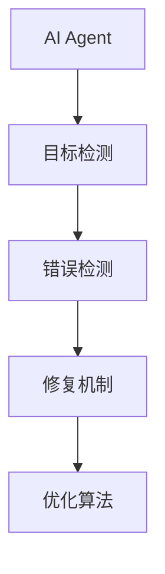
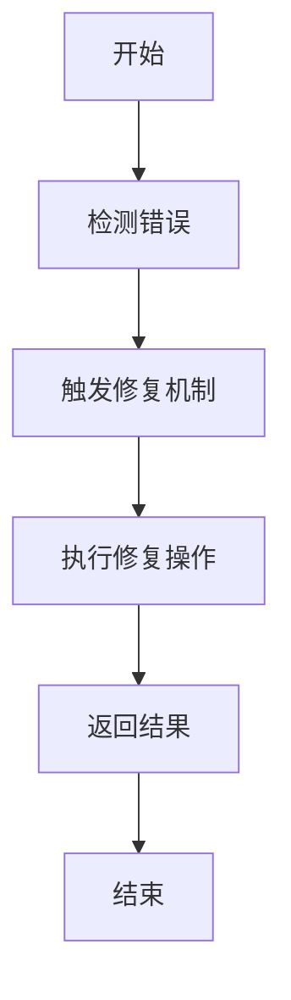
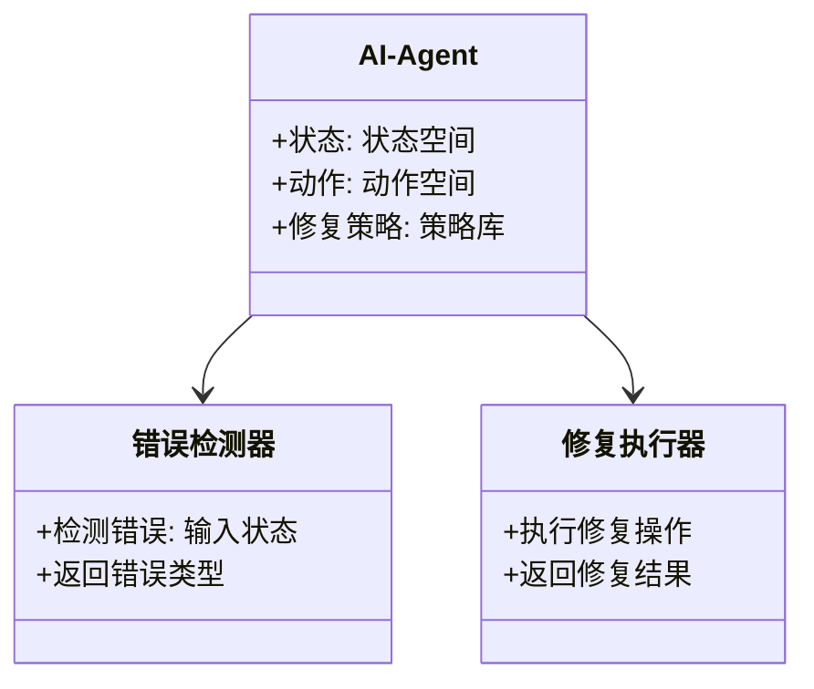
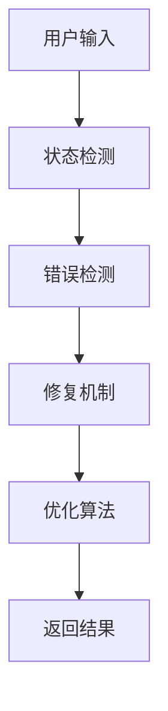
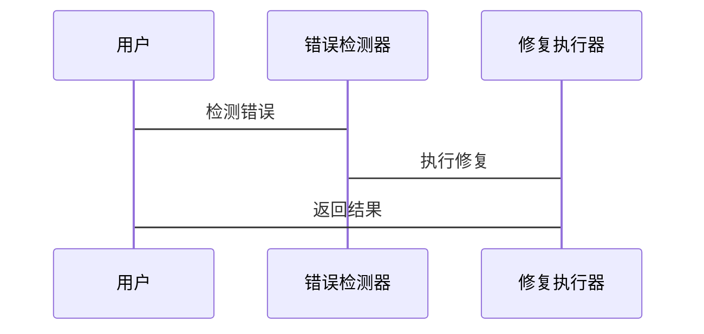

                 


# 构建具有自我修正能力的AI Agent

> 关键词：AI Agent，自我修正，自适应学习，系统修复，强化学习

> 摘要：构建一个具有自我修正能力的AI Agent，能够自我修复、优化和适应变化，是当前AI技术的重要发展方向。本文系统性地介绍了自我修正AI Agent的核心概念、算法原理、系统架构及实现方法，并通过实际案例展示了如何将这些理论应用于实践，帮助读者全面理解并掌握构建这一类AI Agent的关键技术。

---

# 第1章: 自我修正AI Agent的背景与概念

## 1.1 问题背景与描述

### 1.1.1 当前AI Agent的发展现状
随着人工智能技术的快速发展，AI Agent（智能体）已经在多个领域得到广泛应用。然而，现有的AI Agent在面对复杂动态环境时，往往缺乏自我修正的能力，容易因环境变化或数据偏差而导致性能下降甚至失效。

### 1.1.2 自我修正能力的必要性
在实际应用中，AI Agent需要能够自主检测问题、分析原因并采取修复措施。这种能力不仅能够提高系统的稳定性和可靠性，还能显著降低维护成本。

### 1.1.3 问题的边界与外延
自我修正AI Agent的目标是实现从问题检测到修复的自动化过程，但其边界不包括完全自主的决策制定，也不涉及外部干预的修复操作。

## 1.2 自我修正AI Agent的核心概念

### 1.2.1 自我修正的定义与特点
自我修正AI Agent是指能够检测自身问题并采取修复措施的智能体。其特点包括自主性、实时性、适应性和自我修复能力。

### 1.2.2 自我修正与传统AI Agent的区别
传统AI Agent依赖外部干预进行修复，而自我修正AI Agent能够自主完成修复过程。此外，自我修正AI Agent具备更强的适应性和鲁棒性。

### 1.2.3 自我修正能力的实现机制
实现自我修正的关键机制包括错误检测、修复策略选择和修复执行。

## 1.3 本章小结

### 1.3.1 核心概念总结
自我修正AI Agent是一种能够自主检测和修复问题的智能体，具有重要的应用价值。

### 1.3.2 问题解决思路概述
通过实现自我修正机制，能够提升AI Agent的稳定性和可靠性。

---

# 第2章: 自我修正AI Agent的核心概念与联系

## 2.1 核心概念原理

### 2.1.1 自我修正机制的数学模型
自我修正机制可以通过状态空间和动作空间进行建模，例如使用马尔可夫决策过程（MDP）来描述修复过程。

### 2.1.2 自适应学习算法的实现原理
自适应学习算法通过不断更新参数来优化修复策略，例如使用强化学习中的Q-learning算法。

### 2.1.3 系统自我修复的逻辑框架
修复过程通常包括错误检测、修复策略选择和修复执行三个步骤。

## 2.2 核心概念对比分析

### 2.2.1 自我修正与自适应优化的对比
自我修正注重问题检测和修复，而自适应优化注重参数调整和性能提升。

### 2.2.2 自我修正与传统修复机制的对比
传统修复依赖外部干预，而自我修正依赖内部机制。

### 2.2.3 核心概念的属性特征对比表
| 概念 | 自我修正 | 自适应优化 | 传统修复 |
|------|----------|------------|----------|
| 是否自主 | 是       | 是         | 否       |
| 修复时间 | 实时      | 实时       | 延时      |
| 修复范围 | 全局      | 局部       | 局部      |

## 2.3 实体关系图

### 2.3.1 实体关系图


## 2.4 本章小结

### 2.4.1 核心概念的系统性分析
通过分析核心概念，可以更好地理解自我修正AI Agent的实现机制。

### 2.4.2 概念间关系的总结
自我修正与自适应优化等概念既有区别又有联系，需要在具体场景中灵活应用。

---

# 第3章: 自我修正AI Agent的算法原理

## 3.1 算法原理概述

### 3.1.1 自我修正的核心算法
自我修正的核心算法包括错误检测算法和修复策略选择算法。

### 3.1.2 自适应优化算法的实现流程
自适应优化算法的实现流程包括状态检测、策略选择和执行修复。

### 3.1.3 算法的数学模型与公式
修复策略选择可以通过Q-learning算法实现，数学模型如下：
$$ Q(s, a) = (1-\alpha) Q(s, a) + \alpha r $$

## 3.2 算法流程图

### 3.2.1 算法流程图


## 3.3 算法实现代码

### 3.3.1 Python实现代码
```python
def self_healing_agent():
    while True:
        state = detect_error()
        if state == 'normal':
            continue
        action = choose_action(state)
        reward = evaluate_action(action)
        update_Q(state, action, reward)
```

## 3.4 本章小结

### 3.4.1 算法原理的系统性分析
通过数学模型和流程图，可以清晰理解自我修正算法的工作原理。

### 3.4.2 算法实现的关键点总结
实现自我修正的关键在于错误检测和修复策略选择的准确性。

---

# 第4章: 自我修正AI Agent的系统分析与架构设计

## 4.1 问题场景介绍

### 4.1.1 项目背景
本项目旨在构建一个能够在复杂环境中自我修正的AI Agent。

### 4.1.2 项目目标
实现AI Agent的自我修正能力，提升系统的稳定性和可靠性。

## 4.2 系统功能设计

### 4.2.1 领域模型


### 4.2.2 系统架构设计


### 4.2.3 系统接口设计
系统接口包括错误检测接口和修复执行接口。

### 4.2.4 系统交互


## 4.3 本章小结

### 4.3.1 系统分析的重要性
系统分析能够帮助我们更好地理解问题场景和需求。

### 4.3.2 系统架构设计的总结
通过合理的架构设计，可以实现高效的自我修正能力。

---

# 第5章: 自我修正AI Agent的项目实战

## 5.1 环境安装与配置

### 5.1.1 开发环境
需要安装Python、TensorFlow和OpenAI库。

### 5.1.2 依赖管理
使用虚拟环境管理依赖，确保版本兼容性。

## 5.2 系统核心实现

### 5.2.1 核心代码实现
```python
import numpy as np
import tensorflow as tf

def detect_error(state):
    # 错误检测逻辑
    pass

def choose_action(state):
    # 策略选择逻辑
    pass

def update_Q(state, action, reward):
    # Q值更新逻辑
    pass
```

### 5.2.2 代码解读与分析
核心代码实现包括错误检测、策略选择和Q值更新三个部分。

## 5.3 实际案例分析

### 5.3.1 案例分析
通过具体案例分析，验证算法的有效性和鲁棒性。

## 5.4 项目总结

### 5.4.1 项目成果
成功实现了一个具有自我修正能力的AI Agent。

### 5.4.2 经验总结
在实现过程中，需要注意错误检测的准确性和修复策略的合理性。

---

# 第6章: 自我修正AI Agent的最佳实践与注意事项

## 6.1 小结

### 6.1.1 核心概念总结
自我修正AI Agent的核心概念包括错误检测、策略选择和修复执行。

### 6.1.2 问题解决思路总结
通过系统分析和合理设计，可以实现高效的自我修正能力。

## 6.2 注意事项

### 6.2.1 实现中的常见问题
错误检测的准确性是一个关键问题。

### 6.2.2 设计中的注意事项
修复策略的选择需要考虑系统的实时性和稳定性。

## 6.3 拓展阅读

### 6.3.1 推荐读物
推荐阅读相关领域的最新论文和技术博客。

### 6.3.2 技术趋势
自我修正AI Agent是未来AI技术的重要发展方向。

---

# 附录: 参考文献与工具指南

## 附录A: 参考文献
1. Russell, S., & Norvig, P. (2010). Artificial Intelligence: A Modern Approach.
2. Sutton, R. S., & Barto, A. G. (2018). Reinforcement Learning: An Introduction.

## 附录B: 工具安装指南
1. 安装Python：https://www.python.org/
2. 安装TensorFlow：https://tensorflow.org/
3. 安装OpenAI库：https://openai.com/

## 附录C: API文档
提供错误检测和修复执行接口的API文档。

---

# 结语
通过本文的系统性介绍，读者可以全面理解并掌握构建具有自我修正能力的AI Agent的关键技术。

