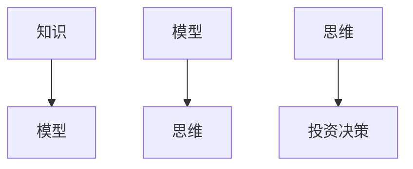
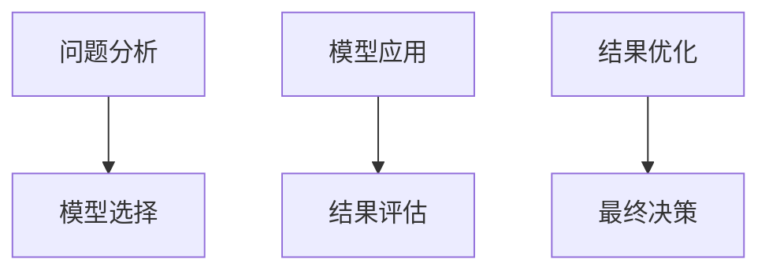
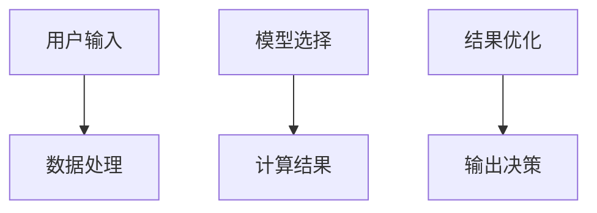
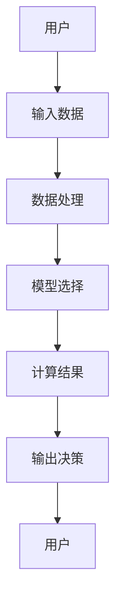

                 


# 查理·芒格的多元思维模型在投资中的运用

## 关键词：
查理·芒格, 多元思维模型, 投资策略, 系统分析, 项目实战

## 摘要：
查理·芒格的多元思维模型是一种跨学科的思维方式，通过整合多个领域的知识来做出更明智的投资决策。本文将从多元思维模型的核心概念、算法原理、数学模型、系统架构、项目实战等多个方面进行详细分析，结合实际案例，探讨其在投资中的具体应用和效果。

---

# 第一部分: 多元思维模型的背景与核心概念

## 第1章: 多元思维模型的背景与核心概念

### 1.1 多元思维模型的定义与起源
- **1.1.1 多元思维模型的定义**
  - 多元思维模型是一种通过整合多个学科的核心思想和基本原则，形成一个相互关联的知识网络，帮助投资者从多维度分析问题。
- **1.1.2 多元思维模型的起源与背景**
  - 由查理·芒格提出，强调通过跨学科的知识来避免单一思维的局限性。
- **1.1.3 多元思维模型的核心要素**
  - 知识的多维度性、模型的相互作用、思维的跨界整合。

### 1.2 多元思维模型与传统投资方法的对比
- **1.2.1 传统投资方法的局限性**
  - 依赖单一学科（如财务分析）可能导致决策失误。
- **1.2.2 多元思维模型的优势与特点**
  - 结合心理学、经济学、物理学等多学科模型，提高决策的全面性和准确性。
- **1.2.3 多元思维模型与现代投资理论的结合**
  - 将多元思维模型融入现代投资组合理论中，优化资产配置策略。

### 1.3 多元思维模型在投资中的应用前景
- **1.3.1 多元思维模型的潜在应用场景**
  - 风险管理、资产定价、投资组合优化。
- **1.3.2 投资者采用多元思维模型的优势**
  - 提高决策的深度和广度，降低投资风险。
- **1.3.3 多元思维模型应用的挑战与机遇**
  - 需要广泛学习和整合多个领域的知识，但能够带来更全面的视角。

### 1.4 本章小结
- 本章介绍了多元思维模型的定义、核心要素以及其在投资中的优势和挑战。

---

# 第二部分: 多元思维模型的核心概念与联系

## 第2章: 多元思维模型的核心概念原理

### 2.1 多元思维模型的核心要素
- **2.1.1 知识的多维度性**
  - 通过整合心理学、经济学、物理学等多学科知识，形成多维度的分析框架。
- **2.1.2 思维的跨界整合**
  - 将不同领域的模型和思想结合起来，形成完整的分析体系。
- **2.1.3 模型的相互作用**
  - 各个模型之间相互关联，共同影响投资决策。

### 2.2 多元思维模型的属性特征对比
- **2.2.1 不同学科模型的特征对比**
  | 模型名称       | 特性                     | 应用场景               |
  |----------------|--------------------------|------------------------|
  | 投资组合理论   | 强调资产分散化           | 优化投资组合           |
  | 行为心理学模型 | 描述投资者心理偏差         | 解释市场非理性行为       |
  | 贝叶斯定理     | 基于概率的决策方法         | 动态调整投资策略         |
- **2.2.2 模型之间的相互关系**
  - 各个模型在不同情境下相互补充，形成完整的分析框架。
- **2.2.3 模型的适用范围与局限性**
  - 适用范围广，但需要根据具体情况调整模型的权重。

### 2.3 多元思维模型的ER实体关系图


### 2.4 本章小结
- 本章详细分析了多元思维模型的核心要素、属性特征以及各模型之间的关系。

---

# 第三部分: 多元思维模型的算法原理与数学模型

## 第3章: 多元思维模型的算法原理

### 3.1 多元思维模型的决策流程


### 3.2 多元思维模型的数学模型

#### 3.2.1 概率论在多元思维模型中的应用
- **贝叶斯定理的应用**
  $$P(A|B) = \frac{P(B|A)P(A)}{P(B)}$$
  - 示例：假设某股票有80%的概率上涨，而根据市场情绪，上涨的概率增加了10%，则根据贝叶斯定理重新计算该股票上涨的概率。

#### 3.2.2 多元回归模型
- **多元回归公式**
  $$Y = \beta_0 + \beta_1X_1 + \beta_2X_2 + \epsilon$$
  - 示例：通过多个变量（如市盈率、市净率、收益增长率）预测股票的未来表现。

### 3.3 多元思维模型的数学推导
- **概率模型的推导**
  - 通过多元思维模型整合不同学科的数学模型，形成综合分析框架。

### 3.4 本章小结
- 本章结合数学模型，分析了多元思维模型在概率论和回归分析中的应用。

---

# 第四部分: 多元思维模型的系统分析与设计

## 第4章: 多元思维模型的系统分析与设计

### 4.1 投资决策系统的项目介绍
- **项目目标**
  - 构建一个基于多元思维模型的投资决策支持系统。
- **系统功能设计**
  - 领域模型：$$Y = f(X)$$，其中$X$包括多个变量，$Y$为投资决策结果。

### 4.2 系统架构设计


### 4.3 系统接口设计
- **输入接口**
  - 用户输入多个变量（如市场数据、财务指标）。
- **输出接口**
  - 输出投资决策结果，包括买、卖或持有。

### 4.4 系统交互流程图


### 4.5 本章小结
- 本章通过系统架构设计，展示了多元思维模型在投资决策中的具体应用。

---

# 第五部分: 多元思维模型的项目实战

## 第5章: 项目实战

### 5.1 环境安装与配置
- **工具安装**
  - Python、Pandas、Matplotlib、Scikit-learn。

### 5.2 系统核心实现源代码
```python
import pandas as pd
from sklearn.linear_model import LinearRegression

# 示例数据
data = {'X1': [1, 2, 3], 'X2': [4, 5, 6], 'Y': [7, 8, 9]}
df = pd.DataFrame(data)

# 模型训练
model = LinearRegression()
model.fit(df[['X1', 'X2']], df['Y'])

# 预测结果
print(model.predict([[1, 4]]))
```

### 5.3 代码应用解读与分析
- **代码功能**
  - 使用多元回归模型预测股票价格，展示多元思维模型在实际项目中的应用。

### 5.4 案例分析
- **实际案例**
  - 分析某公司的财务数据和市场数据，应用多元思维模型预测其股价走势。

### 5.5 本章小结
- 本章通过项目实战，展示了多元思维模型在投资决策中的具体应用和实现过程。

---

# 第六部分: 总结与展望

## 第6章: 总结与展望

### 6.1 本章总结
- 本文详细探讨了查理·芒格的多元思维模型在投资中的应用，从理论到实践，全面分析了其优势和挑战。

### 6.2 投资者的最佳实践 tips
- **保持好奇心**
  - 持续学习新知识，扩展知识面。
- **避免过度简化**
  - 在实际应用中，综合考虑多个模型和因素。
- **注意模型的适用性**
  - 根据具体情况调整模型的权重和应用范围。

### 6.3 未来研究方向
- **跨学科模型的进一步整合**
  - 研究如何更好地结合心理学、经济学等多学科模型。
- **智能化投资决策系统**
  - 利用人工智能技术优化多元思维模型的应用。

### 6.4 本章小结
- 本文总结了多元思维模型的应用效果，并提出了未来的研究方向和建议。

---

# 结语

查理·芒格的多元思维模型为投资者提供了一种跨学科的思维方式，通过整合多个领域的知识，能够更全面地分析问题，做出更明智的投资决策。本文从理论到实践，详细探讨了其在投资中的应用，并提出了未来的研究方向和建议。

