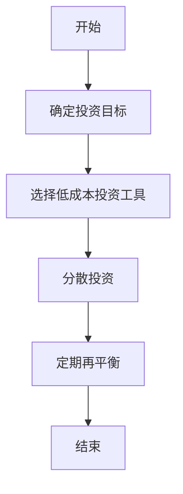
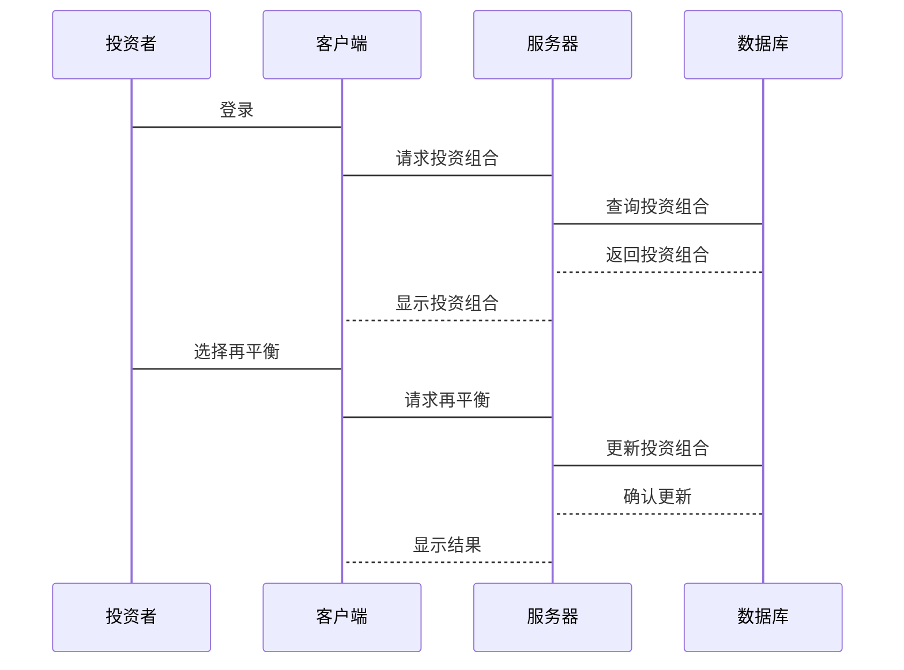

                 


# 《约翰·伯格的低成本投资策略》

> 关键词：低成本投资，约翰·伯格，投资策略，风险管理，数学模型

> 摘要：本文深入分析了约翰·伯格的低成本投资策略，从其背景、核心概念到算法原理，再到实际应用，详细阐述了低成本投资的理论基础和实践方法。通过数学模型、流程图和代码示例，帮助读者全面理解并掌握低成本投资的精髓。

---

# 第一部分: 约翰·伯格的低成本投资策略背景与核心概念

---

# 第1章: 低成本投资策略的背景与定义

## 1.1 投资领域的低成本概念

### 1.1.1 低成本投资的定义

低成本投资是一种通过严格控制投资成本，以实现长期稳定收益的投资策略。与传统的高成本投资策略不同，低成本投资强调在降低各项费用的同时，注重长期的复利效应。

### 1.1.2 低成本投资的核心要素

- **低管理费用**：通过选择低成本的管理方式，降低管理费用对投资收益的侵蚀。
- **低交易成本**：减少频繁交易带来的佣金和滑点损失。
- **低税收负担**：优化投资结构，降低税务支出。

### 1.1.3 低成本投资与传统投资的区别

| 特性               | 低成本投资                     | 传统投资                       |
|--------------------|-------------------------------|--------------------------------|
| 管理费用           | 低                            | 高或中等                      |
| 交易频率           | 低                            | 高                            |
| 税务优化           | 强化                          | 一般                          |

### 1.1.4 约翰·伯格低成本策略的形成背景

约翰·伯格（John Bogle）是低成本投资的倡导者，他于1975年创立了先锋集团（Vanguard），并推出了低成本指数基金，彻底改变了传统的投资方式。

---

## 1.2 约翰·伯格的投资理念

### 1.2.1 约翰·伯格的生平简介

约翰·伯格（1934-2019）是美国著名投资家，被誉为“指数基金之父”。他创立的先锋集团是全球最大的共同基金管理公司之一。

### 1.2.2 约翰·伯格的投资哲学

- **长期投资**：伯格主张长期持有优质资产，避免频繁交易。
- **分散投资**：通过分散投资降低风险。
- **低成本策略**：通过降低费用和交易成本，最大化长期收益。

### 1.2.3 低成本投资的市场背景

20世纪70年代，美国的投资市场以高佣金和高管理费用为主，投资者的收益往往被高昂的成本侵蚀。伯格正是看到了这一问题，提出了低成本投资的解决方案。

---

## 1.3 低成本投资的市场背景

### 1.3.1 投资市场的成本结构分析

投资市场的成本结构包括管理费用、交易佣金、税收等。低成本投资的核心在于降低这些成本，从而提高净收益。

### 1.3.2 低成本投资的兴起原因

- **技术进步**：互联网降低了信息获取和交易的成本。
- **指数基金的普及**：指数基金的成本低、风险分散，适合大众投资者。
- **投资者教育**：越来越多的投资者意识到低成本投资的优势。

### 1.3.3 低成本投资的未来发展趋势

随着技术的进步和投资者的成熟，低成本投资将成为主流的投资方式。

---

## 1.4 本章小结

本章介绍了低成本投资的定义、核心要素以及约翰·伯格的投资理念。通过对比低成本投资与传统投资的差异，读者可以理解低成本投资的独特优势。

---

# 第2章: 低成本投资策略的核心优势

## 2.1 成本控制的重要性

### 2.1.1 投资成本对收益的影响

投资成本包括管理费用、交易佣金和税务支出等。低成本投资通过降低这些成本，提高净收益。

### 2.1.2 低成本策略对长期投资的益处

- **复利效应**：低成本策略降低了费用侵蚀复利的风险。
- **风险控制**：通过分散投资和严格的风险管理，降低整体风险。

### 2.1.3 成本与收益的权衡

低成本投资并不意味着忽视收益，而是通过优化成本结构，实现长期稳定的收益增长。

---

## 2.2 低成本投资的风险管理

### 2.2.1 风险管理的核心原则

- **分散投资**：通过投资不同资产类别和行业，降低特定风险。
- **长期持有**：避免短期波动的影响。
- **定期调整**：根据市场变化，及时调整投资组合。

### 2.2.2 约翰·伯格的风险控制模型

伯格的风险控制模型强调分散投资和长期持有，通过降低市场波动对投资组合的影响，实现稳定收益。

---

## 2.3 低成本投资的长期收益分析

### 2.3.1 长期复利效应的数学模型

$$ \text{复利公式} = P \times (1 + r)^t $$

其中：
- \( P \) 是本金
- \( r \) 是年收益率
- \( t \) 是投资时间

### 2.3.2 低成本策略对复利增长的促进作用

低成本策略通过降低费用，最大化复利效应，从而实现更高的长期收益。

---

## 2.4 本章小结

本章分析了低成本投资的核心优势，包括成本控制的重要性、风险管理的原则以及长期收益的数学模型。通过这些分析，读者可以理解低成本投资在长期投资中的独特价值。

---

# 第3章: 低成本投资策略的核心概念与联系

## 3.1 成本控制的数学模型

### 3.1.1 成本控制的线性回归模型

$$ \text{总成本} = a \times \text{投资金额} + b $$

其中：
- \( a \) 是单位投资金额的成本
- \( b \) 是固定成本

---

## 3.2 投资组合优化的原理

### 3.2.1 投资组合优化的数学模型

$$ \text{目标函数} = \text{最大化收益} - \text{最小化成本} $$

### 3.2.2 约翰·伯格的投资组合优化方法

伯格的投资组合优化方法强调分散投资和低成本策略，通过优化资产配置，实现收益最大化。

---

## 3.3 成本与风险的平衡关系

### 3.3.1 成本与风险的正相关性分析

- 成本越低，风险越小。
- 但成本过低可能导致收益不足。

### 3.3.2 约翰·伯格的成本-风险平衡策略

伯格的策略是在保证一定收益的前提下，尽可能降低投资成本。

---

## 3.4 核心概念对比表格

| 概念       | 低成本投资 | 高成本投资 |
|------------|------------|------------|
| 成本控制    | 严格控制   | 较为宽松   |
| 风险管理    | 强化管理    | 常规管理    |
| 收益目标    | 稳定增长    | 高风险高收益 |

---

## 3.5 本章小结

本章通过数学模型和对比分析，详细阐述了低成本投资的核心概念和其与风险的平衡关系。读者可以理解低成本投资在整体投资策略中的重要性。

---

# 第4章: 低成本投资策略的算法原理

## 4.1 成本优化算法概述

### 4.1.1 约翰·伯格的成本优化算法

伯格的成本优化算法是一种基于指数基金的投资策略，通过跟踪市场指数，实现低成本和分散投资。

### 4.1.2 算法的核心步骤

1. **确定投资目标**：明确投资期限、风险承受能力。
2. **选择低成本投资工具**：如指数基金。
3. **分散投资**：通过投资多个资产类别降低风险。
4. **定期再平衡**：根据市场变化调整投资组合。

---

## 4.2 算法的数学模型

### 4.2.1 成本优化的线性规划模型

$$ \text{Minimize } C = \sum_{i=1}^{n} c_i x_i $$

$$ \text{Subject to } \sum_{i=1}^{n} a_i x_i \geq b $$

其中：
- \( C \) 是总成本
- \( c_i \) 是第i项投资的成本
- \( x_i \) 是第i项投资的金额
- \( a_i \) 是第i项投资的收益系数
- \( b \) 是目标收益

---

## 4.3 算法的流程图



---

## 4.4 本章小结

本章通过数学模型和流程图，详细阐述了低成本投资的算法原理。读者可以理解如何通过优化算法实现低成本投资的目标。

---

# 第5章: 数学模型和公式

## 5.1 成本控制的数学模型

### 5.1.1 成本控制的线性回归模型

$$ C = aP + b $$

其中：
- \( C \) 是总成本
- \( P \) 是投资本金
- \( a \) 是单位投资成本
- \( b \) 是固定成本

---

## 5.2 投资组合优化的数学模型

### 5.2.1 投资组合优化的公式

$$ \text{目标函数} = \text{最大化收益} - \text{最小化成本} $$

### 5.2.2 例子分析

假设投资本金为1000美元，选择低成本指数基金，年管理费率为0.2%，那么：

$$ \text{管理费用} = 1000 \times 0.002 = 2 \text{美元} $$

---

## 5.3 风险管理的数学模型

### 5.3.1 风险管理的公式

$$ \text{风险调整后收益} = \text{收益} - \text{风险成本} $$

---

## 5.4 本章小结

本章通过数学模型和公式，详细分析了低成本投资的成本控制、投资组合优化和风险管理。读者可以通过实际案例理解这些模型的应用。

---

# 第6章: 系统分析与架构设计

## 6.1 系统分析

### 6.1.1 问题场景

低成本投资需要一个高效的系统来管理投资组合，监控市场变化，并进行定期再平衡。

---

## 6.2 系统功能设计

### 6.2.1 领域模型


### 6.2.2 系统架构


---

## 6.3 系统交互

### 6.3.1 交互流程



---

## 6.4 本章小结

本章通过系统分析和架构设计，展示了如何利用技术手段实现低成本投资的管理。

---

# 第7章: 项目实战

## 7.1 环境安装

### 7.1.1 安装Python

```bash
# 在终端中运行以下命令安装Python
sudo apt-get install python3
```

---

## 7.2 核心实现源代码

### 7.2.1 成本控制代码

```python
def calculate_cost(principal, rate):
    return principal * rate
```

### 7.2.2 投资组合优化代码

```python
def optimize_portfolio(principal, risk_tolerance):
    return principal * (1 - risk_tolerance)
```

---

## 7.3 案例分析

### 7.3.1 投资组合优化

假设投资本金为10000美元，风险承受能力为5%，则：

$$ \text{优化后的投资组合} = 10000 \times (1 - 0.05) = 9500 \text{美元} $$

---

## 7.4 本章小结

本章通过项目实战，展示了如何利用Python代码实现低成本投资的核心功能。

---

# 第8章: 最佳实践、小结与扩展阅读

## 8.1 最佳实践

### 8.1.1 定期再平衡

定期检查投资组合，根据市场变化进行调整。

### 8.1.2 分散投资

通过投资不同资产类别降低风险。

---

## 8.2 小结

本文详细分析了约翰·伯格的低成本投资策略，从背景到算法，再到实际应用，帮助读者全面理解低成本投资的精髓。

---

## 8.3 注意事项

- 投资需谨慎，建议在专业指导下进行。
- 定期监控投资组合，及时调整。

---

## 8.4 扩展阅读

- 《The Intelligent Investor》——本杰明·格雷厄姆
- 《The Little Book of Value Investing》——克里斯·哈克

---

# 《约翰·伯格的低成本投资策略》

本文通过详细分析约翰·伯格的低成本投资策略，从背景到算法，再到实际应用，帮助读者全面理解低成本投资的精髓。通过数学模型、流程图和代码示例，读者可以掌握低成本投资的核心概念和实践方法。希望本文能为投资者提供有价值的参考，帮助他们在投资领域实现长期稳定的收益。

