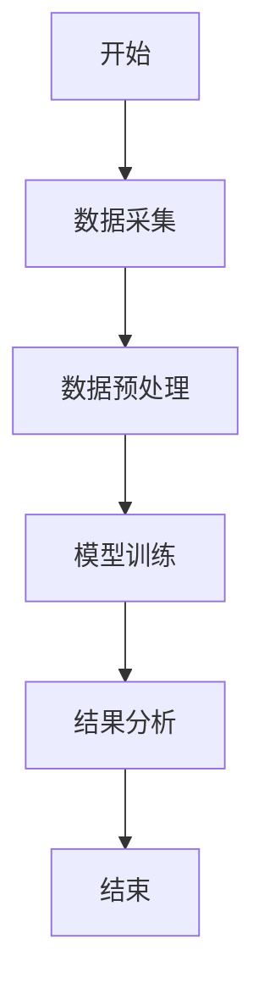
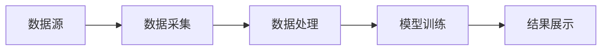
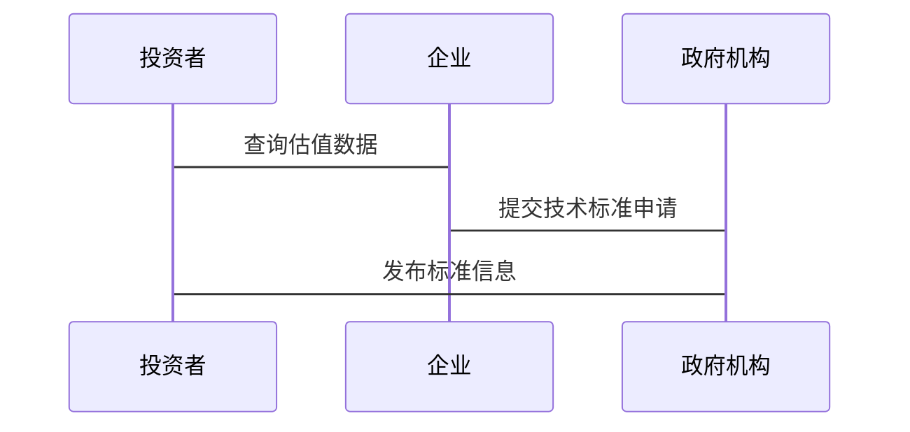

                 


# 股市估值差异对国际技术标准竞争的影响

> 关键词：股市估值，技术标准，国际竞争，市场差异，企业战略

> 摘要：本文探讨股市估值差异如何影响国际技术标准的竞争格局，分析估值差异对技术标准制定和推广的驱动作用，结合实际案例和系统架构，提出应对策略和最佳实践。

---

## 第一部分：背景介绍

### 第1章：问题背景与概念解析

#### 1.1 股市估值差异的定义与影响
- **1.1.1 股市估值的基本概念**  
  股市估值是市场参与者对一家公司未来盈利能力和成长性的评估，通常通过市盈率、市净率等指标衡量。
- **1.1.2 估值差异的形成原因**  
  包括市场信息不对称、投资者情绪波动、宏观经济环境差异等。
- **1.1.3 估值差异对市场的影响**  
  估值差异可能导致资源分配不均，影响企业的融资能力和市场扩展。

#### 1.2 国际技术标准竞争的定义与特点
- **1.2.1 技术标准的基本概念**  
  技术标准是行业规范的统一化文件，旨在确保产品或服务的兼容性和可操作性。
- **1.2.2 技术标准竞争的定义**  
  不同企业或国家之间的技术标准制定和推广的竞争，通常涉及专利、技术和市场影响力。
- **1.2.3 技术标准竞争的特点**  
  包括全球化、技术驱动、长期性和战略意义。

#### 1.3 股市估值差异与技术标准竞争的关系
- **1.3.1 估值差异如何影响技术标准竞争**  
  估值高的企业可能在技术标准制定中更具话语权。
- **1.3.2 技术标准竞争如何反作用于股市估值**  
  技术标准的推广可能提升企业的市场地位，进而影响其估值。
- **1.3.3 两者关系的复杂性**  
  估值差异和标准竞争相互作用，形成复杂的市场生态。

### 第2章：问题描述与边界分析

#### 2.1 股市估值差异的具体表现
- **2.1.1 不同市场间的估值差异**  
  比如中美股市对同一家公司的估值差异。
- **2.1.2 同一市场内不同公司的估值差异**  
  同一行业内的不同公司估值差异显著。
- **2.1.3 估值差异的周期性变化**  
  随市场波动呈现周期性变化。

#### 2.2 技术标准竞争的具体表现
- **2.2.1 不同国家间的标准竞争**  
  比如5G技术标准的全球竞争。
- **2.2.2 同一行业内的标准竞争**  
  比如汽车行业的自动驾驶标准竞争。
- **2.2.3 标准竞争的全球化趋势**  
  技术标准的制定和推广越来越全球化。

#### 2.3 问题的边界与外延
- **2.3.1 估值差异的边界条件**  
  市场环境、企业基本面等因素。
- **2.3.2 技术标准竞争的边界条件**  
  技术复杂度、行业特性、政策影响。

---

## 第二部分：核心概念与联系

### 第3章：核心概念的原理与联系

#### 3.1 股市估值差异的原理
- **3.1.1 市场信息不对称**  
  不同投资者对同一公司信息掌握不一致，导致估值差异。
- **3.1.2 投资者情绪与预期**  
  集体情绪和对未来收益的预期影响估值。

#### 3.2 技术标准竞争的原理
- **3.2.1 技术研发与专利布局**  
  企业通过技术研发和专利布局获得技术标准的话语权。
- **3.2.2 市场推广与生态建设**  
  标准的推广需要生态系统的支持，涉及合作伙伴和用户。

#### 3.3 估值差异与技术标准竞争的联系
- **3.3.1 估值差异驱动技术标准竞争**  
  高估值企业更有资源推动标准制定。
- **3.3.2 技术标准竞争影响估值差异**  
  成功的标准推广可能提升企业的市场地位，进而影响估值。

### 第4章：概念属性对比与ER图

#### 4.1 概念属性对比表
| 概念       | 影响因素             | 结果               |
|------------|----------------------|--------------------|
| 股市估值差异 | 市场环境、企业基本面 | 资源分配不均       |
| 技术标准竞争 | 技术实力、政策支持 | 市场主导权变化     |

#### 4.2 ER图架构
```mermaid
er
actor 投资者;
actor 企业;
actor 政府机构;
entity 股市估值;
entity 技术标准;
entity 技术专利;
```

---

## 第三部分：算法原理讲解

### 第5章：算法原理与数学模型

#### 5.1 算法原理
- **5.1.1 股市估值预测模型**  
  使用回归分析预测公司估值，公式：$$ Valuation = \beta \cdot (Revenue + Profit) + \epsilon $$
- **5.1.2 技术标准竞争分析**  
  使用博弈论模型分析企业竞争策略。

#### 5.2 算法流程图


#### 5.3 Python代码实现
```python
import pandas as pd
from sklearn.linear_model import LinearRegression

# 数据加载与预处理
data = pd.read_csv('market_data.csv')
X = data[['Revenue', 'Profit']]
y = data['Valuation']

# 模型训练
model = LinearRegression()
model.fit(X, y)

# 预测与结果分析
predictions = model.predict(X)
print('预测准确率:', model.score(X, y))
```

---

## 第四部分：系统分析与架构设计

### 第6章：系统架构与功能设计

#### 6.1 系统功能设计
- **6.1.1 数据采集模块**  
  采集股市数据和企业技术标准相关信息。
- **6.1.2 数据处理模块**  
  清洗和预处理数据，构建特征集。
- **6.1.3 分析模块**  
  使用机器学习算法进行估值预测和竞争分析。

#### 6.2 系统架构图


#### 6.3 接口设计与交互图


---

## 第五部分：项目实战与案例分析

### 第7章：项目实战与案例分析

#### 7.1 环境安装与数据准备
- 安装Python、Pandas、Scikit-learn等工具。
- 准备股市数据和企业技术标准数据。

#### 7.2 核心代码实现
```python
import pandas as pd
from sklearn.linear_model import LinearRegression

# 加载数据
data = pd.read_csv('market_data.csv')

# 数据处理
X = data[['Revenue', 'Profit']]
y = data['Valuation']

# 模型训练
model = LinearRegression()
model.fit(X, y)

# 预测与分析
predictions = model.predict(X)
print("预测准确率:", model.score(X, y))
```

#### 7.3 案例分析
- **案例：某行业技术标准竞争分析**  
  分析技术标准竞争对企业估值的影响，展示模型预测结果。

---

## 第六部分：最佳实践与总结

### 第8章：最佳实践与小结

#### 8.1 最佳实践
- 数据准确性是关键，确保数据来源可靠。
- 模型选择要考虑行业特性和数据规模。
- 结合行业专家意见，优化分析结果。

#### 8.2 小结
- 股市估值差异和技术标准竞争相互影响，构建综合分析模型有助于企业制定战略。

---

## 第七部分：注意事项与拓展阅读

### 第9章：注意事项与拓展

#### 9.1 注意事项
- 模型的适用性需结合具体行业。
- 数据隐私和安全需重视。

#### 9.2 拓展阅读
- 建议阅读《技术标准的竞争策略》和《股市估值分析方法》。

---

通过以上结构，文章详细分析了股市估值差异对国际技术标准竞争的影响，结合理论、算法和实际案例，为读者提供了全面的理解和实践指导。

