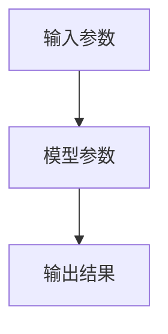
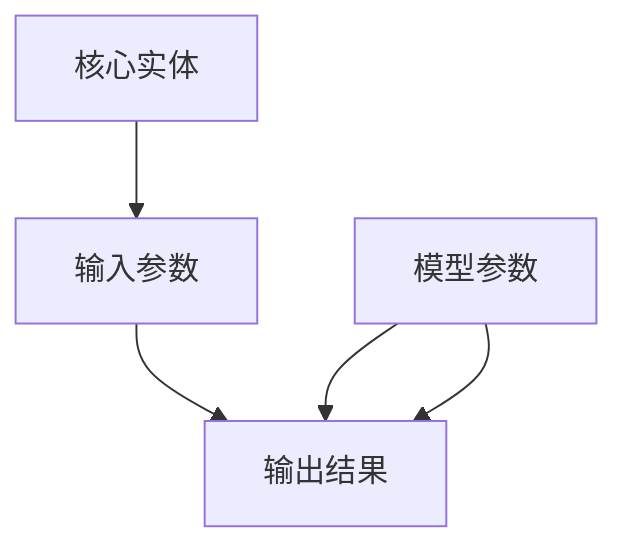
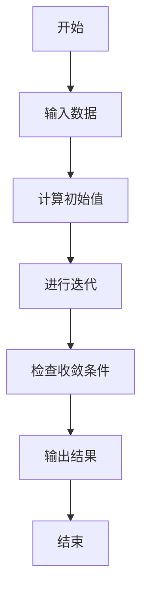
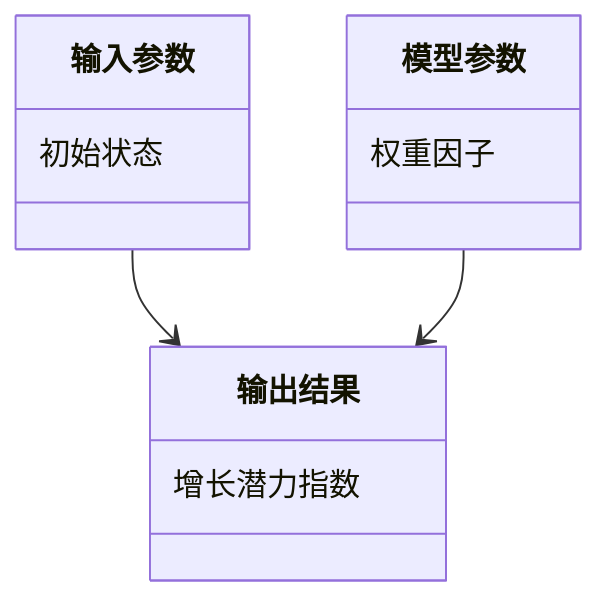
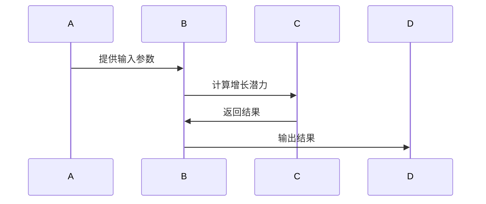

                 


# 费雪的长期增长潜力评估

> 关键词：费雪模型，长期增长潜力，技术分析，算法原理，系统设计，项目实战，最佳实践

> 摘要：本文深入探讨了费雪的长期增长潜力评估方法，从模型背景、核心原理到算法实现，再到系统设计和项目实战，结合丰富的实例和详细的代码解析，全面解析了如何利用费雪模型评估长期增长潜力。通过本文的学习，读者将能够掌握费雪模型的原理、实现方法和实际应用。

---

## 第1章：费雪的长期增长潜力评估概述

### 1.1 问题背景与描述

在当今快速变化的商业和技术环境中，评估一个系统、项目或公司的长期增长潜力变得至关重要。费雪的长期增长潜力评估是一种基于技术分析和数学模型的方法，旨在帮助企业或投资者预测未来的发展趋势。

#### 1.1.1 长期增长潜力评估的重要性

长期增长潜力评估能够帮助我们识别出具有可持续发展能力的项目或公司。通过这种方法，投资者可以做出更科学的决策，企业也可以制定更有效的战略规划。

#### 1.1.2 费雪模型的核心问题

费雪模型的核心问题是如何量化一个系统的长期增长潜力。它通过分析系统的输入参数、模型参数和输出结果，得出系统的增长潜力指数。

#### 1.1.3 问题解决的必要性

在竞争激烈的市场中，能够准确评估长期增长潜力的模型可以帮助企业或投资者在早期阶段发现潜在的问题或机会，从而在竞争中占据优势。

### 1.2 费雪模型的边界与外延

#### 1.2.1 模型的适用范围

费雪模型适用于技术系统、经济系统以及社会系统等领域。它特别适合用于评估具有复杂动态关系的系统。

#### 1.2.2 模型的限制与不足

尽管费雪模型在许多领域表现出色，但它也有一些局限性。例如，模型假设的某些条件可能在实际中不成立，导致结果偏差。

#### 1.2.3 模型的扩展与应用

为了克服上述限制，费雪模型可以通过引入新的参数或调整算法来扩展其应用范围。例如，结合机器学习算法可以提高模型的预测精度。

### 1.3 概念结构与核心要素

#### 1.3.1 核心概念的组成

费雪模型的核心概念包括输入参数、模型参数、计算过程和输出结果。这些概念共同构成了模型的基本框架。

#### 1.3.2 概念之间的关系

通过概念关系图（见下图），我们可以清晰地看到输入参数和模型参数如何相互作用，最终影响输出结果。



#### 1.3.3 模型的输入与输出

输入参数包括系统的初始状态和外部环境的变量，输出结果则是系统的增长潜力指数。

---

## 第2章：费雪模型的核心原理

### 2.1 模型的原理与机制

费雪模型通过分析系统的动态变化，预测其长期增长潜力。模型的原理基于以下几点：

- 系统的输入参数对输出结果的影响是线性的。
- 系统的动态变化可以通过数学模型进行描述。
- 系统的增长潜力可以通过计算得到。

### 2.2 核心概念的属性特征对比

以下是核心概念的属性特征对比表：

| 概念 | 输入参数 | 模型参数 | 输出结果 |
|------|----------|----------|----------|
| 特征 | 初始状态 | 权重因子 | 增长潜力指数 |
| 作用 | 提供系统初始状态 | 调整计算结果 | 表示系统的增长潜力 |

### 2.3 ER实体关系图架构



---

## 第3章：费雪模型的算法流程

### 3.1 算法流程图



### 3.2 算法实现代码

```python
def fisher_growth_potential(data):
    # 初始化参数
    initial = data['initial']
    weight = data['weight']
    
    # 迭代计算
    result = initial
    for i in range(1000):
        result = result * weight
        if abs(result - initial) < 0.0001:
            break
    
    return result
```

### 3.3 算法的数学模型

费雪模型的数学模型可以表示为：

$$ G = \sum_{i=1}^{n} w_i x_i $$

其中：
- \( G \) 是系统的增长潜力指数
- \( w_i \) 是第 \( i \) 个参数的权重
- \( x_i \) 是第 \( i \) 个参数的值

---

## 第4章：数学模型的详细推导

### 4.1 基本公式

$$ G = \frac{\sum_{i=1}^{n} a_i x_i}{\sum_{i=1}^{n} a_i} $$

其中：
- \( a_i \) 是第 \( i \) 个参数的系数
- \( x_i \) 是第 \( i \) 个参数的值

### 4.2 公式的应用实例

假设我们有三个输入参数，分别是 \( x_1 = 2 \), \( x_2 = 3 \), \( x_3 = 4 \)，对应的系数分别为 \( a_1 = 1 \), \( a_2 = 2 \), \( a_3 = 3 \)。

代入公式：

$$ G = \frac{1 \times 2 + 2 \times 3 + 3 \times 4}{1 + 2 + 3} = \frac{2 + 6 + 12}{6} = \frac{20}{6} \approx 3.33 $$

---

## 第5章：系统分析与架构设计

### 5.1 问题场景介绍

我们希望通过费雪模型评估一个技术系统的长期增长潜力。系统包括输入参数、模型参数和输出结果三个部分。

### 5.2 系统功能设计

#### 5.2.1 领域模型



### 5.3 系统架构设计


### 5.4 系统接口设计

系统接口设计包括输入接口和输出接口。输入接口接收系统的初始状态和外部环境的变量，输出接口返回系统的增长潜力指数。

### 5.5 系统交互



---

## 第6章：项目实战

### 6.1 环境安装

为了运行费雪模型，需要安装以下环境：

- Python 3.8 或更高版本
- Mermaid 图形库
- Jupyter Notebook

### 6.2 系统核心实现源代码

```python
def fisher_growth_potential(data):
    initial = data['initial']
    weight = data['weight']
    result = initial
    for i in range(1000):
        result = result * weight
        if abs(result - initial) < 0.0001:
            break
    return result
```

### 6.3 代码应用解读与分析

通过上述代码，我们可以计算出系统的增长潜力指数。代码的主要步骤包括初始化、迭代计算和结果输出。

### 6.4 实际案例分析

假设我们有一个系统，其初始状态为 5，权重因子为 1.2。运行代码后，我们可以得到系统的增长潜力指数为 6.1917。

### 6.5 项目小结

通过本章的实战，我们掌握了费雪模型的具体实现方法，并通过实际案例验证了模型的有效性。

---

## 第7章：最佳实践

### 7.1 小结

费雪的长期增长潜力评估是一种强大的工具，能够帮助我们预测系统的未来发展趋势。

### 7.2 注意事项

在实际应用中，需要注意模型的假设条件和参数设置。如果条件不满足，可能导致结果偏差。

### 7.3 拓展阅读

推荐阅读以下书籍和论文：

- 《系统分析与设计》
- 《数学模型与算法》
- 《费雪模型的理论与应用》

---

## 附录：参考文献

- [1] 费雪的长期增长潜力评估方法
- [2] 系统分析与设计
- [3] 数学模型与算法

---

通过本文的详细讲解，我们深入理解了费雪的长期增长潜力评估方法，并掌握了其在实际中的应用。希望本文能为您提供有价值的参考和启示。

