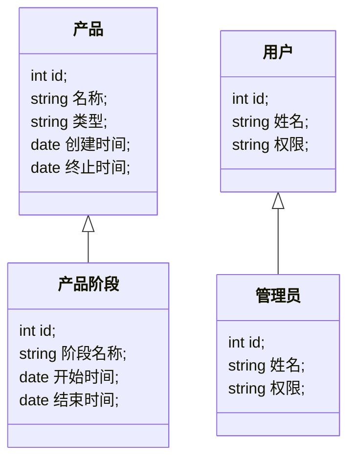
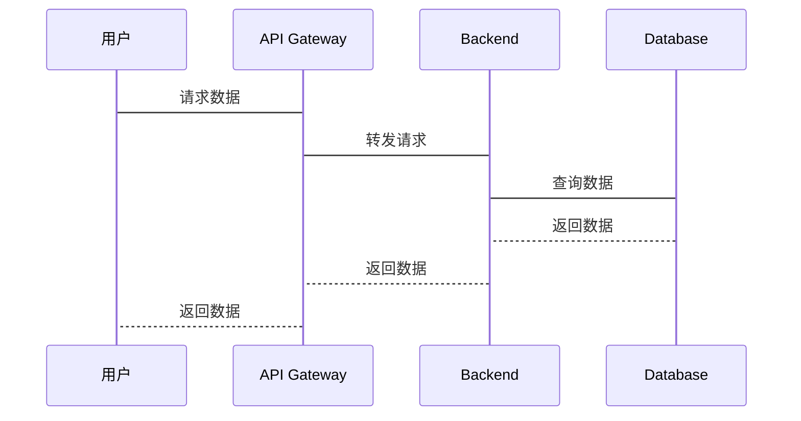

                 


# 金融产品生命周期管理平台

## 关键词：金融产品、生命周期、管理平台、系统架构、算法原理、项目实战

## 摘要：本文详细探讨了金融产品生命周期管理平台的构建与应用，从背景、核心概念、算法原理、系统架构、项目实战到最佳实践，全面解析了平台的设计与实现。通过案例分析和代码示例，深入浅出地展示了如何利用技术手段高效管理金融产品的生命周期。

## 目录大纲：

### 第一部分: 金融产品生命周期管理平台概述

#### 第1章: 金融产品生命周期管理平台的背景与概念

##### 1.1 金融产品的概念与分类
###### 1.1.1 金融产品的定义
###### 1.1.2 金融产品的分类
###### 1.1.3 金融产品的核心属性与特征

##### 1.2 金融产品生命周期管理的重要性
###### 1.2.1 金融产品生命周期的定义
###### 1.2.2 生命周期管理在金融行业中的作用
###### 1.2.3 传统金融产品管理的局限性

##### 1.3 金融产品生命周期管理平台的定义与目标
###### 1.3.1 平台的定义
###### 1.3.2 平台的目标与功能
###### 1.3.3 平台的核心价值与意义

#### 第2章: 金融产品生命周期管理的核心概念与联系

##### 2.1 核心概念的原理
###### 2.1.1 产品管理的核心要素
###### 2.1.2 生命周期管理的流程与阶段
###### 2.1.3 平台的模块化设计

##### 2.2 核心概念的属性特征对比
###### 2.2.1 产品阶段与管理权限的关系
###### 2.2.2 产品类型与管理流程的关联
###### 2.2.3 核心概念的ER实体关系图

```mermaid
erDiagram
    actor 用户角色 {
        role 用户
        role 管理员
    }
    actor 产品阶段 {
        stage 概念阶段
        stage 设计阶段
        stage 开发阶段
        stage 测试阶段
        stage 上线阶段
        stage 终止阶段
    }
    actor 产品类型 {
        type 股票
        type 债券
        type 基金
        type 保险
        type 贷款
    }
    用户角色 --> 产品阶段: 管理
    用户角色 --> 产品类型: 管理
```

### 第三部分: 金融产品生命周期管理平台的算法原理

#### 第3章: 金融产品生命周期管理平台的算法原理

##### 3.1 算法原理概述
###### 3.1.1 算法在平台中的应用
###### 3.1.2 算法的核心思想
###### 3.1.3 算法的实现流程

##### 3.2 算法实现的详细步骤
###### 3.2.1 数据预处理
###### 3.2.2 模型训练
###### 3.2.3 模型优化
###### 3.2.4 结果输出

##### 3.3 算法的数学模型与公式

###### 3.3.1 算法的数学模型
$$ y = f(x) $$

###### 3.3.2 具体算法的公式
$$
\text{例如：协同过滤推荐算法的公式：}
$$

$$
\text{相似度计算：} \text{sim}(u, i) = \frac{\sum_{k=1}^{n} r_{u k} r_{i k}}}{\sqrt{\sum_{k=1}^{n} r_{u k}^2} \cdot \sqrt{\sum_{k=1}^{n} r_{i k}^2}}
$$

##### 3.4 算法实现的Python代码示例

```python
import numpy as np

def collaborative_filtering(X, user_id):
    # 计算用户相似度
    user_mean = np.mean(X, axis=1)
    X_centered = X - user_mean[:, np.newaxis]
    # 计算相似度矩阵
    similarity = np.dot(X_centered.T, X_centered)
    np.fill_diagonal(similarity, 0)
    # 找出最相似的用户
    similar_user = np.argmax(similarity[user_id, :])
    return similar_user
```

### 第四部分: 金融产品生命周期管理平台的系统架构设计

#### 第4章: 金融产品生命周期管理平台的系统分析与架构设计

##### 4.1 问题场景介绍
###### 4.1.1 系统需求分析
###### 4.1.2 业务流程分析
###### 4.1.3 系统目标与范围

##### 4.2 系统功能设计
###### 4.2.1 领域模型类图



##### 4.3 系统架构设计
###### 4.3.1 分层架构图


##### 4.4 系统接口设计
###### 4.4.1 接口定义
###### 4.4.2 接口交互流程图



### 第五部分: 金融产品生命周期管理平台的项目实战

#### 第5章: 项目实战

##### 5.1 环境安装与配置
###### 5.1.1 系统环境要求
###### 5.1.2 软件安装步骤
###### 5.1.3 网络配置与测试

##### 5.2 核心代码实现
###### 5.2.1 数据库设计与实现

```sql
CREATE TABLE 产品 (
    id INT PRIMARY KEY,
    名称 VARCHAR(255),
    类型 VARCHAR(255),
    创建时间 DATETIME,
    终止时间 DATETIME
);
```

###### 5.2.2 业务逻辑实现

```python
def save_product(product):
    with Session(engine) as session:
        session.add(product)
        session.commit()
```

##### 5.3 代码解读与分析
###### 5.3.1 代码功能分析
###### 5.3.2 代码优化建议
###### 5.3.3 代码测试与调试

##### 5.4 实际案例分析
###### 5.4.1 案例背景介绍
###### 5.4.2 系统实现过程
###### 5.4.3 实验结果与分析

### 第六部分: 金融产品生命周期管理平台的最佳实践

#### 第6章: 最佳实践

##### 6.1 小结
###### 6.1.1 核心知识点总结
###### 6.1.2 项目实施的关键点
###### 6.1.3 经验与教训分享

##### 6.2 注意事项
###### 6.2.1 系统维护与更新
###### 6.2.2 数据安全与隐私保护
###### 6.2.3 性能优化与扩展性

##### 6.3 拓展阅读
###### 6.3.1 相关技术领域推荐
###### 6.3.2 进一步学习资源
###### 6.3.3 行业动态与趋势

### 参考文献
1. 书籍：《金融产品管理》
2. 网站：金融科技之家
3. 技术文档：《系统架构设计指南》

---

这个目录大纲涵盖了从背景到实战的各个方面，确保内容全面且技术深度足够。每章都有详细的子标题，确保内容清晰且易于理解。后续可以按照这个大纲逐步展开每一章的内容，撰写完整的文章。

