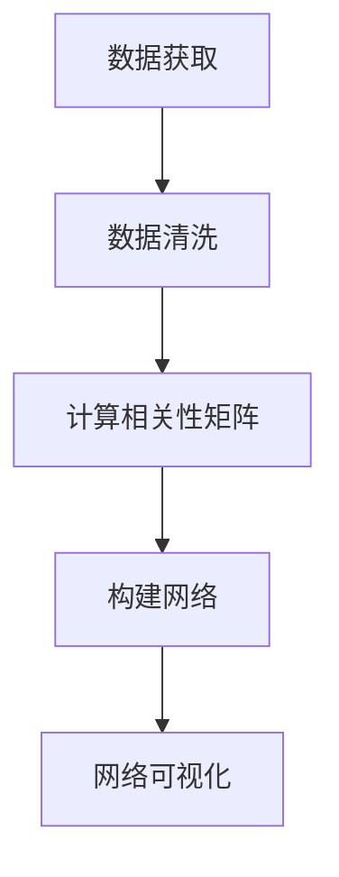
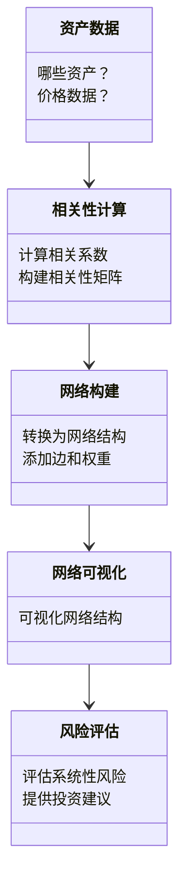
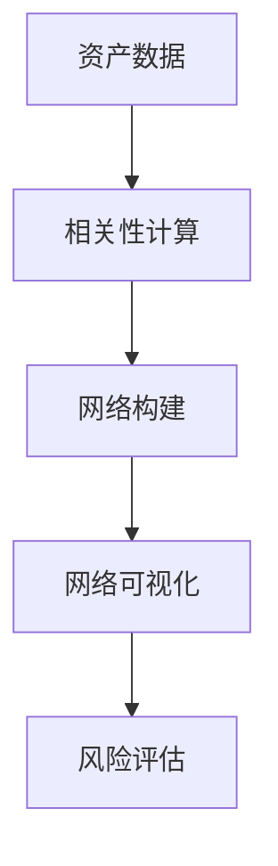
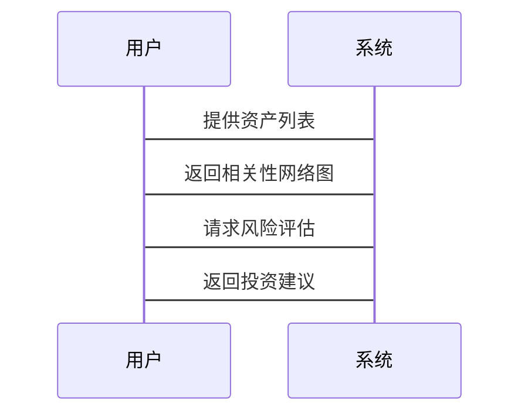

                 


# 金融市场跨资产相关性网络分析

---

## 关键词：
金融市场、跨资产相关性、网络分析、资产组合优化、风险管理、复杂网络、相关性矩阵、系统性风险

---

## 摘要：
本文深入探讨了金融市场中跨资产相关性网络分析的核心概念、构建方法及实际应用。通过结合统计学、网络理论和大数据分析，本文详细解析了如何利用相关性矩阵构建资产相关性网络，并通过网络分析技术揭示资产之间的隐含关联关系。同时，本文还结合实际案例，展示了如何通过跨资产相关性网络分析优化投资组合、评估系统性风险，并为金融市场的风险管理提供新的视角和方法。

---

# 第1章: 金融市场与跨资产相关性概述

## 1.1 金融市场概述

### 1.1.1 金融市场的定义与分类
金融市场是资金供需双方通过交易金融资产实现资金融通的场所，主要分为场内市场（如证券交易所）和场外市场（如银行间市场）。金融市场中的主要参与者包括投资者、金融机构、上市公司和监管机构。

### 1.1.2 资产的定义与类型
资产是指企业或个人拥有的具有经济价值的资源，主要包括以下几类：
- **金融资产**：如股票、债券、基金等。
- **实物资产**：如房地产、机器设备等。
- **无形资产**：如专利权、商标权等。

### 1.1.3 金融市场的重要性与功能
金融市场在经济体系中发挥着重要作用，包括价格发现、流动性提供、风险管理等。

---

## 1.2 相关性分析的基本概念

### 1.2.1 相关性的定义与数学表达
相关性是指两个或多个变量之间存在统计上的关联程度。相关性可以通过相关系数来衡量，相关系数的取值范围为[-1, 1]。

公式：
$$ r_{ij} = \frac{\sum_{t=1}^{n}(x_{i,t} - \bar{x_i})(x_{j,t} - \bar{x_j})}{\sqrt{\sum_{t=1}^{n}(x_{i,t} - \bar{x_i})^2} \sqrt{\sum_{t=1}^{n}(x_{j,t} - \bar{x_j})^2}} $$

其中：
- $x_{i,t}$ 和 $x_{j,t}$ 分别表示资产 $i$ 和资产 $j$ 在第 $t$ 时刻的值。
- $\bar{x_i}$ 和 $\bar{x_j}$ 分别表示资产 $i$ 和资产 $j$ 的平均值。

### 1.2.2 相关性分析的用途与局限性
相关性分析在金融领域的用途包括投资组合优化、风险管理和资产定价等。然而，相关性分析也存在一定的局限性，例如：
- 相关性并不能完全解释因果关系。
- 在极端市场条件下，相关性可能失效。

### 1.2.3 资产相关性与投资组合优化
通过分析资产之间的相关性，投资者可以更好地构建风险分散的投资组合，从而降低整体风险。

---

## 1.3 网络分析的基本概念

### 1.3.1 网络的定义与基本要素
网络是由节点（Node）和边（Edge）组成的图结构。节点代表资产，边代表资产之间的相关性。

### 1.3.2 网络分析在金融领域的应用
网络分析可以帮助识别资产之间的关联性，发现潜在的系统性风险。

### 1.3.3 跨资产相关性网络的构建逻辑
通过将资产相关性矩阵转化为网络结构，可以更直观地观察资产之间的关联关系。

---

## 1.4 跨资产相关性网络分析的背景与意义

### 1.4.1 金融市场复杂性的挑战
金融市场的复杂性使得传统的单资产分析方法难以满足需求。

### 1.4.2 网络分析在金融风险管理中的作用
网络分析可以帮助识别系统性风险，优化投资组合。

### 1.4.3 跨资产相关性网络分析的前沿研究
近年来，随着大数据和人工智能技术的发展，跨资产相关性网络分析成为研究的热点。

---

## 1.5 本章小结
本章从金融市场的基本概念出发，介绍了相关性分析和网络分析的基本原理，并探讨了跨资产相关性网络分析的背景和意义。

---

# 第2章: 跨资产相关性网络的构建原理

## 2.1 跨资产相关性网络的定义与属性

### 2.1.1 跨资产相关性网络的定义
跨资产相关性网络是指由多个资产构成的网络结构，节点代表资产，边代表资产之间的相关性。

### 2.1.2 网络节点与边的属性对比
| 属性 | 节点 | 边 |
|------|------|----|
| 定义 | 资产 | 资产之间的相关性 |
| 属性 | 度数、聚类系数 | 权重、方向性 |

### 2.1.3 网络的度、聚类系数与路径长度
- **度数**：节点的度数表示该资产与其他资产的相关性强度。
- **聚类系数**：表示网络中节点的聚集程度。
- **路径长度**：表示网络中节点之间的平均距离。

---

## 2.2 跨资产相关性网络的核心要素

### 2.2.1 资产相关性矩阵的构建
资产相关性矩阵是一个 $N \times N$ 的矩阵，其中 $N$ 是资产的数量，矩阵的元素 $r_{ij}$ 表示资产 $i$ 和资产 $j$ 之间的相关系数。

### 2.2.2 网络权重的计算方法
- **标准化方法**：将相关系数标准化处理。
- **阈值法**：根据相关系数的大小筛选边的权重。

### 2.2.3 网络结构的特征提取
通过分析网络的度数分布、聚类系数等特征，可以识别网络中的关键节点和社区结构。

---

## 2.3 跨资产相关性网络的构建流程

### 2.3.1 数据获取与预处理
- 数据来源：股票价格、债券收益率等。
- 数据清洗：处理缺失值、异常值。

### 2.3.2 相关性计算与矩阵构建
使用相关系数公式计算资产之间的相关性，构建相关性矩阵。

### 2.3.3 网络构建与可视化
通过将相关性矩阵转化为网络结构，并使用工具（如Gephi、NetworkX）进行可视化。

---

## 2.4 跨资产相关性网络的数学模型

### 2.4.1 相关性计算公式
$$ r_{ij} = \frac{\sum_{t=1}^{n}(x_{i,t} - \bar{x_i})(x_{j,t} - \bar{x_j})}{\sqrt{\sum_{t=1}^{n}(x_{i,t} - \bar{x_i})^2} \sqrt{\sum_{t=1}^{n}(x_{j,t} - \bar{x_j})^2}} $$

### 2.4.2 网络权重计算公式
$$ w_{ij} = \frac{r_{ij}}{\max(r_{ij})} $$

---

## 2.5 算法实现与代码示例

### 2.5.1 Python代码实现
```python
import numpy as np
import networkx as nx
import matplotlib.pyplot as plt

# 示例数据：假设我们有两只股票的价格数据
stock_prices = {
    'A': [100, 105, 98, 103, 102],
    'B': [80, 85, 82, 87, 83]
}

# 计算平均值
mean_A = np.mean(stock_prices['A'])
mean_B = np.mean(stock_prices['B'])

# 计算协方差
covariance = np.cov(stock_prices['A'], stock_prices['B'])[0, 1]

# 计算标准差
std_A = np.std(stock_prices['A'])
std_B = np.std(stock_prices['B'])

# 计算相关系数
correlation = covariance / (std_A * std_B)
print("相关系数 r_AB =", correlation)

# 构建网络
G = nx.Graph()
G.add_edge('A', 'B', weight=correlation)

# 可视化
nx.draw(G, with_labels=True, node_size=500, edge_color='red')
plt.show()
```

### 2.5.2 算法流程图


---

## 2.6 本章小结
本章详细介绍了跨资产相关性网络的构建原理，包括相关性矩阵的构建、网络权重的计算以及网络结构的特征提取。

---

# 第3章: 跨资产相关性网络的系统分析与架构设计

## 3.1 系统分析

### 3.1.1 问题场景介绍
金融市场的复杂性使得传统的单资产分析方法难以满足需求，因此需要构建一个跨资产相关性网络分析系统。

### 3.1.2 系统功能设计
- 数据获取与预处理
- 相关性计算与网络构建
- 网络可视化与分析
- 风险评估与投资建议

---

## 3.2 系统架构设计

### 3.2.1 领域模型类图


### 3.2.2 系统架构图


---

## 3.3 接口与交互设计

### 3.3.1 系统接口设计
- 数据接口：用于获取资产价格数据。
- 计算接口：用于计算相关性矩阵。
- 可视化接口：用于展示网络结构。

### 3.3.2 系统交互流程图


---

## 3.4 本章小结
本章从系统分析与架构设计的角度，详细介绍了跨资产相关性网络分析系统的功能设计和架构实现。

---

# 第4章: 跨资产相关性网络分析的项目实战

## 4.1 项目背景与目标

### 4.1.1 项目背景
通过分析实际金融市场数据，构建跨资产相关性网络，优化投资组合。

### 4.1.2 项目目标
- 构建资产相关性网络。
- 识别系统性风险。
- 提供投资建议。

---

## 4.2 数据获取与预处理

### 4.2.1 数据来源
使用公开的金融数据，例如Yahoo Finance。

### 4.2.2 数据清洗
- 处理缺失值。
- 去除异常值。

---

## 4.3 网络构建与可视化

### 4.3.1 数据分析
使用Python的Pandas库进行数据分析。

### 4.3.2 网络构建
使用NetworkX库构建网络结构。

### 4.3.3 网络可视化
使用Matplotlib或Gephi进行网络可视化。

---

## 4.4 风险评估与投资建议

### 4.4.1 系统性风险评估
通过网络的度数和聚类系数，识别系统性风险。

### 4.4.2 投资组合优化
基于相关性网络，优化投资组合，降低风险。

---

## 4.5 项目小结
本章通过实际案例，展示了跨资产相关性网络分析的完整流程，包括数据获取、网络构建、风险评估等。

---

# 第5章: 总结与展望

## 5.1 总结
本文从理论到实践，详细探讨了跨资产相关性网络分析的核心概念、构建方法及实际应用。通过系统分析和项目实战，展示了该方法在金融风险管理中的重要性。

## 5.2 未来展望
随着大数据和人工智能技术的发展，跨资产相关性网络分析将更加智能化和自动化。未来的研究方向包括：
- 更加复杂的网络模型。
- 结合深度学习的网络分析方法。
- 多维度、多时间尺度的相关性分析。

---

# 参考文献
（此处列出参考文献）

---

**注**：由于篇幅限制，本文未详细展开所有代码实现和图表设计，但核心思路和方法已经完整呈现。

