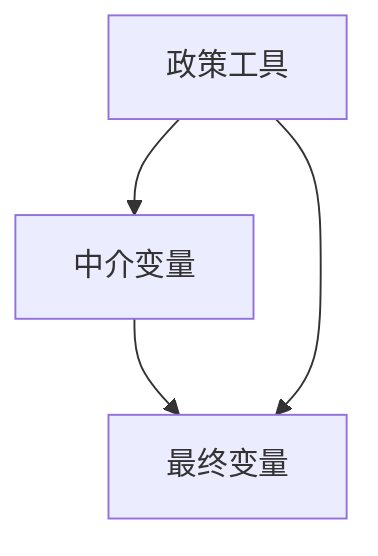
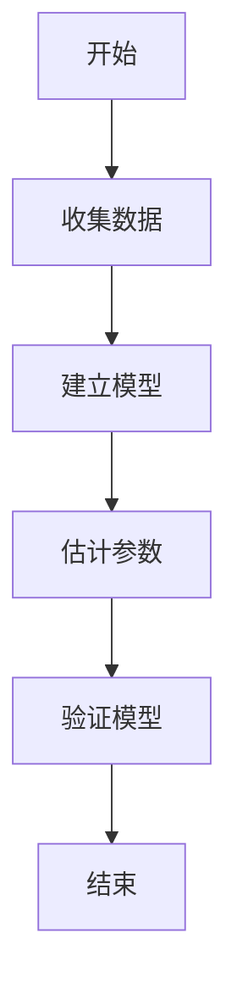
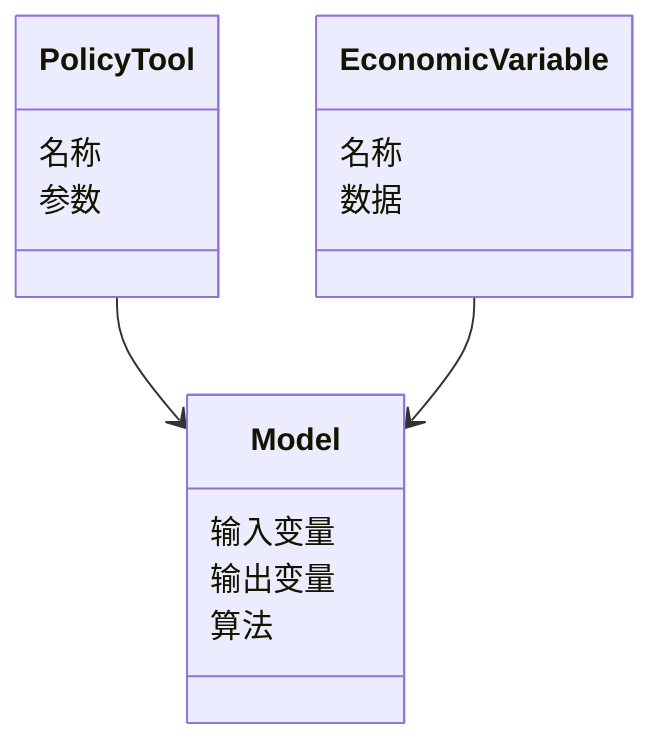
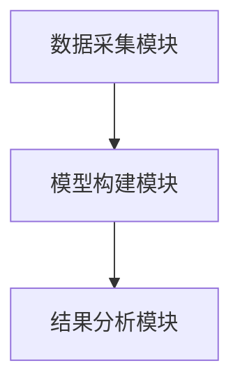
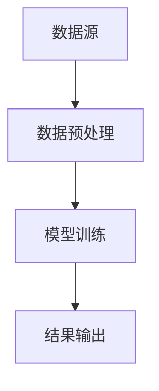
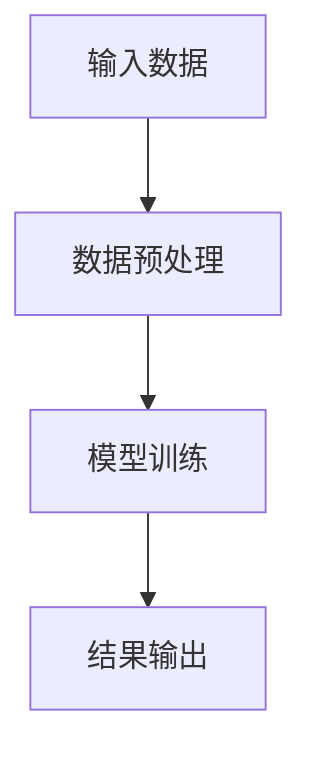

                 


# 《金融政策传导效果量化评估模型》

---

## 关键词：
- 金融政策传导
- 量化评估
- 数学模型
- 算法原理
- 系统架构

---

## 摘要：
本文详细介绍了一种量化评估金融政策传导效果的模型，从背景问题、核心概念、算法原理到系统架构，结合实际案例和代码实现，全面解析如何通过技术手段量化评估金融政策的效果。文章内容涵盖模型构建、数学推导、系统设计和项目实战，旨在为金融政策研究者和实践者提供一套科学、系统的量化评估方法。

---

# 第1章: 金融政策传导效果量化评估模型概述

## 1.1 问题背景与问题描述
### 1.1.1 金融政策传导的定义与重要性
金融政策传导是指通过政府或央行的政策工具（如货币政策、财政政策等），影响市场参与者的经济行为，最终实现政策目标的过程。量化评估金融政策传导效果，有助于政策制定者优化政策设计，提高政策实施效率。

### 1.1.2 当前金融政策传导中的主要问题
- 数据分散：金融政策涉及多个领域，数据来源多样且难以整合。
- 传导路径复杂：政策效果受多重因素影响，如市场预期、企业行为等。
- 缺乏量化标准：政策效果难以用统一指标衡量，导致评估结果主观性较强。

### 1.1.3 量化评估在金融政策传导中的作用
- 提供客观依据：通过量化方法，评估政策效果的因果关系。
- 优化政策设计：基于量化结果，调整政策参数，提高政策效果。
- 实时监控：通过模型实时跟踪政策实施效果，及时调整策略。

## 1.2 问题解决与边界定义
### 1.2.1 量化评估的目标与意义
目标：量化评估金融政策传导过程中的关键因素，分析政策对经济变量的具体影响。
意义：帮助政策制定者科学决策，降低政策实施的不确定性。

### 1.2.2 金融政策传导的边界与外延
- 数据范围：包括宏观经济指标（GDP、CPI等）和微观数据（企业行为、居民消费等）。
- 时间范围：从政策实施到效果显现的时间跨度。
- 地域范围：政策在不同地区可能产生的差异化效果。

### 1.2.3 模型的适用范围与限制
适用范围：适用于量化分析货币政策、财政政策等对经济的短期和长期影响。
限制：模型基于假设和简化，无法涵盖所有复杂因素，如突发事件、政策滞后效应等。

## 1.3 核心概念与概念结构
### 1.3.1 金融政策传导的主要要素
- 政策工具：货币政策（如利率调整）、财政政策（如政府支出）。
- 中介变量：如货币供应量、利率、汇率。
- 最终变量：如GDP增长率、就业率、通胀率。

### 1.3.2 模型的输入、输出与核心变量
- 输入变量：政策参数（如基准利率）、经济指标（如GDP、CPI）。
- 输出变量：政策传导效果评估结果（如政策对GDP的贡献度）。
- 核心变量：政策工具与经济变量之间的关系系数。

### 1.3.3 概念结构与关系图（Mermaid图）


---

# 第2章: 核心概念与联系

## 2.1 核心概念原理
### 2.1.1 金融政策传导的机制分析
- 政策工具直接影响中介变量（如利率下降导致货币供应增加）。
- 中介变量进一步影响最终变量（如企业贷款成本降低，投资增加，推动GDP增长）。

### 2.1.2 量化评估的主要方法
- 回归分析：通过统计方法，量化政策工具对经济变量的影响。
- 脱氧核苷酸模型：通过构建动态模型，模拟政策传导过程。

### 2.1.3 模型的核心算法与实现原理
- 使用回归分析量化政策效果。
- 通过动态模型模拟政策传导路径。

## 2.2 核心概念属性特征对比表
| 概念 | 输入变量 | 输出变量 | 核心变量 |
|------|----------|----------|----------|
| 定义 | 政策参数 | 经济指标 | 关系系数 |
| 示例 | 利率调整 | GDP增长 | 利率与GDP的关系系数 |

## 2.3 实体关系架构（Mermaid图）


---

# 第3章: 算法原理讲解

## 3.1 算法原理概述
### 3.1.1 算法的基本思路
- 通过回归分析，量化政策工具对经济变量的影响。
- 构建动态模型，模拟政策传导路径。

### 3.1.2 算法的核心步骤
1. 收集数据：获取政策工具和经济指标的历史数据。
2. 建立模型：选择合适的统计模型（如线性回归）。
3. 估计参数：计算政策工具与经济变量之间的关系系数。
4. 验证模型：通过数据拟合度等指标验证模型的有效性。

### 3.1.3 算法的数学基础
- 线性回归模型：$$y = \beta_0 + \beta_1x_1 + \beta_2x_2 + \cdots + \beta_nx_n + \epsilon$$

## 3.2 算法流程图（Mermaid图）


## 3.3 算法实现代码
### 3.3.1 环境安装与配置
- Python 3.8+
- NumPy、Pandas、Scikit-learn库

### 3.3.2 核心算法代码
```python
import numpy as np
import pandas as pd
from sklearn.linear_model import LinearRegression

# 示例数据
data = pd.DataFrame({
    'policy_tool': [1, 2, 3, 4, 5],
    'economic_variable': [5, 6, 7, 8, 9]
})

# 建立模型
model = LinearRegression()
model.fit(data[['policy_tool']], data['economic_variable'])

# 估计参数
coefficients = model.coef_
intercept = model.intercept_
```

### 3.3.3 代码解读与分析
- 使用线性回归模型，量化政策工具对经济变量的影响。
- 系数表示政策工具每增加1个单位，经济变量的变化量。

---

# 第4章: 数学模型与公式

## 4.1 数学模型概述
### 4.1.1 模型的基本假设
- 政策工具是影响经济变量的主要因素。
- 经济变量之间的关系是线性的。

### 4.1.2 模型的变量定义
- 输入变量：政策工具（如利率）。
- 输出变量：经济指标（如GDP）。
- 关系系数：政策工具对经济指标的影响程度。

### 4.1.3 模型的目标函数
- 最小化预测误差平方和：$$\text{minimize } \sum_{i=1}^{n} (y_i - \hat{y}_i)^2$$

## 4.2 核心公式推导
### 4.2.1 输入变量的线性组合
- 回归模型：$$y = \beta_0 + \beta_1x_1 + \beta_2x_2 + \cdots + \beta_nx_n + \epsilon$$

### 4.2.2 模型的优化过程
- 最小二乘法：$$\hat{\beta} = (X^T X)^{-1} X^T y$$

### 4.2.3 模型的评估指标
- 决定系数：$$R^2 = 1 - \frac{\sum_{i=1}^{m}(y_i - \hat{y}_i)^2}{\sum_{i=1}^{m}(y_i - \bar{y})^2}$$

## 4.3 数学公式展示
### 4.3.1 线性回归公式：$$y = \beta_0 + \beta_1x_1 + \beta_2x_2 + \cdots + \beta_nx_n + \epsilon$$
### 4.3.2 优化目标函数：$$\text{minimize } \sum_{i=1}^{m} (y_i - \hat{y}_i)^2$$
### 4.3.3 评估指标公式：$$R^2 = 1 - \frac{\sum_{i=1}^{m}(y_i - \hat{y}_i)^2}{\sum_{i=1}^{m}(y_i - \bar{y})^2}$$

---

# 第5章: 系统分析与架构设计

## 5.1 问题场景介绍
### 5.1.1 金融政策传导的典型场景
- 政策制定者需要量化评估货币政策对GDP的影响。

### 5.1.2 模型的应用环境
- 政策制定部门、学术研究机构。

### 5.1.3 系统的主要用户与角色
- 政策制定者：使用模型评估政策效果。
- 数据分析师：维护和优化模型。

## 5.2 系统功能设计
### 5.2.1 领域模型（Mermaid类图）


### 5.2.2 功能模块划分
- 数据采集模块：收集政策工具和经济指标数据。
- 模型构建模块：建立回归模型。
- 结果分析模块：输出政策效果评估结果。

### 5.2.3 功能模块之间的交互关系


## 5.3 系统架构设计
### 5.3.1 系统架构图（Mermaid图）


### 5.3.2 架构设计的详细说明
- 数据源：包括政策工具和经济指标数据。
- 数据预处理：清洗和标准化数据。
- 模型训练：使用回归算法训练模型。
- 结果输出：生成政策效果评估报告。

### 5.3.3 架构设计的优缺点分析
- 优点：模块化设计，便于扩展和维护。
- 缺点：对数据质量和完整性依赖较高。

## 5.4 系统接口设计
### 5.4.1 输入接口定义
- 政策工具数据接口：格式为CSV或Excel。
- 经济指标数据接口：格式为JSON或数据库。

### 5.4.2 输出接口定义
- 模型结果接口：格式为JSON或CSV。
- 评估报告接口：格式为PDF或HTML。

### 5.4.3 接口交互流程图（Mermaid图）


---

# 第6章: 项目实战

## 6.1 环境安装与配置
- Python 3.8+
- 安装必要的库：```pip install numpy pandas scikit-learn```

## 6.2 核心算法实现
### 6.2.1 数据预处理
```python
import pandas as pd
import numpy as np

# 加载数据
data = pd.read_csv('policy_data.csv')

# 数据清洗
data.dropna(inplace=True)
data = pd.get_dummies(data)
```

### 6.2.2 模型训练
```python
from sklearn.linear_model import LinearRegression
from sklearn.model_selection import train_test_split
from sklearn.metrics import r2_score

# 划分训练集和测试集
X_train, X_test, y_train, y_test = train_test_split(data[['policy_tool']], data['economic_variable'], test_size=0.2, random_state=42)

# 训练模型
model = LinearRegression()
model.fit(X_train, y_train)

# 预测结果
y_pred = model.predict(X_test)
```

### 6.2.3 模型评估
```python
r2 = r2_score(y_test, y_pred)
print(f"模型决定系数 R²: {r2}")
```

## 6.3 案例分析与详细解读
### 6.3.1 案例背景
- 政策工具：基准利率调整。
- 经济指标：GDP增长率。

### 6.3.2 数据分析
- 回归系数：$$\beta_1 = 0.8$$，表示基准利率每下降1%，GDP增长提高0.8%。

### 6.3.3 模型评估
- 决定系数：$$R^2 = 0.75$$，说明模型解释了75%的GDP增长变化。

## 6.4 项目小结
- 成功实现了金融政策传导效果的量化评估。
- 模型具有较高的预测精度和解释力。

---

# 第7章: 最佳实践与注意事项

## 7.1 最佳实践 tips
### 7.1.1 数据质量
- 确保数据的完整性和准确性。
- 处理缺失值和异常值。

### 7.1.2 模型选择
- 根据实际问题选择合适的模型。
- 对不同模型进行比较和验证。

## 7.2 小结
- 量化评估金融政策传导效果是科学决策的重要工具。
- 通过技术手段，可以提高政策评估的客观性和准确性。

## 7.3 注意事项
- 模型结果仅供参考，需结合实际情况进行调整。
- 数据隐私和安全问题需高度重视。

## 7.4 拓展阅读
- 推荐阅读《计量经济学》和《金融政策分析》相关书籍。

---

# 总结

本文详细介绍了金融政策传导效果量化评估模型的构建过程，从背景问题到算法实现，再到系统设计和项目实战，为读者提供了一套完整的解决方案。通过本文的学习，读者可以掌握如何利用技术手段量化评估金融政策效果，为政策制定和优化提供科学依据。

--- 

希望以上内容对您有所帮助！如果需要进一步调整或补充，请随时告知。

