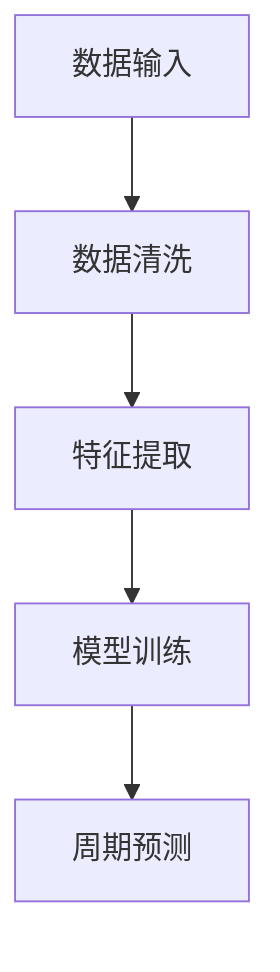

                 


# 霍华德·马克斯的市场周期理论

> 关键词：市场周期理论、霍华德·马克斯、投资者心理、均值回归模型、市场波动分析、投资策略优化

> 摘要：霍华德·马克斯的市场周期理论强调市场的波动性和周期性，以及投资者心理在市场周期中的重要作用。本文通过详细分析市场周期的核心概念、数学模型、投资策略以及实战案例，帮助读者理解如何在市场周期中找到投资机会并优化投资策略。

---

## 第一部分: 霍华德·马克斯市场周期理论的背景与基础

### 第1章: 市场周期理论概述

#### 1.1 市场周期的基本概念

##### 1.1.1 市场周期的定义与特征
市场的周期性是指市场在时间和空间上呈现的波动性变化，通常表现为涨跌交替、繁荣与衰退交替的周期性模式。市场的周期性波动是由多种因素共同作用的结果，包括经济周期、投资者心理、政策变化等。

##### 1.1.2 市场周期的形成机制
市场周期的形成机制涉及以下几个关键因素：
1. **经济基本面**：包括GDP增长率、通货膨胀率、利率水平等。
2. **投资者心理**：投资者的贪婪与恐惧心理导致市场的非理性波动。
3. **政策因素**：政府的货币政策、财政政策等对市场周期有重要影响。
4. **市场参与者的行为**：机构投资者、个人投资者等不同参与者的行为差异影响市场周期。

##### 1.1.3 市场周期与经济波动的关系
市场周期与经济波动密切相关，但两者并不完全同步。市场周期更多反映的是投资者对经济前景的预期，而经济波动则是实际经济数据的变化。市场的超前性使得市场周期成为经济波动的领先指标。

#### 1.2 霍华德·马克斯的市场周期理论

##### 1.2.1 霍华德·马克斯的投资者心理分析
霍华德·马克斯认为，市场的波动性主要源于投资者心理的变化。投资者在市场繁荣时过度乐观，在市场衰退时过度悲观。这种非理性心理导致市场的周期性波动。

##### 1.2.2 市场周期的核心观点
霍华德·马克斯提出，市场的波动性是周期性的，且这种周期性可以通过分析市场的参与者行为、市场估值和宏观经济指标来预测和利用。

##### 1.2.3 理论的应用范围与边界
霍华德·马克斯的市场周期理论主要适用于股票市场，但也适用于其他金融市场，如债券市场、商品市场等。其边界在于市场的非周期性波动和极端事件（如黑天鹅事件）。

---

### 第2章: 市场周期的核心概念与联系

#### 2.1 市场周期的核心原理

##### 2.1.1 市场波动的内在规律
市场的波动性是周期性的，表现为涨跌交替的周期性模式。市场的波动性可以通过均值回归模型来描述，即市场价格会围绕其长期均值波动。

##### 2.1.2 投资者心理与市场周期的关系
投资者的心理变化是市场周期的核心驱动力。当市场处于繁荣期时，投资者过度乐观，导致市场估值过高；当市场处于衰退期时，投资者过度悲观，导致市场估值过低。

##### 2.1.3 市场周期的驱动因素
市场周期的驱动因素包括：
1. **经济基本面**：如GDP增长率、通货膨胀率等。
2. **投资者心理**：如贪婪与恐惧心理。
3. **政策因素**：如货币政策、财政政策等。

#### 2.2 核心概念对比与ER实体关系图

##### 2.2.1 核心概念属性特征对比表
| 核心概念 | 属性特征 |
|----------|----------|
| 市场周期 | 波动性、周期性、非线性 |
| 投资者心理 | 贪婪与恐惧、 herd mentality（从众心理）、过度自信 |
| 市场估值 | 相对估值、绝对估值、市场情绪 |

##### 2.2.2 市场周期的ER实体关系图


---

### 第3章: 市场周期的数学模型与公式

#### 3.1 市场周期的数学模型

##### 3.1.1 均值回归模型
均值回归模型假设市场价格会围绕其长期均值波动，可以通过以下公式表示：
$$ R_t = \mu + \epsilon_t $$
其中，\( R_t \) 是第 \( t \) 期的市场回报率，\( \mu \) 是长期均值，\( \epsilon_t \) 是随机误差项。

##### 3.1.2 波动性分析模型
波动性分析模型用于衡量市场的波动性，可以通过标准差来表示：
$$ \sigma = \sqrt{\frac{1}{n}\sum_{i=1}^{n}(R_i - \mu)^2} $$
其中，\( R_i \) 是第 \( i \) 期的市场回报率，\( \mu \) 是均值，\( n \) 是样本数量。

##### 3.1.3 市场周期的量化指标
市场周期的量化指标包括：
1. **相对强弱指数（RSI）**：用于衡量市场的超买或超卖状态。
2. **移动平均收敛散度（MACD）**：用于判断市场的趋势变化。

#### 3.2 算法原理与代码实现

##### 3.2.1 市场周期分析算法流程图


##### 3.2.2 Python代码实现
```python
import pandas as pd
import numpy as np

def market_cycle_analysis(data):
    # 数据清洗
    cleaned_data = data.dropna()
    # 特征提取
    cleaned_data['returns'] = cleaned_data['close'] / cleaned_data['close'].shift(1) - 1
    # 均值回归模型
    mu = cleaned_data['returns'].mean()
    std = cleaned_data['returns'].std()
    # 波动性分析
    cleaned_data['z_score'] = (cleaned_data['returns'] - mu) / std
    return cleaned_data

# 示例数据
data = pd.DataFrame({
    'close': [100, 105, 110, 108, 105, 103, 108, 112, 115, 110]
})
result = market_cycle_analysis(data)
print(result)
```

---

## 第二部分: 市场周期的分析方法

### 第4章: 市场周期的波动性分析

#### 4.1 市场波动性的量化与预测

##### 4.1.1 波动性指数的计算
波动性指数可以通过标准差来衡量：
$$ \sigma = \sqrt{\frac{1}{n}\sum_{i=1}^{n}(R_i - \mu)^2} $$
其中，\( R_i \) 是第 \( i \) 期的市场回报率，\( \mu \) 是均值，\( n \) 是样本数量。

##### 4.1.2 波动性与市场周期的关系
波动性是市场周期的重要特征，高波动性通常出现在市场周期的转折点。

#### 4.2 投资者心理与市场行为

##### 4.2.1 投资者心理的量化
投资者心理可以通过市场情绪指标（如恐慌指数、贪婪指数）来量化。

##### 4.2.2 市场行为的分析
市场行为可以通过交易量、价格走势等指标来分析。

---

## 第三部分: 投资策略与风险管理

### 第5章: 投资策略的制定

#### 5.1 投资策略的核心原则

##### 5.1.1 逆向投资策略
逆向投资策略是指在市场低迷时买入，在市场繁荣时卖出。

##### 5.1.2 风险管理策略
风险管理是投资策略的重要组成部分，包括止损、止盈、资产配置等。

#### 5.2 投资策略的优化

##### 5.2.1 动态调整策略
根据市场周期的变化动态调整投资策略。

##### 5.2.2 组合投资策略
通过组合投资分散风险，提高收益。

---

## 第四部分: 实战案例分析

### 第6章: 实战案例分析

#### 6.1 科技股泡沫的案例分析

##### 6.1.1 泡沫形成的背景
科技股泡沫的形成与互联网技术的快速发展和投资者的过度乐观有关。

##### 6.1.2 泡沫破裂的原因
泡沫破裂的原因包括技术瓶颈、政策调控、市场参与者心理变化等。

#### 6.2 2008年金融危机的案例分析

##### 6.2.1 金融危机的背景
2008年金融危机的背景包括次贷危机、金融衍生品的过度发展等。

##### 6.2.2 金融危机的影响
金融危机对全球经济和金融市场产生了深远影响。

---

## 第五部分: 总结与展望

### 第7章: 总结与展望

#### 7.1 理论总结

##### 7.1.1 理论的核心要点
市场周期理论的核心要点包括市场的波动性、投资者心理、均值回归模型等。

##### 7.1.2 理论的实践价值
市场周期理论在投资实践中具有重要的指导意义。

#### 7.2 未来展望

##### 7.2.1 理论的发展方向
未来的发展方向包括市场周期理论的扩展、新模型的开发等。

##### 7.2.2 投资策略的优化
未来可以通过技术进步进一步优化投资策略。

---

## 附录

### 附录A: 进一步阅读的资料

#### 1. 霍华德·马克斯的经典著作
- 《投资最重要的事情》
- 《投资的艺术》

#### 2. 相关工具推荐
- Python数据分析库：Pandas、NumPy
- 数据可视化工具：Matplotlib、Seaborn
- 量化交易工具：QuantLib、Backtrader

#### 3. 关键术语表
- 市场周期：市场的波动性变化的周期性模式。
- 均值回归：市场价格围绕长期均值波动的特性。
- 投资者心理：投资者在市场中的心理变化，包括贪婪与恐惧。

#### 4. 参考文献
- 霍华德·马克斯：《投资最重要的事情》
- 约翰·劳伦斯：《投资心理学》
- 艾德·费里德曼：《市场波动性分析》

---

以上是《霍华德·马克斯的市场周期理论》的技术博客文章的完整目录大纲和部分内容展示。如需进一步扩展或调整，请随时告知！

