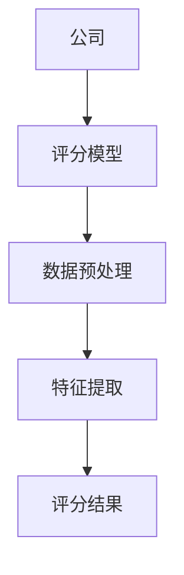
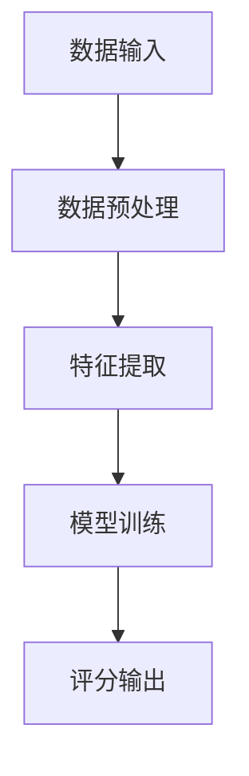
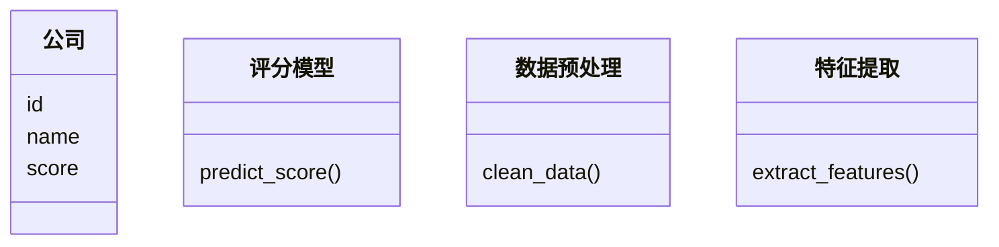
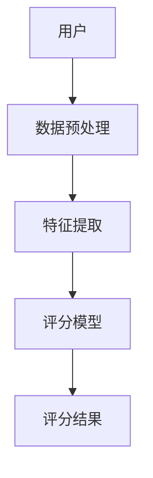
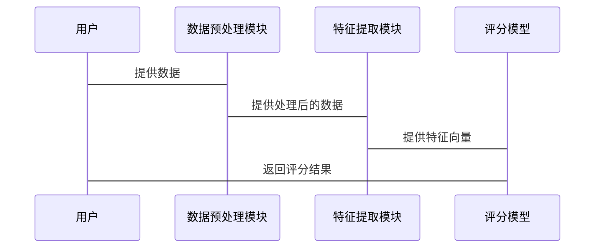

                 


# AI增强型公司质量评分系统

## 关键词：AI，公司质量评分，机器学习，评分系统，企业分析

## 摘要：本文将详细介绍AI增强型公司质量评分系统的构建与应用。通过分析传统评分系统的局限性，提出利用AI技术提升评分效率和准确性的解决方案。文章将从核心概念、算法原理、系统架构到项目实战，全面阐述AI在公司质量评分中的应用，为企业的质量管理和优化提供新的思路。

---

## 第1章: AI增强型公司质量评分系统背景介绍

### 1.1 问题背景与描述
#### 1.1.1 传统公司质量评分的局限性
传统的公司质量评分系统主要依赖人工审核和简单的统计模型，存在以下问题：
- 数据量大、维度高，人工处理效率低。
- 评分标准主观性强，难以量化。
- 需要大量人工经验，难以快速响应市场变化。

#### 1.1.2 AI技术在评分系统中的应用潜力
AI技术（特别是机器学习和深度学习）能够通过以下方式提升公司质量评分系统：
- 自动化处理大量数据，提高效率。
- 通过模型学习，实现更精准的评分预测。
- 实现实时监控和动态调整。

#### 1.1.3 当前企业质量评分的主要挑战
当前企业在质量评分系统中面临的主要挑战包括：
- 数据的多样性和复杂性。
- 模型的可解释性和透明度。
- 如何实时更新和优化模型。

### 1.2 问题解决与边界
#### 1.2.1 AI增强型评分系统的解决方案
AI增强型评分系统通过以下方式解决问题：
- 利用机器学习模型自动提取特征。
- 通过深度学习模型处理非结构化数据。
- 实现实时数据处理和动态评分。

#### 1.2.2 系统的边界与外延
系统边界包括：
- 数据输入：公司运营数据、财务数据、市场反馈等。
- 数据输出：评分结果和评分解释。
- 边界外延：系统不直接涉及公司战略决策，但可以为决策提供数据支持。

#### 1.2.3 核心要素与组成结构
系统核心要素包括：
- 数据预处理模块。
- 特征提取模块。
- 模型训练与部署模块。
- 评分解释与可视化模块。

### 1.3 核心概念与联系
#### 1.3.1 核心概念原理
- **评分模型**：基于机器学习的模型，用于预测公司质量评分。
- **数据预处理**：清洗、转换和标准化数据，确保模型输入的准确性。
- **特征提取**：从原始数据中提取关键特征，提升模型性能。

#### 1.3.2 概念属性特征对比表
| 概念       | 数据驱动 | 可解释性 | 实时性 |
|------------|----------|----------|--------|
| 评分模型    | 高       | 中       | 高     |
| 数据预处理  | 中       | 高       | 低     |
| 特征提取    | 高       | 中       | 低     |

#### 1.3.3 ER实体关系图


## 1.4 本章小结
本章介绍了AI增强型公司质量评分系统的背景、核心概念和解决思路，为后续章节的深入分析奠定了基础。

---

## 第2章: AI增强型评分系统的核心算法原理

### 2.1 算法原理概述
#### 2.1.1 机器学习模型的选择
常用的机器学习模型包括：
- 线性回归：用于简单的评分预测。
- 支持向量机（SVM）：适用于分类问题。
- 随机森林：适合特征工程复杂的场景。

#### 2.1.2 深度学习模型的应用
深度学习模型（如LSTM和Transformer）适用于处理时间序列数据和文本数据。

### 2.2 算法流程图


### 2.3 算法实现代码
```python
# 示例代码
import pandas as pd
from sklearn.model_selection import train_test_split
from sklearn.linear_model import LinearRegression

# 数据加载
data = pd.read_csv('company_data.csv')

# 数据预处理
X = data[['feature1', 'feature2']]
y = data['score']

# 数据分割
X_train, X_test, y_train, y_test = train_test_split(X, y, test_size=0.2)

# 模型训练
model = LinearRegression()
model.fit(X_train, y_train)
```

### 2.4 算法的数学模型与公式
线性回归模型的数学公式为：
$$ y = \beta_0 + \beta_1x_1 + \beta_2x_2 + \epsilon $$
其中，$\beta_0$是截距，$\beta_1$和$\beta_2$是特征的系数，$\epsilon$是误差项。

---

## 第3章: 系统分析与架构设计方案

### 3.1 问题场景介绍
系统需要处理大量公司数据，包括财务数据、市场反馈和客户评价。

### 3.2 系统功能设计
#### 3.2.1 领域模型图


#### 3.2.2 系统架构图


### 3.3 系统接口设计
系统主要接口包括：
- 数据输入接口：接收公司数据。
- 评分接口：返回公司质量评分。
- 更新接口：动态更新模型参数。

### 3.4 系统交互流程图


---

## 第4章: 项目实战

### 4.1 环境安装与配置
安装必要的Python库：
```bash
pip install pandas scikit-learn matplotlib
```

### 4.2 核心代码实现
```python
import pandas as pd
from sklearn.model_selection import train_test_split
from sklearn.metrics import mean_squared_error

# 数据加载
data = pd.read_csv('company_data.csv')

# 数据预处理
data.dropna(inplace=True)
data['score'] = data['score'].astype(int)

# 特征选择
X = data[['revenue', 'profit', 'customer_feedback']]
y = data['score']

# 数据分割
X_train, X_test, y_train, y_test = train_test_split(X, y, test_size=0.2, random_state=42)

# 模型训练
from sklearn.linear_model import LinearRegression
model = LinearRegression()
model.fit(X_train, y_train)

# 模型预测
y_pred = model.predict(X_test)
print('预测评分:', y_pred)
print('均方误差:', mean_squared_error(y_test, y_pred))
```

### 4.3 代码解读与分析
- 数据预处理：删除缺失值，将评分转换为整数。
- 特征选择：选择收入、利润和客户反馈作为特征。
- 模型训练：使用线性回归模型。
- 模型评估：计算均方误差，评估模型性能。

### 4.4 实际案例分析
以某公司为例，输入数据后，模型输出预测评分，帮助企业快速了解自身质量。

### 4.5 项目总结
通过项目实战，验证了AI增强型评分系统的可行性和有效性，为后续优化提供了方向。

---

## 第5章: 最佳实践与总结

### 5.1 最佳实践
- 数据预处理：确保数据的完整性和准确性。
- 特征选择：根据业务需求选择关键特征。
- 模型选择：根据数据类型选择合适的算法。

### 5.2 小结
本文详细介绍了AI增强型公司质量评分系统的构建与应用，从背景分析到项目实战，为企业的质量管理和优化提供了新的思路。

### 5.3 注意事项
- 数据隐私保护：确保数据安全和合规性。
- 模型可解释性：避免“黑箱”模型，确保评分结果的透明性。

### 5.4 拓展阅读
推荐阅读相关书籍和论文，深入学习机器学习和评分系统的最新进展。

---

## 结语
通过本文的分析与实践，AI增强型公司质量评分系统在企业中的应用前景广阔，能够显著提升企业的管理水平和竞争力。

