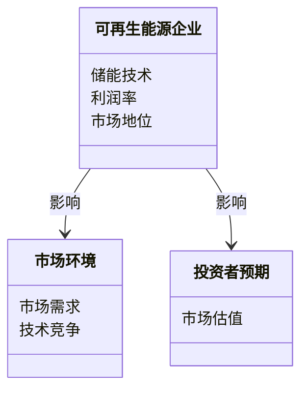
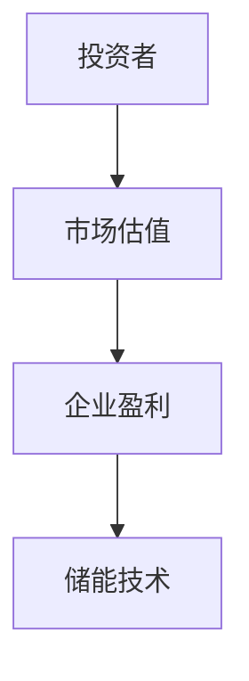
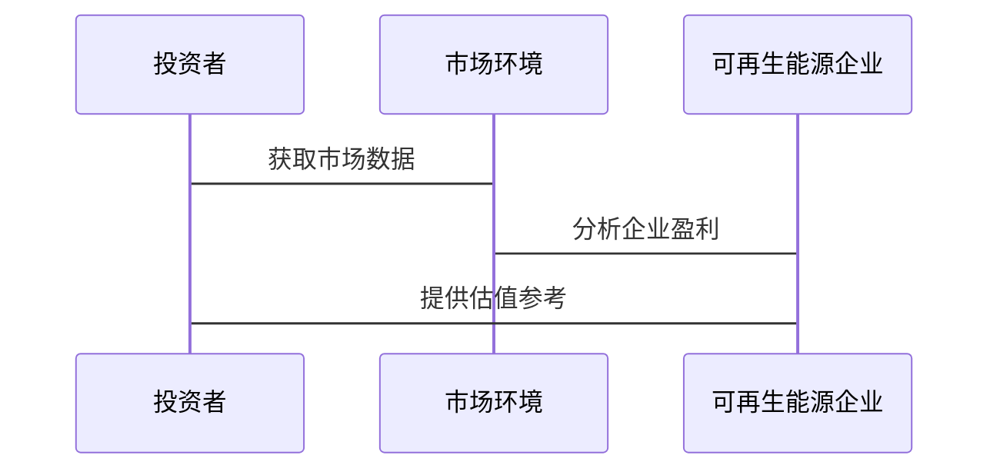

                 


# 全球股市估值与可再生能源储能技术的关系

> 关键词：全球股市估值、可再生能源储能技术、DCF模型、市场分析、技术创新

> 摘要：本文探讨了全球股市估值与可再生能源储能技术之间的关系，分析了储能技术对股市估值的影响机制，结合数学模型和实际案例，详细阐述了储能技术如何通过影响企业盈利能力和市场预期来改变股市估值。通过系统分析和算法原理的深入探讨，本文为投资者和相关从业者提供了有价值的参考。

---

## 第一章：背景介绍

### 1.1 问题背景

#### 1.1.1 全球股市估值的基本概念
全球股市估值是衡量市场整体价值的重要指标，通常通过市盈率（P/E）、市净率（P/B）等指标来衡量。股市估值的变化反映了市场对经济前景、企业盈利能力和技术创新的预期。

#### 1.1.2 可再生能源储能技术的发展现状
随着全球能源结构转型，可再生能源（如风能、太阳能）的占比迅速增加。然而，可再生能源具有间歇性，储能技术成为解决这一问题的关键。目前，储能技术主要包括电池储能、压缩空气储能和飞轮储能等。

#### 1.1.3 问题提出的背景与意义
可再生能源储能技术的商业化应用正在改变能源行业的格局，同时也对股市估值产生了深远影响。理解这种关系有助于投资者更好地把握市场趋势。

---

### 1.2 核心概念与问题描述

#### 1.2.1 可再生能源储能技术的定义与分类
- **定义**：储能技术是将多余的能量以某种形式存储起来，以便在需要时释放的技术。
- **分类**：
  - 电池储能（如锂离子电池、铅酸电池）
  - 压缩空气储能
  - 飞轮储能
  - 热储能

#### 1.2.2 全球股市估值的核心指标
- 市盈率（P/E）：股价与每股收益的比率。
- 市净率（P/B）：股价与每股净资产的比率。
- 市值与净利润比（EV/EBITDA）：企业价值与息税折旧及摊销前利润的比率。

#### 1.2.3 问题的边界与外延
本文仅讨论可再生能源储能技术对股市估值的影响，不涉及传统能源行业。

#### 1.2.4 核心概念的结构与要素组成
- **储能技术**：技术类型、成本、效率。
- **股市估值**：核心指标、影响因素。

---

## 第二章：核心概念与联系

### 2.1 可再生能源储能技术的原理与特征

#### 2.1.1 储能技术的主要类型
- **电池储能**：目前最为成熟的技术，广泛应用于电网调峰和可再生能源并网。
- **压缩空气储能**：适用于大规模储能，但技术成熟度较低。

#### 2.1.2 各类储能技术的优缺点对比
| 技术类型 | 优点 | 缺点 |
|----------|------|------|
| 电池储能 | 成熟、响应快 | 成本高、寿命有限 |
| 压缩空气储能 | 大规模储能、成本低 | 技术复杂、效率低 |

#### 2.1.3 储能技术对能源行业的影响
- 提高可再生能源的利用率。
- 稳定电网运行。

### 2.2 全球股市估值的影响因素

#### 2.2.1 市场供需与宏观经济因素
- 经济增长、利率水平影响股市估值。

#### 2.2.2 行业基本面与企业盈利状况
- 企业盈利能力和成长性是股市估值的核心驱动因素。

#### 2.2.3 技术创新与市场预期
- 技术创新提升企业竞争力，影响市场预期。

### 2.3 储能技术对股市估值的潜在影响

#### 2.3.1 储能技术对企业盈利能力和市场地位的影响
- 储能技术的应用可以提高企业的利润率和市场竞争力。

#### 2.3.2 储能技术对行业竞争格局的重塑
- 技术领先的企业可能占据市场主导地位。

#### 2.3.3 储能技术对投资者信心和市场预期的影响
- 技术突破可能提升投资者信心。

---

## 第三章：储能技术对股市估值的算法原理

### 3.1 市场估值的核心算法

#### 3.1.1 贴现现金流模型（DCF）
- **定义**：DCF模型通过预测未来现金流并将其贴现为现值，评估企业价值。
- **公式**：
  $$ \text{企业价值} = \sum_{t=1}^{n} \frac{\text{现金流}_t}{(1 + r)^t} $$
  其中，\( r \) 为折现率。

#### 3.1.2 市盈率（P/E）与市净率（P/B）分析
- **市盈率**：$$ \text{P/E} = \frac{\text{股价}}{\text{每股收益}} $$
- **市净率**：$$ \text{P/B} = \frac{\text{股价}}{\text{每股净资产}} $$

#### 3.1.3 市场资本化率与行业估值倍数
- 市场资本化率：$$ \text{市场资本化率} = \frac{\text{市值}}{\text{净利润}} $$

### 3.2 储能技术的经济性分析

#### 3.2.1 储能技术的成本结构
- 初始投资、运营成本、维护成本。

#### 3.2.2 储能技术的收益模型
- 收益来源：电力 arbitrage（套利）、容量租赁、辅助服务。

#### 3.2.3 储能技术的经济性评估
- 投资回收期：$$ \text{回收期} = \frac{\text{初始投资}}{\text{年净收益}} $$

---

## 第四章：系统分析与架构设计

### 4.1 问题场景介绍
- 可再生能源储能技术对企业盈利能力和股市估值的影响。

### 4.2 项目介绍
- 分析某家储能技术企业的市场表现。

### 4.3 系统功能设计（领域模型）



### 4.4 系统架构设计



### 4.5 系统接口设计
- 数据接口：获取企业财务数据和市场数据。

### 4.6 系统交互设计



---

## 第五章：项目实战

### 5.1 环境安装
- Python、Pandas、Matplotlib。

### 5.2 系统核心实现源代码

```python
import pandas as pd
import matplotlib.pyplot as plt

# 获取数据
data = pd.read_csv('stock_data.csv')

# 计算市盈率
data['PE'] = data['股价'] / data['每股收益']

# 可视化
plt.plot(data['日期'], data['PE'])
plt.title('市盈率变化')
plt.show()
```

### 5.3 代码应用解读与分析
- 使用DCF模型分析企业的未来现金流。

### 5.4 实际案例分析
- 案例：特斯拉储能业务对股价的影响。

### 5.5 详细讲解剖析
- 如何通过储能技术的应用提升企业估值。

---

## 第六章：最佳实践与小结

### 6.1 最佳实践 tips
- 关注技术创新和成本下降。
- 结合DCF模型和市场指标进行分析。

### 6.2 小结
储能技术正在改变能源行业的格局，对股市估值的影响日益显著。

### 6.3 注意事项
- 数据的准确性和模型的假设条件。

### 6.4 拓展阅读
- 《可再生能源与金融》。

---

通过以上步骤，本文详细探讨了全球股市估值与可再生能源储能技术的关系，结合理论分析和实际案例，为投资者和从业者提供了有价值的参考。

