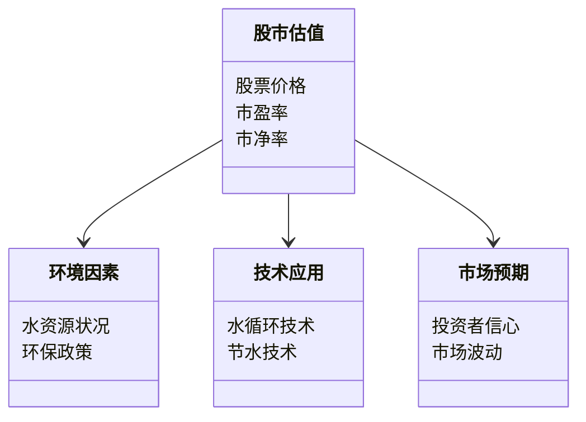
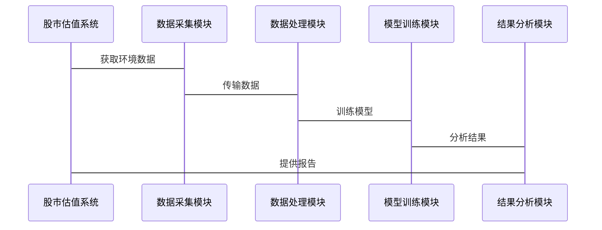

                 


# 全球股市估值与可持续水资源循环利用技术的关联

## 关键词：
- 全球股市估值
- 可持续水资源循环利用技术
- 环境因素
- 经济影响
- 技术应用

## 摘要：
本文探讨了全球股市估值与可持续水资源循环利用技术之间的关联。通过分析环境因素对股市的影响，特别是水资源问题对高耗水行业的影响，本文揭示了可持续水资源技术如何通过影响企业运营和市场预期，进而影响股市估值。文章还提出了构建综合评价模型的方法，以量化这些影响，并通过实际案例分析验证了模型的有效性，为投资者提供了科学的决策依据。

---

# 第一章：引言

## 1.1 问题背景

### 1.1.1 全球股市估值的重要性
全球股市估值是衡量经济健康的重要指标，反映了企业的盈利能力和市场的信心。股市的波动性直接影响投资者的资产配置和经济决策。

### 1.1.2 可持续水资源循环利用的必要性
水资源是生命之源，随着全球人口增长和工业化进程加快，水资源短缺问题日益严重。可持续水资源循环利用技术能够有效缓解水资源压力，促进经济发展和社会可持续性。

### 1.1.3 研究的意义
研究股市估值与水资源技术的关联，有助于理解环境因素对经济的影响，指导企业优化资源利用，帮助投资者做出更明智的决策。

## 1.2 问题描述

### 1.2.1 全球股市估值的波动性分析
股市估值受多种因素影响，包括宏观经济指标、政策变化和市场情绪。环境因素，特别是水资源问题，逐渐成为影响股市的重要因素。

### 1.2.2 可持续水资源循环利用的挑战
水资源短缺不仅影响企业运营，还可能导致生产成本上升和供应链中断。通过技术创新实现水资源循环利用，是企业应对水资源挑战的关键。

### 1.2.3 环境因素对经济的影响
环境问题直接影响企业利润和市场信心，进而影响股市估值。水资源问题尤其突出，因为它涉及多个行业，如农业、制造业和能源。

## 1.3 研究目标与方法

### 1.3.1 研究目标
探讨环境因素对股市估值的影响，特别是水资源循环利用技术的作用机制。

### 1.3.2 研究方法
通过文献分析、案例研究和数据建模，量化环境因素对股市的影响，构建综合评价模型。

---

# 第二章：全球股市估值理论

## 2.1 股市估值的基本概念

### 2.1.1 股市估值的定义
股市估值是通过对上市公司财务数据和市场指标的分析，评估其股票的内在价值。

### 2.1.2 股市估值的主要方法
- 市盈率（P/E）：股价与每股收益的比率。
- 市净率（P/B）：股价与每股净资产的比率。
- 股息率：每股股息与股价的比率。

## 2.2 影响股市估值的主要因素

### 2.2.1 经济指标
GDP增长率、利率、通货膨胀率等宏观经济指标直接影响股市表现。

### 2.2.2 行业发展趋势
行业周期、技术创新和市场需求变化影响企业的盈利能力和股票估值。

### 2.2.3 政治与政策因素
政府政策、国际贸易关系和法规变化对企业运营和股市估值有重要影响。

## 2.3 股市估值的波动性分析

### 2.3.1 市场情绪对估值的影响
投资者情绪波动导致股市短期波动，市场恐慌或乐观情绪会影响股票估值。

### 2.3.2 宏观经济指标对估值的影响
经济数据发布直接影响市场对经济前景的预期，从而影响股市估值。

---

# 第三章：可持续水资源循环利用技术

## 3.1 水资源循环利用的基本概念

### 3.1.1 水资源循环利用的定义
水资源循环利用是指通过物理、化学和生物技术，将废水、雨水等非传统水源处理后，用于工业、农业和生活等多领域。

### 3.1.2 水资源循环利用的重要性
缓解水资源短缺，减少水污染，促进可持续发展。

## 3.2 可持续水资源循环利用的主要技术

### 3.2.1 物理处理技术
- 过滤：通过物理过滤去除水中悬浮物。
- 蒸馏：通过加热蒸发水，去除杂质。

### 3.2.2 化学处理技术
- 沉淀：加入化学试剂使悬浮物沉淀。
- 氧化还原：通过化学反应去除污染物。

### 3.2.3 生物处理技术
- 厌氧处理：利用 anaerobic bacteria 分解有机物。
- 好氧处理：利用 aerobic bacteria 分解有机物。

## 3.3 可持续水资源循环利用的应用现状

### 3.3.1 工业用水循环利用
减少新鲜水使用，降低生产成本。

### 3.3.2 农业用水循环利用
通过滴灌和精确灌溉技术，提高用水效率。

### 3.3.3 居民用水循环利用
雨水收集和中水回用系统，减少市政用水需求。

---

# 第四章：全球股市估值与可持续水资源循环利用技术的关联分析

## 4.1 环境因素对全球股市估值的影响

### 4.1.1 环境风险对行业的影响
水资源短缺可能导致企业生产中断，增加运营成本。

### 4.1.2 可持续发展对投资的影响
投资者越来越关注企业的可持续性，环保表现优异的企业通常享有更高的估值。

## 4.2 可持续水资源循环利用技术对股市估值的影响

### 4.2.1 技术进步对行业的影响
技术创新降低企业用水成本，提升企业竞争力和盈利能力。

### 4.2.2 技术应用对股市估值的提升
通过技术应用，企业能够更好地应对环境挑战，增强市场信心，提升股票估值。

---

# 第五章：系统分析与架构设计方案

## 5.1 问题场景介绍

### 5.1.1 问题背景
企业需要量化水资源循环利用技术对股市估值的影响，构建综合评价模型。

## 5.2 项目介绍

### 5.2.1 项目目标
构建一个综合评价模型，量化环境因素对股市估值的影响。

## 5.3 系统功能设计

### 5.3.1 领域模型（Mermaid 类图）


## 5.4 系统架构设计（Mermaid 架构图）


## 5.5 系统接口设计

### 5.5.1 数据接口
- 数据输入接口：接收环境数据、企业数据和市场数据。
- 数据输出接口：提供模型结果和分析报告。

## 5.6 系统交互（Mermaid 序列图）


---

# 第六章：项目实战

## 6.1 环境数据采集

### 6.1.1 数据来源
- 公开市场数据：如股票价格、市盈率。
- 环境数据：如水资源使用量、环保政策。

## 6.2 数据预处理

### 6.2.1 数据清洗
- 处理缺失值。
- 标准化数据。

## 6.3 模型训练

### 6.3.1 算法选择
使用多元线性回归模型，分析环境因素对股市估值的影响。

### 6.3.2 算法实现
```python
import pandas as pd
from sklearn.linear_model import LinearRegression

# 数据加载
data = pd.read_csv('data.csv')

# 特征选择
X = data[['水资源使用量', '环保政策评分']]
y = data['股票估值']

# 模型训练
model = LinearRegression()
model.fit(X, y)

# 模型预测
predictions = model.predict(X)
```

## 6.4 结果分析

### 6.4.1 模型评估
- R²值：衡量模型解释力。
- 回归系数：显示各因素对估值的影响程度。

---

# 第七章：总结与展望

## 7.1 研究发现
- 可持续水资源技术对股市估值有显著影响。
- 投资者应关注企业的环保表现。

## 7.2 未来研究方向
- 探索更多环境因素对股市的影响。
- 开发更复杂的模型，如机器学习算法。

## 7.3 投资建议
- 投资环保表现优异的企业。
- 关注政策变化和技术创新。

---

# 附录

## 附录A：数据来源
- 公开市场数据。
- 环境部门报告。

## 附录B：工具介绍
- Python：数据处理和建模工具。
- Mermaid：图表绘制工具。

## 附录C：参考文献
- 引用的相关学术论文和报告。

---

通过以上结构，我们可以系统地分析全球股市估值与可持续水资源循环利用技术的关联，为企业和投资者提供科学的决策依据。

