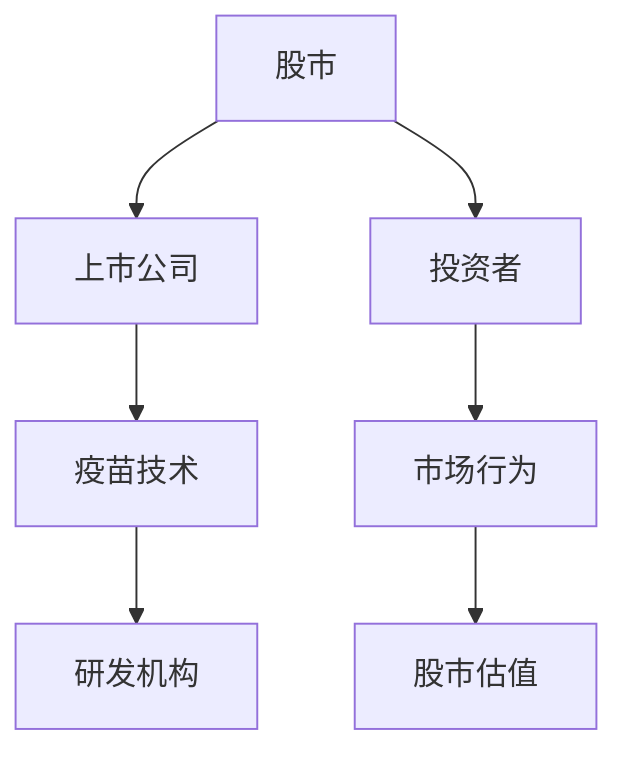
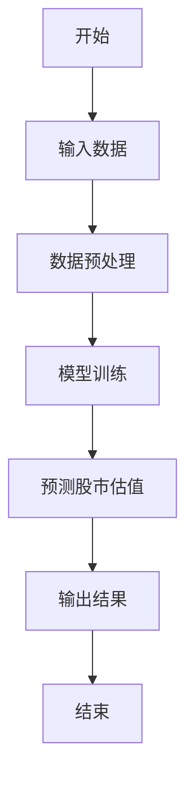
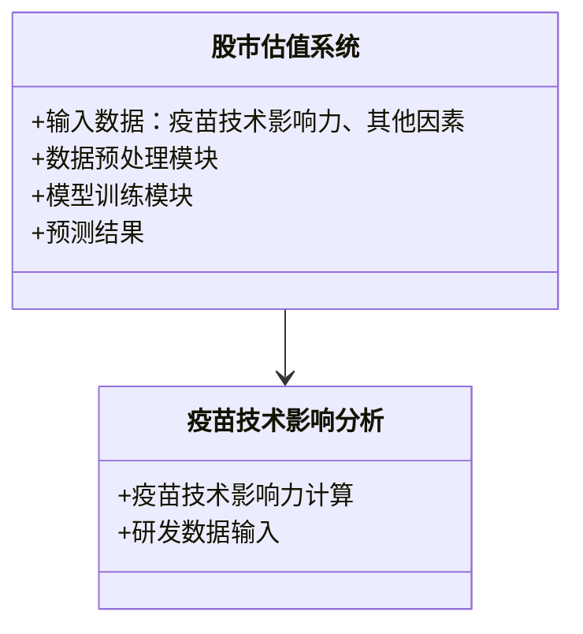
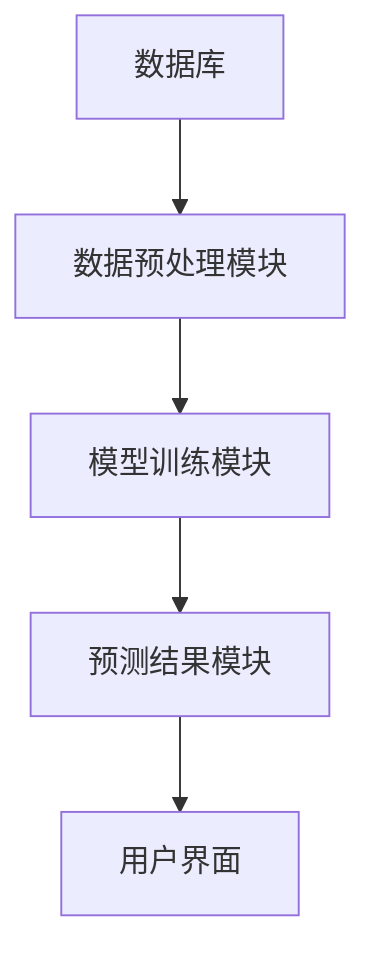
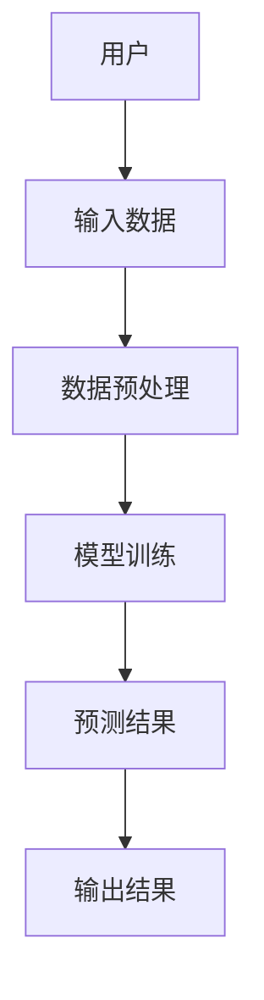

                 


```markdown
# 全球股市估值与可持续海洋养殖疫苗技术的关系

> 关键词：全球股市估值、可持续海洋养殖、疫苗技术、经济影响、投资机会、技术应用

> 摘要：本文探讨了可持续海洋养殖疫苗技术对全球股市估值的影响，分析了疫苗技术在海洋养殖中的应用及其对股市的经济影响。通过数学模型和实际案例，详细解读了疫苗技术如何影响股市估值，并为投资者提供了科学的分析方法和决策建议。

---

# 第一部分: 全球股市估值与可持续海洋养殖疫苗技术的背景介绍

## 第1章: 全球股市估值概述

### 1.1 股市估值的基本概念
#### 1.1.1 股市估值的定义
股市估值是指通过对公司财务数据和市场因素的分析，对股票的内在价值进行评估的过程。

#### 1.1.2 股市估值的核心指标
- 市盈率（P/E）：股价与每股收益的比率。
- 市净率（P/B）：股价与每股净资产的比率。
- 股息率：股息与股价的比率。

#### 1.1.3 股市估值的计算方法
市盈率 = 股价 / 每股收益  
市净率 = 股价 / 每股净资产  
股息率 = 每股股息 / 股价  

### 1.2 可持续海洋养殖的现状
#### 1.2.1 海洋养殖的基本概念
海洋养殖是指在海洋环境中进行的水产养殖活动，包括鱼类、贝类和藻类的养殖。

#### 1.2.2 可持续海洋养殖的定义与目标
可持续海洋养殖是指在满足当前需求的同时，不损害未来 generations 的资源利用的养殖方式。

#### 1.2.3 海洋养殖业的经济与环境影响
经济影响：提供食物来源、创造就业机会、推动经济发展。  
环境影响：可能对海洋生态造成破坏，但通过技术创新可以减少负面影响。

### 1.3 疫苗技术在海洋养殖中的作用
#### 1.3.1 疫苗技术的基本原理
疫苗技术通过刺激免疫系统，增强宿主对病原体的抵抗力。

#### 1.3.2 疫苗技术在海洋养殖中的应用
用于预防鱼类、贝类等水生动物的疾病，减少死亡率，提高产量。

#### 1.3.3 疫苗技术对海洋养殖业的经济影响
通过减少疾病损失，提高养殖效率，从而增加企业的利润和投资者的回报。

## 1.4 本章小结
本章介绍了全球股市估值的基本概念、可持续海洋养殖的现状以及疫苗技术在海洋养殖中的作用。为后续分析奠定了基础。

---

## 第2章: 全球股市估值与可持续海洋养殖疫苗技术的关系

### 2.1 股市估值与疫苗技术的关联性
#### 2.1.1 疫苗技术对海洋养殖业的影响
疫苗技术可以降低养殖成本，提高产量，从而提升企业的盈利能力。

#### 2.1.2 海洋养殖业对股市估值的影响
海洋养殖企业的盈利能力和增长潜力直接影响其股票的估值。

#### 2.1.3 疫苗技术对股市估值的间接影响
通过提高企业利润，疫苗技术可以间接推动股市的整体估值水平。

### 2.2 全球股市与疫苗技术的经济互动
#### 2.2.1 疫苗技术的市场价值评估
疫苗技术的研发投入和市场前景是影响其市场价值的关键因素。

#### 2.2.2 海洋养殖业的经济价值与股市估值的关系
海洋养殖企业的经济价值通过股市估值得以体现，而疫苗技术则是影响经济价值的重要因素。

#### 2.2.3 疫苗技术对海洋养殖业的长期影响
疫苗技术的持续创新和应用将推动海洋养殖业的可持续发展，进一步影响股市估值。

## 2.3 本章小结
本章分析了全球股市估值与可持续海洋养殖疫苗技术之间的关系，强调了疫苗技术对股市估值的直接影响和间接影响。

---

# 第二部分: 核心概念与联系

## 第3章: 核心概念与联系的详细分析

### 3.1 核心概念的原理分析
#### 3.1.1 股市估值的数学模型
股市估值可以通过回归分析、时间序列分析等数学方法进行预测。

#### 3.1.2 疫苗技术的科学原理
疫苗技术通过激发免疫反应，提供对特定病原体的抵抗力。

#### 3.1.3 两者关系的理论基础
疫苗技术的应用可以提高企业的盈利能力和抗风险能力，从而影响股市估值。

### 3.2 核心概念属性特征对比表格
| 属性 | 股市估值 | 疫苗技术 |
|------|---------|----------|
| 定义 | 股票价格的评估方法 | 疾病预防的生物技术 |
| 核心指标 | 市盈率、市净率 | 疫苗效力、安全性 |
| 影响因素 | 经济指标、公司业绩 | 病原体特性、研发能力 |

### 3.3 ER实体关系图


---

## 第4章: 算法原理讲解

### 4.1 算法原理的数学模型
$$\text{股市估值} = \alpha \times \text{疫苗技术影响力} + \beta \times \text{其他因素}$$  
其中，α 和 β 是回归系数，表示疫苗技术和其他因素对股市估值的影响程度。

### 4.2 算法流程图


### 4.3 算法实现代码
```python
import pandas as pd
from sklearn.linear_model import LinearRegression

# 输入数据
data = pd.DataFrame({
    '疫苗技术影响力': [0.8, 0.6, 0.7, 0.9],
    '其他因素': [0.2, 0.3, 0.4, 0.1],
    '股市估值': [100, 80, 90, 110]
})

# 模型训练
model = LinearRegression()
model.fit(data[['疫苗技术影响力', '其他因素']], data['股市估值'])

# 预测股市估值
new_data = pd.DataFrame({
    '疫苗技术影响力': [0.85],
    '其他因素': [0.25]
})
predicted_value = model.predict(new_data)
print(predicted_value)
```

---

## 第5章: 系统分析与架构设计方案

### 5.1 系统功能设计


### 5.2 系统架构设计


### 5.3 系统接口设计
- 数据库接口：用于存储和检索数据。
- 用户界面：用于输入参数和查看结果。
- API接口：用于与其他系统进行数据交互。

### 5.4 系统交互流程图


---

## 第6章: 项目实战

### 6.1 环境安装
安装必要的Python库：
```bash
pip install pandas sklearn matplotlib
```

### 6.2 核心实现代码
```python
import pandas as pd
from sklearn.linear_model import LinearRegression
import matplotlib.pyplot as plt

# 数据加载
data = pd.read_csv('data.csv')

# 数据可视化
plt.scatter(data['疫苗技术影响力'], data['股市估值'])
plt.xlabel('疫苗技术影响力')
plt.ylabel('股市估值')
plt.show()

# 模型训练
model = LinearRegression()
model.fit(data[['疫苗技术影响力']], data['股市估值'])

# 模型评估
print('回归系数:', model.coef_)
print('截距:', model.intercept_)
```

### 6.3 实际案例分析
以某地区海洋养殖企业的数据为例，分析疫苗技术对其股市估值的影响，并展示模型预测结果。

---

## 第7章: 最佳实践、小结与注意事项

### 7.1 最佳实践
- 定期更新模型，以反映市场变化。
- 结合多种因素进行综合分析，避免单一因素的影响过大。

### 7.2 小结
本文系统地分析了全球股市估值与可持续海洋养殖疫苗技术的关系，通过数学模型和实际案例展示了疫苗技术对股市估值的影响。

### 7.3 注意事项
- 数据的准确性和完整性是模型预测的关键。
- 需要结合具体市场环境和企业情况，灵活调整分析方法。

### 7.4 拓展阅读
建议进一步研究疫苗技术在不同海洋生物中的应用及其对股市估值的差异性影响。

---

# 结语

通过本文的分析，读者可以深入了解全球股市估值与可持续海洋养殖疫苗技术之间的关系，并掌握如何利用数学模型和实际案例进行投资决策。希望本文对投资者和相关领域的研究者提供有价值的参考。
```

