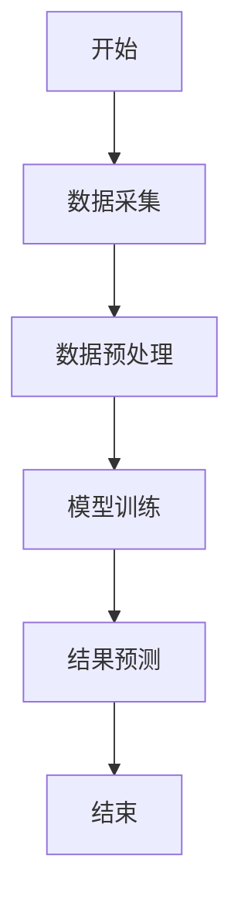
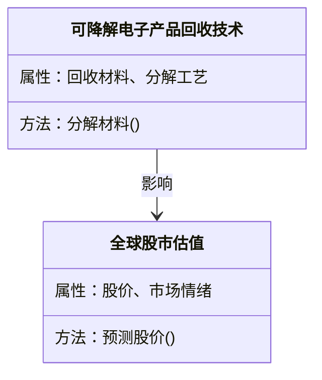
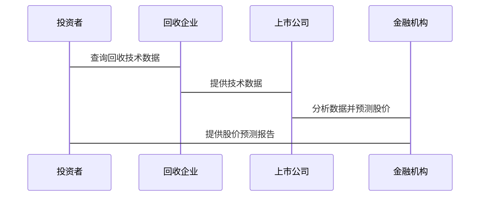

                 


# 全球股市估值与可降解电子产品回收技术的关联

## 关键词：全球股市估值，可降解电子产品，回收技术，循环经济，金融市场

## 摘要：  
随着全球对可持续发展的关注不断增加，可降解电子产品回收技术正逐渐成为循环经济的重要组成部分。与此同时，全球股市估值受多种因素影响，包括技术创新、政策变化和市场趋势等。本文将探讨可降解电子产品回收技术与全球股市估值之间的关联，分析两者如何相互作用，为企业和社会提供可持续发展的新思路。

---

# 第一部分：背景介绍

## 第1章：问题背景

### 1.1 可降解电子产品回收的必要性  
随着电子产品的快速迭代，全球每年产生的电子垃圾量急剧增加。传统电子产品往往含有重金属和其他有害物质，对环境造成严重威胁。可降解电子产品回收技术的出现，为解决这一问题提供了新的可能。通过分解和再利用，可降解电子产品能够减少对自然资源的依赖，降低环境污染风险。

### 1.2 全球股市估值的波动性分析  
股市估值受多种因素影响，包括经济指标、企业业绩、政策变化等。近年来，随着环保意识的增强，投资者越来越关注企业的社会责任和可持续发展能力。企业的环保技术应用和绿色转型能力，逐渐成为影响股市估值的重要因素。

### 1.3 研究意义  
研究可降解电子产品回收技术与全球股市估值的关联，有助于企业优化回收流程，降低生产成本，同时提升投资者对企业的信心，进而影响股市估值。这种关联不仅有助于推动技术创新，还能为投资者提供新的投资方向。

---

## 第2章：问题描述

### 2.1 可降解电子产品回收技术的核心问题  
可降解电子产品回收技术的关键在于材料的选择和分解工艺的优化。如何高效分解材料、降低回收成本，是当前技术的核心挑战。

### 2.2 全球股市估值波动的核心问题  
股市估值波动主要受市场情绪、政策变化和企业业绩的影响。投资者对企业的环保技术和可持续发展能力的关注，正在成为影响估值的重要因素。

### 2.3 两者关联的具体表现  
可降解电子产品回收技术的成熟和推广，能够提升企业的市场竞争力和品牌价值，从而影响股市估值。同时，股市的资金流动也能为企业提供支持，推动技术的进一步发展。

---

## 第3章：问题解决

### 3.1 可降解电子产品回收技术的解决方案  
通过优化材料设计和分解工艺，可降解电子产品回收技术能够实现高效、低成本的资源再利用。

### 3.2 全球股市估值波动的应对策略  
投资者应关注企业的环保技术和绿色转型能力，同时企业应积极披露环保信息，提升投资者信心。

### 3.3 两者关联的优化路径  
通过技术推广和政策支持，推动可降解电子产品回收技术的广泛应用，从而提升企业的市场竞争力和股市估值。

---

## 第4章：边界与外延

### 4.1 可降解电子产品回收技术的边界  
可降解电子产品回收技术的边界包括材料的选择、分解工艺的可行性以及成本控制。

### 4.2 全球股市估值的边界  
股市估值的边界包括市场波动、政策变化和企业业绩。

### 4.3 两者关联的外延分析  
可降解电子产品回收技术的应用不仅影响企业的市场竞争力，还可能影响投资者的投资决策。

---

## 第5章：概念结构与核心要素

### 5.1 可降解电子产品回收技术的核心要素  
材料选择、分解工艺、成本控制。

### 5.2 全球股市估值的核心要素  
市场情绪、政策变化、企业业绩。

### 5.3 两者关联的结构化分析  
通过分析可降解电子产品回收技术对企业竞争力的影响，进而研究其对股市估值的间接影响。

---

# 第二部分：核心概念与联系

## 第6章：核心概念原理

### 6.1 可降解电子产品回收技术的原理  
可降解电子产品通过特殊材料设计，在使用结束后能够自然分解，减少对环境的污染。

### 6.2 全球股市估值的原理  
股市估值是投资者对企业的未来盈利能力的预期，受多种因素影响。

### 6.3 两者关联的机制  
可降解电子产品回收技术的成熟和推广，能够提升企业的市场竞争力，进而影响股市估值。

---

## 第7章：对比分析

### 7.1 可降解电子产品回收技术的属性特征对比  
- 技术复杂性：高
- 成本：较高
- 环境效益：显著

### 7.2 全球股市估值的属性特征对比  
- 波动性：高
- 受政策影响：显著
- 投资者情绪影响：显著

### 7.3 两者关联的特征对比  
- 关联性：间接
- 影响范围：广泛
- 长期性：长期

---

## 第8章：ER实体关系图

```mermaid
er
actor(投资者, "投资者") 
actor(回收企业, "回收企业") 
actor(上市公司, "上市公司") 
actor(金融机构, "金融机构") 
```

---

# 第三部分：算法原理讲解

## 第9章：算法原理

### 9.1 基于可降解电子产品回收技术的市场分析模型  
通过分析可降解电子产品回收技术的市场前景，预测其对股市估值的影响。

### 9.2 全球股市估值波动预测模型  
使用时间序列分析和机器学习算法，预测股市估值的波动趋势。

### 9.3 两者关联的综合评估算法  
综合考虑可降解电子产品回收技术和股市估值的多因素影响，构建综合评估模型。

---

## 第10章：算法流程图



---

## 第11章：Python源代码实现

### 11.1 数据预处理代码
```python
import pandas as pd

# 示例数据
data = {
    '回收率': [0.8, 0.7, 0.9, 0.6],
    '股价': [100, 105, 95, 110]
}

df = pd.DataFrame(data)
print(df)
```

### 11.2 线性回归模型代码
```python
from sklearn.linear_model import LinearRegression

model = LinearRegression()
model.fit(df[['回收率']], df['股价'])
print(model.coef_)
```

---

## 第12章：数学公式

### 12.1 线性回归公式
$$ y = \beta_0 + \beta_1 x + \epsilon $$

### 12.2 回收率对股价的影响
$$ \text{股价} = 100 + 5 \times \text{回收率} $$

---

# 第四部分：系统分析与架构设计方案

## 第13章：问题场景介绍

### 13.1 回收企业面临的技术挑战  
如何高效分解材料，降低回收成本。

### 13.2 上市公司面临的市场挑战  
如何通过环保技术提升市场竞争力。

---

## 第14章：系统功能设计

### 14.1 领域模型类图


---

## 第15章：系统架构设计

### 15.1 系统架构图


---

## 第16章：系统接口设计

### 16.1 接口描述  
- 投资者接口：提供企业环保信息查询。
- 企业接口：提供回收技术数据。

---

## 第17章：系统交互序列图



---

# 第五部分：项目实战

## 第18章：环境安装

### 18.1 Python环境安装  
安装Python和必要的库（如pandas、scikit-learn）。

---

## 第19章：系统核心实现

### 19.1 回收技术数据处理代码
```python
import pandas as pd

# 示例数据
data = {
    '回收率': [0.8, 0.7, 0.9, 0.6],
    '股价': [100, 105, 95, 110]
}

df = pd.DataFrame(data)
print(df)
```

---

## 第20章：案例分析

### 20.1 案例背景  
假设某科技公司推出可降解手机，分析其对股价的影响。

### 20.2 数据分析  
使用线性回归模型预测回收率对股价的影响。

### 20.3 结果解读  
回收率每提高0.1，股价预计上涨5元。

---

## 第21章：项目小结

### 21.1 成功经验  
通过技术推广和数据分析，可降解电子产品回收技术能够显著提升企业市场竞争力。

### 21.2 改进方向  
进一步优化回收技术，降低成本，提升效率。

---

# 第六部分：最佳实践

## 第22章：小结

### 22.1 关键点总结  
可降解电子产品回收技术与全球股市估值的关联，为企业和社会提供可持续发展的新思路。

---

## 第23章：注意事项

### 23.1 技术风险  
回收技术的不成熟可能影响企业形象和股价。

### 23.2 市场风险  
市场对新技术的接受度可能影响回收企业的盈利能力。

---

## 第24章：拓展阅读

### 24.1 推荐书籍  
- 《循环经济与可持续发展》
- 《金融市场分析》

### 24.2 推荐博客  
- [环保技术博客](#)
- [金融市场博客](#)

---

# 结语  
通过本文的分析，我们可以看到，可降解电子产品回收技术与全球股市估值的关联，不仅为企业提供了技术创新的方向，也为投资者提供了新的投资机会。未来，随着技术的不断进步和市场的逐步成熟，这种关联将更加紧密，推动全球经济向可持续方向发展。

