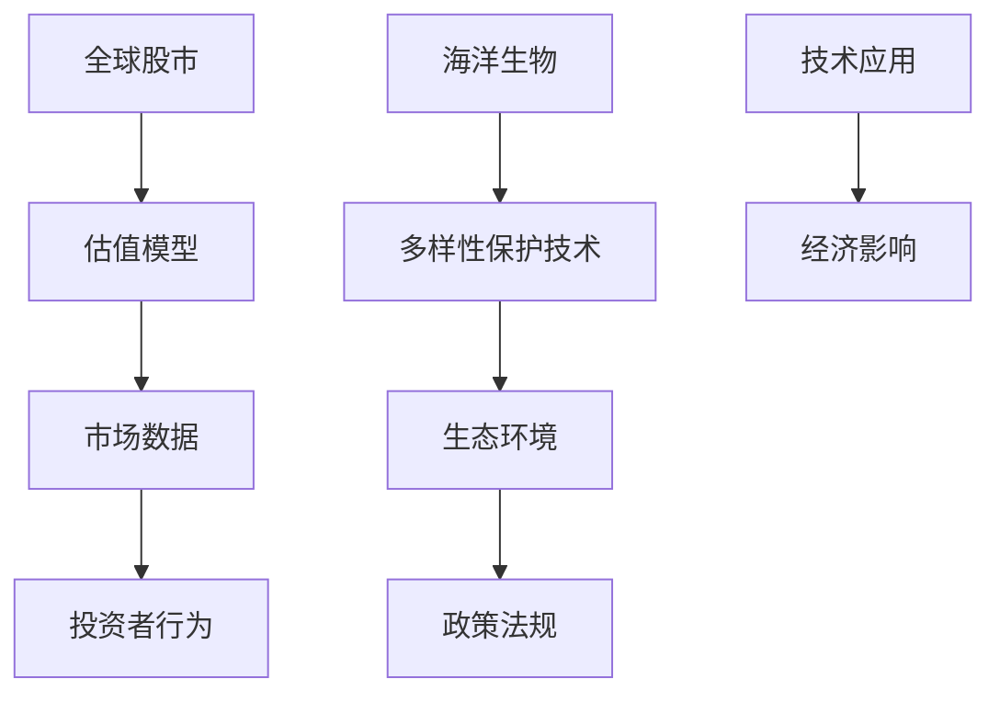
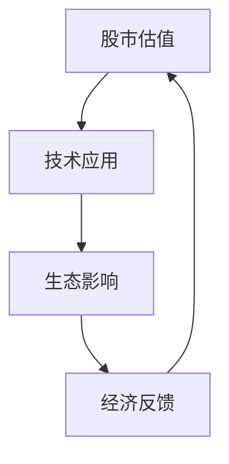
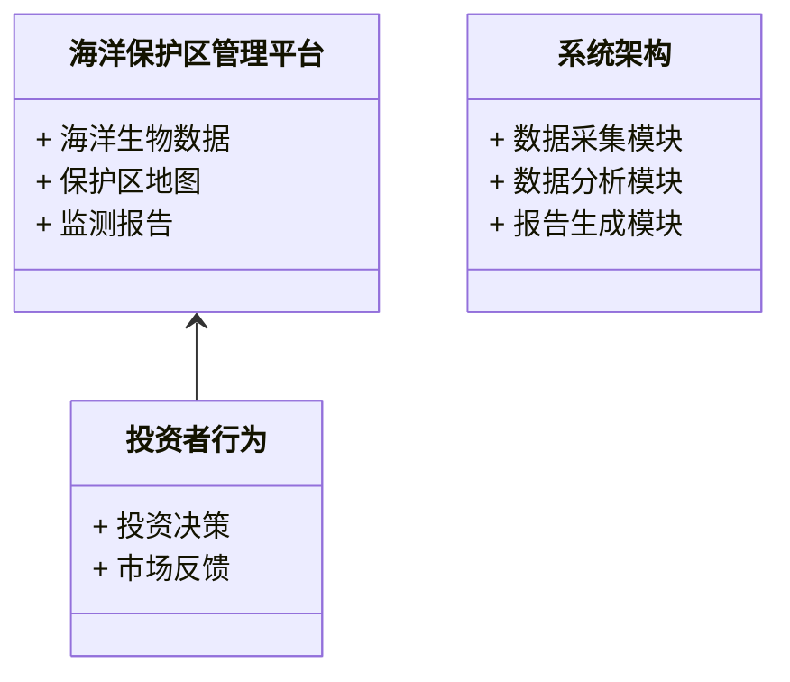
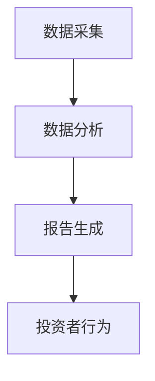
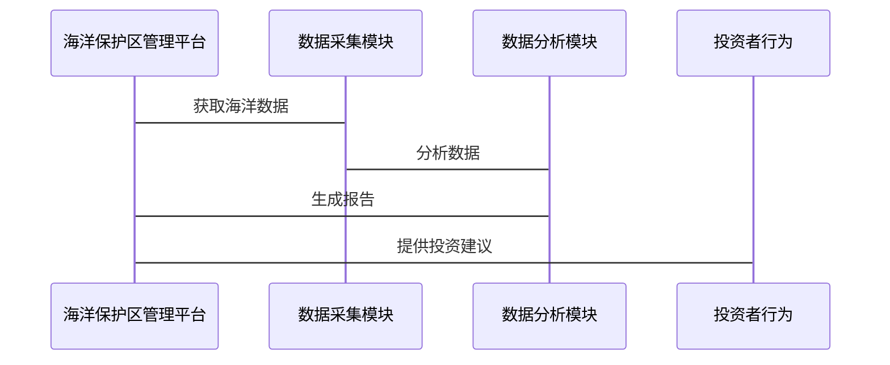

                 


# 全球股市估值与海洋生物多样性保护技术的关系

## 关键词：全球股市估值、海洋生物多样性、系统动力学、投资价值、生态保护

## 摘要：
本文探讨了全球股市估值与海洋生物多样性保护技术之间的关系。通过分析海洋生物多样性保护技术的经济价值、技术支撑和投资机会，构建了系统动力学模型，揭示了两者之间的相互作用。本文还通过实际案例分析，展示了如何将海洋生物多样性保护技术应用于投资决策，为投资者提供了新的视角。

---

# 第一部分: 全球股市估值与海洋生物多样性保护技术的背景与核心概念

## 第1章: 全球股市估值与海洋生物多样性保护技术的背景介绍

### 1.1 问题背景与问题描述
#### 1.1.1 全球股市估值的现状与挑战
全球股市估值是衡量市场健康状况的重要指标，受经济、政治和社会因素的影响。近年来，投资者越来越关注企业的社会责任（ESG）指标，包括环境保护、社会公平和公司治理。这使得海洋生物多样性保护技术成为影响股市估值的重要因素。

#### 1.1.2 海洋生物多样性保护技术的现状与挑战
海洋生物多样性是维持海洋生态系统平衡的关键，但过度捕捞、污染和气候变化等因素正在威胁海洋生物多样性。保护海洋生物多样性需要技术创新，如遥感技术、人工智能和生物技术等。

#### 1.1.3 问题解决的必要性与意义
研究全球股市估值与海洋生物多样性保护技术的关系，有助于投资者评估环保技术的经济价值，同时为政策制定者提供科学依据，推动可持续发展。

### 1.2 核心概念与问题外延
#### 1.2.1 全球股市估值的核心概念
全球股市估值是指对上市公司股票价格的综合评估，包括市盈率、市净率等指标。这些指标反映了市场的信心和企业的盈利能力。

#### 1.2.2 海洋生物多样性保护技术的核心概念
海洋生物多样性保护技术包括监测、保护和恢复海洋生态系统的技术，如海洋保护区管理、生态修复和智能监测系统。

#### 1.2.3 问题背景的边界与外延
本文的研究范围限于海洋生物多样性保护技术的经济价值及其对股市估值的影响，不涉及其他类型的环境保护技术。

#### 1.2.4 核心概念的结构与组成
全球股市估值由市场数据、投资者行为和企业绩效组成，而海洋生物多样性保护技术由技术创新、生态保护和政策支持组成。

---

## 第2章: 核心概念与联系

### 2.1 核心概念的原理与特征
#### 2.1.1 全球股市估值的原理
股市估值是市场参与者对企业未来收益的预期，反映了企业的基本面和市场情绪。

#### 2.1.2 海洋生物多样性保护技术的原理
海洋生物多样性保护技术通过技术创新保护海洋生态系统，减少人类活动对海洋的破坏。

#### 2.1.3 核心概念的属性特征对比
| 属性 | 全球股市估值 | 海洋生物多样性保护技术 |
|------|--------------|--------------------------|
| 核心 | 市场数据     | 生态保护技术            |
| 影响 | 经济因素     | 生态因素                |
| 目标 | 投资回报     | 生态平衡                |

### 2.2 核心概念的ER实体关系图


---

## 第3章: 全球股市估值与海洋生物多样性保护技术的关系分析

### 3.1 经济价值与生态价值的关联
#### 3.1.1 经济价值的衡量
股市估值反映了企业的经济价值，而海洋生物多样性保护技术通过减少生态破坏间接提升了企业的经济价值。

#### 3.1.2 生态价值的衡量
海洋生物多样性保护技术的生态价值体现在保护海洋生态系统，减少生态破坏带来的经济损失。

#### 3.1.3 两者的关系
海洋生物多样性保护技术的生态价值通过影响企业的社会责任指标间接影响股市估值。

### 3.2 技术支撑与投资机会的结合
#### 3.2.1 技术支撑的经济价值
技术创新降低了海洋保护的成本，提升了企业的竞争力，从而提升了股市估值。

#### 3.2.2 投资机会的生态价值
海洋生物多样性保护技术的投资机会体现了投资者对可持续发展的关注，推动了股市估值的提升。

#### 3.2.3 两者的相互作用
技术支撑为投资机会提供了基础，而投资机会的增加进一步推动了技术创新。

### 3.3 系统动力学模型构建


---

## 第4章: 海洋生物多样性保护技术的分析与实现

### 4.1 技术原理与实现方法
#### 4.1.1 技术原理
海洋生物多样性保护技术通过遥感技术、人工智能和生物技术等手段，实现对海洋生态系统的监测和保护。

#### 4.1.2 实现方法
- 使用遥感技术监测海洋生物分布。
- 通过人工智能分析海洋生态数据。
- 利用生物技术修复海洋生态系统。

---

## 第5章: 系统分析与架构设计方案

### 5.1 问题场景介绍
本文构建了一个海洋保护区管理平台，用于监测和保护海洋生物多样性。

### 5.2 系统功能设计


### 5.3 系统架构设计


### 5.4 系统接口设计
- 数据采集接口：从传感器获取海洋数据。
- 数据分析接口：使用Python进行数据分析。
- 报告生成接口：生成监测报告。

### 5.5 系统交互流程


---

## 第6章: 项目实战

### 6.1 环境安装
安装Python、GIS软件和数据分析工具。

### 6.2 核心代码实现
```python
import pandas as pd
import numpy as np

# 数据加载
data = pd.read_csv('marine_data.csv')

# 数据分析
data['avg_biodiversity'] = data['biodiversity'].mean()

# 报告生成
data.to_csv('report.csv', index=False)
```

### 6.3 代码解读与分析
上述代码展示了如何使用Python进行数据分析，生成海洋生物多样性保护技术的监测报告。

### 6.4 案例分析
以某海洋保护区为例，分析其生物多样性数据，生成投资建议。

### 6.5 项目小结
本项目展示了如何将海洋生物多样性保护技术应用于投资决策，为投资者提供了新的视角。

---

## 第7章: 总结与展望

### 7.1 研究总结
本文通过系统动力学模型，分析了全球股市估值与海洋生物多样性保护技术的关系，展示了两者之间的相互作用。

### 7.2 未来展望
未来研究可以进一步探讨更多类型的环境保护技术对股市估值的影响。

### 7.3 最佳实践 tips
- 投资者应关注企业的社会责任指标。
- 政府应加强政策支持，推动技术创新。

### 7.4 注意事项
- 数据分析需结合实际，避免片面结论。
- 系统设计需考虑可扩展性。

### 7.5 拓展阅读
推荐阅读相关领域的学术论文和行业报告。

---

# 结语

本文通过系统动力学模型，分析了全球股市估值与海洋生物多样性保护技术的关系，展示了两者之间的相互作用。未来的研究可以进一步探讨更多类型的环境保护技术对股市估值的影响，为投资者和政策制定者提供更多的科学依据。

